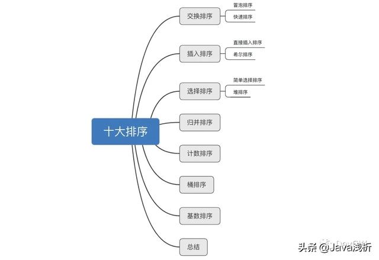
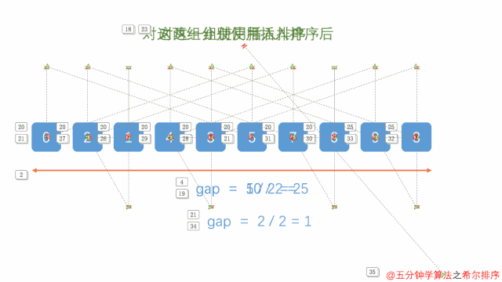
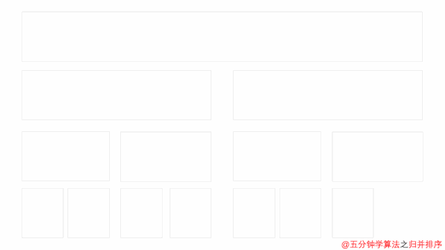
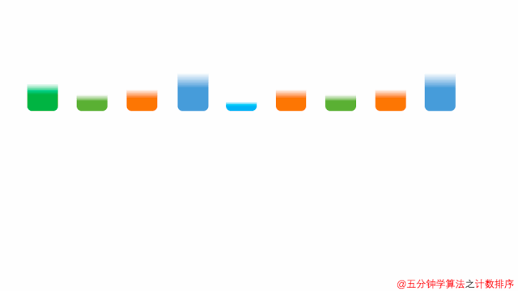
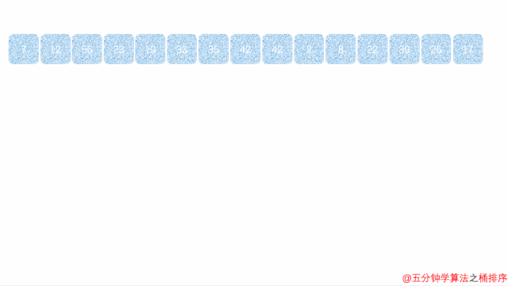
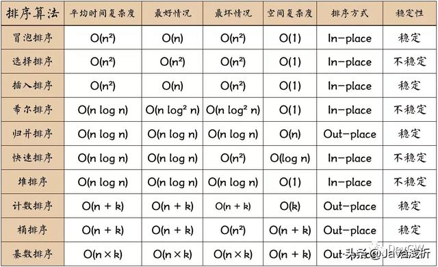
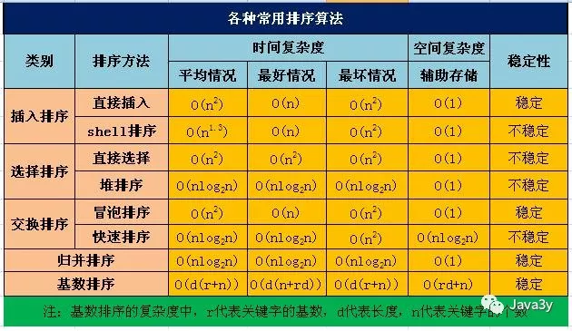

[toc]



# 交换排序

## 冒泡排序


### 对应代码

```java
public static void bubbleSort() { 
    // 修剪枝叶的优化方法  
    // 基于原理：  
    // 每一趟完整的循环就对完成一个最大值或者最小值的放置   
    // 那每一趟都可以删去枝叶，也就是最大值或者最小值的位置   
    // i的大小也同样可以确定已经完成排序的数值的个数  
    for (int i = 0; i < array.length - 1; i++) {  
        for (int j = 0; j < array.length - i - 1; j++) {   
            if (array[j] > array[j + 1]) {           
                swap(array[j], array[j+1]);      
            }     
        } 
    }
}
```

### 原理及其实现方式

代码的效果正好和图片相反，其实冒泡排序作为最简单的排序方法之一，基于的是一个这样的概念：**两两交换，比较双方数值大的放在高位，数值小的则放在低位。**

而暴力双重循环，就是他的实现方式。每一次都将最大的一位数放到了最后一位，或者反之，将最小的数放到了第一位。

 优化：如果一趟排序后也没有交换位置，那么该数组已有序～ 

```java
public static void bubbleSort() { 
    // 修剪枝叶的优化方法  
    // 基于原理：  
    // 每一趟完整的循环就对完成一个最大值或者最小值的放置   
    // 那每一趟都可以删去枝叶，也就是最大值或者最小值的位置   
    // i的大小也同样可以确定已经完成排序的数值的个数  
    for (int i = 0; i < array.length - 1; i++) {  
        
         //每比较一趟就重新初始化为0
        isChange = 0;
        
        for (int j = 0; j < array.length - i - 1; j++) {   
            if (array[j] > array[j + 1]) {           
                swap(array[j], array[j+1]);   
                //如果进到这里面了，说明发生置换了
                isChange = 1;
            }     
        } 
		//如果比较完一趟没有发生置换，那么说明已经排好序了，不需要再执行下去了
        if (isChange == 0) {
            break;
        }
    }
}
```


## 快速排序


### 对应代码

```java
/**
 * @param arr 要进行排序的数组
 * @param L   指向数组最左侧的元素
 * @param R   指向数组最右侧的元素
 * @return
 */
public static void quickSort(int[] arr, int L, int R) {
    // 使i等于最左侧数据的索引
    int i = L;
    // 使j等于最右侧数据的索引
    int j = R;

    // 找到中间值作为支点
    int pivot = arr[(L + R) / 2];

    // 当i<=j的情况下，不断的判断是否满足两边数据交换的条件
    while (i <= j) {

        // 寻找左侧比支点大的数据的索引
        while (pivot > arr[i]) {
            i++;
        }
        // 寻找右侧比支点大的数据的索引
        while (pivot < arr[j]) {
            j--;
        }

        // 若i<=j说明两端都已经找到需要交换的数据
        if (i <= j) {
            int temp = arr[i];
            arr[i] = arr[j];
            arr[j] = temp;
            i++; j--;
        }
    }

    //“左边”再做排序，直到左边剩下一个数(递归出口)
    if (L < j) {
        quickSort(arr, L, j);
    }

    //“右边”再做排序，直到右边剩下一个数(递归出口)
    if (i < R) {
        quickSort(arr, i, R);
    }
}
```

### 原理及其实现方式

快速排序其实是冒泡排序的升级版，同样的基于两两交换，但是引入了分治的思想。通过使用中线，对需要排序的区间进行了重新的一个划分，而这内部剩下的性能还有一方面就是在于这个中线，因为数值的比较不再是全局，而是局部，从效率计算上来讲一般情况可降到O(nlogn)，当然极端情况就可能退化回我们的冒泡排序。

> 极端例子：5 -> 4 -> 3 -> 2 -> 1
>
> 也就是一个已经完成排序的数组，再经过快速排序，想要将数组排序，就将会造成快排的退化。**而解决方案就是不再以首个数据作为中线的基准。**

为什么说快排是不稳定的排序？

>  首先理解什么是不稳定的排序，如果说数组中有相等的元素A和元素B在排序前A在B的前面，但是排序之后A在B的后面，那么我们就说这个排序是不稳定的排序。而快排算法就是将大于等于当前值或者小于等于当前值的元素放在前面，这个等于的判断就有可能导致相等的元素索引位置改变，因此快排是不稳定的排序。

# 插入排序

## 直接插入排序


### 对应代码

```java
public static void insertionSort(int[] arr) {
    //临时变量
    int temp;

    //外层循环控制需要排序的趟数(从1开始因为将第0位看成了有序数据)
    for (int i = 1; i < arr.length; i++) {

        //temp保存的是每次取出来和前面有序队列比较的那个值
        temp = arr[i];

        //如果前一位(已排序的数据)比当前数据要大，那么就进入循环比较[参考第二趟排序]
        while (i >= 1 && arr[i - 1] > temp) {

            //往后退一个位置，让当前数据与之前前位进行比较
            arr[i] = arr[i - 1];

            //不断往前，直到退出循环
            i--;

        }

        //退出了循环说明找到了合适的位置了，将当前数据插入合适的位置中
        arr[i] = temp;
    }

}
```

### 原理及其实现方式

插入排序，顾名思义，就是把数字放到合适的位置。原理上讲就是将一个无序数组拆分成了两个部分，一块有序，一块无序。不断的删去无序队列中的数值，放到有序队列中，最后也就成为了有序队列。

```java
第一趟排序：（5） -> 3 -> 4 -> 7 -> 2
第二趟排序：（3 -> 5 ）-> 4 -> 7 -> 2
第三趟排序：（3 -> 4 -> 5 ）-> 7 -> 2
。。。。以此类推
```

## 希尔排序




### 对应代码

```java
public static void shellSort(int[] array) {
    // gap也就相当于组别
    for (int gap = array.length >> 1; gap > 0; gap /= 2) {
        // 对分的每个组进行插入排序，直至完毕
        for (int i = gap; i < array.length; i++) {
            int j = i;
            while (j - gap >= 0 && array[j] < array[j - gap]) {

                int temp = array[j];
                array[j] = array[j - gap];
                array[j - gap] = temp;

                j -= gap;
            }
        }
    }
}
```

### 原理及其实现方法

 希尔排序实质上就是插入排序的增强版，希尔排序将数组分隔成n组来进行插入排序，**直至该数组宏观上有序，**最后再进行插入排序时就不用移动那么多次位置了～ 

先对代码做一个解释：

（1）gap：也就是是我说的组别，分成两个部分 

（2）array[j]：右半边需要交换的序列 

（3）array[j - gap]：左半边交换的序列 

（4）j -= gap：是为了保障最后一位被遗忘的数据被处理。

```
原序列：4 -> 3 -> 2 -> 5 -> 1
第一趟过程1：(2) -> 3 -> (4) -> 5 ->1
第一趟过程2：2 -> (3) -> 4 -> (5) ->1
第一趟过程3：（1） -> 3 ->（2）-> 5 ->（4）
```

# 选择排序

## 简单选择排序


### 对应代码

```java
/**
 * 选择排序
 *
 * @param arr
 */
public static void selectionSort(int[] arr) {
    // 控制需要循环的次数
    for (int i = 0; i < arr.length - 1; i++) {

        // 每次新的循环将索引重新置为0
        int index = 0;

        // 内层循环控制遍历数组的个数并得到最大数的角标
        // 每次遍历找到最大的那个数的索引
        for (int j = 0; j < arr.length - i; j++) {
            if (arr[j] > arr[index]) {
                index = j;
            }
        }

        // 找到最大的索引和最后一个无序的值交换
        int temp = arr[index];
        arr[index] = arr[arr.length - i - 1];
        arr[arr.length - i - 1] = temp;
    }
}
```

### 原理及其实现方式

和冒泡排序简单程度同级的排序，基于这样一个概念：每次找到在维护的数组内部最小个的值，并将它放到对应范围的第一位。

实现方案同样还是暴力的双重循环进行一个求解过程。


## 堆排序


### 对应代码

```java
/**
 * 堆排序
 * @param arr
 */
public static void heapSort(int[] arr) {
    for (int i = 0; i < arr.length; i++) {

        //每完成一次建堆就可以排除一个元素了
        maxHeapify(arr, arr.length - i);

        //交换
        int temp = arr[0];
        arr[0] = arr[(arr.length - 1) - i];
        arr[(arr.length - 1) - i] = temp;

    }
}

/**
 * 完成一次建堆，最大值在堆的顶部(根节点)
 */
public static void maxHeapify(int[] arr, int size) {

    for (int i = size - 1; i >= 0; i--) {
        heapify(arr, i, size);
    }

}


/**
 * 建堆
 *
 * @param arr          看作是完全二叉树
 * @param currentRootNode 当前父节点位置
 * @param size            节点总数
 */
public static void heapify(int[] arr, int currentRootNode, int size) {

    if (currentRootNode < size) {
        //左子树和右字数的位置
        int left = 2 * currentRootNode + 1;
        int right = 2 * currentRootNode + 2;

        //把当前父节点位置看成是最大的
        int max = currentRootNode;

        if (left < size) {
            //如果比当前根元素要大，记录它的位置
            if (arr[max] < arr[left]) {
                max = left;
            }
        }
        if (right < size) {
            //如果比当前根元素要大，记录它的位置
            if (arr[max] < arr[right]) {
                max = right;
            }
        }
        //如果最大的不是根元素位置，那么就交换
        if (max != currentRootNode) {
            int temp = arr[max];
            arr[max] = arr[currentRootNode];
            arr[currentRootNode] = temp;

            //继续比较，直到完成一次建堆
            heapify(arr, max, size);
        }
    }
}
```

### 原理及其实现方式

堆排序，其实你也可以理解为一种树形排序，虽然没有把这个数组转化成树，但是基于的原理就是一种树形的概念。

（1）**大顶堆(数组升序)**：arr[i] >= arr[2i+1] && arr[i] >= arr[2i+2]

（2）**小顶堆**：arr[i] <= arr[2i+1] && arr[i] <= arr[2i+2]

总结出来就是树形，而遍历方式就是一种层次性遍历比较：

```java
原序列：4 -> 3 -> 2 -> 5 -> 1
构建大顶堆，树形对应数组的一份:
       4        2无子树   4                    5    maxId变化    5
    /     \     不处理。/    \               /    \   处理4    /   \
   3       2     ===>     5        2   ===>    4      2   ===>   4     2
  / \           处理3    / \           处理4  /  \               / \
 5   1                  3   1                3    1            3   1
```

我们发现一旦出现值的变化，那就需要对子树进行最初相应的改变，**但为什么这一步只是说完成树的构建呢？** 因为她并不会去比较，左右子树的大小，他唯一能保证的就是一个节点的值一定大于左右子树，并且确定下跟节点的值。所以引出了我们的第二步就是真正的排序。

```java
构建完大顶堆后的序列：5 -> 4 -> 2 -> 3 -> 1
进行完交换后：
       5         交换         1
    /     \     0和4号位    /    \        回到上述的树形建立
   4       2     ===>     4        2  ===>
  / \                    / \              只是去除了4号位
 3   1                  3   5
```

# 归并排序




## 对应代码

```java
static void sort(int L, int R) { 
    if(L == R) {      
        return;
    }  
    int mid = ((L + R) >> 1); 
    // 不断的对数组直接进行对半的拆分   
    // 递归调用回归顺序   
    // 先把左半边全部合并，再把右半边全部合并  
    // 两两数组合并  
    sort(L, mid);  
    sort(mid + 1, R); 
    merge(L, mid, R);
}

static void merge(int L, int mid, int R) { 
    int[] temp = new int[R - L + 1];  
    int i = 0;  
    int p1 = L;   
    int p2 = mid + 1;  
    // 比较左右两部分的元素，哪个小，把那个元素填入temp中   
    while(p1 <= mid && p2 <= R) {   
        temp[i++] = array[p1] < array[p2] ? array[p1++] : array[p2++]; 
    }  
    // 上面的循环退出后，把剩余的元素依次填入到temp中  
    while(p1 <= mid) {    
        temp[i++] = array[p1++];   
    }   
    while(p2 <= R) {  
        temp[i++] = array[p2++];   
    }  
    // 把最终的排序的结果复制给原数组 
    for(i = 0; i < temp.length; i++) {  
        array[L + i] = temp[i]; 
    }
}
```

## 原理及其实现方式

从图中已经知道了，归并排序和快排的思路正好相反，为什么这么说呢，快排在拆分的时候其实是拆分的时候通过中线分割，而归并是在是先把整个数组直接做一个对半拆分再对比合并。

拆分不是难事，但是合并真的很麻烦。如果只有两个数据比较，那么只用判断a > b，再来一个swap(a, b)。但是两个数组的比较呢？

```java
原序列：4 -> 3 -> 2 -> 5 -> 1
左半边序列回归的时候需要进行的比较，经过推算肯定是第一次两个数组合并是:
4 -> 3的比较，这个时候具体merge(0, 0, 1);
归并的做法是创建一个新的数组空间来存放。
（1）两个数组 {[4], [3]}，这里会将数组小的一个个塞进新数组temp中。 
	while(p1 <= mid && p2 <= R) {     
    	temp[i++] = array[p1] < array[p2] ? array[p1++] : array[p2++]; 
    }
（2）而下方的自加策略是对未运算完的数据全部数据一股脑塞进temp中。   
仔细观察可以发现其实只完成了对数组[3]的赋值，就跳出了这一重循环。 
    while(p1 <= mid) {    
    	temp[i++] = array[p1++];  
    }   
    while(p2 <= R) {  
    	temp[i++] = array[p2++];   
    }
```

# 计数排序




## 对应代码

```java
public class countSort {
    /**
    * Min为a【1】,Max为a【0】  
    *  
    * @param array  
    * @return   
    */    
    private static int[] getMinAndMaxValue(int array[]) {   
        int[] a = new int[2];     
        a[0] = a[1] = array[0];    
        for (int i = 0; i < array.length; i++) {  
            if (array[i] > a[0]) a[0] = array[i];       
            if (array[i] < a[1]) a[1] = array[i];    
        }    
        return a;  
    }   
    /**  
    * 根据Max和Min构建数组，然后排序   
    * @param array    
    * @param max  
    * @param min    
    * @return   
    */   
    private static int[] countSort(int[] array, int max, int min) {     
        int[] temp = new int[max - min + 1];   
        int[] results = new int[array.length];    
        for (int i = 0; i < array.length; i++) {       
            temp[array[i] - min]++;      
        }    
        int index = 0;      
        for (int i = 0; i < temp.length; i++) {   
            while (temp[i] > 0) {      
                results[index++] = i + min;     
                temp[i]--;    
            }   
        }    
        return results;    
    }
}
```

## 原理及其实现方式

我们能够看到三个循环的使用，其中一个循环是用于调优，也就是找出我们的最大小最小值。

因为从图中我们可以看出计数排序是将所有数值在对应的index中放置，然后重排的过程。那么会出现这样的极端情况。

**极端情况**：[1,999]

这样的两个数据，及时使用我们的调优，最后会造成的临时数组大小为998，如果差距更大呢，就会造成更多的空间浪费了。所以我们会引出另一种排序方案，它叫做桶排序。

# 桶排序




## 对应代码

```java
public class BucketSort {  
    /**   
    * Min为a【1】,Max为a【0】   
    *   
    * @param array  
    * @return  
    */   
    private static int[] getMinAndMaxValue(int array[]) {  
        int[] a = new int[2];     
        a[0] = a[1] = array[0];     
        for (int i = 0; i < array.length; i++) { 
            if (array[i] > a[0]) a[0] = array[i]; 
            if (array[i] < a[1]) a[1] = array[i];
        }  
        return a;   
    } 
    public static ArrayList<ArrayList<Integer>> bucketSort(int[] arr, int max, int min) {
        //桶数  
        int bucketNum = (max - min) / arr.length + 1;    
        ArrayList<ArrayList<Integer>> bucketArr = new ArrayList<>(bucketNum);  
        for (int i = 0; i < bucketNum; i++) {    
            bucketArr.add(new ArrayList<>());
        }     
        //将每个元素放入桶    
        for (int i = 0; i < arr.length; i++) {  
            int num = (arr[i] - min) / (arr.length);  
            bucketArr.get(num).add(arr[i]);   
        }     
        //对每个桶进行排序   
        for (int i = 0; i < bucketArr.size(); i++) {   
            Collections.sort(bucketArr.get(i));  
        }  
        return bucketArr; 
    }
}
```

## 原理及其实现方式

**第一个问题，何为桶？** 其实就是一个数值区间，这就是桶排序对于计数排序的一种优化方案。对于之前的极端情况，我们将其分为两个桶区间即可解决问题。

**[1,999]分为两个桶区间：（1）[1,500)；（2）[500,999]**

再对桶内的数组进行相应的排序，最后也就得到我们想要的排序数组了。

**为什么要用ArrayList？**

对于桶排序而言，如果数值过的分布于一个桶区间内，势必要去关注。如果一开始就创建和原数组一样大小的桶，会造成空间的浪费。用ArrayList的一个原因是它已经集成了自动扩容的机制。

# 基数排序


## 对应代码

```java
public class RadixSort {  
    private static void radixSort(int[] array, int d) {    
        //代表位数对应的数：1,10,100...   
        int n = 1;      
        //保存每一位排序后的结果用于下一位的排序输入    
        int k = 0;        
        int length = array.length;    
        //排序桶用于保存每次排序后的结果，这一位上排序结果相同的数字放在同一个桶里   
        int[][] bucket = new int[10][length];    
        //用于保存每个桶里有多少个数字    
        int[] order = new int[length];    
        while (n < d) {           
            //将数组array里的每个数字放在相应的桶里      
            for (int num : array) {            
                int digit = (num / n) % 10;    
                bucket[digit][order[digit]] = num;   
                order[digit]++;         
            }    
            //将前一个循环生成的桶里的数据覆盖到原数组中用于保存这一位的排序结果   
            for (int i = 0; i < length; i++) {   
                //这个桶里有数据，从上到下遍历这个桶并将数据保存到原数组中   
                if (order[i] != 0) {      
                    for (int j = 0; j < order[i]; j++) {     
                        array[k] = bucket[i][j];      
                        k++;             
                    }         
                }       
                //将桶里计数器置0，用于下一次位排序     
                order[i] = 0;     
            }         
            n *= 10;  
            //将k置0，用于下一轮保存位排序结果   
            k = 0;    
        }   
    }
}
```

## 原理及其实现方式

这是一个不断循环迭代的过程，为什么这么说呢。高位数和低位数的比较在于后面计算时的数位高位的存在与否。而低位的比较在个位数开始时就已经定位。其实对于每个数位的排序，最后进行归总时就是排序结果。

# 总结

因为算法的使用肯定考虑到使用场景，所以知道时空复杂度，是使用使用算法的前提。但是已经不再提倡选择和冒泡排序了，因为效率实在太差。



