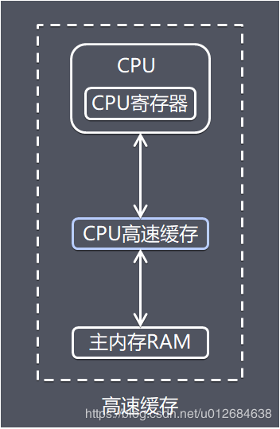
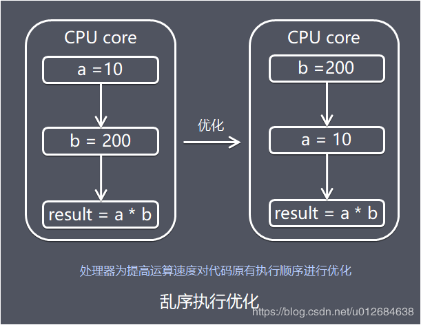
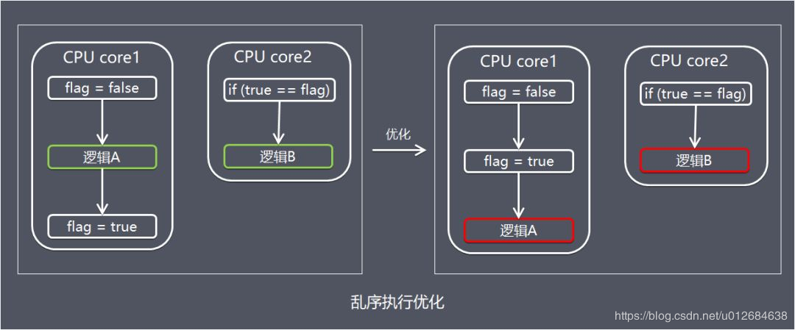
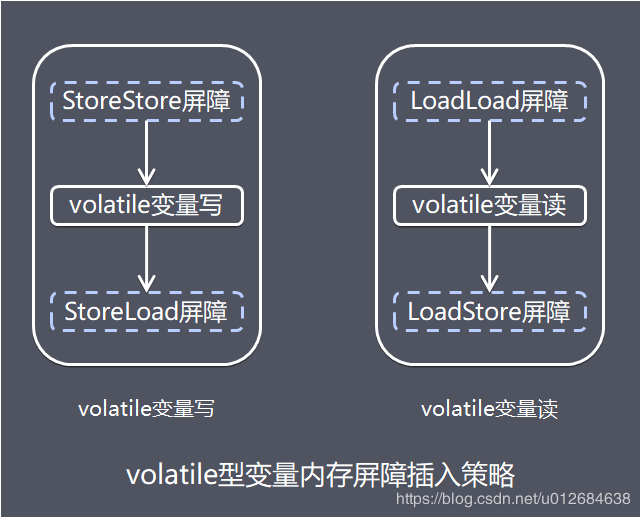

最近重新学习一遍《深入学习Java虚拟机》，把之前Java内存模型中模糊的知识重新梳理一遍，这篇文章主要介绍模型产生的问题背景，解决的问题，处理思路，相关实现规则，环环相扣，希望读者看完这篇文章后能对Java内存模型体系产生一个相对清晰的理解，知其然而知其所以然。

# 1 内存模型产生背景

在介绍Java内存模型之前，我们先了解一下物理计算机中的并发问题，理解这些问题可以搞清楚内存模型产生的背景。物理机遇到的并发问题与虚拟机中的情况有不少相似之处，物理机的解决方案对虚拟机的实现有相当的参考意义。

## 物理机的并发问题

- **硬件的效率问题**

计算机处理器处理绝大多数运行任务都不可能只靠处理器“计算”就能完成，处理器至少需要与**内存交互**，如读取运算数据、存储运算结果，这个I/O操作很难消除(无法仅靠寄存器完成所有运算任务)。

由于计算机的存储设备与处理器的运算速度有几个数量级的差距，为了避免处理器等待缓慢的内存读写操作完成，现代计算机系统通过加入一层读写速度尽可能接近处理器运算速度的高速缓存。缓存作为内存和处理器之间的缓冲：将运算需要使用到的数据复制到缓存中，让运算能快速运行，当运算结束后再从缓存同步回内存之中。




CPU高速缓存

- **缓存一致性问题**

基于高速缓存的存储系统交互很好地解决了处理器与内存速度的矛盾，但是也为计算机系统带来更高的复杂度，因为引入了一个新问题：**缓存一致性。**

在多处理器的系统中(或者单处理器多核的系统)，每个处理器(每个核)都有自己的高速缓存，而它们有共享同一主内存(Main Memory)。当多个处理器的运算任务都涉及同一块主内存区域时，将可能导致各自的缓存数据不一致。
 为此，需要各个处理器访问缓存时都遵循一些协议，在读写时要根据协议进行操作，来维护缓存的一致性。


缓存一致性

- **代码乱序执行优化问题**

为了使得处理器内部的运算单元尽量被充分利用，提高运算效率，处理器可能会对输入的代码进行乱序执行，处理器会在计算之后将乱序执行的结果重组，**乱序优化可以保证在单线程下该执行结果与顺序执行的结果是一致的**，但不保证程序中各个语句计算的先后顺序与输入代码中的顺序一致。



代码执行乱序优化

乱序执行技术是处理器为提高运算速度而做出违背代码原有顺序的优化。在单核时代，处理器保证做出的优化不会导致执行结果远离预期目标，但在多核环境下却并非如此。

多核环境下， 如果存在一个核的计算任务依赖另一个核 计的算任务的中间结果，而且对相关数据读写没做任何防护措施，那么其顺序性并不能靠代码的先后顺序来保证，处理器最终得出的结果和我们逻辑得到的结果可能会大不相同。



代码乱序执行优化的问题

以上图为例进行说明：CPU的core2中的逻辑B依赖core1中的逻辑A先执行

- 正常情况下，逻辑A执行完之后再执行逻辑B。
- 在处理器乱序执行优化情况下，有可能导致flag提前被设置为true，导致逻辑B先于逻辑A执行。

# 2 Java内存模型的组成分析

## 内存模型概念

为了更好解决上面提到系列问题，内存模型被总结提出，我们可以把内存模型理解为**在特定操作协议下，对特定的内存或高速缓存进行读写访问的过程抽象**。

不同架构的物理计算机可以有不一样的内存模型，Java虚拟机也有自己的内存模型。Java虚拟机规范中试图定义一种Java内存模型（Java Memory Model，简称JMM）来**屏蔽掉各种硬件和操作系统的内存访问差异**，以实现**让Java程序在各种平台下都能达到一致的内存访问效果**，不必因为不同平台上的物理机的内存模型的差异，对各平台定制化开发程序。

更具体一点说，Java内存模型提出目标在于，**定义程序中各个变量的访问规则，即在虚拟机中将变量存储到内存和从内存中取出变量这样的底层细节**。此处的变量(Variables)与Java编程中所说的变量有所区别，它包括了实例字段、静态字段和构成数值对象的元素，但不包括局部变量与方法参数，因为后者是线程私有的。(如果局部变量是一个reference类型，它引用的对象在Java堆中可被各个线程共享，但是reference本身在Java栈的局部变量表中，它是线程私有的)。

## Java内存模型的组成

- 主内存
   Java内存模型规定了所有变量都存储在主内存(Main Memory)中（此处的主内存与介绍物理硬件的主内存名字一样，两者可以互相类比，但此处仅是虚拟机内存的一部分）。
- 工作内存
   每条线程都有自己的工作内存(Working Memory，又称本地内存，可与前面介绍的处理器高速缓存类比)，线程的工作内存中保存了该线程使用到的变量的主内存中的共享变量的副本拷贝。**工作内存是 JMM 的一个抽象概念，并不真实存在**。它涵盖了缓存，写缓冲区，寄存器以及其他的硬件和编译器优化。

Java内存模型抽象示意图如下：


Java内存模型抽象示意图

## JVM内存操作的并发问题

结合前面介绍的物理机的处理器处理内存的问题，可以类比总结出JVM内存操作的问题，下面介绍的Java内存模型的执行处理将围绕解决这2个问题展开：

- **1 工作内存数据一致性**
   各个线程操作数据时会保存使用到的主内存中的共享变量副本，当多个线程的运算任务都涉及同一个共享变量时，将导致各自的的共享变量副本不一致，如果真的发生这种情况，数据同步回主内存以谁的副本数据为准？
   Java内存模型主要通过一系列的数据同步协议、规则来保证数据的一致性，后面再详细介绍。
- **2 指令重排序优化**
   Java中重排序通常是编译器或运行时环境为了优化程序性能而采取的对指令进行重新排序执行的一种手段。重排序分为两类：**编译期重排序和运行期重排序**，分别对应编译时和运行时环境。
   同样的，指令重排序不是随意重排序，它需要满足以下两个条件：
  - 1 在单线程环境下不能改变程序运行的结果
     即时编译器（和处理器）需要保证程序能够遵守 as-if-serial 属性。通俗地说，就是在单线程情况下，要给程序一个顺序执行的假象。即经过重排序的执行结果要与顺序执行的结果保持一致。
  - 2 存在数据依赖关系的不允许重排序

多线程环境下，如果线程处理逻辑之间存在依赖关系，有可能因为指令重排序导致运行结果与预期不同，后面再展开Java内存模型如何解决这种情况。

# 3 Java内存间的交互操作

在理解Java内存模型的系列协议、特殊规则之前，我们先理解Java中内存间的交互操作。

## 交互操作流程

为了更好理解内存的交互操作，以线程通信为例，我们看看具体如何进行线程间值的同步：


线程间交互操作

线程1和线程2都有主内存中共享变量x的副本，初始时，这3个内存中x的值都为0。线程1中更新x的值为1之后同步到线程2主要涉及2个步骤：

- 1 线程1把线程工作内存中更新过的x的值刷新到主内存中
- 2 线程2到主内存中读取线程1之前已更新过的x变量

从整体上看，这2个步骤是线程1在向线程2发消息，这个通信过程必须经过主内存。线程对变量的所有操作（读取，赋值）都必须在**工作内存中**进行。不同线程之间也无法直接访问对方工作内存中的变量，线程间变量值的传递均需要通过主内存来完成，实现各个线程共享变量的可见性。

## 内存交互的基本操作

关于主内存与工作内存之间的具体交互协议，即一个变量如何从主内存拷贝到工作内存、如何从工作内存同步回主内存之类的实现细节，Java内存模型中定义了下面介绍8种操作来完成。

虚拟机实现时必须保证下面介绍的每种操作都是原子的，不可再分的(对于double和long型的变量来说，load、store、read、和write操作在某些平台上允许有例外，后面会介绍）。

### 8种基本操作


8种基本操作

- lock (锁定)
   作用于**主内存**的变量，它把一个变量标识为一条线程独占的状态。
- unlock (解锁)
   作用于**主内存**的变量，它把一个处于锁定状态的变量释放出来，释放后的变量才可以被其他线程锁定。
- read (读取)
   作用于**主内存**的变量，它把一个变量的值从主内存**传输**到线程的工作内存中，以便随后的load动作使用。
- load (载入)
   作用于**工作内存**的变量，它把read操作从主内存中得到的变量值放入工作内存的变量副本中。
- use (使用)
   作用于**工作内存**的变量，它把工作内存中一个变量的值传递给执行引擎，每当虚拟机遇到一个需要使用到变量的值的字节码指令时就会执行这个操作。
- assign (赋值)
   作用于**工作内存**的变量，它把一个从执行引擎接收到的值赋给工作内存的变量，每当虚拟机遇到一个给变量赋值的字节码指令时执行这个操作。
- store (存储)
   作用于**工作内存**的变量，它把工作内存中一个变量的值传送到主内存中，以便随后write操作使用。
- write (写入)
   作用于**主内存**的变量，它把store操作从工作内存中得到的变量的值放入主内存的变量中。

# 4 Java内存模型运行规则

## 4.1 内存交互基本操作的3个特性

在介绍内存的交互的具体的8种基本操作之前，有必要先介绍一下操作的3个特性，Java内存模型是围绕着在并发过程中如何处理这3个特性来建立的，这里先给出定义和基本实现的简单介绍，后面会逐步展开分析。

- **原子性(Atomicity)**
   **即一个操作或者多个操作 要么全部执行并且执行的过程不会被任何因素打断，要么就都不执行**。即使在多个线程一起执行的时候，一个操作一旦开始，就不会被其他线程所干扰。
- **可见性(Visibility)**
   **是指当多个线程访问同一个变量时，一个线程修改了这个变量的值，其他线程能够立即看得到修改的值**。
   正如上面“交互操作流程”中所说明的一样，JMM是通过在线程1变量工作内存修改后将新值同步回主内存，线程2在变量读取前从主内存刷新变量值，这种**依赖主内存作为传递媒介**的方式来实现可见性。
- **有序性(Ordering)**
   有序性规则表现在以下两种场景: 线程内和线程间
  - 线程内
     从某个线程的角度看方法的执行，指令会按照一种叫“串行”（as-if-serial）的方式执行，此种方式已经应用于顺序编程语言。
  - 线程间
     这个线程“观察”到其他线程并发地执行非同步的代码时，由于指令重排序优化，任何代码都有可能交叉执行。唯一起作用的约束是：对于同步方法，同步块(synchronized关键字修饰)以及volatile字段的操作仍维持相对有序。

Java内存模型的一系列运行规则看起来有点繁琐，但总结起来，是**围绕原子性、可见性、有序性特征建立**。归根究底，是为实现共享变量的在多个线程的工作内存的**数据一致性**，多线程并发，指令重排序优化的环境中程序能如预期运行。

## 4.2 happens-before关系

介绍系列规则之前，首先了解一下happens-before关系：用于描述下2个操作的内存可见性：**如果操作A happens-before 操作B，那么A的结果对B可见**。happens-before关系的分析需要分为**单线程和多线程**的情况：

- **单线程下的 happens-before**
   字节码的先后顺序天然包含happens-before关系：因为单线程内共享一份工作内存，不存在数据一致性的问题。
   在程序控制流路径中靠前的字节码 happens-before 靠后的字节码，即靠前的字节码执行完之后操作结果对靠后的字节码可见。然而，这并不意味着前者一定在后者之前执行。实际上，如果后者不依赖前者的运行结果，那么它们可能会被重排序。
- **多线程下的 happens-before**
   多线程由于每个线程有共享变量的副本，如果没有对共享变量做同步处理，线程1更新执行操作A共享变量的值之后，线程2开始执行操作B，此时操作A产生的结果对操作B不一定可见。

为了方便程序开发，Java内存模型实现了下述支持happens-before关系的操作：

- 程序次序规则
   一个线程内，按照代码顺序，书写在前面的操作 happens-before 书写在后面的操作。
- 锁定规则
   一个unLock操作 happens-before 后面对同一个锁的lock操作。
- volatile变量规则
   对一个变量的写操作 happens-before 后面对这个变量的读操作。
- 传递规则
   如果操作A happens-before  操作B，而操作B又 happens-before 操作C，则可以得出操作A happens-before 操作C。
- 线程启动规则
   Thread对象的start()方法 happens-before 此线程的每个一个动作。
- 线程中断规则
   对线程interrupt()方法的调用 happens-before 被中断线程的代码检测到中断事件的发生。
- 线程终结规则
   线程中所有的操作都 happens-before 线程的终止检测，我们可以通过Thread.join()方法结束、Thread.isAlive()的返回值手段检测到线程已经终止执行。
- 对象终结规则
   一个对象的初始化完成 happens-before 他的finalize()方法的开始

## 4.3 内存屏障

Java中如何保证底层操作的有序性和可见性？可以通过内存屏障。

内存屏障是被插入两个CPU指令之间的一种指令，用来禁止处理器指令发生重排序（像屏障一样），从而保障**有序性**的。另外，为了达到屏障的效果，它也会使处理器写入、读取值之前，将主内存的值写入高速缓存，清空无效队列，从而保障**可见性**。

举个例子：

```cpp
Store1; 
Store2;   
Load1;   
StoreLoad;  //内存屏障
Store3;   
Load2;   
Load3;
```

对于上面的一组CPU指令（Store表示写入指令，Load表示读取指令），StoreLoad屏障之前的Store指令无法与StoreLoad屏障之后的Load指令进行交换位置，即**重排序**。但是StoreLoad屏障之前和之后的指令是可以互换位置的，即Store1可以和Store2互换，Load2可以和Load3互换。

常见有4种屏障

- LoadLoad屏障：
   对于这样的语句 Load1; LoadLoad; Load2，在Load2及后续读取操作要读取的数据被访问前，保证Load1要读取的数据被读取完毕。
- StoreStore屏障：
   对于这样的语句 Store1; StoreStore; Store2，在Store2及后续写入操作执行前，保证Store1的写入操作对其它处理器可见。
- LoadStore屏障：
   对于这样的语句Load1; LoadStore; Store2，在Store2及后续写入操作被执行前，保证Load1要读取的数据被读取完毕。
- StoreLoad屏障：
   对于这样的语句Store1; StoreLoad; Load2，在Load2及后续所有读取操作执行前，保证Store1的写入对所有处理器可见。它的开销是四种屏障中最大的（冲刷写缓冲器，清空无效化队列）。在大多数处理器的实现中，这个屏障是个万能屏障，兼具其它三种内存屏障的功能。

Java中对内存屏障的使用在一般的代码中不太容易见到，常见的有volatile和synchronized关键字修饰的代码块(后面再展开介绍)，还可以通过Unsafe这个类来使用内存屏障。

## 4.4 8种操作同步的规则

JMM在执行前面介绍8种基本操作时，为了保证内存间数据一致性，JMM中规定需要满足以下规则：

- 规则1：如果要把一个变量从主内存中复制到工作内存，就需要按顺序的执行 read 和 load 操作，如果把变量从工作内存中同步回主内存中，就要按顺序的执行 store 和 write 操作。但 Java 内存模型只要求上述操作必须按顺序执行，而没有保证必须是连续执行。
- 规则2：不允许 read 和 load、store 和 write 操作之一单独出现。
- 规则3：不允许一个线程丢弃它的最近 assign 的操作，即变量在工作内存中改变了之后必须同步到主内存中。
- 规则4：不允许一个线程无原因的（没有发生过任何 assign 操作）把数据从工作内存同步回主内存中。
- 规则5：一个新的变量只能在主内存中诞生，不允许在工作内存中直接使用一个未被初始化（load 或 assign ）的变量。即就是对一个变量实施 use 和 store 操作之前，必须先执行过了 load 或 assign  操作。
- 规则6：一个变量在同一个时刻只允许一条线程对其进行 lock 操作，但 lock 操作可以被同一条线程重复执行多次，多次执行 lock 后，只有执行相同次数的 unlock 操作，变量才会被解锁。所以 lock 和 unlock 必须成对出现。
- 规则7：如果对一个变量执行 lock 操作，将会清空工作内存中此变量的值，在执行引擎使用这个变量前需要重新执行 load 或 assign 操作初始化变量的值。
- 规则8：如果一个变量事先没有被 lock 操作锁定，则不允许对它执行 unlock 操作；也不允许去 unlock 一个被其他线程锁定的变量。
- 规则9：对一个变量执行 unlock 操作之前，必须先把此变量同步到主内存中（执行 store 和 write 操作）

看起来这些规则有些繁琐，其实也不难理解：

- 规则1、规则2
   工作内存中的共享变量作为主内存的副本，主内存变量的值同步到工作内存需要read和load一起使用，工作内存中的变量的值同步回主内存需要store和write一起使用，这2组操作各自都是是一个固定的有序搭配，不允许单独出现。
- 规则3、规则4
   由于工作内存中的共享变量是主内存的副本，为保证数据一致性，当工作内存中的变量被字节码引擎重新赋值，必须同步回主内存。如果工作内存的变量没有被更新，不允许无原因同步回主内存。
- 规则5
   由于工作内存中的共享变量是主内存的副本，必须从主内存诞生。
- 规则6、7、8、9
   为了并发情况下安全使用变量，线程可以基于lock操作独占主内存中的变量，其他线程不允许使用或unlock该变量，直到变量被线程unlock。

## 4.5 volatile型变量的特殊规则

volatile的中文意思是不稳定的，易变的，用volatile修饰变量是为了保证变量的可见性。

### volatile的语义

volatile主要有下面2种语义

### 语义1 保证可见性

保证了不同线程对该变量操作的内存可见性。

这里保证可见性是不等同于volatile变量并发操作的安全性，保证可见性具体一点解释：

**线程写volatile变量的过程：**

- 1 改变线程工作内存中volatile变量副本的值
- 2 将改变后的副本的值从工作内存刷新到主内存

**线程读volatile变量的过程：**

- 1 从主内存中读取volatile变量的最新值到线程的工作内存中
- 2 从工作内存中读取volatile变量的副本

但是如果多个线程同时把更新后的变量值同时刷新回主内存，可能导致得到的值不是预期结果：

举个例子：
 定义volatile int count = 0，2个线程同时执行count++操作，每个线程都执行500次，最终结果小于1000，原因是每个线程执行count++需要以下3个步骤：

- 步骤1 线程从主内存读取最新的count的值
- 步骤2 执行引擎把count值加1，并赋值给线程工作内存
- 步骤3 线程工作内存把count值保存到主内存
   有可能某一时刻2个线程在步骤1读取到的值都是100，执行完步骤2得到的值都是101，最后刷新了2次101保存到主内存。

### 语义2 禁止进行指令重排序

具体一点解释，禁止重排序的规则如下：

- 当程序执行到 volatile变量的读操作或者写操作时，在其前面的操作的更改肯定全部已经进行，且结果已经对后面的操作可见；在其后面的操作肯定还没有进行；
- 在进行指令优化时，不能将在对 volatile 变量访问的语句放在其后面执行，也不能把 volatile 变量后面的语句放到其前面执行。

普通的变量仅仅会保证该方法的执行过程中所有依赖赋值结果的地方都能获取到正确的结果，而不能保证赋值操作的顺序与程序代码中的执行顺序一致。

举个例子：


```php
volatile boolean initialized = false;

// 下面代码线程A中执行
// 读取配置信息，当读取完成后将initialized设置为true以通知其他线程配置可用
doSomethingReadConfg();
initialized = true;

// 下面代码线程B中执行
// 等待initialized 为true，代表线程A已经把配置信息初始化完成
while (!initialized) {
     sleep();
}
// 使用线程A初始化好的配置信息
doSomethingWithConfig();
```

上面代码中如果定义initialized变量时没有使用volatile修饰，就有可能会由于指令重排序的优化，导致线程A中最后一句代码 "initialized = true" 在 “doSomethingReadConfg()” 之前被执行，这样会导致线程B中使用配置信息的代码就可能出现错误，而volatile关键字就禁止重排序的语义可以避免此类情况发生。

### volatile型变量实现原理

具体实现方式是在编译期生成字节码时，会在指令序列中增加内存屏障来保证，下面是基于保守策略的JMM内存屏障插入策略：



volatile型变量内存屏障插入策略

- 在每个volatile写操作的前面插入一个StoreStore屏障。
   该屏障除了保证了屏障之前的写操作和该屏障之后的写操作不能重排序，还会保证了volatile写操作之前，任何的读写操作都会先于volatile被提交。
- 在每个volatile写操作的后面插入一个StoreLoad屏障。
   该屏障除了使volatile写操作不会与之后的读操作重排序外，还会刷新处理器缓存，使volatile变量的写更新对其他线程可见。
- 在每个volatile读操作的后面插入一个LoadLoad屏障。
   该屏障除了使volatile读操作不会与之前的写操作发生重排序外，还会刷新处理器缓存，使volatile变量读取的为最新值。
- 在每个volatile读操作的后面插入一个LoadStore屏障。
   该屏障除了禁止了volatile读操作与其之后的任何写操作进行重排序，还会刷新处理器缓存，使其他线程volatile变量的写更新对volatile读操作的线程可见。

### volatile型变量使用场景

总结起来，就是“一次写入，到处读取”，某一线程负责更新变量，其他线程只读取变量(不更新变量)，并根据变量的新值执行相应逻辑。例如状态标志位更新，观察者模型变量值发布。

## 4.6 final型变量的特殊规则

我们知道，final成员变量必须在声明的时候初始化或者在构造器中初始化，否则就会报编译错误。
 final关键字的可见性是指：被final修饰的字段在声明时或者构造器中，一旦初始化完成，那么在其他线程无须同步就能正确看见final字段的值。这是因为一旦初始化完成，final变量的值立刻回写到主内存。

## 4.7 synchronized的特殊规则

通过 synchronized关键字包住的代码区域，对数据的读写进行控制：

- 读数据
   当线程进入到该区域读取变量信息时，对数据的读取也不能从工作内存读取，只能从内存中读取，保证读到的是最新的值。
- 写数据
   在同步区内对变量的写入操作，在离开同步区时就将当前线程内的数据刷新到内存中，保证更新的数据对其他线程的可见性。

## 4.8 long和double型变量的特殊规则

Java内存模型要求lock、unlock、read、load、assign、use、store、write这8种操作都具有原子性，但是对于64位的数据类型(long和double)，在模型中特别定义相对宽松的规定：允许虚拟机将没有被volatile修饰的64位数据的读写操作分为2次32位的操作来进行。也就是说虚拟机可选择不保证64位数据类型的load、store、read和write这4个操作的原子性。由于这种非原子性，有可能导致其他线程读到同步未完成的“32位的半个变量”的值。

不过实际开发中，Java内存模型强烈建议虚拟机把64位数据的读写实现为具有原子性，目前各种平台下的商用虚拟机都选择把64位数据的读写操作作为原子操作来对待，因此我们在编写代码时一般不需要把用到的long和double变量专门声明为volatile。

# 5 总结

由于Java内存模型涉及系列规则，网上的文章大部分就是对这些规则进行解析，但是很多没有解释为什么需要这些规则，这些规则的作用，其实这是不利于初学者学习的，容易绕进去这些繁琐规则不知所以然，下面谈谈我的一点学习知识的个人体会：

**学习知识的过程不是等同于只是理解知识和记忆知识，而是要对知识解决的问题的输入和输出建立连接**，知识的本质是解决问题，所以在学习之前要理解问题，理解这个问题要的输出和输出，而知识就是输入到输出的一个关系映射。知识的学习要结合大量的例子来**理解这个映射关系，然后压缩知识**，华罗庚说过：“把一本书读厚，然后再读薄”，解释的就是这个道理，先结合大量的例子理解知识，然后再压缩知识。

以学习Java内存模型为例：

- 理解问题，明确输入输出
   首先理解Java内存模型是什么，有什么用，解决什么问题
- 理解内存模型系列协议
   结合大量例子理解这些协议规则
- 压缩知识
   大量规则其实就是通过数据同步协议，保证内存副本之间的数据一致性，同时防止重排序对程序的影响。