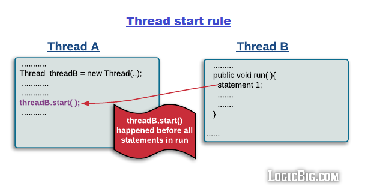

## 1、有多少种实现线程的方法？典型错误答案和正确答案（对应视频3-1~3-3、3.6）
答题思路，以下5点：
1. 从不同的角度看，会有不同的答案。
2. 典型答案是两种，分别是实现Runnable接口和继承Thread类，然后具体展开说；
3. 但是，我们看原理，其实Thread类实现Runnable接口，并且看Thread类的run方法，会发现其实两种方法的本质都是一样的，run方法的代码如下：

```java
@Override
public void run() {
    if(target != null) {
        target.run();
    }
}
```

​		方法一和方法二，也就是**继承Thread类然后重写run**和**实现Runnable接口并传入Thread类**在实现多线程的本质上，并没有区别，都是最终调用了start()方法来创建新线程。这两个方法的区别在于run()方法的来源：

> 方法一：最终调用target.run()；
>
> 方法二：run()整个都被重写；

4. 然后具体展开说其它方式：还有其他实现线程的方式，比如线程池、定时器。他们也能创建线程，但是细看源码，从没有逃出过本质，也就是实现Runnable接口和继承Thread类。
5. 结论：我们只能通过新建Thread类这一种方式来创建线程，但是类里面的run方法有两种方式来实现第一种是重写run方法，第二种是实现Runnable接口的run方法，然后把该runnable实例传给Threa类。除此之外，从表面上看线程池、定时器等工具类也可以创建线程，但是他们的本质都逃不出刚才所说的范围。

以上这种描述比直接回答一种、两种、多种都更准确。


## 2、实现Runnable接口和继承Thread类哪种方式更好？（对应视频3-2）

### 1、实现Runnable接口更好

1.  从代码架构角度：**具体的任务（run方法）**应该和创**建运行线程的机制（Thread类）**解耦，用runnable对象可以**实现解耦**。通过Runnable方式实现的run方法中的内容就是具体执行的任务，可以让一个单独任务类实现Runnable接口，然后把对应的实例传入Thread类就可以。这样的话，同样一个任务类，可以传给不同的Thread，并且任务类也不负责创建线程等工作，是解耦的。
2. 使用Thread的方式的恶化，那么每次想要新建一个任务，只能新建一个独立的线程，而这样做的损耗会比较大（比如重头开始创建一个线程、执行完毕之后再销毁等。如果线程的实际工作内容也就是run()方法只是简单打印一行文字的话，那么可能现成的工作内容还不如损耗来的大）。如果使用Runnable和线程池，就可以大大减小这样的损耗。
3. 继承Thread类之后，由于Java语言不支持多继承，这样就无法再继承其它的类，限制了可扩展性。

> 通常我们优先选择实现Runnable接口。
>
> 继承Thread类也会有几个小小的好处，但是相比于缺点来说的话，不值一提。比如
>
> 1. run()方法内获取当前线程可以直接使用this，而无需用Thread.currentThread()方法；
> 2. 继承的类内部变量不会直接共享，少数不需要共享变量的场景下使用起来会更方便；

### 2、两种方法的本质对比

方法一和方法二，也就是**继承Thread类然后重写run**和**实现Runnable接口并传入Thread类**在实现多线程的本质上，并没有区别，都是最终调用了start()方法来创建新线程。这两个方法的区别在于run()方法的来源：

```java
@Override
public void run() {
    if(target != null) {
        target.run();
    }
}
```

> 方法一：最终调用target.run()；
>
> 方法二：run()整个都被重写；


## 3、一个线程调用两次start方法会出现什么情况？为什么？（对应视频4-2、4-5）

### 1、让我们一起来看下start()的源码

```java
public synchronized void start() {
        
    if (threadStatus != 0)
        throw new IllegalThreadStateException();

    group.add(this);

    boolean started = false;
    try {
        start0();
        started = true;
    } finally {
        try {
            if (!started) {
                group.threadStartFailed(this);
            }
        } catch (Throwable ignore) {
            /* do nothing. If start0 threw a Throwable then
                  it will be passed up the call stack */
        }
    }
}

private native void start0();
```

### 2、流程

1. 检查流程状态，只有NEW状态下的线程才能继续，否则会抛出IllegalThreadStateException（在运行中活着已结束的线程，都不能再次启动，详见代码中的CantStartTwice类）；
2. 被加入线程组；
3. 调用start0()方法启动线程；

> 注意点：
>
> 1. start方法是被synchronized修饰的方法，可以保证线程安全；
> 2. 由JVM创建的main方法线程和system组线程，并不会通过start来启动；

### 3、解答

丛源码可以看出，start的时候会先检查线程状态，只有NEW状态下的线程才能继续，否则会抛出IllegalThreadStateException。

### 4、既然Thread.start()只能调用一次。那么线程池是如何实现复用的呢?

线程重用的核心是，线程池对Thread做了包装，不重读调用thread.start()，而是自己有一个Runnable.run()，run方法里面循环在跑，跑的过程中不断检查我们是否有新加入的子Runnable对象，有新的Runnable进来的话就调一下我们的run()，其实就是一个大run()把其它小run()#1、run()#1、...给串联起来了。同一个Thread可以执行不同的Runnable，主要原因是线程池吧线程和Runnabel通过BlokingQueue给解耦了，线程可以从BlokingQueue中不断的获取新的任务。


## 4、既然start()方法会调用run()方法，为什么我们选择调用start()方法，而不是直接调用run()方法呢？（对应视频4-5）

start()才是真正启动一个线程，而如果直接调用run()，那么run只是一个普通的方法而已，和线程的生命周期没有任何关系。


## 5、如何正确停止一个线程？（对应视频5-6、5-7、5-15）

1. **原理**：用interrupt来请求线程停止而不是强制，好处是安全；
2. **三方配合**：想停止线程，要请求方、被停止方、子方法被调用放方相互配合才行；
   1. **被停止方**：每次循环中或者适时检查中断信号，并且在可能抛出InterruptException的地方处理该中断信号；
   2. **请求方**：发出中断信号；
   3. **子方法调用方（被线程调用的方法的作者）**：优先在方法层面抛出InterruptException，或者检查到中断信号时，再次设置中断状态；
3. 最后再说**错误的方法**：stop/suspend已废弃，volatile的boolean无法处理长时间阻塞的情况；


## 6、如何处理不可中断的阻塞（例如抢锁时ReentrantLock.lock()或者Socket I/O时无法响应中断应该怎么让该线程停止呢？）（对应视频5-15）

如果线程阻塞是由于调用了wait()、sleep()或者join()方法，你可以中断线程，通过抛出InterruptException异常来唤醒线程。

但是对于不能响应InterruptException的阻塞，很遗憾，并没有一个通用的解决方案。

但是我们可以利用特定的其它可以响应中断的方法，比如ReentrantLock.lockInterruptibly()，比如关闭套接字使线程立即返回等方法来达到目的。

答案有很多种，因为有很多原因会造成阻塞，所以针对不同情卡U那个，唤起的方法也不同。


总结来说就是如果不支持响应中断，就要用特定的方法来唤起，没有万能药。


## 7、线程有哪几种状态？声明周期是什么？（对应视频6-1、6-2、6-5）


图中共有3点需要说明：状态、路径、转换条件。

### 1、六种状态

```Java
NEW、RUNNABLE、BLOCKED、WAITING、TIMED_WAITING、TERMINATED
```

### 2、转换关系

1. 新创建线程只能往下走到可运行，而不能直接跳跃到其它状态；
2. 线程生命周期不可回头：一旦到了可运行就不能回到新创建，一旦被终止，就不能再有任何状态的变化了。所以一个线程只能有一次的新创建和已终止。线程是不可以重重复执行的，当它运行完了之后便会结束，一单一个线程进入了TERMINATED状态，它便不可以重新变回RUNNABLE等状态，这个不可重复执行的性质和线程池是一样的。如果我们还想执行该任务，可以选择重新创建一个线程，而原对象会被JVM回收。

### 3、转化条件

详见状态转移图。

### 4、特殊情况

1. 如果发生异常，可以直接跳到终止TERMINATED状态，不必再遵循路径，比如可以WAITING直接到TERMINATED；
2. 从Object.wait()刚被唤醒时，通常不能立即抢到monitor锁，那就会从WAITING先进入BLOCKED状态，抢到锁后再转换到RUNNABLE状态；

wait相关状态转移图如下：


### 5、线程状态官方文档

https://docs.oracle.com/javase/8/docs/api/index.html?java/lang/Thread.State.html

### 6、各个状态的代码演示

详见包`package per.lzy.concurrencuylearning.core.sixstate_04`。


## 8、如何用wait()实现两个线程交替打印0-100的奇偶数？（对应视频7-7）

### 1、问题描述

两个线程，一个线程打印奇数另一个打印偶数，它们交替输出，如下所示：

> 偶线程：0
>
> 奇线程：1
>
> 偶线程：2
>
> ......
>
> 奇线程：99
>
> 偶线程：100

### 2、解题思路

#### 2.1  用synchronized实现

比较容易想到的一个方案是，要输出的时候判断一下当前需要输出的数是不是自己要负责打印的值，如果是就输出，如果不是就直接释放锁。代码详见文件`WaitNotifyPrintOddEvenSyn.java`。

这个方法可以满足题目的要求：两个线程，一个打印奇数，一个打印偶数，轮流输出。但是只用了一个讨巧的方式避开了线程交替获取锁的需求，明显没有答到面试官考察的点上。而且效率较低，如果同一个线程一直抢到锁，而另一个线程一直没有拿到，就会导致线程做很多无谓的空转。那么有没有更好的解决方案，让两个线程严格的交替获取到锁呢？

> 注意：这里的synchronized的锁对象不应该用count变量，因为该变量执行了count++之后，count所指向的对象地址已经变了。

#### 2.2  更好的方法：wait/notify

交替获取锁的方案：这种实现方式的原理就是线程1打印之后唤醒线程2，然后让出锁，自己进入休眠状态。因为进入了休眠状态就不会与线程2抢锁，此时只有线程2在获取锁，所以线程2必然会拿到锁。线程2以同样的逻辑执行，唤醒线程1并让出自己持有的锁，自己进入休眠状态。这样来来回回，持续执行直到任务完。代码详见文件`WaitNotifyPrintOddEveWait.java`。


## 9、如何用wait()实现生产者模式？（对应视频7-6）

### 1、为什么要使用生产者消费者模式

在线程世界里，生产者就是生产数据的线程，消费者就是消费数据的线程。在多线程开发当中，如果生产者处理速度很快，而消费者处理速度很慢，那么生产者就必须等待消费者处理完，才能继续处理数据。同样的道理，如果消费者的处理能力大于生产者，那没消费者就必须等待生产者。为了解决这个问题于是引入了生产者和消费者模式。

### 2、什么是生产者消费者模式

生产者消费者模式（后面简称生产者模式）是非常经典的设计模式之一，而实现生产者模式是wait/notify的典型用途之一。我们将在本小节学习生产者模式，以及如何用wait、notify来实现它。

我面腾讯的时候面到过用wait/notify手写生产者模式的问题，这很重要的一个知识点，很基础，但是可以全面考察候选人的内功。

生产者消费者模式是通过一个容器来解决生产者和消费者的强耦合问题。生产者和消费者彼此之间不直接通讯，而通过阻塞队列来进行通讯，所以生产者生产完数据之后不用等待消费者处理，直接扔给阻塞队列，消费者不找生产者要数据，而是直接从阻塞队列里取，阻塞队列就相当于一个缓冲区，平衡了生产者和消费者的处理能力。

#### 2.1 特点

1. 生产者仅在仓库未满的时候生产，如果仓库满了就停止生产。
2. 消费者仅在仓库有产品时才能消费，如果仓库里面没产品，就等待。
3. 当消费者发现仓库没产品了，会通知生产者去生产。
4.  当生产者生产出可了产品，会通知等待的消费者去消费。

本次是用wait/notify实现，后面还会要求用Condition和BlockingQueue实现生产者消费者模式，原理都是一样的。

#### 2.2 示意图


#### 2.3 代码

```java
public class ProducerConsumer {

    public static void main(String[] args) {
        EventStorage eventStorage = new EventStorage();
        Thread producer = new Thread(new Producer(eventStorage));
        Thread consumer = new Thread(new Consumer(eventStorage));
        producer.start();
        consumer.start();
    }
}

// 生产者
class Producer implements Runnable {
    private EventStorage eventStorage;

    public Producer(EventStorage eventStorage) {
        this.eventStorage = eventStorage;
    }

    @Override
    public void run() {
        while (true) {
            eventStorage.put();
        }
    }
}

// 消费者
class Consumer implements Runnable {

    private EventStorage eventStorage;

    public Consumer(EventStorage eventStorage) {
        this.eventStorage = eventStorage;
    }

    @Override
    public void run() {
        while (true) {
            eventStorage.take();
        }
    }
}

// 数据层抽象出来
class EventStorage {
    private int maxLength;
    private LinkedList<Long> linkedList;

    public EventStorage() {
        this.maxLength = 100;
        this.linkedList = new LinkedList<>();
    }

    public synchronized void put() {
        // 队列中放满时，生产者wait()等待消费者唤醒
        while (linkedList.size() == maxLength) {
            try {
                this.wait();
            } catch (InterruptedException e) {
                e.printStackTrace();
            }
        }

        // 没满时就接着放数据
        linkedList.add(System.nanoTime());
        System.out.println("仓库中有了" + linkedList.size() + "个产品");
        this.notify();
    }

    public synchronized void take() {
        // 队列为空的时候，消费者wait()等待生产者唤醒
        while (linkedList.size() == 0) {
            try {
                this.wait();
            } catch (InterruptedException e) {
                e.printStackTrace();
            }
        }

        // 不为空的时候就取数据
        long date = linkedList.remove();
        System.out.println("拿到了" + date + ",现在仓库还剩下" + linkedList.size());
        this.notify();
    }
}
```

这里在Storage初始化的时候，配置了容量，所以满了就会阻塞。


## 10、为什么wait()必须在同步代码块中使用？（对应视频7-8）

我们反过来想，如果不要求wait必须在同步块里面，而是可以在之外吊用的话，那么就会有以下代码：

```java
class BlockingQueue {
    Queue<String> buffer = new LinkedList<>();
    
    public void give(String date) {
        buffer.add(data);
        notify();	// since someone may be waiting in take
    }
    
    public String take() throws InterruptedException {
        while (buffer.isEmpty()) {
            wait();
        }
        
        return buffer.remove();
    }
}
```

那么可能会发生以下错误：

1. 消费者线程调用take()并看到了buffer.isEmpty()；
2. 在消费者线程继续wait()之前，生产者线程调用一个完整的give()，也就是buffer.add(data)和notify()；
3. 消费者线程现在调用wait()，但是错过了刚才的notify()；
4. 如果运气不好，即使有可用的数据，但是没有更多生产者生产的话，那么消费者会陷入wait的无限期等待。

一旦你理解了这个问题，解决方案是显而易见的：synchronized用来确保notify永远不会在isEmpty和wait之间被调用。


## 11、为什么线程通信方法wait()/notify()/notifyAll()定义在Object类中？而sleep定义在Thread类里？（对应视频7-8）

**每个对象都可以上锁**，由于wait，notify和notifyAll都是锁级别的操作，所以把他们定义在Object类中，因为**锁属于对象**。

Java的每个对象中都有一个锁(monitor，也可以成为监视器) 并且wait()，notify()等方法用于等待对象的锁或者通知其他线程对象的监视器可用。在Java的线程中并没有可供任何对象使用的锁和同步器。这就是为什么这些方法是Object类的一部分，这样Java的每一个类都有用于线程间通信的基本方法。

一个很明显的原因是JAVA提供的锁是对象级的而不是线程级的，每个对象都有锁，通过线程获得。如果线程需要等待某些锁那么调用对象中的wait()方法就有意义了。如果wait()方法定义在Thread类中，线程正在等待的是哪个锁就不明显了。

每个对象都拥有monitor（即锁），所以让当前线程等待某个对象的锁，当然应该通过这个对象来操作了。而不是用当前线程来操作，因为当前线程可能会等待多个线程的锁，如果通过线程来操作，就非常复杂了。


## 12、wait方法是属于Object对象的，那么调用Thread.wait()会怎么样？（对应视频7-8）

这里就把Thread当成是一个普通的类，和Object没有区别。

但是这样会有一个问题，那就是线程退出的时候会自动notify()，这会让我们自己设计的唤醒流程受到极大的干扰，所以十分不推荐调用Thread类的wait()，因为这会影响到系统API的正常运行，或者被系统API影响到。


## 13、如何选择用notify还是notifyAll？（对应视频7-3）

Object.notify()可能导致信号丢失这样的正确性问题，而Object.notifyAll()虽然效率不太高（把不需要唤醒的等待线程也给唤醒了），但是其在正确性方面有保障。因此实现通知的一种比较流行的保守性方法是优先使用Object.notifyAll()以保障正确性，只有在有证据表明使用Object.notify()足够的情况下才使用Object.notify()——Object.notify()只有在下列条件全部满足的情况下才能够用于替代notifyAll方法。

条件1：一次通知仅需要唤醒至多一个线程。这一点容易理解，但是光满足这一点还不足以用Object.notify()去替代Object.notifyAll()。在不同的等待线程可能使用不同的保护条件的情况下，Object.notify()唤醒的一个任意线程可能并不是我们需要唤醒的那一个（种）线程。因此，这个问题还需要通过满足条件2来排除。

条件2：相应对象的等待集中仅包含同质等待线程。所谓同质等待线程指这些线程使用同一个保护条件，并且这些线程在Object.wait()调用返回之后的处理逻辑一致。最为典型的同质线程是使用同一个Runnable接口实例创建的不同线程（实例）或者从同一个Thread子类的new出来的多个实例。

> 注意：
>
> Object.notify()唤醒的是其所属对象上的一个任意等待线程。Object.notify()本身在唤醒线程时是不考虑保护条件的。Object.notifyAll()方法唤醒的是其所属对象上的所有等待线程。使用Object.notify()替代Object.notifyAll()时需要确保以下两个条件同时得以满足：
>
> - 一次通知仅需要唤醒至多一个线程；
> - 相应对象上的所有等待线程都是同质等待线程；


## 14、notifyAll之后所有的线程都会再次抢夺锁，那么某个线程抢夺失败怎么办？（对应视频7-8）

继续等待，不会有其他动作，就和等待synchronized的monitor一样。


## 15、用suspend()和resume()来阻塞线程可以吗？为什么？（对应视频7-8）

suspend() 和 resume() 已经不推荐使用，功能类似于wait和notify，但是不释放锁，并且容易引起死锁。


## 16、wait/notify、sleep的异同（方法属于哪个对象？线程状态怎么切换？）？（对应视频7-11）

### 1、相同

1. Wait和sleep方法都可以使线程阻塞，对应线程状态是Waiting或Time_Waiting。 
2. wait和sleep方法都可以响应中断Thread.interrupt()。

### 2、不同

1. wait方法的执行必须在同步方法中进行，而sleep则不需要；
2. 在同步方法里执行sleep方法时，不会释放monitor锁，但是wait方法会释放monitor锁；
3. sleep 方法 短暂 休眠 之后 会 主动 退出 阻塞， 而没有指定时间的 wait 方法则需要被其它线程中断或唤醒后才能退出阻塞；
4. wait()和notify(),notifyAll()是Object类的方法，sleep()和yield()是Thread类的方法；


## 17、在join期间，线程处于那种线程状态？（对应视频7-13）

有书本说是Blocked状态（Java高并发编程详解多线程与架构设计3.8.1），但是这是不对的。

我们自己动手来实验，实践出真知，代码不会骗人。

代码详见`JoinThreadState.java`类。

经过代码演示，我们知道了，答案是Waiting，那么为什么不是Timed_waiting呢，因为join的时候无法预料等待时间是多少。


## 18、yield和sleep的区别？（对应视频7-15）

yield和sleep区别是，sleep期间线程调度器不会去调度该线程，而yield方法时只是让线程释放出自己的CPU时间片，线程依然处于就绪状态，随时可能再次被调度。


## 19、守护线程和普通线程的区别？（对应视频8-3）

User和Daemon两者几乎没有区别，唯一的不同之处就在于虚拟机的离开：如果 User Thread已经全部退出运行了，只剩下Daemon Thread存在了，虚拟机也就退出了，这是因为没有了“被守护者“，Daemon也就没有工作可做了，也就没有继续运行程序的必要了。


## 20、我们是否需要给线程设置为守护线程？（对应视频8-3）

我们通常不应把自己的线程设置为守护线程，因为设置为守护线程是很危险的。比如线程正在访问如文件、数据库的时候，所有用户线程都结束了，那么守护线程会在任何时候甚至在一个操作的中间发生中断，所以守护线程永远不应该去访问固有资源。


## 21、为什么程序设计不依赖于线程优先级？（对应视频8-4）

由于优先级最终是由线程调度器来决定调度方案的，所以优先级高并不能保证就一定比优先级低的先运行；并且如果优先级设置得不合适，可能会导致线程饥饿等问题（优先级低的线程始终得不到运行），所以通常而言，我们不必要设置线程的优先级属性，保持默认的优先级就可以。

给线程设置的优先级的意图是希望高优先级的线程被优先执行，但是线程优先级的执行情况是高度依赖于操作系统的，Java的10个线程的优先级会被映射到操作系统的优先级上，不同的操作系统的优先级个数也许更多，也许更少。

例如， Windows 有7 个优先级别，对应关系如下：


但是在Oracle 为Linux 提供的Java 虚拟机中， 线程的优先级被忽略——所有线程具有相同的优先级；Solaris中有2的32次这么多个优先级级别。所以可以看出，“**优先级”这个属性，会随着操作系统的不同而变化，这是很不可靠的**。

刚才仅仅是优先级不可靠的第一个原因，还有第二个原因：

**优先级可能会被系统自行改变**。例如，在Windows系统中存在一个称为“优先级推进器”（Priority Boosting，当然它可以被关闭掉）的功能，它的大致作用就是当系统发现一个线程执行得特别“勤奋努力”的话，可能会越过线程优先级去为它分配执行时间。因此，我们不能在程序中通过优先级来完全准确地判断一组状态都为Ready的线程将会先执行哪一个。

因此我们不应该把程序的正确性依赖于优先级。


## 22、讲讲Java异常体系？（对应视频5-9）


需要注意的是,所有的异常都是由 Throwable继承而来,但在下一层立即分解为两个分支:Eror和 Exception。

Eror类层次结构描述了Java运行时系统的内部错误和资源耗尽错误。应用程序不应该抛出这种类型的对象。如果出现了这样的内部错误,除了通告给用户,并尽力使程序安全地终止之外,再也无能为力了。这种情况很少出现。

在设计Java程序时,需要关注 Exception层次结构。这个层次结构又分解为两个分支：一个分支派生于 Runtime Exception;另一个分支包含其他异常。

划分两个分支的规则是:由程序错误导致的异常属于 RuntimeException;而程序本身没有问题,但由于像I/O错误这类问题导致的异常属于其他异常。

派生于 RuntimeException的异常包含下面几种情况：

> 错误的访问类型
>
> 数组访问越界
>
> 访问空指针
>
> ......

不是派生于 RuntimeException的异常包括：

> 试图在文件尾部后面读取数据。
>
> 试图打开一个不存在的文件。
>
> 试图根据给定的字符串查找 Class对象,而这个字符串表示的类并不存在。
>
> ......

如果出现 RuntimeException异常,那么就一定是你的问题”是一条相当有道理的规则。

应该通过检测数组下标是否越界来避免 ArraylndexOutOfBounds Exception异常;应该通过在使用变量之前检测是否为null来杜绝 NullPointerException异常的发生。

但是如何处理不存在的文件呢?难道不能先检查文件是否存在再打开它吗?嗯,这个文件有可能在你检査它是否存在之前就已经被删除了。因此,“是否存在”取决于环境,而不只是取决于你的代码。

Java语言规范将派生于Eror类或 RuntimeException类的所有异常称为非受查(unchecked)异常,所有其他的异常称为受查( checked)异常。这是两个很有用的术语,编译器将核查是否为所有的受查异常提供了异常处理器。

注释: RuntimeException这个名字很容易让人混淆。实际上,现在讨论的所有错误都发生在运行时。


## 23、实际工作中，如何处理全局异常？（对应视频9-3）

### 1、给程序统一设置

先自己实现UncaughtExceptionHandler接口，在uncaughtException(Thread t, Throwable e)的实现上，根据业务需要可以有不同策略，最常见的方式是把错误信息写入日志，或者重启线程、或执行其他修复或诊断：

代码演示：`UncaughtExceptionHandler.java`类

捕获器1捕获了异常在MyThread-1的异常：java.lang.RuntimeException，也会打印出异常栈信息，但是这都是我们控制的，如果我们把UncaughtExceptionHandler类的logger部分注释掉，那么异常堆栈就不打印。

我们就可以用以上的方法，来处理未捕获异常，来增强健壮性。以后，如果我们用到的第三方库在线程中抛出了未捕获异常，我们也可以从容面对，捕获异常并处理了。

在平时的工作中，这种设计方式是比较常见的，尤其是那种异步执行方法，比如Google的guavatoolkit就提供了EventBus，在EventBus中事件源和实践的subscriber两者借助于EventBus实现了完全的解耦合，但是在subscriber执行任务时有可能会出现异常情况，EventBus同样也是借助于一个ExceptionHandler进行回调处理的。

### 2、给每个线程或者线程池单独设置

刚才我们是给整个程序设置了默认的UncaughtExceptionHandler，这是通常的做法。当然，如果业务有特殊需求，我们也可以给某个线程或者线程池指定单独的特定的UncaughtExceptionHandler，这样可以更精细化处理。


## 24、为什么异常需要全局处理？不处理行不行？（对应视频9-3）

不处理是不行的，因为否则异常信息会抛给前端，这会让重要的信息泄露，不安全。只要是未处理异常，我们返回给前端就是简单的一句话“意外错误”，而不应该把异常栈信息也告诉前端，否则会被白帽子、黑客利用。


## 25、run方法是否可以抛出异常？如果抛出异常，线程的状态会怎么样？（对应视频9-1）

run方法不能抛出异常，如果运行时发生异常，默认行为是打印异常堆栈，线程停止运行，状态变成Terminated，但是不影响主线程的运行。


## 26、一共有哪几种线程安全问题？（对应视频10-3、10-6~10-12）

**1、运行结果错误**

例如a++多线程下出现结果小于累加次数。

**2、对象发布和初始化的时候的安全问题**

1. 方法返回一个private对象（private的本意是不让外部访问）
2. 还未完成初始化（构造函数没有完全执行完毕）就把对象提供给外界，比如：
   1. 在构造函数中未初始化完毕就this赋值
   2. 隐式溢出--注册监听事件
   3. 构造函数中运行线程

**3、死锁等问题**


## 27、哪些场景需要额外注意线程安全问题？（对应视频10-13）

**1、访问共享的变量或资源，会有并发风险，比如对象的属性、静态变量、共享缓存、数据库等；**

**2、所有依赖时序的操作，即使每一步操作都是线程安全的，还是存在并发问题**

1. read-modify-write操作：一个线程读取了共享数据，并在此基础上更新该数据，比如i++；
2. check-then-act操作：一个线程读取了一个共享数据，并在此基础上决定其下一个操作；

**3、不同数据之间存在捆绑关系的时候**

**4、我们使用其它类的时候，如果对方没有声明自己是线程安全的，那么大概率会存在并发问题的隐患**


## 28、为什么多线程会带来性能问题？（对应视频10-14）

体现在两个方面：线程的**调度**和**协作**，这两个方面通常相辅相成，也就是说，**由于线程需要协作，所以会引起调度**。

### 1、调度：上下文切换

什么时候会需要线程调度呢?当可运行的线程数超过了CPU核心数，那么操作系统就要调度线程，以便于让每个线程都有运行的机会。

调度会引起上下文切换。

例如当某个线程运行Thread.sleep(1000);的时候，线程调度器就会让当前这个线程阻塞，然后往往会让另一个正在等待CPU资源的线程进入可运行状态，这里会产生“上下文切换”，这是一种比较大的开销，有时用于上下文切换的时间甚至比线程执行的时候更长。

通常而言，一次上下文切换所带来的开销大约在5000~10000个时钟周期，大约几微秒，看似不起眼，其实已经是不小的性能损耗了。

#### 1.1 什么是上下文

同学们如果对操作系统这门课熟悉，就比较了解上下文，不过我担心小伙伴们可能不熟悉操作系统，所以我在这里补充下“上下文”的知识：

上下文是指某一时间点 CPU 寄存器和程序计数器的内容。寄存器是 CPU 内部的数量较少但是速度很快的内存（与之对应的是 CPU 外部相对较慢的 RAM 主内存）。寄存器通过对常用值（通常是运算的中间值）的快速访问来提高计算机程序运行的速度。程序计数器是一个专用的寄存器，用于表明指令序列中 CPU 正在执行的位置，存的值为正在执行的指令的位置或者下一个将要被执行的指令的位置，具体依赖于特定的系统。

稍微详细描述一下，上下文切换可以认为是内核（操作系统的核心）在 CPU 上对于进程（包括线程）进行以下的活动：（1）挂起一个进程，将这个进程在 CPU 中的状态（上下文）存储于内存中的某处，（2）在内存中检索下一个进程的上下文并将其在 CPU 的寄存器中恢复，（3）跳转到程序计数器所指向的位置（即跳转到进程被中断时的代码行），以恢复该进程。

#### 1.2 缓存开销

除了刚才提到的上下文切换带来的直接开销外，还需要考虑到间接带来的缓存失效的问题。我们知道程序有很大概率会访问刚才访问过的数据，所以CPU为了加快执行速度，会根据不同算法，把常用到的数据缓存到CPU内，这样以后再用到该数据时，可以很快使用。

但是现在上下文被切换了，也就是说，CPU即将执行不同的线程的不同的代码，那么原本缓存的内容有极大概率也没有价值了。这就需要CPU重新缓存，这导致线程在被调度运行后，一开始的启动速度会有点慢。

为此，线程调度器为了避免太频繁的上下文切换带来的开销过大，往往会给每个被调度到的线程设置一个“最小执行时间”，这样就把上下文切换的最小阈值提高，减少上下文切换的次数，从而提高性能（但是当然，也降低了响应性）。

#### 1.3 何时会导致密集的上下文切换

如果程序**频繁的竞争锁**，或者由于**IO读写**等原因导致**频繁阻塞**，那么这个程序就可能需要更多的上下文切换，这也就导致了更大的开销。

### 2、协作：内存同步

线程之间如果使用共享数据，那么为了避免数据混乱，肯定要使用同步手段，为了数据的正确性，同步手段往往会**禁止编译器优化、使cpu内的缓存失效**等手段，这显然带来了额外开销，因为减少了原本可以进行的优化。


## 29、什么是多线程的上下文切换？（对应视频10-14）

上下文切换可以认为是内核（操作系统的核心）在 CPU 上对于进程（包括线程）进行以下的活动：

（1）挂起一个进程，将这个进程在 CPU 中的状态（上下文）存储于内存中的某处；

（2）在内存中检索下一个进程的上下文并将其在 CPU 的寄存器中恢复；

（3）跳转到程序计数器所指向的位置（即跳转到进程被中断时的代码行），以恢复该进程；


## 30、Java代码如何一步步转换，最终被cpu执行？（对应视频12-3）


1. 最开始，我们编写的Java代码，是*.java文件

2. 在编译（javac命令）后，从刚才的*.java文件会变出一个新的Java字节码文件（*.class）

3. JVM会执行刚才生成的字节码文件（*.class），并把字节码文件转化为机器指令

4. 机器指令可以直接在CPU上执运行，也就是最终的程序执行


## 31、单例模式的作用和适用场景？（对应视频13-9~13-13）

### 1、单例的作用

#### 1.1 节省内存、节省计算

很多情况下，我们只需要一个实例就够了，如果出现了更多的实例，有的时候是浪费，比如：

```java
private Resource re = new Resource();

public Resource getExpensiveResource() {
    return rs;
}

public Resource() {
    field1 = // some CPU heavy logic
    field2 = // some value from DB
    field3 = // etc.
}
```

我们花了很多时间读取了某个文件，并保存在内存了，那么以后运行这个实例就可以了，如果每次都重新读取，实在没必要。

#### 1.2 保证结果正确

有时候更多的实例更有可能是错误的，比如：

我们需要一个全局的计数器，来统计人数，那么如果有多个实例，会导致程序错误

#### 1.3 方便管理

很多工具类我们只需要一个实例，太多实例不但没有帮助，反而会让人眼花缭乱。

### 2、适用场景

1. 无状态的工具类：比如日志工具类，不管是在哪里使用，我们需要的只是它帮我们记录日志信息，除此之外，并不需要在它的实例对象上存储任何状态，这时候我们就只需要一个实例对象即可；
2. 全局信息类：比如我们在一个类上记录网站的访问次数，我们不希望有的访问被记录在对象A上，有的却记录在对象B上，这时候我们就让这个类成为单例；


## 32、重排序的实例：单例模式多种写法、单例和高并发的关系（重要，真实面试高频考题，重点双重检查模式的volatile）？（对应视频13-11）

### 1.概览

1. 饿汉式（静态常量）[可用]
2. 饿汉式（静态代码块）[可用]
3. 懒汉式（线程不安全）[不可用]
4. 懒汉式（线程安全，同步方法）[不推荐用]
5. 懒汉式（线程安全，同步代码块）[不可用]
6. 双重检查 [推荐用]
7. 静态内部类 [推荐用]
8. 枚举 [推荐用]

#### 1.1 饿汉式（静态常量）[可用]

```Java
public class Singleton1 {

    private static final Singleton1 INSTANCE = new Singleton1();

    private Singleton1() {

    }

    public static Singleton1 getInstance() {
        return INSTANCE;
    }
}
```

优点：这种写法比较简单，就是在类装载的时候就完成实例化。避免了多线程问题。

缺点：在类装载的时候就完成实例化，没有达到Lazy Loading的效果。如果从始至终从未使用过这个实例，则会造成内存的浪费。

#### 1.2 饿汉式（静态代码块）[可用]

```java
public class Singleton2 {
    private static final Singleton2 INSTANCE;

    static {
        INSTANCE = new Singleton2();
    }

    private Singleton2() {

    }

    public static Singleton2 getInstance() {
        return INSTANCE;
    }
}
```

这种方式和上面的方式其实类似，只不过将类实例化的过程放在了静态代码块中，也是在类装载的时候，就执行静态代码块中的代码，初始化类的实例。优缺点和上面是一样的。

#### 1.3 懒汉式（线程不安全）[不可用]

```java
public class Singleton3 {
    private static Singleton3 INSTANCE;

    private Singleton3() {

    }

    public static Singleton3 getInstance() {
        if (INSTANCE == null) {
            INSTANCE = new Singleton3();
        }
        return INSTANCE;
    }
}
```

这种写法起到了Lazy Loading的效果，但是只能在单线程下使用。如果在多线程下，一个线程进入了if (INSTANCE== null)判断语句块，还未来得及往下执行，另一个线程也通过了这个判断语句，这时便会多次创建实例。所以在多线程环境下不可使用这种方式。

#### 1.4 懒汉式（线程安全，同步方法）[不推荐用]

```java
public class Singleton4 {
    private static Singleton4 INSTANCE;

    private Singleton4() {

    }

    public static synchronized Singleton4 getInstance() {
        if (INSTANCE == null) {
            INSTANCE = new Singleton4();
        }
        return INSTANCE;
    }
}
```

解决上面第三种实现方式的线程不安全问题，做个线程同步就可以了，于是就对getInstance()方法进行了线程同步。

缺点：效率太低了，每个线程在想获得类的实例时候，执行getInstance()方法都要进行同步。而其实这个方法只执行一次实例化代码就够了，后面的想获得该类实例，直接return就行了。方法进行同步效率太低要改进。

#### 1.5 懒汉式（线程安全，同步代码块）[不可用]

```java
public class Singleton5 {
    private static Singleton5 INSTANCE;

    private Singleton5() {

    }

    public static Singleton5 getInstance() {
        if (INSTANCE == null) {
            synchronized (Singleton5.class) {
                INSTANCE = new Singleton5();
            }
        }

        return INSTANCE;
    }
}
```

由于第四种实现方式同步效率太低，所以摒弃同步方法，改为同步产生实例化的的代码块。但是这种同步并不能起到线程同步的作用。跟第3种实现方式遇到的情形一致，假如一个线程进入了if (INSTANCE== null)判断语句块，还未来得及往下执行，另一个线程也通过了这个判断语句，这时便会产生多个实例。

#### 1.6 双重检查 [推荐面试用]

```java
public class Singleton6 {
    private volatile static Singleton6 INSTANCE;

    private Singleton6() {

    }

    public static Singleton6 getInstance() {
        if (INSTANCE == null) {
            synchronized (Singleton6.class) {
                if (INSTANCE == null) {
                    INSTANCE = new Singleton6();
                }
            }
        }

        return INSTANCE;
    }
}
```

Double-Check概念对于多线程开发者来说不会陌生，如代码中所示，我们进行了两次if (INSTANCE == null)检查，这样就可以保证线程安全了。这样，实例化代码只用执行一次，后面再次访问时，判断if (INSTANCE == null)，直接return实例化对象。

这里的synchronized 不能采用synchronized （this），因为getInstance是一个静态方法，在它内部不能使用未静态的或者未实例的类对象。

优点：线程安全；延迟加载；效率较高。

##### 1.6.1 为什么要double-check

1. **需要第二重的原因**

   > 考虑这样一种情况，就是有两个线程同时到达，即同时调用 getInstance() 方法，此时由于 instance == null ，所以很明显，两个线程都可以通过第一重的 singleton== null，进入第一重 if 语句后，由于存在锁机制，所以会有一个线程进入 lock 语句并进入第二重 singleton == null，而另外的一个线程则会在 lock 语句的外面等待。
   >
   > 而当第一个线程执行完 new  Singleton（）语句后，便会退出锁定区域，此时，第二个线程便可以进入 lock 语句块，此时，如果没有第二重 singleton == null 的话，那么第二个线程还是可以调用new Singleton（）语句，这样第二个线程也会创建一个 Singleton实例，这样也还是违背了单例模式的初衷的，所以这里必须要使用双重检查锁定。

2. **需要第一重的原因**

   > 细心的朋友一定会发现，如果去掉第一重 singleton == null ，程序还是可以在多线程下安全运行的。
   >
   > 考虑在没有第一重 singleton == null 的情况：当有两个线程同时到达，此时，由于 lock 机制的存在，假设第一个线程会进入 lock 语句块，并且可以顺利执行 new Singleton（），当第一个线程退出 lock 语句块时， singleton 这个静态变量已不为 null 了，所以当第二个线程进入 lock 时，会被第二重 singleton == null 挡在外面，而无法执行 new Singleton（），以在没有第一重 singleton == null 的情况下，也是可以实现单例模式的。
   >
   > 那么为什么需要第一重 singleton == null 呢？
   >
   > 这里就涉及一个性能问题了，因为对于单例模式的话，new Singleton（）只需要执行一次就 OK 了，而如果没有第一重singleton == null的话，每一次有线程进入getInstance（）时，均会执行锁定操作来实现线程同步，这是非常耗费性能的，而如果我加上第一重singleton == null的话，那么就只有在第一次执行锁定以实现线程同步，而以后的话，便只要直接返回 Singleton 实例就OK了，而根本无需再进入lock语句块了，这样就可以解决由线程同步带来的性能问题了。

##### 1.6.2 为什么要用volatile

主要在于instance = new Singleton()这句，这并非是一个原子操作，事实上在 JVM 中这句话做了下面 3 件事情。

1.  给 instance 分配内存
2. 调用 Singleton 的构造函数来初始化成员变量
3. 将instance对象指向分配的内存空间（执行完这步 instance 就为非 null 了）


但是在 JVM 的即时编译器中存在指令重排序的优化。也就是说上面的第二步和第三步的顺序是不能保证的，最终的执行顺序可能是 1-2-3 也可能是 1-3-2。如果是后者，则在 3 执行完毕、2 未执行之前，已经线程一被调度器暂停，此时线程二刚刚进来第一重检查，看到的 instance 已经是非 null 了（但却没有初始化，里面的值可能是null/false/0，总之不是构造函数中指定的值），所以线程二会直接返回 instance，然后使用，然后顺理成章地报错或者是看到了非预期的值（因为此时属性的值是默认值而不是所需要的值）。

不过，如果线程一已经从把synchronized 同步块的代码都执行完了，那么此时instance一定是正确构造后的实例了，这是由synchronized的heppens-before保证的。

#### 1.7 静态内部类 [推荐用]

```java
public class Singleton7 {

    private Singleton7() {

    }

    public static class SingletonInstance {
        private static final Singleton7 INSTANCE = new Singleton7();
    }

    public static Singleton7 getInstance() {
        return SingletonInstance.INSTANCE;
    }
}
```

这种方式跟饿汉式方式采用的机制类似，但又有不同。两者都是采用了类装载的机制来保证初始化实例时只有一个线程。不同的地方在饿汉式方式是只要Singleton类被装载就会实例化，没有Lazy-Loading的作用，而静态内部类方式在Singleton类被装载时并不会立即实例化，而是在需要实例化时，调用getInstance方法，才会装载SingletonInstance类，从而完成Singleton的实例化。

类的静态属性只会在第一次加载类的时候初始化，所以在这里，JVM帮助我们保证了线程的安全性，在类进行初始化时，别的线程是无法进入的。

优点：避免了线程不安全，延迟加载，效率高。

#### 1.8 枚举 [推荐实际生产用]

```java
public enum Singleton8 {
    INSTANCE;

    public void whatever() {

    }
}
```

借助JDK1.5中添加的枚举来实现单例模式。不仅能避免多线程同步问题，还是懒加载，而且还能防止反序列化重新创建新的对象。


## 33、单例模式各种写法的适用场景？（对应视频13-13）

1. 最好的方法是利用枚举，因为还可以防止反序列化重新创建新的对象；
2. 非线程同步的方法不能使用；
3. 如果程序一开始要加载的资源太多，那么就应该使用懒加载；
4. 饿汉式如果是对象的创建需要配置文件就不适用；
5. 懒加载虽然好，但是静态内部类这种方式会引入编程复杂性，大部分情况还是推荐枚举，简单。


## 34、饿汉式的缺点？（对应视频13-13）

见32题


## 35、懒汉式的缺点？（对应视频13-13）

见32题


## 36、为什么要用double-check？不用就不安全吗？（对应视频13-11）

见32题


## 37、为什么双重检查模式要用volatile？（对应视频13-11）

见32题


## 38、应该如何选择，用哪种单例的实现方方案最好？（对应视频13-13）

### 1、结论

枚举最好

### 2、具体解释

#### 2.1 写法简单

```java
public enum Singleton8 {
    INSTANCE;

    public void whatever() {

    }
}
```

枚举写法比其它任何写法都更简单，很优雅。

#### 2.2 线程安全有保障

我们定义的一个枚举，在第一次被真正用到的时候，会被虚拟机加载并初始化，而这个初始化过程是线程安全的。而我们知道，**解决单例的并发问题，主要解决的就是初始化过程中的线程安全问题**。

所以，由于枚举的特性，枚举实现的单例天生是线程安全的。

#### 2.3 避免反序列化破坏单例

**普通的Java类的反序列化过程中，会通过反射调用类的默认构造函数来初始化对象。**所以，使单例中构造函数是私有的，也会被反射给破坏掉。由于反序列化后的对象是重新new出来的，所以这就破坏了单例。

但是，**枚举的反序列化并不是通过反射实现的**。所以，也就不会产生由于反序列化导致的单例被破坏问题。


## 39、讲一讲什么是Java内存模型？（对应视频12、13章）

这个问题很大，给了咱们足够的发挥空间。

我们按照这个思路去回答：


从上到下，按照思维导图的内容一点一点地说，内容比较丰富：

先讲三兄弟：JVM内存结构 VS Java内存模型 VS Java对象模型

然后介绍JMM的作用和地位，最重要的3个部分是重排序、可见性、原子性。

剩下的详见思维导图，咱们挑选咱们擅长的讲，最好能当场在白纸上画思维导图出来，绝对是加分项。


## 40、什么是happens-before？（对应视频12-13~12-15）

### 1、什么是happens-before

happens-before规则是用来解决可见性问题的：在时间上，动作A发生在动作B之前，B保证能看见A，这就是happens-before。

两个操作可以用 happens-before 来确定它们的执行顺序：如果一个操作 happens-before 于另一个操作，那么我们说第一个操作对于第二个操作是可见的。

### 2、什么不是happens-before

这样说不太直观，我们直接来看，什么不是happens-before：

由于两个线程没有相互配合的机制，所以代码X和Y的可见性无法保证，比如X修改了a，但是Y可能看得见也可能看不见，那么就不是happens-before。

**影响JVM重排序**

如果两个操作不具备happens-before，那么JVM是可以根据需要自由排序的，但是如果具备happens-before（比如新建线程时，例如thread.start() happens before run方法里面的语句），那么JVM也不能改变他们之间的顺序让happens-brfore失效。


## 41、Happens-before规则有哪些？（对应视频12-14）

如果我们分别有操作 x 和操作 y，我们用 (x, y) 来表示 x happens-before y。

### 1、单线程规则

单个线程中的每个操作都happens-before该程序顺序中稍后出现的该线程中的每个操作。

如果操作 x 和操作 y 是同一个线程的两个操作，并且在代码执行上 x 先于 y 出现，那么有 hb(x, y)


注意：x happens-before y，并不是说 x 操作一定要在 y 操作之前被执行，而是说 x 的执行结果对于 y 是可见的，只要满足可见性，发生了重排序也是可以的。

### 2、锁操作（synchronized和Lock）

 如果A是对锁的解锁unlock，而B是对同一个锁的加锁lock，那么hb(A, B) 


### 3、volatile变量

假设A是对volatile变量的写操作，B是对这个变量的读操作，那么hb(A, B)。


假设A是对volatile变量的写操作，B是对这个变量的读操作，那么hb(A, B)。

### 4、线程启动

假设A是对volatile变量的写操作，B是对这个变量的读操作，那么hb(A, B)。



### 5、线程join

我们知道join可以让线程之间等待，假设线程A通过调用threadA.start（）生成一个新线程B，然后调用threadA.join（）。线程A将在join（）期间会等待，直到线程B的run方法完成。在join方法返回后，线程A中的所有后续操作都将看到线程B的run方法中执行的所有操作，也就是happens-before。


### 6、传递性

如果hb(A, B) 而且hb(B, C)，那么可以推出hb(A, C)。

### 7、中断

一个线程被其他线程interrupt，那么检测中断（isInterrupted）或者抛出InterruptedException时一定能看到。

### 8、构造方法

对象构造方法的最后一行指令 happens-before 于 finalize() 方法的第一行指令。

### 9、工具类的Happens-Before原则

1. 线程安全的容器get一定能看到在此之前的put等存入动作
2. CountDownLatch
3. Samaphore
4. Future
5. 线程池
6. CycliBarrier


## 42、讲讲volatile关键字？（对应视频13-1~13-5）

### 1、volatile是什么

volatile是一种同步机制，比synchronized或者Lock相关类更轻量，因为使用volatile并不会发生上下文切换等开销很大的行为。

如果一个变量别修饰成volatile，那么JVM就知道了这个变量可能会被并发修改。

但是开销小，相应的能力也小，虽然说volatile是用来同步的保证线程安全的，但是volatile做不到synchronized那样的原子保护，volatile仅在很有限的场景下才能发挥作用。

### 2、volatile的适用场合

#### 2.1 不适用：a++

volatile不适用于构建原子操作，比如更新时需要依据原来的值的时候，最典型的是a++，而这是不能靠volatile来保证原子性的。

代码演示：`NoVolatile.java`类和`NoVolatile.java`类

#### 2.2 适用场合1：boolean flag

某个属性被多个线程共享，其中有一个线程修改了此volatile属性，其他线程可以立即得到修改后的值。在并发包的源码中，它使用得非常多。

如果一个共享变量自始至终只被各个线程赋值，而没有其他的操作，那么就可以用volatile来代替synchronized或者代替原子变量，因为赋值自身是有原子性的，而volatile又保证了可见性，所以就足以保证线程安全

比如最典型的是一个boolean的flag，只要flag变了，所有线程都能立刻看到，这里不存在复合操作（例如a++），这里只存在单一操作就是改变flag的值，所以很适用于volatile。

代码演示：`UseVolatile.java`类

#### 2.3 适用场合2：作为刷新之前变量的触发器

用了volatile int x后，可以保证读取x后，之前的所有变量都可见。

一个实际生产中的例子：


### 3、volatile的作用：可见性和禁止指令重排序

#### 3.1 第一层：可见性

可见性指的是在一个线程中对该变量的修改会马上由工作内存（Work Memory）写回主内存（Main Memory），所以会马上反应在其它线程的读取操作中。工作内存是线程独享的，主存是线程共享的。

我们还是用 JMM 的主内存和本地内存抽象来描述，这样比较准确。还有，并不是只有 Java 语言才有 volatile 关键字，所以后面的描述一定要建立在 Java 跨平台以后抽象出了内存模型的这个大环境下。

还记得 synchronized 的语义吗？

**进入 synchronized 时，使得本地缓存失效，synchronized 块中对共享变量的读取必须从主内存读取；**

**退出 synchronized 时，会将进入 synchronized 块之前和 synchronized 块中的写操作刷入到主存中。**

volatile 有类似的语义，**读一个 volatile 变量之前，需要先使相应的本地缓存失效，这样就必须到主内存读取最新值，写一个 volatile 属性会立即刷入到主内存**。所以，volatile 读和 monitorenter 有相同的语义，volatile 写和 monitorexit 有相同的语义。

#### 3.2 第二层：禁止指令重排序

volatile的第二层意思是禁止指令重排序优化。由于编译器优化，在实际执行的时候可能与我们编写的顺序不同。编译器只保证程序执行结果与源代码相同，却不保证实际指令的顺序与源代码相同。这在单线程看起来没什么问题，然而一旦引入多线程，这种乱序就可能导致严重问题。volatile关键字就可以解决这个问题。

大家还记得的双重检查的单例模式吧，前面提到，加个 volatile 能解决问题。其实就是利用了 volatile 的禁止重排序功能。

volatile 的禁止重排序并不局限于两个 volatile 的属性操作不能重排序，而且是 volatile 属性操作和它周围的普通属性的操作也不能重排序。

之前 instance = new Singleton() 中，如果 instance 是 volatile 的，那么对于 instance 的赋值操作（赋一个引用给 instance 变量）就不会和构造函数中的属性赋值发生重排序，能保证构造方法结束后，才将此对象引用赋值给 instance。

根据 volatile 的内存可见性和禁止重排序，那么我们不难得出一个推论：线程 a 如果写入一个 volatile 变量，此时线程 b 再读取这个变量，那么此时对于线程 a 可见的所有属性对于线程 b 都是可见的。

### 4、volatile小结

1. volatile 修饰符适用于以下两种场景：第一种是某个属性被多个线程共享，其中有一个线程修改了此属性，其他线程可以立即得到修改后的值，比如boolean flag。第二种是作为触发器，实现轻量级同步。
2. volatile 属性的读写操作都是无锁的，它不能替代 synchronized，因为它没有提供原子性和互斥性。因为无锁，不需要花费时间在获取锁和释放锁上，所以说它是低成本的。
3. volatile 只能作用于属性，我们用 volatile 修饰属性，这样 compilers 就不会对这个属性做指令重排序。
4. volatile 提供了可见性，任何一个线程对其的修改将立马对其他线程可见。volatile 属性不会被线程缓存，始终从主存中读取。
5. volatile 提供了 happens-before 保证，对 volatile 变量 v 的写入 happens-before 所有其他线程后续对 v 的读操作。
6. volatile 可以使得 long 和 double 的赋值是原子的。


## 43、volatile和synchronized的异同？（对应视频13-5）

volatile可以看做是轻量版的synchronized：如果一个共享变量自始至终只被各个线程赋值，而没有其他的操作，那么就可以用volatile来代替synchronized或者代替原子变量，因为赋值自身是有原子性的，而volatile又保证了可见性，所以就足以保证线程安全。


## 44、什么是内存可见性问题？（对应视频12-9~12-11）

### 1、CPU有多级缓存，导致读的数据过期

为了提高CPU的运行效率，CPU内加入了高速缓存，高速缓存的容量比主内存小，但是速度仅次于寄存器，所以在CPU和主内存之间就多了Cache层，导致了多线程时很多问题的发生。

线程间的对于共享变量的可见性问题不是直接由多核引起的，而是由多缓存引起的。如果所有个核心都只用一个缓存，那么也就不存在内存可见性问题了。

现代多核 CPU 中每个核心拥有自己的一级缓存或一级缓存加上二级缓存等，问题就发生在每个核心的独占缓存上。每个核心都会将自己需要的数据读到独占缓存中，数据修改后也是写入到缓存中，然后等待刷入到主存中。所以会导致有些核心读取的值是一个过期的值。

### 2、CPU缓存结构图


Java 作为高级语言，屏蔽了这些底层细节，用 JMM 定义了一套读写内存数据的规范，虽然我们不再需要关心一级缓存和二级缓存的问题，但是，JMM 抽象了主内存和本地内存的概念。

这里说的本地内存并不是真的是一块给每个线程分配的内存，而是 JMM 的一个抽象，是对于寄存器、一级缓存、二级缓存等的抽象。


## 45、主内存和本地内存的关系？（对应视频12-12）

JMM有以下规定：

1. 所有的变量都存储在主内存中，同时每个线程也有自己独立的工作内存，工作内存中的变量内容是主内存中的拷贝
2. 线程不能直接读写主内存中的变量,而是只能操作自己工作内存中的变量，然后再同步到主内存中
3. 主内存是多个线程共享的，但线程间不共享工作内存,如果线程间需要通信，必须借助主内存中转来完成

所有的共享变量存在于主内存中，每个线程有自己的本地内存，而且线程读写共享数据也是通过本地内存交换的，所以才导致了可见性问题。

操作系统会尽可能抓住机会同步（只要CPU等有空闲，就去同步），而不是等要用的时候再同步。


## 46、什么是原子操作？（对应视频13-7）

原子操作是指一系列的操作，要么全部执行成功，要么全部不执行，不会出现执行一半的情况，是不可分割的。例如从ATM里取钱，是一个原子操作，而其中包含扣余额、吐出现金、银行系统记录等一系列操作，虽然不只是一个操作，但是由于这一些列操作要么全部执行成功，要么全部不执行，不会出现执行一半的情况，所以从ATM里取钱就是具有原子性的。

例如i++这一行代码到CPU里，是3个指令：

读取i的旧值；计算i的新值；把新值写回去。

这说明i++不是原子性的。

但是如果我们把i++这行代码加了synchronized锁，那么它就变成原子的了，因为没有其他线程可以在它修改i时同时操作i。


## 47、Java中的原子操作有哪些？（对应视频13-7）

1. 除long和double之外的基本类型（int, byte, boolean, short, char, float）的赋值操作
2. 所有引用reference的赋值操作，不管是 32 位的机器还是 64 位的机器
3. java.concurrent.Atomic.* 包中所有类的原子操作


## 48、long和double的原子性你了解吗？（对应视频13-8）

### 1、问题描述

long 和 double，它们的值需要占用 64 位的内存空间，Java 编程语言规范中提到，对于 64 位的值的写入，可以分为两个 32 位的操作进行写入。本来一个整体的赋值操作，被拆分为低 32 位赋值和高 32 位赋值两个操作，中间如果发生了其他线程对于这个值的读操作，必然就会读到一个奇怪的值。

看官方文档

https://docs.oracle.com/javase/specs/jls/se7/html/jls-17.html#jls-17.7

这个时候我们要使用 volatile 关键字进行控制了，JMM 规定了对于 volatile long 和 volatile double，JVM 需要保证写入操作的原子性。

### 2、结论

在32位上的JVM上，long 和 double的操作不是原子的，但是在64位的JVM上是原子的。


## 49、生成对象的过程是不是原子操作？（对应视频13-11）

生成对象的过程不是原子操作，实际上是3个步骤的组合，已Person p = new Person（）为例：

1. 新建一个空的Person对象（开辟一块内存）
2. 执行Person的构造函数
3. 把这个对象的地址指向p

这3个动作的执行顺序是可能被改变的。


## 50、写一个必然死锁的例子？（对应视频14-5）

### 1、代码

```java
/**
 * 必定死锁的情况
 **/
public class MustDeadLock implements Runnable {

    int flag = 1;

    static Object o1 = new Object();
    static Object o2 = new Object();

    @Override
    public void run() {
        System.out.println("flag = " + flag);
        if (flag == 1) {
            synchronized (o1) {
                try {
                    Thread.sleep(500);
                } catch (InterruptedException e) {
                    e.printStackTrace();
                }
                synchronized (o2) {
                    System.out.println("线程1成功拿到两把锁");
                }
            }
        }
        if (flag == 0) {
            synchronized (o2) {
                try {
                    Thread.sleep(500);
                } catch (InterruptedException e) {
                    e.printStackTrace();
                }
                synchronized (o1) {
                    System.out.println("线程2成功拿到两把锁");
                }
            }
        }
    }

    public static void main(String[] args) {
        MustDeadLock r1 = new MustDeadLock();
        MustDeadLock r2 = new MustDeadLock();
        r1.flag = 1;
        r2.flag = 0;
        Thread t1 = new Thread(r1);
        Thread t2 = new Thread(r2);
        t1.start();
        t2.start();
    }
}
```

### 2、分析

当类的对象flag=1时（T1），先锁定O1,睡眠500毫秒，然后锁定O2；

而T1在睡眠的时候另一个flag=0的对象（T2）线程启动，先锁定O2,睡眠500毫秒，等待T1释放O1；

T1睡眠结束后需要锁定O2才能继续执行，而此时O2已被T2锁定；

T2睡眠结束后需要锁定O1才能继续执行，而此时O1已被T1锁定；

T1、T2相互等待，都需要对方锁定的资源才能继续执行，从而死锁。


更严谨的话，可以考虑用CountDownLatch，因为start不代表就是运行。


## 51、生产中什么场景下会发生死锁？（对应视频14-6、14-7）

最明显的情况是在一个方法内需要获取多个锁。但是也有不明显的情况，比如在一个方法里先获取一把锁，然后调用其他方法，而其他方法是需要获取锁的，这样实际上也形成了锁的链路，也会造成死锁。


## 52、发生死锁必然满足哪些条件？（对应视频14-8）

发生死锁必须同时满足以下4个条件，才可能发生并且持续下去，缺一不可：

1. 互斥条件：一个资源每次只能被一个进程使用
2. 请求与保持条件：一个进程因请求资源而阻塞时，对已获得的资源保持不放。
3. 不剥夺条件：进程已获得的资源，在未使用完之前，不能强行剥夺。
4. 循环等待条件：若干进程之间形成一种头尾相接的循环等待资源关系。

逐个分析

把刚才写的必然死锁的例子分析一下，看刚才的必然死锁的例子里，是否一一满足了这4个条件。


## 53、如何用工具定位死锁？（对应视频14-9、14-10）

### 1、方法一：jstack

用jstack或者jconsole获取线程栈，如果是比较明显的死锁关系，工具可以直接检测出来；如果死锁不明显，软件无法直接检测出来，那么我们就可以分析线程栈，然后就可以发现相互的依赖关系。这里面包含了线程加锁信息，例如哪些线程获取了哪个锁，以及在哪个语句中获取的，以及正在等待或者阻塞的线程是哪个等重要信息。

先运行MustDeadLock类

用Sloth或者命令行查看到java的pid，然后执行${JAVA_HOME}/bin/jstack pid

然后就会提示：


这样就很容易排查了，可以看出，Thread-1持有尾号688的锁，需要678的锁，而Thread-0恰恰相反，Thread-0持有678的锁，需要688的锁，死锁发生！

用jstack分析各线程持有的锁和需要的锁，然后分析是否有相互循环请求的死锁的情况。

### 2、方法二：ThreadMXBean

代码详见：`ThreadMXBeanDetection.java`类

ThreadMXBean类的使用：

```java
ThreadMXBean threadMXBean = ManagementFactory.getThreadMXBean();
long[] deadlockedThreads = threadMXBean.findDeadlockedThreads();
if (deadlockedThreads != null && deadlockedThreads.length > 0) {
    for (int i = 0; i < deadlockedThreads.length; i++) {
        ThreadInfo threadInfo = threadMXBean.getThreadInfo(deadlockedThreads[i]);
        System.out.println("发现死锁" + threadInfo.getThreadName());
    }
}
```


## 54、有哪些解决死锁的策略？（对应视频14-11~14-15）

### 1、常见修复策略

1. 避免策略（哲学家就餐的换手方案、转账换序方案、不讲银行家算法）
2. 检测与恢复策略（一段时间检测是否有死锁，如果有就剥夺某一个资源，来打开死锁）
3. 鸵鸟策略：鸵鸟这种动物在遇到危险的时候，通常就会把头埋在地上，这样一来它就看不到危险了。而鸵鸟策略的意思就是说，如果我们发生死锁的概率极其低，那么我们就直接忽略它，直到死锁发生的时候，再人工修复。

### 2、避免策略

#### 2.1 如何避免

如果我们能避免相反的获取锁的顺序，就可以避免死锁的发生，所以我们从这个角度出发，去避免死锁。

##### 2.1.1 实际上不在乎获取锁的顺序

其实对于我们而言，在转账时只要能获取到两把锁就可以，而不在乎这两把锁的获取顺序，无论是先获取哪把锁或者后获取哪把锁，只要最终获取到了两把锁，就可以开始转账。我们使用HashCode的值来决定顺序，从而保证了线程安全。

##### 2.1.2 通过hashcode来决定获取锁的顺序，冲突时需要“加时赛”

修正的关键在于，多个线程对两把锁的获取顺序都保持一致，这样就不会有相互等待的情况发生：我们用hashcode来作为对账户Account的标识id，并始终先从hash值小的账户开始获取锁。

加了Thread.sleep(500)也不会发生死锁，只不过是第二次转账会等第一次转账结束后再进行而已。但是考虑一个特殊情况：Hash冲突。一旦两个对象的Hash值一样，就需要“加时赛”来决定锁的获取顺序，这样就可以万无一失地避免死锁：

```java
int fromHash = System.identityHashCode(from);
int toHash = System.identityHashCode(to);

if (fromHash < toHash) {
    synchronized (from) {
        Thread.sleep(100);
        synchronized (to) {
            from.flyMoney(amount);
            to.addMoney(amount);
        }
    }
} else if (fromHash > toHash) {
    synchronized (to) {
        Thread.sleep(100);
        synchronized (from) {
            from.flyMoney(amount);
            to.addMoney(amount);
        }
    }
} else {
    // hashcode相同时，需要再抢占另一把锁
    synchronized (tieLock) {
        synchronized (from) {
            synchronized (to) {
                from.flyMoney(amount);
                to.addMoney(amount);
            }
        }
    }
}
```

代码详见`SafeTransferOne.java`类

有主键就更方便

> 我们刚才选用hashcode作为排序的标准，是因为hashcode比较通用，每个对象都有。不过在实际生产中，需要排序的往往是一个实体类，而每一个实体类一般都会有主键ID，主键ID具有唯一不重复的特点，所以如果我们的类包含主键，那么就方便多了，直接根据主键的顺序来决定锁的获取顺序，也不再需要“加时赛”了，就可以避免死锁。

### 3、检测与恢复策略

#### 3.1 什么是死锁检测算法

和之前的死锁避免的思路不同，这里的死锁检测，是首先允许系统发生死锁，但是每次调用锁的时候，都记录在案，维护一个“锁的调用链路图”。

隔一段时间就来用死锁检测算法检查一下，搜索“锁的调用链路图”中是否存在环路，一旦发生死锁，就用死锁恢复机制进行恢复。

#### 3.2 死锁恢复：方法一：进程终止

逐个终止线程，直到死锁消除。

顺序：

1. 优先级（是前台交互还是后台处理）
2. 已占用资源、还需要的资源
3. 已经运行时间
4. 等...

#### 3.2 死锁恢复：方法二：资源抢占

通过把已经分发出去的锁给收回来的资源抢占方式，让线程回退几步，这样就不用结束整个线程，成本比较低。

缺点：可能同一个线程一直被抢占，那就造成饥饿。


## 55、讲一讲经典的哲学家就餐问题（经典名称叫刀叉问题、吃面问题）？（对应视频14-12~14-14）

### 1、问题描述

#### 1.1 一图胜千言


这个问题有多种版本，有的说的一双筷子，有的说是一刀一叉（吃西餐牛排需要刀和叉，缺一不可），也有的说是两把叉子用来吃意大利面：


具体是刀叉还是筷子不重要，重要的是，必须同时有两个才行，可以是两根筷子，也可以是两把叉子，也可以是一刀一叉，在此，我们选取中国人民最熟悉的筷子来说明问题。

有5个中国哲学家，为什么选择哲学家呢，因为哲学家喜欢思考。我们假设有5个喜欢思考的哲学家，他们一天的行动除了思考就是吃饭，他们吃饭用的是一双筷子，不能只用一根筷子。

#### 1.2 流程

哲学家如果想吃饭了，他会先拿起左手的筷子，然后拿起右手的筷子，如果筷子被人使用了 ，那就等别人用完，吃完后，把筷子放回原位。

#### 1.3 伪代码

```java
while(true) {
    // Initially, thinking about life, universe, and everything
    think();

    // Take a break from thinking, hungry now
    pick_up_left_fork();
    pick_up_right_fork();
    eat();
    put_down_right_fork();
    put_down_left_fork();

    // Not hungry anymore. Back to thinking!
}
```


### 2、有死锁和资源耗尽的风险

哲学家从来不交谈，这就很危险，可能产生死锁，每个哲学家都拿着左手的餐叉，永远都在等右边的餐叉（或者相反）。

即使没有死锁，也有可能发生资源耗尽。例如，假设规定当哲学家等待另一只餐叉超过五分钟后就放下自己手里的那一只餐叉，并且再等五分钟后进行下一次尝试。这个策略消除了死锁（系统总会进入到下一个状态），但仍然有可能发生“活锁”。如果五位哲学家在完全相同的时刻进入餐厅，并同时拿起左边的餐叉，那么这些哲学家就会等待五分钟，同时放下手中的餐叉，再等五分钟，又同时拿起这些餐叉。

在实际的计算机问题中，缺乏餐叉可以类比为缺乏共享资源。一种常用的计算机技术是资源加锁，用来保证在某个时刻，资源只能被一个程序或一段代码访问。当一个程序想要使用的资源已经被另一个程序锁定，它就等待资源解锁。当多个程序涉及到加锁的资源时，在某些情况下就有可能发生死锁。例如，某个程序需要访问两个文件，当两个这样的程序各锁了一个文件，那它们都在等待对方解锁另一个文件，而这永远不会发生。

### 3、代码演示：死锁发生

死锁发生：详见`DiningPhilosophers.java`类

### 4、多种解决方案

#### 4.1 服务员检查

我们可以要求引入一个服务员来解决，每当哲学家需要吃饭的时候，他就询问服务员我现在是否能吃饭，这样服务员就会去检查，如果死锁将要发生，服务员就不允许哲学家吃饭。

#### 4.2 改变一个哲学家拿叉子的顺序

我们可以让四个哲学家先拿左边的叉子，再拿右边的叉子，而其中一名哲学家和他们相反，先拿右边的叉子，再拿左边的叉子，这样一来就不会出现循环等待同一边叉子的情况。

#### 4.3 餐票

哲学家吃饭前，必须先看看有没有剩余的餐票，而餐票只有4张，所以5个哲学家不会同时吃饭，也就不会发生死锁。

#### 4.4 领导调节

领导定期巡视，如果发生了死锁，就命令某一个哲学家放下叉子，先让别人吃饭。

### 5、代码演示：死锁解决

在`DiningPhilosophers.java`类打开注释，改变某个哲学家的拿筷子顺序，解决了死锁。


## 56、实际开发中如何避免死锁？（对应视频14-16、14-17）

### 1、设置超时时间

使用Concurrent下的ReentrantLock的tryLock(long timeout, TimeUnit unit)。

当我们使用synchronized的时候，如果获取不到锁，是不能退出的，只能继续等待直到获取到这把锁。

但是如果我们使用tryLock功能，设置超时时间（假设5秒），那么如果等待了5秒后依然没拿到锁，超时后就可以退出做别的事，防止死锁。

造成超时的可能性有很多种，比如发生了死锁、线程陷入死循环、线程执行很慢等等。当我们获取该锁失败的时候，我们可以打日志、发报警邮件、重启等等，这些都比造成死锁要好得多。

代码演示：`TryLockDeadlock.java`类

如果发现获取不到锁，可以退一步海阔天空，也就是把我当前持有的锁释放，以便让行其他线程，避免死锁。这样一来，当其他线程执行完毕后，自然会轮到我来继续执行，一小步的退让换来的是海阔天空。

### 2、使用并发类而不是自己设计锁

尽量使用java.util.concurrent(jdk 1.5以上)包的并发类代替手写控制wait,notify并发，比较常用的是ConcurrentHashMap、ConcurrentLinkedQueue、AtomicBoolean等等，实际应用中java.util.concurrent.atomic十分有用，简单方便且效率比使用Lock更高。多用并发集合少用同步集合 这是另外一个容易遵循且受益巨大的最佳实践，并发集合比同步集合的可扩展性更好，所以在并发编程时使用并发集合效果更好。如果下一次你需要用到map，你应该首先想到用ConcurrentHashMap。

### 3、尽量降低锁的使用粒度

分别用**不同的锁**来保护同一个类中多个独立的状态变量，而不是对整个类域只使用一个锁。最低限度的使用同步和锁，缩小临界区。

### 4、如果能使用同步代码块就不使用同步方法

相对于同步方法我更喜欢同步块，用同步代码块来指定获取哪个对象的锁，这样就拥有了对锁的绝对控制权。

### 5、给你的线程起个有意义的名字

这样可以方便找bug或追踪。OrderProcessor, QuoteProcessor or TradeProcessor 这种名字比 Thread-1. Thread-2 and Thread-3 好多了，给线程起一个和它要完成的任务相关的名字，所有的主要框架甚至JDK都遵循这个最佳实践。

### 6、避免锁的嵌套

例如`MustDeadLock.java`类，就是因为锁嵌套导致的死锁。

### 7、分配资源前先看能不能收回来

（学习银行家算法的思想）在分配资源前进行详细计算，如果有发生死锁的可能就不分配资源，避免死锁。

### 8、尽量不要几个功能用同一把锁

由于一个线程可以获得多个锁，比如在一个同步方法里面调用另一个对象的同步方法，这样容易获得多个锁，容易死锁，尽量避免。

应该“专锁专用”。

和第一点的区别：

**降低锁粒度**：一个西瓜切开8块

**专锁专用**：西瓜有西瓜锁，冬瓜有冬瓜锁

就是说，一个功能，可能代码很长，那么不要全部上锁，要降低锁的粒度。

不同的功能，也不要用同一个锁。

广义上讲，这两点有相似之处，只需要记住原则就是“只锁需要锁的部分”就可以，自然就能达到目的。


## 57、什么是活跃性问题？活锁、饥饿和死锁有什么区别？（对应视频14-18~14-21）

死锁是最常见的活跃性问题，不过除了刚才的死锁之外，还有一些类似的问题，会导致程序无法顺利执行，统称为活跃性问题。

### 1、什么是活锁

活锁指的是：虽然线程并没有阻塞，也始终在运行（所以叫做“活”锁，线程是“活”的），但是程序却得不到进展，因为线程始终重复做同样的事。回顾死锁的图，其实用在活锁这里也很合适：


活锁和死锁的区别就在于，如果这里死锁，那么就是这里两个人都始终一动不动，直到对方先抬头，他们之间不再说话了，只是等待。

可是如果发生活锁，那么这里的情况就是，双方都不停地对对方说“你先起来吧，你先起来吧”，双方都一直在说话，在运行，只不过死锁和活锁的结果是一样的，就是谁都不能先抬头。

### 2、代码演示

活锁问题代码演示：`LiveLock.java`类

### 3、工程中的活锁实例：消息队列

如果某个消息由于上下游原因，始终处理失败，但是失败时的处理策略是重试且放到队列头部，就会出现活锁问题：无限重试但永远失败。

解决方案是把重试消息放到队列尾部，并且设置重试次数的上限。

### 4、如何解决活锁问题

我们发现产生活锁的最主要原因就是因为大家重试的机制是不变的，比如消息队列中，如果失败也反复继续重试，而吃饭的例子中，夫妻发现对方饿了就一定会让对方先吃。

所以在重试策略中，我们需要在重试的时候让大家不再使用一样的策略，例如引入随机因素，一个非常是典型的例子在以太网中有重试机制，如果发生碰撞，那么双方都会重试，如果没有随机因素，那么双方会不停在1秒后重发数据包，那么又会碰撞，永无止境。所以以太网协议里，发生碰撞后，等待的时间并不是固定的，而是重试时间最多在 0 ~ 1023 个时槽范围内随机选择，这就是指数退避算法，很好地解决了活锁问题。

同样，在吃饭的例子中，如果也加入随机因素，比如在配偶饿的时候，我依然有20%几率可以先吃，那么也就不会造成两个人都很饿却都不能吃饭的恶劣局面。

### 5、饥饿

当线程需要某些资源，但是却始终得不到，导致线程不能继续运行，这种情况就被称为“饥饿”。

最常见的得不到的资源是CPU资源，例如如果我们把线程的优先级设置得过于低（Java中优先级分为1到10），或者有某线程持有锁同时又无限循环从而不释放锁，或者某程序始终占用某文件的写锁，这些情况都可能导致“饥饿”的发生。

饥饿可能会导致响应性差：比如，我们的浏览器有一个线程负责处理前台响应（打开收藏夹等动作），另外的后台线程负责下载图片和文件、计算渲染等。在这种情况下，如果后台线程把CPU资源都占用了，那么前台线程将无法得到很好地执行，这会导致用户的体验很差。