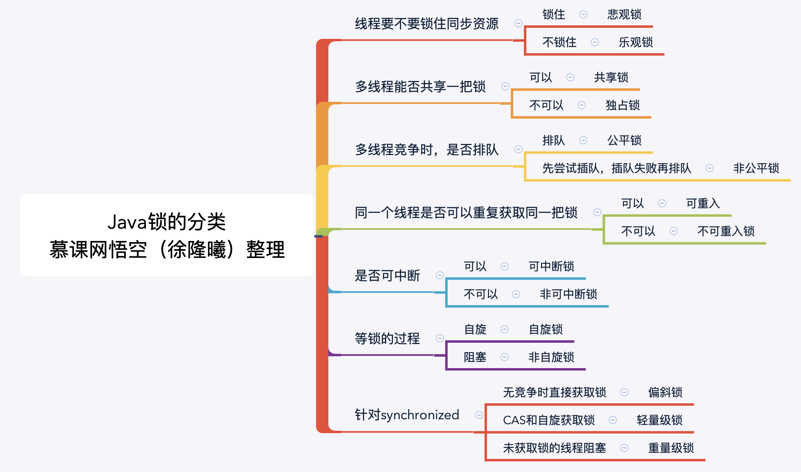

## 第1章 开宗明义

相信很多小伙伴学习过悟空第一门并发基础课，是不是觉得不过瘾？因此悟空老师二度出山，带你深入并发。本章将带你了解本课程学什么，你将收获什么~期待小伙伴在并发领域：百尺竿头，更进一步~~

- 1-1 Java并发成神之路——精通JUC并发工具十八般武艺**试看**

  

## 第2章 鸟瞰Java并发【上帝视角建立并发知识框架】

  要想达到线程安全，有多种方法，本章将从如何解决线程安全问题说起，引出可以解决安全问题的3大类手段，并逐一详细展开。

   2-1 并发工具类纵览——建立起Java并发体系的大厦**试看**
  2-2 课程各章节思维导图汇总

​    

## 第3章 线程池【治理线程的最大法宝】

  线程池是非常重要的工具，如果你要成为一个好的工程师，还是得比较好地掌握这个知识，很多线上问题都是因为没有用好线程池导致的。即使你为了谋生，也要知道，这基本上是面试必问的题目，而且面试官很容易从被面试者的回答中捕捉到被面试者的技术水平。...

  3-1 线程池的自我介绍

  3-2 增减线程的时机

  3-3 keepAliveTime和线程工厂

  3-4 演示内存溢出的情况

  3-5 线程池用法演示

  3-6 对比线程池的特点

  3-7 五虎上将收服线程池

  3-8 钩子：给线程池加点料

  3-9 Executor家族的辨析

  3-10 线程池状态和使用注意点

## 第4章 ThreadLocal【一次解决老大难问题】

  ThreadLocal是面试常客，同时也是工作中非常常用的工具，可以给我们开发提供很多便利。本章将对它做出详细解读。
    
   4-1 ThreadLocal的两种用法**试看**
   4-2 进化之路：故事从两个线程说起
   4-3 进化之路：线程池来帮忙，却好心办坏事
   4-4 走过的弯路，你的套路
   4-5 ThreadLocal是救火队长
   4-6 悔不当初：回顾进化之路
   4-7 ThreadLocal的第二种用法 part1
   4-8 ThreadLocal的第二种用法 part2
   4-9 ThreadLocal的两种用法总结
   4-10 ThreadLocal的好处
   4-11 ThreadLocal原理
   4-12 ThreadLocal的重要方法介绍
   4-13 重要方法的源码分析
   4-14 两种场景，殊途同归
   4-15 收不回来的value
   4-16 ThreadLocal的空指针异常问题
   4-17 ThreadLocal在Spring中的应用

## 第5章 不可不说的“锁”事【种类繁多，如何一一突破？】

  各种类型的锁很多，包括悲观锁、乐观锁、共享锁、公平锁、可重入锁、自旋锁等等，乱花渐欲迷人眼，如何拨开迷雾，看透本质？
    
   5-1 本章纵览

   5-2 内置锁的能力不足以满足需求

   5-3 tryLock尝试获取锁

   5-4 代码演示：获取锁时被中断
   5-5 锁的可见性保证
   5-6 互斥同步锁
   5-7 非互斥同步锁
   5-8 可重入锁的用法
   5-9 可重入性质和源码解析
   5-10 是否允许一部分人“先富起来”
   5-11 代码演示：先来后到的特例、优劣、源码分析
   5-12 共享锁和排它锁的用法
   5-13 深入理解交互思想
   5-14 看似读锁按部就班
   5-15 超越95%面试者的秘籍 part 1
   5-16 超越95%面试者的秘籍 part 2
   5-17 读写锁的由奢入俭“易”
   5-18 循环尝试，不释放CPU
   5-19 可中断锁
   5-20 我们如何才能让锁变得更好用？
   5-21 “锁”事总结

### Lock接口的简介、地位、作用

- 锁是一种工具，用于控制对共享资源的访问
- Lock和Synchronized，这两个是最常见的锁，他们都可以达到线程安全的目的，但是在使用上和功能上又有较大的不同
- Lock并不是用来替代synchronized的，而是当使用synchronized不合适或者不足以满足要求的时候，来提供高级功能的
- Lock接口最常见的实现类是ReentrantLock
- 通常情况下，Lock只允许一个线程来访问这个共享资源。不过有些时候，一些特殊的实现也可允许并发访问，比如ReadWriteLock里面的Lock

  

### 为什么synchronized不够用？

1. **效率低**：锁的释放情况少、师徒获得锁时不能设定超时、不能中断一个正在试图获得锁的对象
2. **不够灵活**（读写锁更灵活）：加锁和释放锁的时机单一，每个锁仅有单一的条件（某个对象），可能是不够的
3. **无法知道是否成功获得锁**

### Lock主要方法介绍

Lock中声明了四个方法来获得锁：lock()、tryLock()、tryLock(long time, TimeUint unit)和lockInterruptibly()

#### 那么这四个方法有什么区别呢？

1. lock()就是最普通的获取锁。如果锁已被其他线程获取，则进行等待。Lock不会像synchronized一样在**异常时自动释放锁**。因此最佳实践是，在**finally中释放锁**，以保证发生异常时锁一定被释放。lock方法不能被中断，这会带来很大的隐患：一旦陷入死锁，lock()就会陷入永久等待。

2. tryLock()用来**尝试获取锁**如果当前锁没有被其他线程占用，则获取成功，则返回true，否则返回false，代表获取锁失败。相比与lock，这样的方法显然功能更强大了，我们**可以根据是否能够获得到锁来决定后续程序的行为**。该方法会**立即返回**，即便在拿不到锁时也不会一直在那等。
3. tryLock(long time, TimeUnit unit)是tryLock()的重载方法，可以设置超时时间，超时就放弃获取锁。
4. lockIntertuptibly()：相当于tyrLock(long time, TimeUnit unit)把超时时间设置为无限。在等待锁的过程中，线程可以被中断。
5. unlock()：解锁

### 可见性保证

Lock的加解锁和synchronized有同样的内存语义，也就是说，下一个线程加锁后可以看到所有前一个线程解锁前发生的所有操作。

### 锁的分类

这些分类，是从各种**不同角度**出发去看的

这些分类并不是互斥的，也就是多个类型可以并存：可能有一个锁，同时属于两种类型。比如ReentrantLock既是互斥锁，又是可重入锁，好比一个人可以既是男人又是军人，这不冲突。

我们以3个最常用的锁为例子，分析类型和适用场景如下：

|                                                 | 属于哪类锁                                                   | 适用场景                                                     |
| ----------------------------------------------- | ------------------------------------------------------------ | ------------------------------------------------------------ |
| ReentrantLock（实现Lock接口）                   | 悲观锁独占锁可以自由设置是否是公平锁可重入锁可中断锁(有lockInterruptibly等可中断方法) | ReentrantLock功能强大，适用于大部分的普通情况                |
| synchronized关键字                              | 同时是悲观锁（重量级锁）和乐观锁（轻量级锁）独占锁非公平锁可重入锁不可中断锁自旋锁（轻量级锁的时候）在偏斜锁、轻量级锁、重量级锁之间升降级 | 对于Lock和synchronized的选择标准，参加本文本末的“继续学习”中的免费课部分 |
| ReentrantReadWriteLock（实现ReadWriteLock接口） | 读锁是共享锁，写锁是独占锁可以自由设置是否是公平锁可重入锁，顾名思义可中断锁(有lockInterruptibly等可中断方法) | ReentrantReadWriteLock适用于读多写少的情况，合理使用可以进一步提高并发效率。 |

 

#### 悲观锁和乐观锁

1. 为什么会诞生非同步互斥锁--**互斥同步锁的劣势**
   1. 阻塞和**唤醒**带来的性能劣势
   2. **永久阻塞**：如果持有锁的线程被永久阻塞，比如遇到了无限循环、死锁等活跃性问题，那么等待该线程释放锁的那几个悲催的线程，将永远也得不到执行
   3. **优先级反转**：如果一个优先级低的线程锁住资源之后执行耗时很久，会导致优先级反转
2. 什么是乐观锁和悲观锁
   1. 悲观锁：如果我不锁住这个资源，别人就会来抢，就会造成数据结果错误，所以每次悲观锁为了确保结果的准确性，会在每次获取并在修改数据时，把数据锁住，让别人无法访问该数据，这样就可以确保数据内容万无一失。Java中悲观锁的实现就是synchronized和Lock相关类。
   2. 乐观锁：认为自己处理线程的时候不会有其他线程来干扰，所以并**不会锁住**被操作的对象。在更新的时候，去对比在我修改期间数据有没有被其他人改变过：如果没有被改变过，就说明真的只是自己在操作，那么就正常的去修改数据；如果数据和我一开始拿到的不一样了，说明其他人在这段时间内改过数据，那我就不能继续刚才的更新数据的过程了，我会选择放弃、报错、重试等策略。乐观锁的实现一般都是利用**cas**算法实现的。
3. 典型例子
   1. 悲观锁：synchronized和Lock接口
   2. 乐观锁：**原子类、并发容器**等
   3. 其它例子
      1. git：git就是乐观锁的典型例子，当我们往远端仓库push的时候，git会检查远端仓库的版本是不是领先我们现在的版本，如果远端仓库的版本和我们本地仓库的版本不一致，就表示有其他人修改了远端仓库的代码了，我们这次**提交就失败**；如果远端和本地版本号一致，我们就可以顺利提交到远端仓库。git不适合用悲观锁，否则公司倒闭。
      2. 数据库：`select for update`就是悲观锁。用version控制数据库就是乐观锁。添加一个字段lock_version，先查询这个更新语句的version：`select * from table`，然后`update set num = 2, version = version+1 where version = 1 and id = 5`; 如果version被更新了等于2，不一样就会报错，这就是乐观锁的原理。
4. 开销对比
   1. 悲观锁的原始开销要高于乐观锁，但是**特点是一劳永逸**，临界区持锁时间就算越来越差，也不会对互斥锁的开销造成影响
   2. 想反，虽然乐观锁一开始的开销比悲观锁小，但是如果自旋时间很长或者不停重试，那么**消耗的资源也会越来越多**
5. 两种锁各自的使用场景
   1. 悲观锁：适合并发写入多的情况，适用于临界区持锁时间比较长的情况，悲观锁可以避免大量的无用自旋等消耗，典型情况：
      - 临界区有**IO操作**
      - 临界区**代码复杂**或者循环量大
      - 临界区**竞争非常激烈**
   2. 适合并发写入少，大部分是读取的场景，不加锁的能让读取性能大幅提高
6. 源码分析

#### 可重入锁和非可重入锁

1. 什么是可重入
   1. 如果获取锁之后无需先释放锁就可以重新获取到锁，那么就称为可重入锁，典型是ReentrantLock
2. 可重入的好处
   1. 避免死锁
   2. 提升封装性
3. ReentrantLock的其它方法介绍：
   1. isHoldByCurrentThread可以看出锁是否被当前线程持有
   2. getQueueLength可以返回当前正在等待这把锁的队列有多长，一般这两个方法是开发和调试的时候用，上线后用到的不多

#### 公平锁和非公平锁

1. 什么是公平和非公平

   1. 公平指的是按照线程请求顺序，来分配锁；非公平指的是，不完全按照请求的顺序，在一定情况下，可以插队。
   2. 注意：非公平也同样不提倡“插队”行为，这里的非公平，指的是在“合适的时机”插队，而不是盲目插队。
   3. 什么是合适的时机呢？
      1. 比如在一个线程刚由阻塞恢复到运行的这段时间，其实还需要准备运行资源，线程并不能马上立即开始执行，这个时候即使处理另一个线程的数据，也不会对当前线程有很大的影响。这个时候就可以插队。

2. 为什么要有非公平锁

   1. 为了**提高效率**，**避免唤醒带来的空档期**。参考合适的时机的例子。

3. 公平的情况

   1. 如果在创建ReentrantLock对象时，参数填写为true，那么这个锁就是公平锁。

4. 非公平的情况

   1. 比如线程1-5排队执行，如果在线程1释放锁的时候，线程5恰好去执行lock()，由于ReentrantLock发现此时并没有线程持有lock这把锁（线程2还没来得及获取到，因为获取需要时间），线程5可以插队，直接拿到这把锁，这也是ReentrantLock**默认的公平策略**，也就是**不公平**。

5. 代码案例：演示公平和非公平的效果

6. 特例

   1. 针对tryLock()的方法，它是很猛的，它不遵守设定的公平的规则
   2. 例如，当有线程执行tryLock的时候，一旦有现成释放了锁，那么这个tryLock的线程就能够获得到锁，即使他前面已经有其他线程在等待队列中了。

7. 对比公平和非公平的优缺点

   1. |          | 优势                                                     | 劣势                                                         |
      | -------- | -------------------------------------------------------- | ------------------------------------------------------------ |
      | 公平锁   | 各线程公平平等，每个线程在等待一段时间后，总有执行的机会 | 更慢，吞吐更小                                               |
      | 非公平锁 | 更快，吞吐量更大                                         | 有可能产生线程饥饿，也就是某些线程在长时间内，始终得不到执行 |

      

8. 源码分析

#### 共享锁和独占锁

以ReentrantReadWriteLock读写锁为例

1. 什么是共享锁和排他锁
   1. 排他锁：又称为独占锁、独享锁
   2. 共享锁：又称为读锁，获取共享锁之后，可以查看但是无法修改和删除数据，**其它线程此时也可以获取到共享锁**，也**可以查看但是无法修改和删除其中的数据**
   3. 共享锁和排他锁的典型是读写锁ReentrantReadWriteLock，其中**读锁是共享锁，写锁是独享锁**。
2. 读写锁的作用
   1. 在没有读写锁之前，我们假设使用ReentrantLock，那么虽然我们保证了线程安全，但是**也浪费了一定的资源：多个读操作同时进行，并没有线程安全问题**。
   2. **在读的地方使用读锁，在写的地方使用写锁，灵活控制，如果没有写锁的情况下，读是无阻塞的，提高了程序的执行效率**
3. 读写锁的规则
   1. 多个线程只申请读锁，都可以申请到
   2. 如果一个线程已经占用了读锁，则此时其它线程如果要申请写锁，则申请写锁的线程会一直等待释放读锁
   3. 如果有一个线程已经占用了写锁，则此时其它线程如果申请写锁或者读锁，则申请的线程会一直等待释放写锁
   4. 一句话总结：**要么是一个或多个线程同时有读锁，要么是一个线程有写锁，但是两者不会同时出现（要么多读，要么一写）**
   5. 换一种思路更容易理解：读写锁只是一把锁，可以通过两种方式锁定：读锁定和写锁定。读写锁可以同时被一个或多个线程读锁定，也可以被单一线程写锁定。但永远不能同时被这两把锁进行读锁定和写锁定。
   6. 这里把获取写锁理解为把读写锁进行写锁定，相当于是换了一种思路，不过原则是不变的，就是要么一个或多个线程同时有读锁（同时读锁定），要么是一个线程有写锁（进行写锁定），但是两者不会同时出现
4. ReentrantReadWriteLock的具体用法见代码
5. 读锁和写锁的交互方式
   1. 插队策略：为了防止饥饿，读锁不能插队
   2. 升降级策略：只能降级，不能升级
6. 使用场景
   1. 相比于ReentrantLock适用于一般场合，ReentrantReadWriteLock适用于读多写少的情况，合理使用可以进一步提高并发效率

#### 自旋锁和非自旋锁

1. 概念
   1. 阻塞或唤醒一个Java线程需要操作系统切换CPU状态来完成，这种状态转换需要耗费处理器时间
   2. 如果同步代码块中的内容过于简单，状态转换消耗的时间有可能比用户代码执行的时间还长
   3. 在许多场景中，同步资源的锁定时间很短，为了这一小段去切换线程，线程挂起和恢复现场的花费可能会让系统得不偿失
   4. 如果物理机有多个处理器，能够让两个或两个以上的线程同时并行执行，我们就可以让后面那个请求锁的线程不放弃CPU执行时间，看看持有锁的线程是否很快就会释放锁
   5. 而为了让当前线程稍等一下，我们需要让当前线程进行自旋，如果在自旋完成后面锁定同步资源的线程已经释放了锁，那么当前线程就可以不必阻塞而是直接获取同步资源，从而避免切换线程的开销。这就是自旋锁。
   6. 阻塞锁和自旋锁想反，阻塞锁如果遇到没有拿到锁的情况，会直接把线程阻塞，直到被唤醒。
2. 缺点
   1. 如果资源被占用的时间很长，那么自旋的线程就会白白浪费处理器资源
   2. 在自旋过程中，一直消耗CPU，所以虽然自旋锁的起始开销低于悲观锁，但是随着自旋时间的增长，开销也是线性增长的
3. 原理和源码分析
   1. 在Java1.5版本及以上的并发框架java.util.concurrent的atomic包下的类基本都是自旋锁的实现
   2. AtomicInteger的实现：自旋锁的实现原理是cas，AtomicInteger中调用unsafe进行自增操作的源码中的do-while循环就是一个自旋操作，如果修改过程中遇到其它线程竞争导致没有修改成功，就在while中死循环，直到修改成功。
4. 适用场景
   1. 自旋锁一般用于多核的服务器，在并发度不是很高的情况下，比阻塞锁的效率高
   2. 另外，自旋锁适用于临界区比较短小的情况，否则如果临界区很大（线程一旦拿到锁，很久以后才会释放），那也是不合适的

#### 可中断锁和不可中断锁

在Java中，synchronized就是不可中断锁，二Lock是可中断锁，因为tryLock(time)和lockInterruptibly都能响应中断。

如果某一线程A正在执行锁中的代码，另一线程B正在等待获取该锁，可能由于等待时间过长，线程B不想等待了，想先处理其他事情，我们可以中断它，这就是可中断锁。

#### 锁优化

1. Java虚拟机锁的优化
   1. 自旋锁和自适应
      1. 自旋锁见上
      2. 自适应指的是在尝试自旋的时候并不是盲目一种尝试，如果发现尝试指定的次数之后获取不到锁，就会转为阻塞锁，并且次数也是可以不断完善的
   2. 锁消除
      1. 有一些场景下不必要加锁，比如代码就是在同步方法内部，不可能呗多个线程同时访问，这个时候如果内部有加锁，就会消除
   3. 锁粗化
      1. 有一个原则是希望同步代码块的范围越小越好，这样并发性能会比较好。但是有些情况下，如果一系列的操作都是对同一个对象加锁解锁。这个时候jvm就会检测，如果相邻的synchronized代码块使用的是同一个锁对象，就将上锁操作合成为一次，这样就不需要频繁的获取释放锁了，也提高了性能。

#### 我们在写代码的时候如何优化锁和提高并发性能

1. 缩小同步代码块
2. 尽量不要锁住方法
3. 减少请求锁的次数
4. 避免人为制造“热点”
5. 锁中尽量不要再包含锁
6. 选择合适的锁类型或合适的工具类

## 第6章 atomic包【一刻也不能分割】

  对于原子包的6个类型做出用法和原理的讲解
    
   6-1 什么是原子类，有什么作用？
   6-2 6类原子类纵览
   6-3 AtomicInteger案例演示
   6-4 Atomic数组，每个都安全
   6-5 Atomic引用在自旋锁的应用
   6-6 把普通变量升级为原子变量
   6-7 对比新旧工具的运行速度
   6-8 剖析高速运转的原理
   6-9 功能升级，不限于加操作
   6-10 总结原子类

## 第7章 CAS【不可中断的典范】

  非互斥同步的灵魂——CAS，对于这个不易理解的概念，给出通俗易懂的解读
    
   7-1 什么是CAS
   7-2 CAS的等价代码、使用案例
   7-3 CAS的应用场景、源码分析
   7-4 CAS的缺点和总结

  

## 第8章 以不变应万变【最便捷的并发安全之道】

  介绍不变性和final关键字带来的线程安全
    
   8-1 什么是“不变性”？
   8-2 final变量的赋值时机
   8-3 final的注意点
   8-4 栈封闭技术
   8-5 面试题：真假美猴王

## 第9章 ConcurrentHashMap等并发集合【面试超高频考点】

  精讲最常见的并发容器，包括ConcurrentHashMap、CopyOnWriteArrayList、各种阻塞队列，从用法到内部结构，面面俱到。
    
   9-1 并发容器概览
   9-2 集合类的历史，演进过程：Vector和Hashtable
   9-3 前身：同步的HashMap和ArrayList
   9-4 ConcurrentHashMap概览
   9-5 Map接口的典型实现类、常用方法演示
   9-6 彩蛋：调整JDK版本，以便查看对应版本的代码
   9-7 HashMap的死循环导致CPU100%的问题分析
   9-8 彩蛋：多线程调试技巧，每个线程独立调试
   9-9 HashMap的死循环分析
   9-10 HashMap 1.7和1.8的结构图和特点，红黑树的概念
   9-11 ConcurrentHashMap 1.7和1.8结构图
   9-12 ConcurrentHashMap源码分析-
   9-13 ConcurrentHashMap1.7和1.8的对比，做了哪些升级？
   9-14 ConcurrentHashMap难道也会发生线程安全问题？：组合操作的玄机
   9-15 实际生产中并发安全事故的分享、ConcurrentHashMap复习
   9-16 CopyOnWriteArrayList的适用场景、读写规则
   9-17 CopyOnWrite设计理念、数据过期问题
   9-18 CopyOnWrite源码、缺点分析
   9-19 并发队列简介
   9-20 彩蛋：轻松绘制漂亮的UML图
   9-21 BlockingQueue入门
   9-22 ArrayBlockingQueue代码演示、源码分析
   9-23 LinkedBlockingQueue等典型介绍
   9-24 并发容器总结

## 第10章 控制并发流程【做好线程之间的协调人】

  控制并发流程的工具类，作用就是帮助我们程序员更容易得让线程之间合作，让线程之间相互配合，来满足业务逻辑，比如让线程A等待线程B执行完毕后再执行等合作策略。
    
   10-1 如何控制并发流程？
   10-2 倒计时门闩，一等多
   10-3 综合用法：运动员跑步
   10-4 Semaphore颁发许可证
   10-5 Semaphore用法和注意点
   10-6 条件对象的作用和用法演示
   10-7 用条件对象实现生产者模式
   10-8 循环栅栏的作用
   10-9 总结控制并发流程的要点

## 第11章 AQS【进阶必备，并发灵魂人物】

  AQS是众多并发工具底层的核心原理，掌握了它，你就打通了任督二脉，登上了并发大雅之堂。
    
   11-1 如何学习AQS？
   11-2 Semaphore和AQS的关系
   11-3 比喻：HR和AQS的职责统一
   11-4 AQS的三要素
   11-5 AQS源码分析
   11-6 AQS的许可证颁发
   11-7 利用AQS实现独占锁
   11-8 DIY一次性门闩
   11-9 AQS的核心思路
   11-10 AQS补充材料（选修）

## 第12章 获取子线程的执行结果【来而不往非礼也】

  Future的核心思想是：一个方法的计算过程可能非常耗时，一直在原地等待方法返回，显然不明智。可以把该计算过程放到线程池去执行，并通过Future去控制方法的计算过程，在计算出结果后直接获取该结果。
    
   12-1 Future和Callable的关系
   12-2 代码演示：submit返回Future对象，快速抽取返回值
   12-3 批量接收结果
   12-4 执行时异常和isDone演示
   12-5 代码演示：默认广告的超时和取消
   12-6 cancel方法与中断线程
   12-7 用法二：用FutureTask获取结果
   12-8 总结Future本章

## 第13章 从0到1打造高性能缓存【学以致用】

  理论结合实际，知识落地。把学到的知识运用在实际中，从0开始一步步搭建高性能缓存。
    
   13-1 从最简单的缓存出发
   13-2 暴露出来的性能和复用性问题
   13-3 用装饰者模式解耦
   13-4 用ConcurrentHashMap保证并发安全
   13-5 用Future解决重复计算问题
   13-6 原子组合操作填补漏洞
   13-7 计算错误如何处理？
   13-8 缓存“污染”问题的解决
   13-9 缓存过期功能和随机性
   13-10 用线程池测试缓存性能
   13-11 用CountDownLatch实现压测
   13-12 用ThreadLocal确认时间的统一性
   13-13 打怪升级之路总结

## 第14章 结语【总结全课精华】

  全课精华总结，展望未来学习路径
    
   14-1 全课精华总结 part 1
   14-2 全课精华总结 part 2

## 第15章 【赠送】学习本课程有困难？

  学习本课程有困难？不妨加持线程部分。特别开放试看章节~
    
   15-1 Java并发核心知识体系精讲课程介绍
   15-2 核心1：实现多线程的方法是1种还是2种还是4种？-网上的观点和正确的观点
   15-3 同时使用两种方法；正确实现方法的总结
   15-4 典型错误观点
   15-5 彩蛋-优质学习路径
   15-6 彩蛋-如何了解技术前沿；如何在业务缠身的情况下让技术快速成长
   15-7 实现多线程-2个常见面试问题