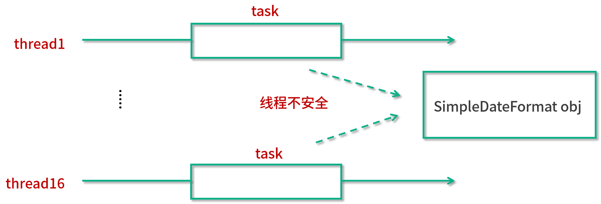
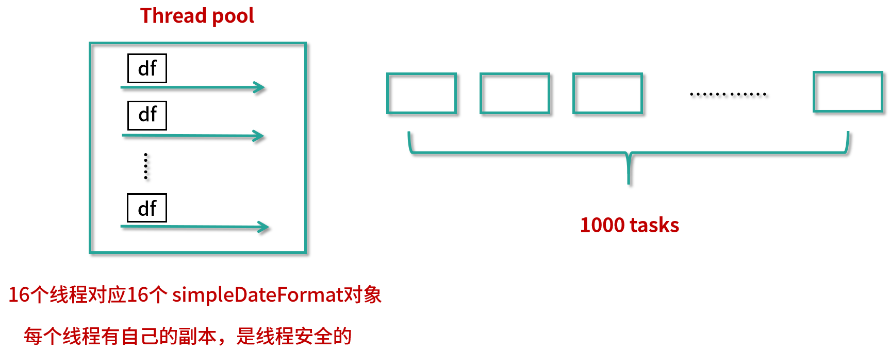
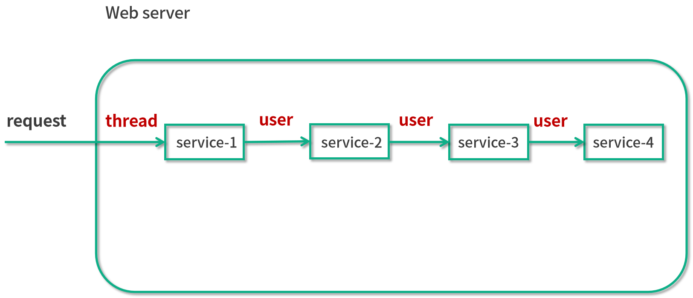
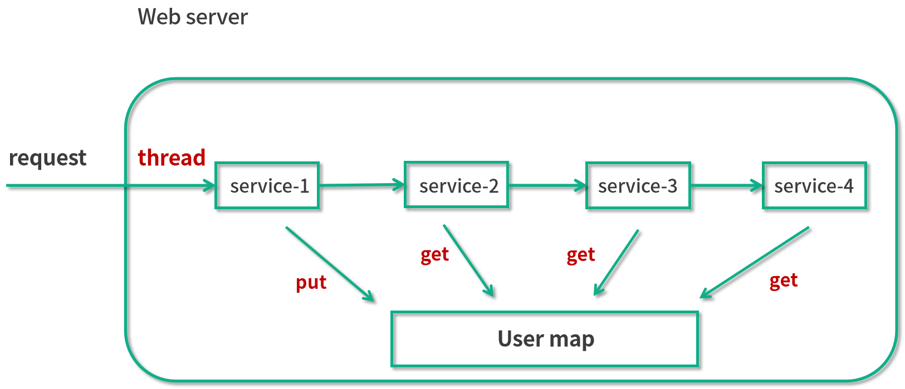
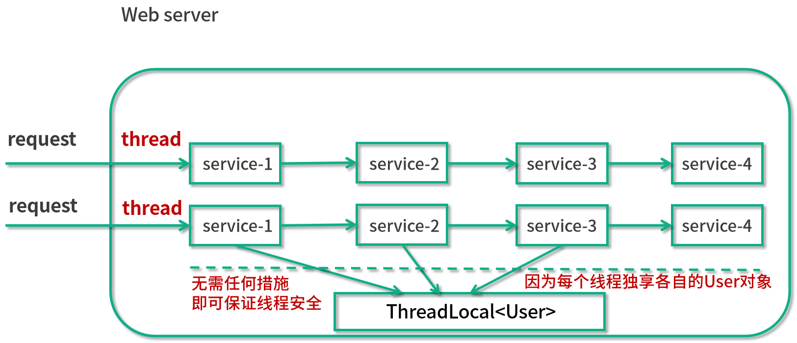

本课时主要介绍 ThreadLocal 适合用在哪些实际生产的场景中。

我们在学习一个工具之前，首先应该知道这个工具的作用，能带来哪些好处，而不是一上来就闷头进入工具的 API、用法等，否则就算我们把某个工具的用法学会了，也不知道应该在什么场景下使用。所以，我们先来看看究竟哪些场景下需要用到 ThreadLocal。

在通常的业务开发中，ThreadLocal 有两种典型的使用场景。

场景1，ThreadLocal 用作保存每个线程独享的对象，为每个线程都创建一个副本，这样每个线程都可以修改自己所拥有的副本, 而不会影响其他线程的副本，确保了线程安全。

场景2，ThreadLocal 用作每个线程内需要独立保存信息，以便供其他方法更方便地获取该信息的场景。每个线程获取到的信息可能都是不一样的，前面执行的方法保存了信息后，后续方法可以通过 ThreadLocal 直接获取到，避免了传参，类似于全局变量的概念。

#### 典型场景1
这种场景通常用于保存线程不安全的工具类，典型的需要使用的类就是 SimpleDateFormat。

##### 场景介绍
在这种情况下，每个 Thread 内都有自己的实例副本，且该副本只能由当前 Thread 访问到并使用，相当于每个线程内部的本地变量，这也是 ThreadLocal 命名的含义。因为每个线程独享副本，而不是公用的，所以**不存在多线程间共享的问题**。

我们来做一个比喻，比如饭店要做一道菜，但是有 5 个厨师一起做，这样的话就很乱了，因为如果一个厨师已经放过盐了，假如其他厨师都不知道，于是就都各自放了一次盐，导致最后的菜很咸。这就好比多线程的情况，线程不安全。我们用了 ThreadLocal 之后，相当于每个厨师只负责自己的一道菜，一共有 5 道菜，这样的话就非常清晰明了了，不会出现问题。

##### SimpleDateFormat 的进化之路

1. **2 个线程都要用到 SimpleDateFormat**

下面我们用一个案例来说明这种典型的第一个场景。假设有个需求，即 2 个线程都要用到 SimpleDateFormat。代码如下所示：

```java
public class ThreadLocalDemo01 {

    public static void main(String[] args) throws InterruptedException {
        new Thread(() -> {
            String date = new ThreadLocalDemo01().date(1);
            System.out.println(date);
        }).start();
        Thread.sleep(100);
        new Thread(() -> {
            String date = new ThreadLocalDemo01().date(2);
            System.out.println(date);
        }).start();
    }
    
    public String date(int seconds) {
        Date date = new Date(1000 * seconds);
        SimpleDateFormat simpleDateFormat = new SimpleDateFormat("mm:ss");
        return simpleDateFormat.format(date);
    }

}
```

在以上代码中可以看出，两个线程分别创建了一个自己的 SimpleDateFormat 对象，如图所示：


这样一来，有两个线程，那么就有两个 SimpleDateFormat 对象，它们之间互不干扰，这段代码是可以正常运转的，运行结果是：

```java
  00:01
  00:02
```


2. **10 个线程都要用到 SimpleDateFormat**

假设我们的需求有了升级，不仅仅需要 2 个线程，而是需要 10 个，也就是说，有 10 个线程同时对应 10 个 SimpleDateFormat 对象。我们就来看下面这种写法：

```java
public class ThreadLocalDemo02 {

    public static void main(String[] args) throws InterruptedException {
        for (int i = 0; i < 10; i++) {
            int finalI = i;
            new Thread(() -> {
                String date = new ThreadLocalDemo02().date(finalI);
                System.out.println(date);
            }).start();
            Thread.sleep(100);
        }
    }
    
    public String date(int seconds) {
        Date date = new Date(1000 * seconds);
        SimpleDateFormat simpleDateFormat = new SimpleDateFormat("mm:ss");
        return simpleDateFormat.format(date);
    }

}
```

上面的代码利用了一个 for 循环来完成这个需求。for 循环一共循环 10 次，每一次都会新建一个线程，并且每一个线程都会在 date 方法中创建一个 SimpleDateFormat 对象，示意图如下：


可以看出一共有 10 个线程，对应 10 个 SimpleDateFormat 对象。

代码的运行结果：

```java
00:00
00:01
00:02
00:03
00:04
00:05
00:06
00:07
00:08
00:09
```


3. **需求变成了 1000 个线程都要用到 SimpleDateFormat**

但是线程不能无休地创建下去，因为线程越多，所占用的资源也会越多。假设我们需要 1000 个任务，那就不能再用 for 循环的方法了，而是应该使用线程池来实现线程的复用，否则会消耗过多的内存等资源。

在这种情况下，我们给出下面这个代码实现的方案：

```java
public class ThreadLocalDemo03 {

    public static ExecutorService threadPool = Executors.newFixedThreadPool(16);
    
    public static void main(String[] args) throws InterruptedException {
        for (int i = 0; i < 1000; i++) {
            int finalI = i;
            threadPool.submit(new Runnable() {
                @Override
                public void run() {
                    String date = new ThreadLocalDemo03().date(finalI);
                    System.out.println(date);
                }
            });
        }
        threadPool.shutdown();
    }
    
    public String date(int seconds) {
        Date date = new Date(1000 * seconds);
        SimpleDateFormat dateFormat = new SimpleDateFormat("mm:ss");
        return dateFormat.format(date);
    }

}
```


可以看出，我们用了一个 16 线程的线程池，并且给这个线程池提交了 1000 次任务。每个任务中它做的事情和之前是一样的，还是去执行 date 方法，并且在这个方法中创建一个 simpleDateFormat 对象。程序的一种运行结果是（多线程下，运行结果不唯一）：

```java
00:00
00:07
00:04
00:02
...
16:29
16:28
16:27
16:26
16:39
```


程序运行结果正确，把从 00:00 到 16:39 这 1000 个时间给打印了出来，并且没有重复的时间。我们把这段代码用图形化给表示出来，如图所示：


图的左侧是一个线程池，右侧是 1000 个任务。我们刚才所做的就是每个任务都创建了一个 simpleDateFormat 对象，也就是说，1000 个任务对应 1000 个 simpleDateFormat 对象。

但是这样做是没有必要的，因为这么多对象的创建是有开销的，并且在使用完之后的销毁同样是有开销的，而且这么多对象同时存在在内存中也是一种内存的浪费。

现在我们就来优化一下。既然不想要这么多的 simpleDateFormat 对象，最简单的就是只用一个就可以了。

4. **所有的线程都共用一个 simpleDateFormat 对象**

我们用下面的代码来演示只用一个 **simpleDateFormat** 对象的情况：

```java
public class ThreadLocalDemo04 {

    public static ExecutorService threadPool = Executors.newFixedThreadPool(16);
    static SimpleDateFormat dateFormat = new SimpleDateFormat("mm:ss");
    
    public static void main(String[] args) throws InterruptedException {
        for (int i = 0; i < 1000; i++) {
            int finalI = i;
            threadPool.submit(new Runnable() {
                @Override
                public void run() {
                    String date = new ThreadLocalDemo04().date(finalI);
                    System.out.println(date);
                }
            });
        }
        threadPool.shutdown();
    }
    
    public String date(int seconds) {
        Date date = new Date(1000 * seconds);
        return dateFormat.format(date);
    }

}
```


在代码中可以看出，其他的没有变化，变化之处就在于，我们把这个 simpleDateFormat 对象给提取了出来，变成 static 静态变量，需要用的时候直接去获取这个静态对象就可以了。看上去省略掉了创建 1000 个 simpleDateFormat 对象的开销，看上去没有问题，我们用图形的方式把这件事情给表示出来：



从图中可以看出，我们有不同的线程，并且线程会执行它们的任务。但是不同的任务所调用的 simpleDateFormat 对象都是同一个，所以它们所指向的那个对象都是同一个，但是这样一来就会有线程不安全的问题。

5. **线程不安全，出现了并发安全问题**

控制台会打印出（多线程下，运行结果不唯一）：

```java
00:04
00:04
00:05
00:04
...
16:15
16:14
16:13
```


执行上面的代码就会发现，控制台所打印出来的和我们所期待的是不一致的。我们所期待的是打印出来的时间是不重复的，但是可以看出在这里出现了重复，比如第一行和第二行都是 04 秒，这就代表它内部已经出错了。

6. **加锁**

出错的原因就在于，s**impleDateFormat 这个对象本身不是一个线程安全的对象**，不应该被多个线程同时访问。所以我们就想到了一个解决方案，用 synchronized 来加锁。于是代码就修改成下面的样子：

```java
public class ThreadLocalDemo05 {

    public static ExecutorService threadPool = Executors.newFixedThreadPool(16);
    static SimpleDateFormat dateFormat = new SimpleDateFormat("mm:ss");
    
    public static void main(String[] args) throws InterruptedException {
        for (int i = 0; i < 1000; i++) {
            int finalI = i;
            threadPool.submit(new Runnable() {
                @Override
                public void run() {
                    String date = new ThreadLocalDemo05().date(finalI);
                    System.out.println(date);
                }
            });
        }
        threadPool.shutdown();
    }
    
    public String date(int seconds) {
        Date date = new Date(1000 * seconds);
        String s = null;
        synchronized (ThreadLocalDemo05.class) {
            s = dateFormat.format(date);
        }
        return s;
    }

}
```


可以看出在 date 方法中加入了 synchronized 关键字，把 **simpleDateFormat 的调用给上了锁**。

运行这段代码的结果（多线程下，运行结果不唯一）：

```java
00:00
00:01
00:06
...
15:56
16:37
16:36
```


这样的结果是正常的，没有出现重复的时间。但是由于我们使用了 synchronized 关键字，就会陷入一种排队的状态，多个线程不能同时工作，这样一来，整体的效率就被大大降低了。有没有更好的解决方案呢？

我们希望达到的效果是，**既不浪费过多的内存，同时又想保证线程安全**。经过思考得出，可以让**每个线程都拥有一个自己的 simpleDateFormat 对象来达到这个目的**，这样就能两全其美了。

7. **使用 ThreadLocal**

那么，要想达到这个目的，我们就可以使用 ThreadLocal。示例代码如下所示：

```java
public class ThreadLocalDemo06 {

    public static ExecutorService threadPool = Executors.newFixedThreadPool(16);
    
    public static void main(String[] args) throws InterruptedException {
        for (int i = 0; i < 1000; i++) {
            int finalI = i;
            threadPool.submit(new Runnable() {
                @Override
                public void run() {
                    String date = new ThreadLocalDemo06().date(finalI);
                    System.out.println(date);
                }
            });
        }
        threadPool.shutdown();
    }
    
    public String date(int seconds) {
        Date date = new Date(1000 * seconds);
        SimpleDateFormat dateFormat = ThreadSafeFormatter.dateFormatThreadLocal.get();
        return dateFormat.format(date);
    }

}

class ThreadSafeFormatter {
    public static ThreadLocal<SimpleDateFormat> dateFormatThreadLocal = new ThreadLocal<SimpleDateFormat>() {
        @Override
        protected SimpleDateFormat initialValue() {
            return new SimpleDateFormat("mm:ss");
        }
    };
}
```


在这段代码中，我们使用了 ThreadLocal 帮每个线程去生成它自己的 simpleDateFormat 对象，对于每个线程而言，这个对象是独享的。但与此同时，这个对象就不会创造过多，一共只有 16 个，因为线程只有 16 个。

代码运行结果（多线程下，运行结果不唯一）：

```java
00:05
00:04
00:01
...
16:37
16:36
16:32
```


这个结果是正确的，不会出现重复的时间。

我们用图来看一下当前的这种状态：



在图中的左侧可以看到，这个线程池一共有 16 个线程，对应 16 个 simpleDateFormat 对象。而在这个图画的右侧是 1000 个任务，任务是非常多的，和原来一样有 1000 个任务。但是这里最大的变化就是，虽然任务有 1000 个，但是我们不再需要去创建 1000 个 simpleDateFormat 对象了。即便任务再多，最终也只会有和线程数相同的 simpleDateFormat 对象。这样既高效地使用了内存，又同时保证了线程安全。

以上就是第一种非常典型的适合使用 ThreadLocal 的场景。

#### 典型场景2
每个线程内需要保存类似于全局变量的信息（例如在拦截器中获取的用户信息），可以让不同方法直接使用，避免参数传递的麻烦却不想被多线程共享（因为不同线程获取到的用户信息不一样）。

例如，用 ThreadLocal 保存一些业务内容（用户权限信息、从用户系统获取到的用户名、用户ID 等），这些信息在同一个线程内相同，但是不同的线程使用的业务内容是不相同的。

在线程生命周期内，都通过这个静态 ThreadLocal 实例的 get() 方法取得自己 set 过的那个对象，避免了将这个对象（如 user 对象）作为参数传递的麻烦。

我们用图画的形式举一个实例：



比如说我们是一个用户系统。假设不使用 ThreadLocal，那么当一个请求进来的时候，一个线程会负责执行这个请求，然后这个请求就会依次调用 service-1()、service-2()、service-3()、service-4()，这 4 个方法可能是分布在不同的类中的。

在 service-1() 的时候它会创建一个 user 的对象，用于保存比如说这个用户的用户名等信息，后面 service-2/3/4() 都需要用到这个对象的信息，比如说 service-2() 代表下订单、service-3() 代表发货、service-4() 代表完结订单，在这种情况下，每一个方法都需要用户信息，所以就需要把这个 user 对象层层传递下去，从 service-1() 传到 service-2()，再从 service-2() 传到 service-3()，以此类推。

这样做会导致代码非常冗余，那有没有什么办法可以解决这个问题呢？我们首先想到的方法就是使用一个 HashMap，如下图所示：




比如说我们使用了这样的 Map 之后，就不需要把 user 对象层层传递了，而是在执行 service-1() 的时候，把这个用户信息给 put 进去，然后后面需要拿用户信息的时候，直接从静态的 User map 里面 get 就可以了。这样一来，无论你执行哪个方法，都可以直接获取到这个用户信息。当然，我们也要考虑到 web 服务器通常都是多线程的，当多个线程同时工作的时候，我们也需要保证线程安全。

所以在这里，如果我们使用 HashMap 是不够的，因为它是线程不安全的，那我们就可以使用 synchronized，或者直接把 HashMap 替换成 ConcurrentHashMap，用类似的方法来保证线程安全，这样的改进如下图所示：


在这个图中，可以看出有两个线程，并且每个线程所做的事情都是访问 service-1/2/3/4()。那么当它们同时运行的时候，都会同时访问这个 User map，于是就需要 User map 是线程安全的。

无论我们使用 synchronized 还是使用 ConcurrentHashMap，它对性能都是有所影响的，因为即便是使用性能比较好的 ConcurrentHashMap，它也是包含少量的同步，或者是 cas 等过程。相比于完全没有同步，它依然是有性能损耗的。所以在此一个更好的办法就是使用 ThreadLocal。

这样一来，我们就可以在不影响性能的情况下，也无需层层传递参数，就可以达到保存当前线程所对应的用户信息的目的。如下图所示：



在这个图中可以看出，同样是多个线程同时去执行，但是这些线程同时去访问这个 ThreadLocal 并且能利用 ThreadLocal 拿到只属于自己的独享对象。这样的话，就无需任何额外的措施，保证了线程安全，因为每个线程是独享 user 对象的。代码如下所示：

```java
public class ThreadLocalDemo07 {

    public static void main(String[] args) {
        new Service1().service1();
    
    }

}

class Service1 {

    public void service1() {
        User user = new User("拉勾教育");
        UserContextHolder.holder.set(user);
        new Service2().service2();
    }

}

class Service2 {

    public void service2() {
        User user = UserContextHolder.holder.get();
        System.out.println("Service2拿到用户名：" + user.name);
        new Service3().service3();
    }

}

class Service3 {

    public void service3() {
        User user = UserContextHolder.holder.get();
        System.out.println("Service3拿到用户名：" + user.name);
        UserContextHolder.holder.remove();
    }

}

class UserContextHolder {

    public static ThreadLocal<User> holder = new ThreadLocal<>();

}

class User {

    String name;
    
    public User(String name) {
        this.name = n
    }

}
```


在这个代码中我们可以看出，我们有一个 UserContextHolder，里面保存了一个 ThreadLocal，在调用 Service1 的方法的时候，就往里面存入了 user 对象，而在后面去调用的时候，直接从里面用 get 方法取出来就可以了。没有参数层层传递的过程，非常的优雅、方便。

代码运行结果：

```java
Service2拿到用户名：拉勾教育
Service3拿到用户名：拉勾教育
```

#### 总结
下面我们进行总结。

本讲主要介绍了 ThreadLocal 的两个典型的使用场景。

场景1，**ThreadLocal 用作保存每个线程独享的对象**，为每个线程都创建一个副本，每个线程都只能修改自己所拥有的副本, 而不会影响其他线程的副本，这样就让原本在并发情况下，线程不安全的情况变成了线程安全的情况。

场景2，**ThreadLocal 用作每个线程内需要独立保存信息的场景，供其他方法更方便得获取该信息**，每个线程获取到的信息都可能是不一样的，前面执行的方法设置了信息后，后续方法可以通过 ThreadLocal 直接获取到，避免了传参。