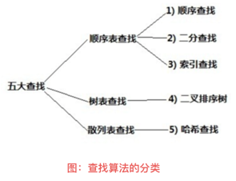
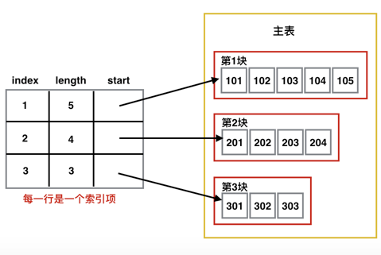

这一篇要介绍的是算法中的查找算法。查找在我们生活中无处不在，比如查公交，查机票，查酒店等等。

首先看一下查找的分类。如下图：


     

## 顺序查找

什么是顺序查找呢？顺序查找就是遍历整个列表，逐个元素与给定值比较，若某个元素和给定值相等，则查找成功。如果直到最后一个元素和给定值比较都不相等，则查找失败。 

### 对应代码

```java
public class SequenceSearch {
    public static void main(String[] args) {
        int[] list = {90, 10, 20, 50, 70, 40, 80, 60, 30, 52};
        System.out.println("************顺序查找************");
        display(list);
        System.out.println("");

        int result = sequenceSearch(list, 50);
        if (result != -1) {
            System.out.println("50在列表中的位置是：" + result);
        } else {
            System.out.println("对不起，列表中不存在该元素！");
        }
    }

    /**
     * 顺序查找
     */
    public static int sequenceSearch(int[] list, int key) {
        for (int i = 0; i < list.length; i++) {
            // 找到该元素，返回位置序号
            if (list[i] == key) {
                return i;
            }
        }
        // 没有找到
        return -1;
    }

    /**
     * 遍历打印
     */
    public static void display(int[] list) {
        System.out.println("********展示开始********");
        if (list != null && list.length > 0) {
            for (int num : list) {
                System.out.print(num + " ");
            }
            System.out.println("");
        }
        System.out.println("********展示结束********");
    }
}
```


## 二分查找

什么是二分查找呢？二分查找的基本思想是：在有序表中，取中间元素作为比较对象，若给定值与中间元素相等，则查找成功；若给定值小于中间元素，则在中间元素的左半区继续查找；若给定值大于中间元素，则在中间元素的右半区继续查找。不断重复上述过程，直到找到为止。

从二分查找的定义我们可以看出，使用二分查找有两个前提条件：

（1）待查找的列表必须有序。

（2）必须使用线性表的顺序存储结构来存储数据。

### 对应代码

```java
public class BinarySearch {
    public static void main(String[] args) {
        int[] list = {10, 20, 30, 40, 50, 60, 70, 80, 90};
        System.out.println("************二分查找************");
        display(list);
        System.out.println("");

        int result = binarySearch(list, 30);
        if (result != -1) {
            System.out.println("30在列表中的位置是：" + result);
        } else {
            System.out.println("对不起，列表中不存在该元素！");
        }
    }

    /**
     * 二分查找
     */
    public static int binarySearch(int[] list, int key) {
        int low = 0;
        int high = list.length - 1;

        while (low <= high) {
            int middle = (low + high) / 2;

            // 判断中间元素是否与给定值相等
            if (list[middle] == key) {
                return middle;
            } else {
                if (list[middle] > key) {
                    // 在中间元素的左半区查找
                    high = middle - 1;
                } else {
                    // 在中间元素的右半区查找
                    low = middle + 1;
                }
            }
        }
        // 没有找到（查找失败）
        return -1;
    }

    /**
     * 遍历打印
     */
    public static void display(int[] list) {
        System.out.println("********展示开始********");
        if (list != null && list.length > 0) {
            for (int num :
                    list) {
                System.out.print(num + " ");
            }
            System.out.println("");
        }
        System.out.println("********展示结束********");
    }
}
```


## 索引查找

关于索引，我们很容易地联想到数据库中的索引，建立了索引，可以大大提高数据库的查询速度。

索引查找又称为分块查找，是一种介于顺序查找和二分查找之间的一种查找方法，索引查找的基本思想是：首先查找索引表，可用二分查找或顺序查找，然后在确定的块中进行顺序查找。

在实现索引查找算法前需要弄清楚以下三个术语。

（1）主表。即要查找的序列。

（2）索引项。一般我们会将主表分成几个块，每个块建立一个索引，这个索引就叫索引项。

（3）索引表。即索引项的集合。

同时，索引项包括以下三点。

（1）index，即索引项在主表的关键字。

（2）start，即块内的第1个元素在主表中的位置。

（3）length，即块的长度。

### 索引查找示意图

  

### 对应代码

```java
public class IndexItem {
    public int index;
    public int start;
    public int length;

    public IndexItem(int index, int start, int length) {
        this.index = index;
        this.start = start;
        this.length = length;
    }

    public int getIndex() {
        return index;
    }

    public void setIndex(int index) {
        this.index = index;
    }

    public int getStart() {
        return start;
    }

    public void setStart(int start) {
        this.start = start;
    }

    public int getLength() {
        return length;
    }

    public void setLength(int length) {
        this.length = length;
    }
}
```

```java
public class IndexSearch {
    // 主表
    static int[] mainList = new int[]{
            101, 102, 103, 104, 105, 0, 0, 0, 0, 0,
            201, 202, 203, 204, 0, 0, 0, 0, 0, 0,
            301, 302, 303, 0, 0, 0, 0, 0, 0, 0
    };

    // 索引表
    static IndexItem[] indexItemList = new IndexItem[]{
            new IndexItem(1, 0, 5),
            new IndexItem(2, 10, 4),
            new IndexItem(3, 20, 3)
    };

    /**
     * 索引查找算法
     *
     * @param key 给定值
     * @return 返回给定值在表中的位置
     */
    public static int indexSearch(int key) {
        IndexItem item = null;

        // 建立索引规则
        int index = key / 100;

        // ① 遍历索引表，找到对应的索引项
        for (int i = 0; i < indexItemList.length; i++) {
            // 找到索引项
            if (indexItemList[i].index == index) {
                item = indexItemList[i];
                break;
            }
        }

        // 索引表中不存在该索引项
        if (item == null) {
            return -1;
        }

        // ② 根据索引项，在主表中查找
        for (int i = item.start; i < item.start + item.length; i++) {
            if (mainList[i] == key) {
                return i;
            }
        }
        return -1;
    }

    /**
     * 插入数据
     *
     * @param key 要插入的值
     * @return true表示插入成功，false表示插入失败
     */
    public static boolean insert(int key) {
        IndexItem item = null;

        // 建立索引规则
        int index = key / 100;
        int i = 0;
        // 遍历索引表，找到对应的索引项
        for (i = 0; i < indexItemList.length; i++) {
            if (indexItemList[i].index == index) {
                item = indexItemList[i];
                break;
            }
        }
        // 索引表中不存在该索引项
        if (item == null) {
            return false;
        }

        // 根据索引项将值插入到主表中
        mainList[item.start + item.length] = key;
        // 更新索引表
        indexItemList[i].length++;

        return true;
    }

    /**
     * 遍历打印
     */
    public static void display(int[] list) {
        System.out.println("********展示开始********");
        if (list != null && list.length > 0) {
            for (int i = 0; i < list.length; i++) {
                System.out.print(list[i] + " ");
                if ((i + 1) % 10 == 0) {
                    System.out.println("");
                }
            }
        }
        System.out.println("********展示结束********");
    }

    public static void main(String[] args) {
        System.out.println("********索引查找********");
        System.out.println("");
        System.out.println("原始数据：");
        display(mainList);
        System.out.println("");

        int value = 106;
        System.out.println("插入数据：" + value);
        // 插入成功
        if (insert(value)) {
            System.out.println("插入后的主表：");
            display(mainList);
            System.out.println("");

            System.out.println("元素" + value + "在列表中的位置为：" + indexSearch(value));
        }
    }
}
```


## 二叉搜索树查找

构造一棵二叉排序树的目的，其实并不是为了排序，而是为了提高查找和插入删除的效率。

什么是二叉排序树呢？二叉排序树具有以下几个特点。

（1）若根节点有左子树，则左子树的所有节点都比根节点小。

（2）若根节点有右子树，则右子树的所有节点都比根节点大。

（3）根节点的左，右子树也分别是二叉排序树。

## 1、二叉排序树的图示

下面是二叉排序树的图示，通过它可以加深对二叉排序树的理解。

  .png)   

## 2、二叉排序树常见的操作及思路

下面是二叉排序树常见的操作及思路。

### 2-1、插入节点

思路：比如我们要插入数字20到这棵二叉排序树中。那么步骤如下：

（1）首先将20与根节点进行比较，发现比根节点小，所以继续与根节点的左子树30比较。

（2）发现20比30也要小，所以继续与30的左子树10进行比较。

（3）发现20比10要大，所以就将20插入到10的右子树中。

**此时的二叉排序树如下图：**

  .png)   

### 2-2、查找节点

比如我们要查找节点10，那么思路如下：

（1）还是一样，首先将10与根节点50进行比较，发现比根节点要小，所以继续与根节点的左子树30进行比较。

（2）发现10比左子树30要小，所以继续与30的左子树10进行比较。

（3）发现两值相等，即查找成功，返回10的位置。

### 2-3、删除节点

删除节点的情况相对复杂，主要分为以下三种情形：

（1）删除的是叶节点(即没有孩子节点的)。比如20，删除它不会破坏原来树的结构，最简单。如图所示。

  .png)   

（2）删除的是单孩子节点。比如90，删除它后需要将它的孩子节点与自己的父节点相连。情形比第一种复杂一些。

  .png)   

（3）删除的是有左右孩子的节点。比如根节点50

这里有一个问题就是删除它后，谁将作为根节点？**利用二叉树的中序遍历，就是右节点的左子树的最左孩子**。

  .png)   

### 3. 对应代码

```java
public class BSTreeNode {
    public int data;
    public BSTreeNode left;
    public BSTreeNode right;

    public BSTreeNode(int data) {
        this.data = data;
    }
}
```

```java
/**
 * 二叉排序树的常见操作
 */
public class BSTreeOperate {

    // 树的根节点
    public BSTreeNode root;
    // 记录树的节点个数
    public int size;

    /**
     * 创建二叉排序树
     *
     * @param list
     * @return
     */
    public BSTreeNode create(int[] list) {

        for (int i = 0; i < list.length; i++) {
            insert(list[i]);
        }
        return root;
    }

    /**
     * 插入一个值为data的节点
     *
     * @param data
     */
    public void insert(int data) {
        insert(new BSTreeNode(data));
    }

    /**
     * 插入一个节点
     *
     * @param bsTreeNode
     */
    public void insert(BSTreeNode bsTreeNode) {
        if (root == null) {
            root = bsTreeNode;
            size++;
            return;
        }
        BSTreeNode current = root;
        while (true) {
            if (bsTreeNode.data <= current.data) {
                // 如果插入节点的值小于当前节点的值，说明应该插入到当前节点左子树，而此时如果左子树为空，就直接设置当前节点的左子树为插入节点。
                if (current.left == null) {
                    current.left = bsTreeNode;
                    size++;
                    return;
                }
                current = current.left;
            } else {
                // 如果插入节点的值大于当前节点的值，说明应该插入到当前节点右子树，而此时如果右子树为空，就直接设置当前节点的右子树为插入节点。
                if (current.right == null) {
                    current.right = bsTreeNode;
                    size++;
                    return;
                }
                current = current.right;
            }
        }
    }

    /**
     * 中序遍历
     *
     * @param bsTreeNode
     */
    public void LDR(BSTreeNode bsTreeNode) {
        if (bsTreeNode != null) {
            // 遍历左子树
            LDR(bsTreeNode.left);
            // 输出节点数据
            System.out.print(bsTreeNode.data + " ");
            // 遍历右子树
            LDR(bsTreeNode.right);
        }
    }

    /**
     * 查找节点
     */
    public boolean search(BSTreeNode bsTreeNode, int key) {
        // 遍历完没有找到，查找失败
        if (bsTreeNode == null) {
            return false;
        }
        // 要查找的元素为当前节点，查找成功
        if (key == bsTreeNode.data) {
            return true;
        }
        // 继续去当前节点的左子树中查找，否则去当前节点的右子树中查找
        if (key < bsTreeNode.data) {
            return search(bsTreeNode.left, key);
        } else {
            return search(bsTreeNode.right, key);
        }
    }
}

```

```java
public class BSTreeOperateTest {
    public static void main(String[] args) {
        BSTreeOperate bsTreeOperate = new BSTreeOperate();
        int[] list = new int[]{50, 30, 70, 10, 40, 90, 80};
        System.out.println("*********创建二叉排序树*********");
        BSTreeNode bsTreeNode = bsTreeOperate.create(list);
        System.out.println("中序遍历原始的数据：");
        bsTreeOperate.LDR(bsTreeNode);
        System.out.println("");
        System.out.println("");

        System.out.println("********查找节点*******");
        System.out.println("元素20是否在树中：" + bsTreeOperate.search(bsTreeNode, 20));
        System.out.println("");

        System.out.println("********插入节点*******");
        System.out.println("将元素20插入到树中");
        bsTreeOperate.insert(20);
        System.out.println("中序遍历：");
        bsTreeOperate.LDR(bsTreeNode);
        System.out.println("");
        System.out.println("");

        System.out.println("********查找节点*******");
        System.out.println("元素20是否在树中：" + bsTreeOperate.search(bsTreeNode, 20));
        System.out.println("");
    }
}
```


## 哈希查找

哈希查找（也称为散列查找）。提起哈希，我的第一印象就是java中的Hashtable类，它是由 key/value 的键值对组成的集合，它就是应用了哈希技术。

那什么是哈希查找呢？在弄清楚什么是哈希查找之前，我们要弄清楚哈希技术，哈希技术是在记录的存储位置和记录的 key 之间建立一个确定的映射 f()，使得每个 key 对应一个存储位置 f(key)。若查找集合中存在这个记录，则必定在 f(key) 的位置上。哈希技术既是一种存储方法，也是一种查找方法。

## 六种哈希函数 f(key) 的构造方法：

### 1、直接定址法

哈希地址：f(key) = a*key+b (a,b为常数)

这种方法的优点是：简单，均匀，不会产生冲突。但是需要事先知道 key 的分布情况，适合查找表较小并且连续的情况。

### 2、数字分析法

比如我们的11位手机号码“136xxxx5889”，其中前三位是接入号，一般对应不同运营公司的子品牌，如130是联通如意通，136是移动神州行等等。中间四位表示归属地。最后四位才是用户号。

若我们现在要存储某家公司员工登记表，如果用手机号码作为 key，那么极有可能前7位都是相同的，所以我们选择最后四位作为 f(key) 就是不错的选择。

### 3、平方取中法

故名思义，比如 key 是1234，那么它的平方就是1522756，再抽取中间的3位就是227作为 f(key) 。

### 4、折叠法

折叠法是将 key 从左到右分割成位数相等的几个部分(最后一部分位数不够可以短些)，然后将这几部分叠加求和，并按哈希表的表长，取后几位作为 f(key) 。

比如我们的 key 是 9876543210，哈希表的表长为3位，我们将 key 分为4组，987|654|321|0 ，然后将它们叠加求和 987+654+321+0=1962，再取后3位即得到 f(key) = 962 。

### 5、除留余数法

哈希地址：f(key) = key mod p (p<=m) m为哈希表表长。

**这种方法是最常用的哈希函数构造方法。下面的代码中也使用了这种方法。**

### 6、随机数法

哈希地址：f(key) = random(key) 

这里 random 是随机函数，当 key 的长度不等时，采用这种方法比较合适。

## 哈希函数冲突的两种解决方法：

我们设计得再好的哈希函数也不可能完全避免冲突，当我们使用哈希函数后发现有 key1 != key2，但却有 f(key1) = f(key2) ，即发生冲突。

### 1、开放定址法：

开放定址法就是一旦发生了冲突，就去寻找下一个空的哈希地址，只要哈希表足够大，空的哈希地址总是能找到，然后将记录插入。这种方法是最常用的解决冲突的方法。下面的代码中也使用了这种方法。

### 2、链地址法：

链地址法不做详细展开。

### 对应代码

```java
import java.io.IOException;
import java.util.Scanner;

public class HashSearch {
    // 初始化哈希表
    static int hashLength = 7;
    static int[] hashTable = new int[hashLength];

    // 原始数据
    static int[] list = new int[]{13, 29, 27, 28, 26, 30, 38};

    public static void main(String[] args) throws IOException {
        System.out.println("*******哈希查找*******");

        // 创建哈希表
        for (int i = 0; i < list.length; i++) {
            insert(hashTable, list[i]);
        }
        System.out.println("展示哈希表中的数据：" + display(hashTable));

        while (true) {
            // 哈希表查找
            System.out.print("请输入要查找的数据：");
            int data = new Scanner(System.in).nextInt();
            int result = search(hashTable, data);
            if (result == -1) {
                System.out.println("对不起，没有找到！");
            } else {
                System.out.println("数据的位置是：" + result);
            }
        }
    }

    /**
     * 方法：哈希表插入
     */
    public static void insert(int[] hashTable, int data) {
        // 哈希函数，除留余数法
        int hashAddress = hash(hashTable, data);

        // 如果不为0，则说明发生冲突
        while (hashTable[hashAddress] != 0) {
            // 利用 开放定址法 解决冲突
            hashAddress = (++hashAddress) % hashTable.length;
        }

        // 将待插入值存入字典中
        hashTable[hashAddress] = data;
    }

    /**
     * 方法：哈希表查找
     */
    public static int search(int[] hashTable, int data) {
        // 哈希函数，除留余数法
        int hashAddress = hash(hashTable, data);

        while (hashTable[hashAddress] != data) {
            // 利用 开放定址法 解决冲突
            hashAddress = (++hashAddress) % hashTable.length;
            // 查找到开放单元 或者 循环回到原点，表示查找失败
            if (hashTable[hashAddress] == 0 || hashAddress == hash(hashTable, data)) {
                return -1;
            }
        }
        // 查找成功，返回下标
        return hashAddress;
    }

    /**
     * 方法：构建哈希函数（除留余数法）
     *
     * @param hashTable
     * @param data
     * @return
     */
    public static int hash(int[] hashTable, int data) {
        return data % hashTable.length;
    }

    /**
     * 方法：展示哈希表
     */
    public static String display(int[] hashTable) {
        StringBuffer stringBuffer = new StringBuffer();
        for (int i : hashTable) {
            stringBuffer = stringBuffer.append(i + " ");
        }
        return String.valueOf(stringBuffer);
    }
}
```

