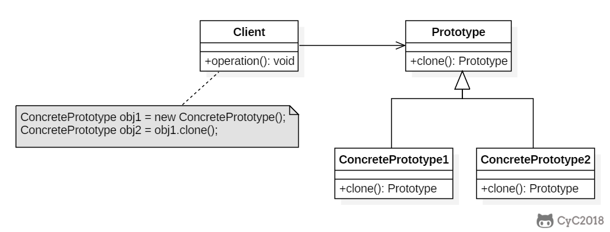

[toc]

设计模式一共有 23 种，今天我们先来学习构建型模式，一共五种，分别是：

- 工厂方法模式
- 抽象工厂模式
- 单例模式
- 建造型模式
- 原型模式


##  一、**工厂模式**

在平时编程中，构建对象最常用的方式是 new 一个对象。乍一看这种做法没什么不好，而实际上这也属于一种硬编码。每 new 一个对象，相当于调用者多知道了一个类，增加了类与类之间的联系，不利于程序的松耦合。其实构建过程可以被封装起来，工厂模式便是用于封装对象的设计模式。

## **1.1.简单工厂模式（Simple factory）**

### Intent

在创建一个对象时不向客户暴露内部细节，并提供一个创建对象的通用接口。

### Class Diagram

简单工厂把实例化的操作单独放到一个类中，这个类就成为简单工厂类，让简单工厂类来决定应该用哪个具体子类来实例化。

这样做能把客户类和具体子类的实现解耦，客户类不再需要知道有哪些子类以及应当实例化哪个子类。客户类往往有多个，如果不使用简单工厂，那么所有的客户类都要知道所有子类的细节。而且一旦子类发生改变，例如增加子类，那么所有的客户类都要进行修改。


### Implementation

```java
public interface Product {
}
public class ConcreteProduct implements Product {
}
public class ConcreteProduct1 implements Product {
}
public class ConcreteProduct2 implements Product {
}
```

### 正文：

举个例子，直接 new 对象的方式相当于当我们需要一个苹果时，我们需要知道苹果的构造方法，需要一个梨子时，需要知道梨子的构造方法。更好的实现方式是有一个水果工厂，我们告诉工厂需要什么种类的水果，水果工厂将我们需要的水果制造出来给我们就可以了。这样我们就无需知道苹果、梨子是怎么种出来的，只用和水果工厂打交道即可。

水果工厂：

Java

```java
public class FruitFactory {
    public Fruit create(String type){
        switch (type){
            case "苹果": return new Apple();
            case "梨子": return new Pear();
            default: throw new IllegalArgumentException("暂时没有这种水果");
        }
    }
}
```


调用者：

```java
public class User {
    private void eat(){
        FruitFactory fruitFactory = new FruitFactory();
        Fruit apple = fruitFactory.create("苹果");
        Fruit pear = fruitFactory.create("梨子");
        apple.eat();
        pear.eat();
    }
}
```


事实上，将构建过程封装的好处不仅可以降低耦合，如果某个产品构造方法相当复杂，使用工厂模式可以大大减少代码重复。比如，如果生产一个苹果需要苹果种子、阳光、水分，将工厂修改如下：

```java
public class FruitFactory {
    public Fruit create(String type) {
        switch (type) {
            case "苹果":
                AppleSeed appleSeed = new AppleSeed();
                Sunlight sunlight = new Sunlight();
                Water water = new Water();
                return new Apple(appleSeed, sunlight, water);
            case "梨子":
                return new Pear();
            default:
                throw new IllegalArgumentException("暂时没有这种水果");
        }
    }
}
```

调用者的代码则完全不需要变化，而且调用者不需要在每次需要苹果时，自己去构建苹果种子、阳光、水分以获得苹果。苹果的生产过程再复杂，也只是工厂的事。这就是封装的好处，假如某天科学家发明了让苹果更香甜的肥料，要加入苹果的生产过程中的话，也只需要在工厂中修改，调用者完全不用关心。

不知不觉中，我们就写出了简单工厂模式的代码。工厂模式一共有三种：

- 简单工厂模式
- 工厂方法模式
- 抽象工厂模式

注：在 GoF 所著的《设计模式》一书中，简单工厂模式被划分为工厂方法模式的一种特例，没有单独被列出来。

总而言之，简单工厂模式就是让一个工厂类承担构建所有对象的职责。调用者需要什么产品，让工厂生产出来即可。它的弊端也显而易见：

- 一是如果需要生产的产品过多，此模式会导致工厂类过于庞大，承担过多的职责，变成超级类。当苹果生产过程需要修改时，要来修改此工厂。梨子生产过程需要修改时，也要来修改此工厂。也就是说这个类不止一个引起修改的原因。违背了单一职责原则。
- 二是当要生产新的产品时，必须在工厂类中添加新的分支。而开闭原则告诉我们：类应该对修改封闭。我们希望在添加新功能时，只需增加新的类，而不是修改既有的类，所以这就违背了开闭原则。


## **1.2.工厂方法模式（Factory method）**

### Intent

定义了一个创建对象的接口，但由子类决定要实例化哪个类。工厂方法把实例化操作推迟到子类。

### Class Diagram

在简单工厂中，创建对象的是另一个类，而在工厂方法中，是由子类来创建对象。

下图中，Factory 有一个 doSomething() 方法，这个方法需要用到一个产品对象，这个产品对象由 factoryMethod() 方法创建。该方法是抽象的，需要由子类去实现。


### Implementation

```java
public abstract class Factory {
    abstract public Product factoryMethod();
    public void doSomething() {
        Product product = factoryMethod();
        // do something with the product
    }
}
public class ConcreteFactory extends Factory {
    public Product factoryMethod() {
        return new ConcreteProduct();
    }
}
public class ConcreteFactory1 extends Factory {
    public Product factoryMethod() {
        return new ConcreteProduct1();
    }
}
public class ConcreteFactory2 extends Factory {
    public Product factoryMethod() {
        return new ConcreteProduct2();
    }
}
```

### 正文：

为了解决简单工厂模式的这两个弊端，工厂方法模式应运而生，它规定每个产品都有一个专属工厂。比如苹果有专属的苹果工厂，梨子有专属的梨子工厂，Java 代码如下：

苹果工厂：

```java
public class AppleFactory {
    public Fruit create(){
        return new Apple();
    }
}
```


梨子工厂：

```java
public class PearFactory {
    public Fruit create(){
        return new Pear();
    }
}
```


调用者：

```java
public class User {
    private void eat(){
        AppleFactory appleFactory = new AppleFactory();
        Fruit apple = appleFactory.create();
        PearFactory pearFactory = new PearFactory();
        Fruit pear = pearFactory.create();
        apple.eat();
        pear.eat();
    }
}
```


有读者可能会开喷了，这样和直接 new 出苹果和梨子有什么区别？上文说工厂是为了减少类与类之间的耦合，让调用者尽可能少的和其他类打交道。用简单工厂模式，我们只需要知道 FruitFactory，无需知道 Apple 、Pear 类，很容易看出耦合度降低了。但用工厂方法模式，调用者虽然不需要和 Apple 、Pear 类打交道了，但却需要和 AppleFactory、PearFactory 类打交道。有几种水果就需要知道几个工厂类，耦合度完全没有下降啊，甚至还增加了代码量！

这位读者请先放下手中的大刀，仔细想一想，工厂模式的第二个优点在工厂方法模式中还是存在的。当构建过程相当复杂时，工厂将构建过程封装起来，调用者可以很方便的直接使用，同样以苹果生产为例：

```java
public class AppleFactory {
    public Fruit create(){
        AppleSeed appleSeed = new AppleSeed();
        Sunlight sunlight = new Sunlight();
        Water water = new Water();
        return new Apple(appleSeed, sunlight, water);
    }
}
```

调用者无需知道苹果的生产细节，当生产过程需要修改时也无需更改调用端。同时，工厂方法模式解决了简单工厂模式的两个弊端。

- 当生产的产品种类越来越多时，工厂类不会变成超级类。工厂类会越来越多，保持灵活。不会越来越大、变得臃肿。如果苹果的生产过程需要修改时，只需修改苹果工厂。梨子的生产过程需要修改时，只需修改梨子工厂。符合单一职责原则。
- 当需要生产新的产品时，无需更改既有的工厂，只需要添加新的工厂即可。保持了面向对象的可扩展性，符合开闭原则。


## **1.3.抽象工厂模式（Abstract factory）**

### Intent

提供一个接口，用于创建 **相关的对象家族** 。

### Class Diagram

抽象工厂模式创建的是对象家族，也就是很多对象而不是一个对象，并且这些对象是相关的，也就是说必须一起创建出来。而工厂方法模式只是用于创建一个对象，这和抽象工厂模式有很大不同。

抽象工厂模式用到了工厂方法模式来创建单一对象，AbstractFactory 中的 createProductA() 和 createProductB() 方法都是让子类来实现，这两个方法单独来看就是在创建一个对象，这符合工厂方法模式的定义。

至于创建对象的家族这一概念是在 Client 体现，Client 要通过 AbstractFactory 同时调用两个方法来创建出两个对象，在这里这两个对象就有很大的相关性，Client 需要同时创建出这两个对象。

从高层次来看，抽象工厂使用了组合，即 Cilent 组合了 AbstractFactory，而工厂方法模式使用了继承。


### Implementation

```java
public class AbstractProductA {
}
public class AbstractProductB {
}
public class ProductA1 extends AbstractProductA {
}
public class ProductA2 extends AbstractProductA {
}
public class ProductB1 extends AbstractProductB {
}
public class ProductB2 extends AbstractProductB {
}
public abstract class AbstractFactory {
    abstract AbstractProductA createProductA();
    abstract AbstractProductB createProductB();
}
public class ConcreteFactory1 extends AbstractFactory {
    AbstractProductA createProductA() {
        return new ProductA1();
    }

    AbstractProductB createProductB() {
        return new ProductB1();
    }
}
public class ConcreteFactory2 extends AbstractFactory {
    AbstractProductA createProductA() {
        return new ProductA2();
    }

    AbstractProductB createProductB() {
        return new ProductB2();
    }
}
public class Client {
    public static void main(String[] args) {
        AbstractFactory abstractFactory = new ConcreteFactory1();
        AbstractProductA productA = abstractFactory.createProductA();
        AbstractProductB productB = abstractFactory.createProductB();
        // do something with productA and productB
    }
}
```

### 正文：

工厂方法模式可以进一步优化，提取出工厂接口：

Java

```java
public interface IFactory {
    Fruit create();
}
```

然后苹果工厂和梨子工厂都实现此接口：

```java
public class AppleFactory implements IFactory {
    @Override
    public Fruit create(){
        return new Apple();
    }
}
```


```java
public class PearFactory implements IFactory {
    @Override
    public Fruit create(){
        return new Pear();
    }
}
```


此时，调用者可以将 AppleFactory 和 PearFactory 统一作为 IFactory 对象使用，调用者 Java 代码如下：

```java
public class User {
    private void eat(){
        IFactory appleFactory = new AppleFactory();
        Fruit apple = appleFactory.create();
        IFactory pearFactory = new PearFactory();
        Fruit pear = pearFactory.create();
        apple.eat();
        pear.eat();
    }
}
```


可以看到，我们在创建时指定了具体的工厂类后，在使用时就无需再关心是哪个工厂类，只需要将此工厂当作抽象的 IFactory 接口使用即可。这种经过抽象的工厂方法模式被称作抽象工厂模式。

由于客户端只和 IFactory 打交道了，调用的是接口中的方法，使用时根本不需要知道是在哪个具体工厂中实现的这些方法，这就使得替换工厂变得非常容易。

例如：

```java
public class User {
    private void eat(){
        IFactory factory = new AppleFactory();
        Fruit fruit = factory.create();
        fruit.eat();
    }
}
```

如果需要替换为吃梨子，只需要更改一行代码即可：

```java
public class User {
    private void eat(){
        IFactory factory = new PearFactory();
        Fruit fruit = factory.create();
        fruit.eat();
    }
}
```

IFactory 中只有一个抽象方法时，或许还看不出抽象工厂模式的威力。实际上抽象工厂模式主要用于替换一系列方法。例如将程序中的 SQL Server 数据库整个替换为 Access 数据库，使用抽象方法模式的话，只需在 IFactory 接口中定义好增删改查四个方法，让 SQLFactory 和 AccessFactory 实现此接口，调用时直接使用 IFactory 中的抽象方法即可，调用者无需知道使用的什么数据库，我们就可以非常方便的整个替换程序的数据库，并且让客户端毫不知情。

抽象工厂模式很好的发挥了开闭原则、依赖倒置原则，但缺点是抽象工厂模式太重了，如果 IFactory 接口需要新增功能，则会影响到所有的具体工厂类。使用抽象工厂模式，替换具体工厂时只需更改一行代码，但要新增抽象方法则需要修改所有的具体工厂类。所以抽象工厂模式适用于增加同类工厂这样的横向扩展需求，不适合新增功能这样的纵向扩展。


## **二、单例模式（Singleton）**

### Intent

单例模式非常常见，某个对象全局只需要一个实例时，就可以使用单例模式。它的优点也显而易见：

- 它能够避免对象重复创建，节约空间并提升效率
- 避免由于操作不同实例导致的逻辑错误

单例模式有两种实现方式：饿汉式和懒汉式。

### Class Diagram

使用一个私有构造函数、一个私有静态变量以及一个公有静态函数来实现。

私有构造函数保证了不能通过构造函数来创建对象实例，只能通过公有静态函数返回唯一的私有静态变量。


### **2.1.饿汉式**

- 饿汉式：变量在声明时便初始化。

#### 饿汉式-线程安全

```java
public class Singleton {
  
    private static Singleton instance = new Singleton();

    private Singleton() {
    }

    public static Singleton getInstance() {
        return instance;
    }
}
```

可以看到，我们将构造方法定义为 private，这就保证了其他类无法实例化此类，必须通过 getInstance 方法才能获取到唯一的 instance 实例，非常直观。但饿汉式有一个弊端，那就是即使这个单例不需要使用，它也会在类加载之后立即创建出来，占用一块内存，并增加类初始化时间。就好比一个电工在修理灯泡时，先把所有工具拿出来，不管是不是所有的工具都用得上。就像一个饥不择食的饿汉，所以称之为饿汉式。

### **2.2.懒汉式**

- 懒汉式：先声明一个空变量，需要用时才初始化。例如：

#### 懒汉式-线程不安全

```java
public class Singleton {
  
    private static Singleton instance = null;
  
    private Singleton() {
    }
    
    public static Singleton getInstance(){
        if (instance == null) {
            instance = new Singleton();
        }
        return instance;
    }
}
```

我们先声明了一个初始值为 null 的 instance 变量，当需要使用时判断此变量是否已被初始化，没有初始化的话才 new 一个实例出来。就好比电工在修理灯泡时，开始比较偷懒，什么工具都不拿，当发现需要使用螺丝刀时，才把螺丝刀拿出来。当需要用钳子时，再把钳子拿出来。就像一个不到万不得已不会行动的懒汉，所以称之为懒汉式。

懒汉式解决了饿汉式的弊端，好处是按需加载，避免了内存浪费，减少了类初始化时间。

上述代码的懒汉式单例乍一看没什么问题，但其实它不是线程安全的。如果有多个线程同一时间调用 getInstance 方法，instance 变量可能会被实例化多次。为了保证线程安全，我们需要给判空过程加上锁：

#### 懒汉式-线程安全

```java
public class Singleton {

    private static Singleton instance = null;

    private Singleton() {
    }

    public static Singleton getInstance() {
        synchronized (Singleton.class) {
            if (instance == null) {
                instance = new Singleton();
            }
        }
        return instance;
    }
}
```

这样就能保证多个线程调用 getInstance 时，一次最多只有一个线程能够执行判空并 new 出实例的操作，所以 instance 只会实例化一次。

但这样的写法仍然有问题，当多个线程调用 getInstance 时，每次都需要执行 synchronized 同步化方法，这样会严重影响程序的执行效率。所以更好的做法是在同步化之前，再加上一层检查：

#### 双重校验锁-线程安全

```java
public class Singleton {
    
    private static volatile Singleton instance = null;

    private Singleton() {
    }

    public static Singleton getInstance() {
        if (instance == null) {
            synchronized (Singleton.class) {
                if (instance == null) {
                    instance = new Singleton();
                }
            }
        }
        return instance;
    }
}
```

这样增加一种检查方式后，如果 instance 已经被实例化，则不会执行同步化操作，大大提升了程序效率。上面这种写法也就是我们平时较常用的双检锁方式实现的线程安全的单例模式。

instance采用 volatile 关键字修饰也是很有必要的，`instance = new Singleton();` 这段代码其实是分为三步执行：

1. 为 uniqueInstance 分配内存空间
2. 初始化 uniqueInstance
3. 将 uniqueInstance 指向分配的内存地址

但是由于 JVM 具有指令重排的特性，执行顺序有可能变成 1>3>2。指令重排在单线程环境下不会出现问题，但是在多线程环境下会导致一个线程获得还没有初始化的实例。例如，线程 T1 执行了 1 和 3，此时 T2 调用 getUniqueInstance() 后发现 uniqueInstance 不为空，因此返回 uniqueInstance，但此时 uniqueInstance 还未被初始化。

使用 volatile 可以禁止 JVM 的指令重排，保证在多线程环境下也能正常运行。


除了双检锁方式外，还有一种比较常见的静态内部类方式保证懒汉式单例的线程安全：

#### 静态内部类实现

```java
public class Singleton {
    
    private static class SingletonHolder {
        public static Singleton instance = new Singleton();
    }

    private Singleton() {
    }

    public static Singleton getInstance() {
        return SingletonHolder.instance;
    }
}
```

虽然我们经常使用这种静态内部类的懒加载方式，但其中的原理不一定每个人都清楚。接下来我们便来分析其原理，搞清楚两个问题：

- 静态内部类方式是怎么实现懒加载的
- 静态内部类方式是怎么保证线程安全的

Java 类的加载过程包括：加载、验证、准备、解析、初始化。初始化阶段即执行类的 clinit 方法（clinit = class + initialize），包括为类的静态变量赋初始值和执行静态代码块中的内容。但不会立即加载内部类，内部类会在使用时才加载。所以当此 Singleton 类加载时，SingletonHolder 并不会被立即加载，所以不会像饿汉式那样占用内存。

另外，Java 虚拟机规定，当访问一个类的静态字段时，如果该类尚未初始化，则立即初始化此类。当调用Singleton 的 getInstance 方法时，由于其使用了 SingletonHolder 的静态变量 instance，所以这时才会去初始化 SingletonHolder，在 SingletonHolder 中 new 出 Singleton 对象。这就实现了懒加载。

第二个问题的答案是 Java 虚拟机的设计是非常稳定的，早已经考虑到了多线程并发执行的情况。虚拟机在加载类的 clinit 方法时，会保证 clinit 在多线程中被正确的加锁、同步。即使有多个线程同时去初始化一个类，一次也只有一个线程可以执行 clinit 方法，其他线程都需要阻塞等待，从而保证了线程安全。

懒加载方式在平时非常常见，比如打开我们常用的美团、饿了么、支付宝 app，应用首页会立刻刷新出来，但其他标签页在我们点击到时才会刷新。这样就减少了流量消耗，并缩短了程序启动时间。再比如游戏中的某些模块，当我们点击到时才会去下载资源，而不是事先将所有资源都先下载下来，这也属于懒加载方式，避免了内存浪费。

但懒汉式的缺点就是将程序加载时间从启动时延后到了运行时，虽然启动时间缩短了，但我们浏览页面时就会看到数据的 loading 过程。如果用饿汉式将页面提前加载好，我们浏览时就会特别的顺畅，也不失为一个好的用户体验。比如我们常用的 QQ、微信 app，作为即时通讯的工具软件，它们会在启动时立即刷新所有的数据，保证用户看到最新最全的内容。著名的软件大师 Martin 在《代码整洁之道》一书中也说到：不提倡使用懒加载方式，因为程序应该将构建与使用分离，达到解耦。饿汉式在声明时直接初始化变量的方式也更直观易懂。所以在使用饿汉式还是懒汉式时，需要权衡利弊。

一般的建议是：对于构建不复杂，加载完成后会立即使用的单例对象，推荐使用饿汉式。对于构建过程耗时较长，并不是所有使用此类都会用到的单例对象，推荐使用懒汉式。

#### 枚举实现

```java
public enum Singleton {

    INSTANCE;

    private String objName;


    public String getObjName() {
        return objName;
    }


    public void setObjName(String objName) {
        this.objName = objName;
    }


    public static void main(String[] args) {

        // 单例测试
        Singleton firstSingleton = Singleton.INSTANCE;
        firstSingleton.setObjName("firstName");
        System.out.println(firstSingleton.getObjName());
        Singleton secondSingleton = Singleton.INSTANCE;
        secondSingleton.setObjName("secondName");
        System.out.println(firstSingleton.getObjName());
        System.out.println(secondSingleton.getObjName());

        // 反射获取实例测试
        try {
            Singleton[] enumConstants = Singleton.class.getEnumConstants();
            for (Singleton enumConstant : enumConstants) {
                System.out.println(enumConstant.getObjName());
            }
        } catch (Exception e) {
            e.printStackTrace();
        }
    }
}

// 输出结果：
firstName
secondName
secondName
secondName
```

该实现可以防止反射攻击。在其它实现中，通过 setAccessible() 方法可以将私有构造函数的访问级别设置为 public，然后调用构造函数从而实例化对象，如果要防止这种攻击，需要在构造函数中添加防止多次实例化的代码。该实现是由 JVM 保证只会实例化一次，因此不会出现上述的反射攻击。

该实现在多次序列化和序列化之后，不会得到多个实例。而其它实现需要使用 transient 修饰所有字段，并且实现序列化和反序列化的方法。

### JDK

- [java.lang.Runtime#getRuntime()](http://docs.oracle.com/javase/8/docs/api/java/lang/Runtime.html#getRuntime())
- [java.awt.Desktop#getDesktop()](http://docs.oracle.com/javase/8/docs/api/java/awt/Desktop.html#getDesktop--)
- [java.lang.System#getSecurityManager()](http://docs.oracle.com/javase/8/docs/api/java/lang/System.html#getSecurityManager--)

## **三、建造型模式(Builder)**

### Intent

封装一个对象的构造过程，并允许按步骤构造。

### Class Diagram


建造型模式用于创建过程稳定，但配置多变的对象。在《设计模式》一书中的定义是：**将一个复杂的构建与其表示相分离，使得同样的构建过程可以创建不同的表示。**

### 正文：

经典的「建造者-指挥者」模式现在已经不太常用了，现在建造者模式主要用来通过链式调用生成不同的配置。比如我们要制作一杯珍珠奶茶。它的制作过程是稳定的，除了必须要知道奶茶的种类和规格外，是否加珍珠和是否加冰是可选的。使用建造者模式表示如下：

```java
public class MilkTea {
    private final String type;
    private final String size;
    private final boolean pearl;
    private final boolean ice;

    private MilkTea(Builder builder) {
        this.type = builder.type;
        this.size = builder.size;
        this.pearl = builder.pearl;
        this.ice = builder.ice;
    }

    public String getType() {
        return type;
    }

    public String getSize() {
        return size;
    }

    public boolean isPearl() {
        return pearl;
    }
    public boolean isIce() {
        return ice;
    }

    public static class Builder {

        private final String type;
        private String size = "中杯";
        private boolean pearl = true;
        private boolean ice = false;

        public Builder(String type) {
            this.type = type;
        }

        public Builder size(String size) {
            this.size = size;
            return this;
        }

        public Builder pearl(boolean pearl) {
            this.pearl = pearl;
            return this;
        }

        public Builder ice(boolean cold) {
            this.ice = cold;
            return this;
        }

        public MilkTea build() {
            return new MilkTea(this);
        }
    }
}
```

可以看到，我们将 MilkTea 的构造方法设置为私有的，所以外部不能通过 new 构建出 MilkTea 实例，只能通过 Builder 构建。对于必须配置的属性，通过 Builder 的构造方法传入，可选的属性通过 Builder 的链式调用方法传入，如果不配置，将使用默认配置，也就是中杯、加珍珠、不加冰。根据不同的配置可以制作出不同的奶茶：

```java
public class User {
    private void buyMilkTea() {
        MilkTea milkTea = new MilkTea.Builder("原味").build();
        show(milkTea);

        MilkTea chocolate =new MilkTea.Builder("巧克力味")
                .ice(false)
                .build();
        show(chocolate);
        
        MilkTea strawberry = new MilkTea.Builder("草莓味")
                .size("大杯")
                .pearl(false)
                .ice(true)
                .build();
        show(strawberry);
    }

    private void show(MilkTea milkTea) {
        String pearl;
        if (milkTea.isPearl())
            pearl = "加珍珠";
        else
            pearl = "不加珍珠";
        String ice;
        if (milkTea.isIce()) {
            ice = "加冰";
        } else {
            ice = "不加冰";
        }
        System.out.println("一份" + milkTea.getSize() + "、"
                + pearl + "、"
                + ice + "的"
                + milkTea.getType() + "奶茶");
    }
}
```

运行程序，输出如下：

```text
一份中杯、加珍珠、不加冰的原味奶茶
一份中杯、加珍珠、不加冰的巧克力味奶茶
一份大杯、不加珍珠、加冰的草莓味奶茶
```

使用建造者模式的好处是不用担心忘了指定某个配置，保证了构建过程是稳定的。在 OkHttp、Retrofit 等著名框架的源码中都使用到了建造者模式。

### JDK

- [java.lang.StringBuilder](http://docs.oracle.com/javase/8/docs/api/java/lang/StringBuilder.html)
- [java.nio.ByteBuffer](http://docs.oracle.com/javase/8/docs/api/java/nio/ByteBuffer.html#put-byte-)
- [java.lang.StringBuffer](http://docs.oracle.com/javase/8/docs/api/java/lang/StringBuffer.html#append-boolean-)
- [java.lang.Appendable](http://docs.oracle.com/javase/8/docs/api/java/lang/Appendable.html)
- [Apache Camel builders](https://github.com/apache/camel/tree/0e195428ee04531be27a0b659005e3aa8d159d23/camel-core/src/main/java/org/apache/camel/builder)

## **四、原型模式（Prototype）**

### Intent

使用原型实例指定要创建对象的类型，通过复制这个原型来创建新对象。

### Class Diagram



原型模式：**用原型实例指定创建对象的种类，并且通过拷贝这些原型创建新的对象。**

### 正文：

Java 中，Object 的 clone() 方法就属于原型模式。

举个例子，比如有一天，周杰伦到奶茶店点了一份不加冰的原味奶茶，你说我是周杰伦的忠实粉，我也要一份跟周杰伦一样的。用程序表示如下：

奶茶类：

```java
public class MilkTea {
    public String type;
    public boolean ice;
}
```

下单：

```java
private void order(){
    MilkTea milkTeaOfJay = new MilkTea();
    milkTeaOfJay.type = "原味";
    milkTeaOfJay.ice = false;
    
    MilkTea yourMilkTea = milkTeaOfJay;
}
```

好像没什么问题，将周杰伦的奶茶直接赋值到你的奶茶上就行了，看起来我们并不需要 clone 方法。但是这样真的是复制了一份奶茶吗？

当然不是，Java 的赋值只是传递地址。这样赋值之后，yourMilkTea 仍然指向的周杰伦的奶茶，并不会多一份一样的奶茶。

那么我们要怎么做才能点一份一样的奶茶呢？将程序修改如下就可以了：

```java
private void order(){
    MilkTea milkTeaOfJay = new MilkTea();
    milkTeaOfJay.type = "原味";
    milkTeaOfJay.ice = false;
    
    MilkTea yourMilkTea = new MilkTea();
    yourMilkTea.type = "原味";
    yourMilkTea.ice = false;
}
```

只有这样，yourMilkTea 才是 new 出来的一份全新的奶茶。我们设想一下，如果有一千个粉丝都需要点和周杰伦一样的奶茶的话，按照现在的写法就需要 new 一千次，并为每一个新的对象赋值一千次，造成大量的重复。

更糟糕的是，如果周杰伦临时决定加个冰，那么粉丝们的奶茶配置也要跟着修改：

```java
private void order(){
    MilkTea milkTeaOfJay = new MilkTea();
    milkTeaOfJay.type = "原味";
    milkTeaOfJay.ice = true;
    
    MilkTea yourMilkTea = new MilkTea();
    yourMilkTea.type = "原味";
    yourMilkTea.ice = true;
    
    // 将一千个粉丝的 ice 都修改为 true
    ...
}
```

大批量的修改无疑是非常丑陋的做法，这就是我们需要 clone 方法的理由！

运用原型模式，在 MilkTea 中新增 clone 方法：

```java
public class MilkTea{
    public String type;
    public boolean ice;

    public MilkTea clone(){
        MilkTea milkTea = new MilkTea();
        milkTea.type = this.type;
        milkTea.ice = this.ice;
        return milkTea;
    }
}
```

下单：

```java
private void order(){
    MilkTea milkTeaOfJay = new MilkTea();
    milkTeaOfJay.type = "原味";
    milkTeaOfJay.ice = false;
    
    MilkTea yourMilkTea = milkTeaOfJay.clone();
    
    // 一千位粉丝都调用 milkTeaOfJay 的 clone 方法即可
    ...
}
```

这就是原型模式，Java 中有一个语法糖，让我们并不需要手写 clone 方法。这个语法糖就是 Cloneable 接口，我们只要让需要拷贝的类实现此接口即可。

```java
public class MilkTea implements Cloneable{
    public String type;
    public boolean ice;

    @NonNull
    @Override
    protected MilkTea clone() throws CloneNotSupportedException {
        return (MilkTea) super.clone();
    }
}
```

值得注意的是，Java 自带的 clone 方法是浅拷贝的。也就是说调用此对象的 clone 方法，只有基本类型的参数会被拷贝一份，非基本类型的对象不会被拷贝一份，而是继续使用传递引用的方式。如果需要实现深拷贝，必须要自己手动修改 clone 方法才行。

### JDK

- [java.lang.Object#clone()](http://docs.oracle.com/javase/8/docs/api/java/lang/Object.html#clone())

## **总结**

设计模式在面试中的考点通常是介绍其原理并说出优缺点。或者对比几个比较相似的模式的异同点。在笔试中可能会出现画出某个设计模式的 UML 图这样的题。虽说面试中占的比重不大，但并不代表它不重要。恰恰相反，设计模式于程序员而言相当重要，它是我们写出优秀程序的保障。设计模式与程序员的架构能力与阅读源码的能力息息相关，非常值得我们深入学习。

今天我们学习了设计模式的 5 种构建型模式，除此之外还有 11 种行为型模式和 7 种结构型模式，我们将在以后的文章中继续学习。