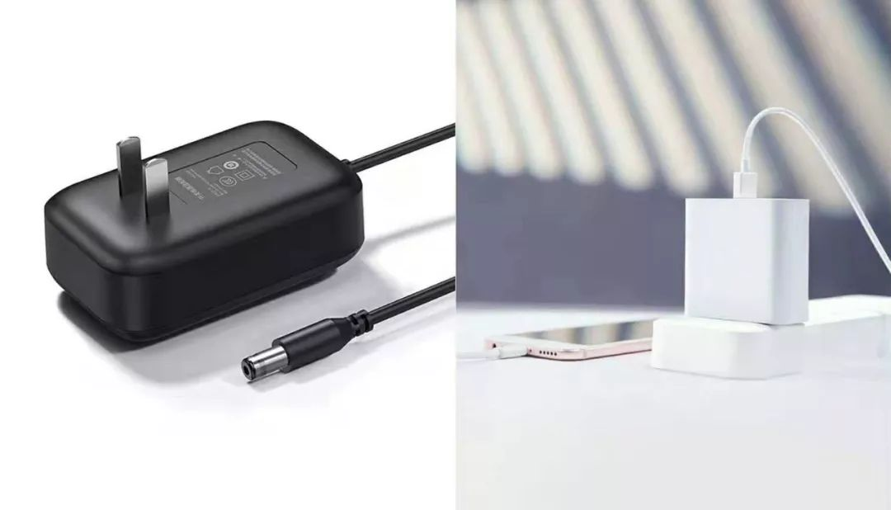
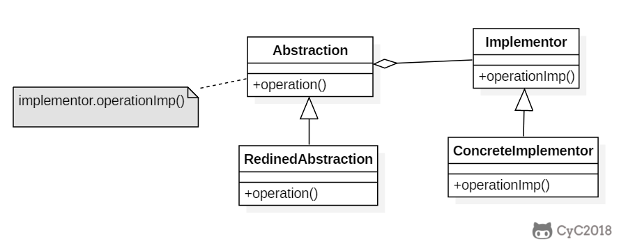
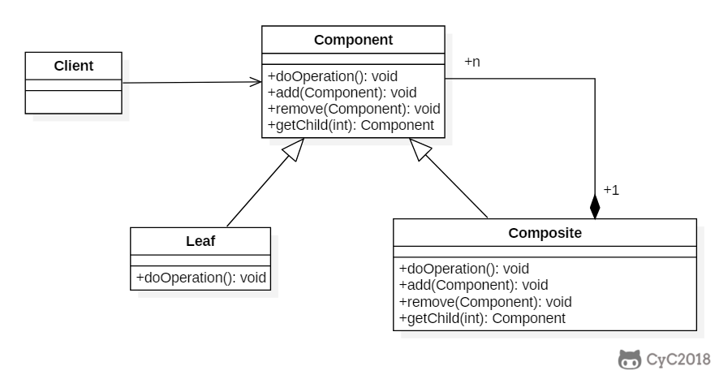

[toc]

在上一篇文章 [如何用「设计模式」制作珍珠奶茶？](https://zhuanlan.zhihu.com/p/85624457)中，

我们学习了 5 种构建型模式。它们主要用于构建对象。让我们简单回顾一下：

- **工厂方法模式**：为每一类对象建立工厂，将对象交由工厂创建，客户端只和工厂打交道。
- **抽象工厂模式**：为每一类工厂提取出抽象接口，使得新增工厂、替换工厂变得非常容易。
- **建造者模式**：用于创建构造过程稳定的对象，不同的 Builder 可以定义不同的配置。
- **单例模式**：全局使用同一个对象，分为饿汉式和懒汉式。懒汉式有双检锁和内部类两种实现方式。
- **原型模式**：为一个类定义 clone 方法，使得创建相同的对象更方便。

本篇文章我们将一起学习结构型模式，顾名思义，**结构型模式是用来设计程序的结构的**。结构型模式就像搭积木，将不同的类结合在一起形成契合的结构。包括以下几种：

- 适配器模式
- 桥接模式
- 组合模式
- 装饰模式
- 外观模式
- 享元模式
- 代理模式

由于内容较多，本篇我们先讲解前三种模式。


## **一、适配器模式（Adapter）**

### Intent

把一个类接口转换成另一个用户需要的接口。


### Class Diagram


### 正文：

说到适配器，我们最熟悉的莫过于电源适配器了，也就是手机的充电头。它就是适配器模式的一个应用。

试想一下，你有一条连接电脑和手机的 USB 数据线，连接电脑的一端从电脑接口处接收 5V 的电压，连接手机的一端向手机输出 5V 的电压，并且他们工作良好。

中国的家用电压都是 220V，所以 USB 数据线不能直接拿来给手机充电，这时候我们有两种方案：

- 单独制作手机充电器，接收 220V 家用电压，输出 5V 电压。
- 添加一个适配器，将 220V 家庭电压转化为类似电脑接口的 5V 电压，再连接数据线给手机充电。

如果你使用过早期的手机，就会知道以前的手机厂商采用的就是第一种方案：早期的手机充电器都是单独制作的，充电头和充电线是连在一起的。现在的手机都采用了电源适配器加数据线的方案。这是生活中应用适配器模式的一个进步。



> 适配器模式：将一个类的接口转换成客户希望的另外一个接口，使得原本由于接口不兼容而不能一起工作的那些类能一起工作。

适配的意思是适应、匹配。通俗地讲，适配器模式适用于 **有相关性但不兼容的结构**，源接口通过一个中间件转换后才可以适用于目标接口，这个转换过程就是适配，这个中间件就称之为适配器。

家用电源和 USB 数据线有相关性：家用电源输出电压，USB 数据线输入电压。但两个接口无法兼容，因为一个输出 220V，一个输入 5V，通过适配器将输出 220V 转换成输出 5V 之后才可以一起工作。

让我们用程序来模拟一下这个过程。

首先，家庭电源提供 220V 的电压：

**Java 实现**

```java
class HomeBattery {
    int supply() {
        // 家用电源提供一个 220V 的输出电压
        return 220;
    }
}
```

USB 数据线只接收 5V 的充电电压：

```java
class USBLine {
    void charge(int volt) {
        // 如果电压不是 5V，抛出异常
        if (volt != 5) throw new IllegalArgumentException("只能接收 5V 电压");
        // 如果电压是 5V，正常充电
        System.out.println("正常充电");
    }
}
```

先来看看适配之前，用户如果直接用家庭电源给手机充电：

```java
public class User {
    @Test
    public void chargeForPhone() {
        HomeBattery homeBattery = new HomeBattery();
        int homeVolt = homeBattery.supply();
        System.out.println("家庭电源提供的电压是 " + homeVolt + "V");

        USBLine usbLine = new USBLine();
        usbLine.charge(homeVolt);
    }
}
```

运行程序，输出如下：

```java
家庭电源提供的电压是 220V

java.lang.IllegalArgumentException: 只能接收 5V 电压
```

这时，我们加入电源适配器：

```java
class Adapter {
    int convert(int homeVolt) {
        // 适配过程：使用电阻、电容等器件将其降低为输出 5V
        int chargeVolt = homeVolt - 215;
        return chargeVolt;
    }
}
```

然后，用户再使用适配器将家庭电源提供的电压转换为充电电压：

```java
public class User {
    @Test
    public void chargeForPhone() {
        HomeBattery homeBattery = new HomeBattery();
        int homeVolt = homeBattery.supply();
        System.out.println("家庭电源提供的电压是 " + homeVolt + "V");

        Adapter adapter = new Adapter();
        int chargeVolt = adapter.convert(homeVolt);
        System.out.println("使用适配器将家庭电压转换成了 " + chargeVolt + "V");

        USBLine usbLine = new USBLine();
        usbLine.charge(chargeVolt);
    }
}
```

运行程序，输出如下：

```text
家庭电源提供的电压是 220V
使用适配器将家庭电压转换成了 5V
正常充电
```

这就是适配器模式。在我们日常的开发中经常会使用到各种各样的 Adapter，都属于适配器模式的应用。

但适配器模式并不推荐多用。因为未雨绸缪好过亡羊补牢，如果事先能预防接口不同的问题，不匹配问题就不会发生，只有遇到源接口无法改变时，才应该考虑使用适配器。比如现代的电源插口中很多已经增加了专门的充电接口，让我们不需要再使用适配器转换接口，这又是社会的一个进步。

### JDK

- javax.swing.JComponent#add(Component)
- java.awt.Container#add(Component)
- java.util.Map#putAll(Map)
- java.util.List#addAll(Collection)
- java.util.Set#addAll(Collection)

## **二、桥接模式（Bridge）**

### Intent

将抽象与实现分离开来，使它们可以独立变化。

### Class Diagram

- Abstraction：定义抽象类的接口
- Implementor：定义实现类接口



### 正文：

考虑这样一个需求：绘制矩形、圆形、三角形这三种图案。按照面向对象的理念，我们至少需要三个具体类，对应三种不同的图形。

抽象接口 IShape：

```java
public interface IShape {
    void draw();
}
```

三个具体形状类：

```java
class Rectangle implements IShape {
    @Override
    public void draw() {
        System.out.println("绘制矩形");
    }
}
```


```java
class Round implements IShape {
    @Override
    public void draw() {
        System.out.println("绘制圆形");
    }
}
```


```java
class Triangle implements IShape {
    @Override
    public void draw() {
        System.out.println("绘制三角形");
    }
}
```


接下来我们有了新的需求，每种形状都需要有四种不同的颜色：红、蓝、黄、绿。

这时我们很容易想到两种设计方案：

- 为了复用形状类，将每种形状定义为父类，每种不同颜色的图形继承自其形状父类。此时一共有 12 个类。
- 为了复用颜色类，将每种颜色定义为父类，每种不同颜色的图形继承自其颜色父类。此时一共有 12 个类。

乍一看没什么问题，我们使用了面向对象的继承特性，复用了父类的代码并扩展了新的功能。

但仔细想一想，如果以后要增加一种颜色，比如黑色，那么我们就需要增加三个类；如果再要增加一种形状，我们又需要增加五个类，对应 5 种颜色。

更不用说遇到增加 20 个形状，20 种颜色的需求，不同的排列组合将会使工作量变得无比的庞大。看来我们不得不重新思考设计方案。

形状和颜色，都是图形的两个属性。他们两者的关系是平等的，所以不属于继承关系。更好的的实现方式是：**将形状和颜色分离，根据需要对形状和颜色进行组合**，这就是桥接模式的思想。

> 桥接模式：将抽象部分与它的实现部分分离，使它们都可以独立地变化。它是一种对象结构型模式，又称为柄体模式或接口模式。

官方定义非常精准、简练，但却有点不易理解。通俗地说，如果一个对象有两种或者多种分类方式，并且两种分类方式都容易变化，比如本例中的形状和颜色。这时使用继承很容易造成子类越来越多，所以更好的做法是把这种分类方式分离出来，让他们独立变化，使用时将不同的分类进行组合即可。

说到这里，不得不提一个设计原则：合成 / 聚合复用原则。虽然它没有被划分到六大设计原则中，但它在面向对象的设计中也非常的重要。

> 合成 / 聚合复用原则：优先使用合成 / 聚合，而不是类继承。

继承虽然是面向对象的三大特性之一，但继承会导致子类与父类有非常紧密的依赖关系，它会限制子类的灵活性和子类的复用性。而使用合成 / 聚合，也就是使用接口实现的方式，就不存在依赖问题，一个类可以实现多个接口，可以很方便地拓展功能。

让我们一起来看一下本例使用桥接模式的程序实现：

新建接口类 IColor，仅包含一个获取颜色的方法：

```java
public interface IColor {
    String getColor();
}
```

每种颜色都实现此接口：

```java
public class Red implements IColor {
    @Override
    public String getColor() {
        return "红";
    }
}
```


```java
public class Blue implements IColor {
    @Override
    public String getColor() {
        return "蓝";
    }
}
```


```java
public class Yellow implements IColor {
    @Override
    public String getColor() {
        return "黄";
    }
}
```


```java
public class Green implements IColor {
    @Override
    public String getColor() {
        return "绿";
    }
}
```


在每个形状类中，桥接 IColor 接口：

```java
class Rectangle implements IShape {

    private IColor color;

    void setColor(IColor color) {
        this.color = color;
    }

    @Override
    public void draw() {
        System.out.println("绘制" + color.getColor() + "矩形");
    }
}
```


```java
class Round implements IShape {

    private IColor color;

    void setColor(IColor color) {
        this.color = color;
    }

    @Override
    public void draw() {
        System.out.println("绘制" + color.getColor() + "圆形");
    }
}
```


```java
class Triangle implements IShape {

    private IColor color;

    void setColor(IColor color) {
        this.color = color;
    }

    @Override
    public void draw() {
        System.out.println("绘制" + color.getColor() + "三角形");
    }
}
```


测试函数：

```java
@Test
public void drawTest() {
    Rectangle rectangle = new Rectangle();
    rectangle.setColor(new Red());
    rectangle.draw();
    
    Round round = new Round();
    round.setColor(new Blue());
    round.draw();
    
    Triangle triangle = new Triangle();
    triangle.setColor(new Yellow());
    triangle.draw();
}
```

运行程序，输出如下：

```text
绘制红矩形
绘制蓝圆形
绘制黄三角形
```

这时我们再来回顾一下官方定义：将抽象部分与它的实现部分分离，使它们都可以独立地变化。抽象部分指的是父类，对应本例中的形状类，实现部分指的是不同子类的区别之处。将子类的区别方式 —— 也就是本例中的颜色 —— 分离成接口，通过组合的方式桥接颜色和形状，这就是桥接模式，它主要用于 **两个或多个同等级的接口**。

### JDK

- AWT (It provides an abstraction layer which maps onto the native OS the windowing support.)
- JDBC


## **三、组合模式（Composite）**

### Intent

将对象组合成树形结构来表示“整体/部分”层次关系，允许用户以相同的方式处理单独对象和组合对象。

### Class Diagram

组件（Component）类是组合类（Composite）和叶子类（Leaf）的父类，可以把组合类看成是树的中间节点。

组合对象拥有一个或者多个组件对象，因此组合对象的操作可以委托给组件对象去处理，而组件对象可以是另一个组合对象或者叶子对象。



### 正文：

上文说到，桥接模式用于将同等级的接口互相组合，那么组合模式和桥接模式有什么共同点吗？

事实上组合模式和桥接模式的组合完全不一样。组合模式用于 **整体与部分的结构**，当整体与部分有相似的结构，在操作时可以被一致对待时，就可以使用组合模式。例如：

- 文件夹和子文件夹的关系：文件夹中可以存放文件，也可以新建文件夹，子文件夹也一样。
- 总公司子公司的关系：总公司可以设立部门，也可以设立分公司，子公司也一样。
- 树枝和分树枝的关系：树枝可以长出叶子，也可以长出树枝，分树枝也一样。

在这些关系中，虽然整体包含了部分，但无论整体或部分，都具有一致的行为。

> 组合模式：又叫部分整体模式，是用于把一组相似的对象当作一个单一的对象。组合模式依据树形结构来组合对象，用来表示部分以及整体层次。这种类型的设计模式属于结构型模式，它创建了对象组的树形结构。

考虑这样一个实际应用：设计一个公司的人员分布结构，结构如下图所示。


我们注意到人员结构中有两种结构，一是管理者，如老板，PM，CFO，CTO，二是职员。其中有的管理者不仅仅要管理职员，还会管理其他的管理者。这就是一个典型的整体与部分的结构。

### **3.1.不使用组合模式的设计方案**

要描述这样的结构，我们很容易想到以下设计方案：

新建管理者类：

```java
public class Manager {
    // 职位
    private String position;
    // 工作内容
    private String job;
    // 管理的管理者
    private List<Manager> managers = new ArrayList<>();
    // 管理的职员
    private List<Employee> employees = new ArrayList<>();

    public Manager(String position, String job) {
        this.position = position;
        this.job = job;
    }
    
    public void addManager(Manager manager) {
        managers.add(manager);
    }

    public void removeManager(Manager manager) {
        managers.remove(manager);
    }

    public void addEmployee(Employee employee) {
        employees.add(employee);
    }

    public void removeEmployee(Employee employee) {
        employees.remove(employee);
    }

    // 做自己的本职工作
    public void work() {
        System.out.println("我是" + position + "，我正在" + job);
    }
    
    // 检查下属
    public void check() {
        work();
        for (Employee employee : employees) {
            employee.work();
        }
        for (Manager manager : managers) {
            manager.check();
        }
    }
}
```

新建职员类：

```java
public class Employee {
    // 职位
    private String position;
    // 工作内容
    private String job;

    public Employee(String position, String job) {
        this.position = position;
        this.job = job;
    }

    // 做自己的本职工作
    public void work() {
        System.out.println("我是" + position + "，我正在" + job);
    }
}
```

客户端建立人员结构关系：

```java
public class Client {
    
    @Test
    public void test() {
        Manager boss = new Manager("老板", "唱怒放的生命");
        Employee HR = new Employee("人力资源", "聊微信");
        Manager PM = new Manager("产品经理", "不知道干啥");
        Manager CFO = new Manager("财务主管", "看剧");
        Manager CTO = new Manager("技术主管", "划水");
        Employee UI = new Employee("设计师", "画画");
        Employee operator = new Employee("运营人员", "兼职客服");
        Employee webProgrammer = new Employee("程序员", "学习设计模式");
        Employee backgroundProgrammer = new Employee("后台程序员", "CRUD");
        Employee accountant = new Employee("会计", "背九九乘法表");
        Employee clerk = new Employee("文员", "给老板递麦克风");
        boss.addEmployee(HR);
        boss.addManager(PM);
        boss.addManager(CFO);
        PM.addEmployee(UI);
        PM.addManager(CTO);
        PM.addEmployee(operator);
        CTO.addEmployee(webProgrammer);
        CTO.addEmployee(backgroundProgrammer);
        CFO.addEmployee(accountant);
        CFO.addEmployee(clerk);

        boss.check();
    }
}
```

运行测试方法，输出如下（为方便查看，笔者添加了缩进）：

```text
我是老板，我正在唱怒放的生命
	我是人力资源，我正在聊微信
	我是产品经理，我正在不知道干啥
		我是设计师，我正在画画
		我是运营人员，我正在兼职客服
		我是技术主管，我正在划水
			我是程序员，我正在学习设计模式
			我是后台程序员，我正在CRUD
	我是财务主管，我正在看剧
		我是会计，我正在背九九乘法表
		我是文员，我正在给老板递麦克风
```

这样我们就设计出了公司的结构，但是这样的设计有两个弊端：

- name 字段，job 字段，work 方法重复了。
- 管理者对其管理的管理者和职员需要区别对待。

关于第一个弊端，虽然这里为了讲解，只有两个字段和一个方法重复，实际工作中这样的整体部分结构会有相当多的重复。比如此例中还可能有工号、年龄等字段，领取工资、上下班打卡、开各种无聊的会等方法。

大量的重复显然是很丑陋的代码，分析一下可以发现， Manager 类只比 Employee 类多一个管理人员的列表字段，多几个增加 / 移除人员的方法，其他的字段和方法全都是一样的。

有读者应该会想到：我们可以将重复的字段和方法提取到一个工具类中，让 Employee 和 Manager 都去调用此工具类，就可以消除重复了。

这样固然可行，但属于 Employee 和 Manager 类自己的东西却要通过其他类调用，并不利于程序的高内聚。

关于第二个弊端，此方案无法解决，此方案中 Employee 和 Manager 类完全是两个不同的对象，两者的相似性被忽略了。

所以我们有更好的设计方案，那就是组合模式！

### **3.2.使用组合模式的设计方案**

组合模式最主要的功能就是让用户可以一致对待整体和部分结构，将两者都作为一个相同的组件，所以我们先新建一个抽象的组件类：

```java
public abstract class Component {
    // 职位
    private String position;
    // 工作内容
    private String job;

    public Component(String position, String job) {
        this.position = position;
        this.job = job;
    }

    // 做自己的本职工作
    public void work() {
        System.out.println("我是" + position + "，我正在" + job);
    }

    abstract void addComponent(Component component);

    abstract void removeComponent(Component component);

    abstract void check();
}
```

管理者继承自此抽象类：

```java
public class Manager extends Component {
    // 管理的组件
    private List<Component> components = new ArrayList<>();

    public Manager(String position, String job) {
        super(position, job);
    }

    @Override
    public void addComponent(Component component) {
        components.add(component);
    }

    @Override
    void removeComponent(Component component) {
        components.remove(component);
    }

    // 检查下属
    @Override
    public void check() {
        work();
        for (Component component : components) {
            component.check();
        }
    }
}
```

职员同样继承自此抽象类：

```java
public class Employee extends Component {

    public Employee(String position, String job) {
        super(position, job);
    }

    @Override
    void addComponent(Component component) {
        System.out.println("职员没有管理权限");
    }

    @Override
    void removeComponent(Component component) {
        System.out.println("职员没有管理权限");
    }

    @Override
    void check() {
        work();
    }
}
```

修改客户端如下：

```java
public class Client {

    @Test
    public void test(){
        Component boss = new Manager("老板", "唱怒放的生命");
        Component HR = new Employee("人力资源", "聊微信");
        Component PM = new Manager("产品经理", "不知道干啥");
        Component CFO = new Manager("财务主管", "看剧");
        Component CTO = new Manager("技术主管", "划水");
        Component UI = new Employee("设计师", "画画");
        Component operator = new Employee("运营人员", "兼职客服");
        Component webProgrammer = new Employee("程序员", "学习设计模式");
        Component backgroundProgrammer = new Employee("后台程序员", "CRUD");
        Component accountant = new Employee("会计", "背九九乘法表");
        Component clerk = new Employee("文员", "给老板递麦克风");
        boss.addComponent(HR);
        boss.addComponent(PM);
        boss.addComponent(CFO);
        PM.addComponent(UI);
        PM.addComponent(CTO);
        PM.addComponent(operator);
        CTO.addComponent(webProgrammer);
        CTO.addComponent(backgroundProgrammer);
        CFO.addComponent(accountant);
        CFO.addComponent(clerk);

        boss.check();
    }
}
```

运行测试方法，输出结果与之前的结果一模一样。

可以看到，使用组合模式后，我们解决了之前的两个弊端。一是将共有的字段与方法移到了父类中，消除了重复，并且在客户端中，可以一致对待 Manager 和 Employee 类：

- Manager 类和 Employee 类统一声明为 Component 对象
- 统一调用 Component 对象的 addComponent 方法添加子对象即可。

### **3.3.组合模式中的安全方式与透明方式**

读者可能已经注意到了，Employee 类虽然继承了父类的 addComponent 和 removeComponent 方法，但是仅仅提供了一个空实现，因为 Employee 类是不支持添加和移除组件的。这样是否违背了接口隔离原则呢？

> 接口隔离原则：客户端不应依赖它不需要的接口。如果一个接口在实现时，部分方法由于冗余被客户端空实现，则应该将接口拆分，让实现类只需依赖自己需要的接口方法。

答案是肯定的，这样确实违背了接口隔离原则。这种方式在组合模式中被称作透明方式.

> 透明方式：在 Component 中声明所有管理子对象的方法，包括 add 、remove 等，这样继承自 Component 的子类都具备了 add、remove 方法。对于外界来说叶节点和枝节点是透明的，它们具备完全一致的接口。

这种方式有它的优点：让 Manager 类和 Employee 类具备完全一致的行为接口，调用者可以一致对待它们。

但它的缺点也显而易见：Employee 类并不支持管理子对象，不仅违背了接口隔离原则，而且客户端可以用 Employee 类调用 addComponent 和 removeComponent 方法，导致程序出错，所以这种方式是不安全的。

那么我们可不可以将 addComponent 和 removeComponent 方法移到 Manager 子类中去单独实现，让 Employee 不再实现这两个方法呢？我们来尝试一下。

将抽象类修改为：

```java
public abstract class Component {
    // 职位
    private String position;
    // 工作内容
    private String job;

    public Component(String position, String job) {
        this.position = position;
        this.job = job;
    }

    // 做自己的本职工作
    public void work() {
        System.out.println("我是" + position + "，我正在" + job);
    }

    abstract void check();
}
```

可以看到，我们在父类中去掉了 addComponent 和 removeComponent 这两个抽象方法。

Manager 类修改为：

```java
public class Manager extends Component {
    // 管理的组件
    private List<Component> components = new ArrayList<>();

    public Manager(String position, String job) {
        super(position, job);
    }

    public void addComponent(Component component) {
        components.add(component);
    }

    void removeComponent(Component component) {
        components.remove(component);
    }

    // 检查下属
    @Override
    public void check() {
        work();
        for (Component component : components) {
            component.check();
        }
    }
}
```

Manager 类单独实现了 addComponent 和 removeComponent 这两个方法，去掉了 @Override 注解。

Employee 类修改为：

```java
public class Employee extends Component {

    public Employee(String position, String job) {
        super(position, job);
    }

    @Override
    void check() {
        work();
    }
}
```

客户端建立人员结构关系：

```java
public class Client {

    @Test
    public void test(){
        Manager boss = new Manager("老板", "唱怒放的生命");
        Employee HR = new Employee("人力资源", "聊微信");
        Manager PM = new Manager("产品经理", "不知道干啥");
        Manager CFO = new Manager("财务主管", "看剧");
        Manager CTO = new Manager("技术主管", "划水");
        Employee UI = new Employee("设计师", "画画");
        Employee operator = new Employee("运营人员", "兼职客服");
        Employee webProgrammer = new Employee("程序员", "学习设计模式");
        Employee backgroundProgrammer = new Employee("后台程序员", "CRUD");
        Employee accountant = new Employee("会计", "背九九乘法表");
        Employee clerk = new Employee("文员", "给老板递麦克风");
        boss.addComponent(HR);
        boss.addComponent(PM);
        boss.addComponent(CFO);
        PM.addComponent(UI);
        PM.addComponent(CTO);
        PM.addComponent(operator);
        CTO.addComponent(webProgrammer);
        CTO.addComponent(backgroundProgrammer);
        CFO.addComponent(accountant);
        CFO.addComponent(clerk);

        boss.check();
    }
}
```


运行程序，输出结果与之前一模一样。

这种方式在组合模式中称之为安全方式。

> 安全方式：在 Component 中不声明 add 和 remove 等管理子对象的方法，这样叶节点就无需实现它，只需在枝节点中实现管理子对象的方法即可。

安全方式遵循了接口隔离原则，但由于不够透明，Manager 和 Employee 类不具有相同的接口，在客户端中，我们无法将 Manager 和 Employee 统一声明为 Component 类了，必须要区别对待，带来了使用上的不方便。

安全方式和透明方式各有好处，在使用组合模式时，需要根据实际情况决定。但大多数使用组合模式的场景都是采用的透明方式，虽然它有点不安全，但是客户端无需做任何判断来区分是叶子结点还是枝节点，用起来是真香。

### JDK

- javax.swing.JComponent#add(Component)
- java.awt.Container#add(Component)
- java.util.Map#putAll(Map)
- java.util.List#addAll(Collection)
- java.util.Set#addAll(Collection)


## **总结**

到这里我们就把结构型模式的前三种介绍完了，让我们总结一下：

- 适配器模式：用于有相关性但不兼容的接口
- 桥接模式：用于同等级的接口互相组合
- 组合模式：用于整体与部分的结构

剩余四种结构型模式我们将在下篇文章中学习。