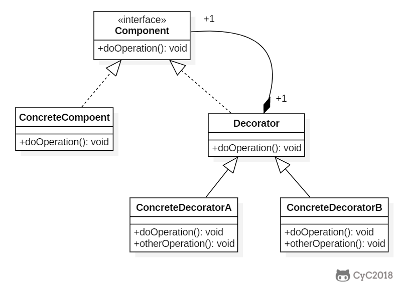
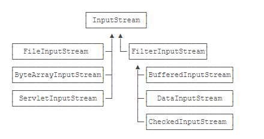
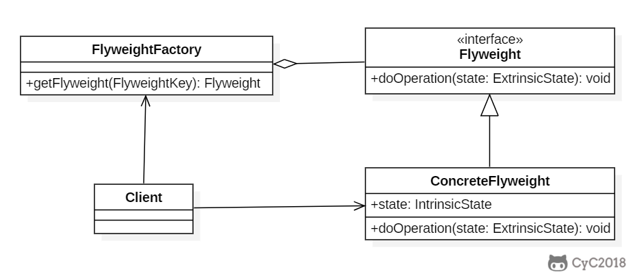
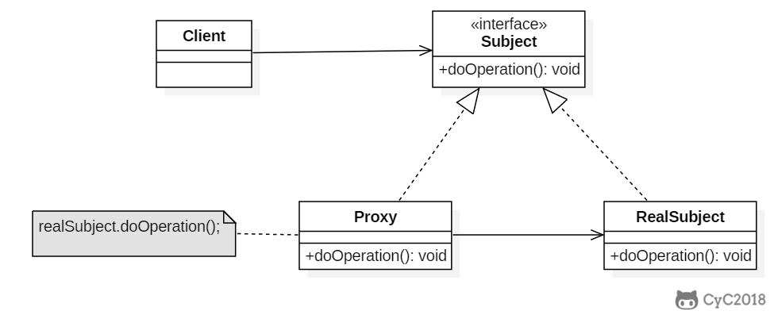

[toc]

在上一篇文章 **[详解设计模式之结构型模式（上）](https://zhuanlan.zhihu.com/p/91836046)**中我们学习了三种结构型模式：适配器模式、桥接模式、组合模式。本文我们将介绍剩余四种结构型模式，它们分别是：

- 装饰模式
- 外观模式
- 享元模式
- 代理模式


## 四、**装饰模式（Decorator）**

### Intent

为对象动态添加功能。

### Class Diagram

装饰者（Decorator）和具体组件（ConcreteComponent）都继承自组件（Component），具体组件的方法实现不需要依赖于其它对象，而装饰者组合了一个组件，这样它可以装饰其它装饰者或者具体组件。所谓装饰，就是把这个装饰者套在被装饰者之上，从而动态扩展被装饰者的功能。装饰者的方法有一部分是自己的，这属于它的功能，然后调用被装饰者的方法实现，从而也保留了被装饰者的功能。可以看到，具体组件应当是装饰层次的最低层，因为只有具体组件的方法实现不需要依赖于其它对象。



### 正文：

提到装饰，我们先来想一下生活中有哪些装饰：

- **女生的首饰**：戒指、耳环、项链等装饰品
- **家居装饰品**：粘钩、镜子、壁画、盆栽等

我们为什么需要这些装饰品呢？很容易想到是为了美，戒指、耳环、项链、壁画、盆栽等都是为了提高颜值或增加美观度。但粘钩、镜子不一样，它们是为了方便我们挂东西、洗漱。所以我们可以总结出装饰品共有两种功能：

- **增强原有的特性**：我们本身就是有一定颜值的，添加装饰品提高了我们的颜值。同样，房屋本身就有一定的美观度，家居装饰提高了房屋的美观度。
- **添加新的特性**：在墙上挂上粘钩，让墙壁有了挂东西的功能。在洗漱台装上镜子，让洗漱台有了照镜子的功能。

并且，我们发现装饰品并不会改变物品本身，只是起到一个锦上添花的作用。装饰模式也一样，它的主要作用就是：

- **增强一个类原有的功能**
- **为一个类添加新的功能**

并且 **装饰模式也不会改变原有的类**。

> **装饰模式**：动态地给一个对象增加一些额外的职责，就增加对象功能来说，装饰模式比生成子类实现更为灵活。其别名也可以称为包装器，与适配器模式的别名相同，但它们适用于不同的场合。根据翻译的不同，装饰模式也有人称之为“油漆工模式”。

#### **1. 用于增强功能的装饰模式**

我们用程序来模拟一下戴上装饰品提高我们颜值的过程：

新建颜值接口：

```java
public interface IBeauty {
    int getBeautyValue();
}
```

新建 Me 类，实现颜值接口：

```java
public class Me implements IBeauty {

    @Override
    public int getBeautyValue() {
        return 100;
    }
}
```

戒指装饰类，将 Me 包装起来：

```java
public class RingDecorator implements IBeauty {
    private final IBeauty me;

    public RingDecorator(IBeauty me) {
        this.me = me;
    }

    @Override
    public int getBeautyValue() {
        return me.getBeautyValue() + 20;
    }
}
```

客户端测试：

```java
public class Client {
    @Test
    public void show() {
        IBeauty me = new Me();
        System.out.println("我原本的颜值：" + me.getBeautyValue());

        IBeauty meWithRing = new RingDecorator(me);
        System.out.println("戴上了戒指后，我的颜值：" + meWithRing.getBeautyValue());
    }
}
```

运行程序，输出如下：

```text
我原本的颜值：100
戴上了戒指后，我的颜值：120
```

这就是最简单的增强功能的装饰模式。以后我们可以添加更多的装饰类，比如：

耳环装饰类：

```java
public class EarringDecorator implements IBeauty {
    private final IBeauty me;

    public EarringDecorator(IBeauty me) {
        this.me = me;
    }

    @Override
    public int getBeautyValue() {
        return me.getBeautyValue() + 50;
    }
}
```

项链装饰类：

```java
public class NecklaceDecorator implements IBeauty {
    private final IBeauty me;

    public NecklaceDecorator(IBeauty me) {
        this.me = me;
    }

    @Override
    public int getBeautyValue() {
        return me.getBeautyValue() + 80;
    }
}
```

客户端测试：

```java
public class Client {
    @Test
    public void show() {
        IBeauty me = new Me();
        System.out.println("我原本的颜值：" + me.getBeautyValue());

        // 随意挑选装饰
        IBeauty meWithNecklace = new NecklaceDecorator(me);
        System.out.println("戴上了项链后，我的颜值：" + meWithNecklace.getBeautyValue());

        // 多次装饰
        IBeauty meWithManyDecorators = new NecklaceDecorator(new RingDecorator(new EarringDecorator(me)));
        System.out.println("戴上耳环、戒指、项链后，我的颜值：" + meWithManyDecorators.getBeautyValue());

        // 任意搭配装饰
        IBeauty meWithNecklaceAndRing = new NecklaceDecorator(new RingDecorator(me));
        System.out.println("戴上戒指、项链后，我的颜值：" + meWithNecklaceAndRing.getBeautyValue());
    }
}
```

运行程序，输出如下：

```text
我原本的颜值：100
戴上了项链后，我的颜值：180
戴上耳环、戒指、项链后，我的颜值：250
戴上戒指、项链后，我的颜值：200
```

可以看到，装饰器也实现了 IBeauty 接口，并且没有添加新的方法，也就是说这里的装饰器**仅用于增强功能**，**并不会改变 Me 原有的功能**，这种装饰模式称之为 **透明装饰模式**，由于没有改变接口，也没有新增方法，所以**透明装饰模式可以无限装饰**。

装饰模式是 **继承** 的一种替代方案。本例如果不使用装饰模式，而是改用继承实现的话，戴着戒指的 Me 需要派生一个子类、戴着项链的 Me 需要派生一个子类、戴着耳环的 Me 需要派生一个子类、戴着戒指 + 项链的需要派生一个子类......各种各样的排列组合会造成类爆炸。而采用了装饰模式就只需要为每个装饰品生成一个装饰类即可，所以说就 **增加对象功能** 来说，**装饰模式比生成子类实现更为灵活**。

#### 2. 用于添加功能的装饰模式

我们用程序来模拟一下房屋装饰粘钩后，新增了挂东西功能的过程：

新建房屋接口：

```java
public interface IHouse {
    void live();
}
```

房屋类：

```java
public class House implements IHouse{

    @Override
    public void live() {
        System.out.println("房屋原有的功能：居住功能");
    }
}
```

新建粘钩装饰器接口，继承自房屋接口：

```java
public interface IStickyHookHouse extends IHouse{
    void hangThings();
}
```

粘钩装饰类：

```java
public class StickyHookDecorator implements IStickyHookHouse {
    private final IHouse house;

    public StickyHookDecorator(IHouse house) {
        this.house = house;
    }

    @Override
    public void live() {
        house.live();
    }

    @Override
    public void hangThings() {
        System.out.println("有了粘钩后，新增了挂东西功能");
    }
}
```

客户端测试：

```java
public class Client {
    @Test
    public void show() {
        IHouse house = new House();
        house.live();

        IStickyHookHouse stickyHookHouse = new StickyHookDecorator(house);
        stickyHookHouse.live();
        stickyHookHouse.hangThings();
    }
}
```

运行程序，显示如下：

```text
房屋原有的功能：居住功能
房屋原有的功能：居住功能
有了粘钩后，新增了挂东西功能
```

这就是用于 **新增功能** 的装饰模式。我们在接口中新增了方法：hangThings，然后在装饰器中将 House 类包装起来，之前 House 中的方法仍然调用 house 去执行，也就是说我们并没有修改原有的功能，只是扩展了新的功能，这种模式在装饰模式中称之为 **半透明装饰模式**。

为什么叫半透明呢？由于新的接口 IStickyHookHouse 拥有之前 IHouse 不具有的方法，所以我们如果要使用装饰器中添加的功能，就不得不区别对待 **装饰前的对象和装饰后的对象**。也就是说客户端要使用新方法，必须知道具体的装饰类 StickyHookDecorator，所以这个装饰类对客户端来说是可见的、不透明的。而被装饰者不一定要是 House，它可以是实现了 IHouse 接口的任意对象，所以被装饰者对客户端是不可见的、透明的。由于一半透明，一半不透明，所以称之为半透明装饰模式。

我们可以添加更多的装饰器：

新建镜子装饰器的接口，继承自房屋接口：

```java
public interface IMirrorHouse extends IHouse {
    void lookMirror();
}
```

镜子装饰类：

```java
public class MirrorDecorator implements IMirrorHouse{
    private final IHouse house;

    public MirrorDecorator(IHouse house) {
        this.house = house;
    }

    @Override
    public void live() {
        house.live();
    }

    @Override
    public void lookMirror() {
        System.out.println("有了镜子后，新增了照镜子功能");
    }
}
```

客户端测试：

```java
public class Client {
    @Test
    public void show() {
        IHouse house = new House();
        house.live();

        IMirrorHouse mirrorHouse = new MirrorDecorator(house);
        mirrorHouse.live();
        mirrorHouse.lookMirror();
    }
}
```

运行程序，输出如下：

```text
房屋原有的功能：居住功能
房屋原有的功能：居住功能
有了镜子后，新增了照镜子功能
```

现在我们仿照 **透明装饰模式** 的写法，同时添加粘钩和镜子装饰试一试：

```java
public class Client {
    @Test
    public void show() {
        IHouse house = new House();
        house.live();

        IStickyHookHouse stickyHookHouse = new StickyHookDecorator(house);
        IMirrorHouse houseWithStickyHookMirror = new MirrorDecorator(stickyHookHouse);
        houseWithStickyHookMirror.live();
        houseWithStickyHookMirror.hangThings(); // 这里会报错，找不到 hangThings 方法
        houseWithStickyHookMirror.lookMirror();
    }
}
```

我们会发现，第二次装饰时，无法获得上一次装饰添加的方法。原因很明显，当我们用 IMirrorHouse 装饰器后，接口变为了 IMirrorHouse，这个接口中并没有 hangThings 方法。

那么我们能否让 IMirrorHouse 继承自 IStickyHookHouse，以实现新增两个功能呢？

可以，但那样做的话两个装饰类之间有了依赖关系，那就不是装饰模式了。装饰类不应该存在依赖关系，而应该在原本的类上进行装饰。这就意味着，**半透明装饰模式中**，**我们无法多次装饰**。

有的同学会问了，既增强了功能，又添加了新功能的装饰模式叫什么呢？

—— 举一反三，肯定是叫全不透明装饰模式！

—— 并不是！只要添加了新功能的装饰模式都称之为 **半透明装饰模式**，他们都具有不可以多次装饰的特点。仔细理解上文半透明名称的由来就知道了，“透明”指的是我们无需知道被装饰者具体的类，既增强了功能，又添加了新功能的装饰模式仍然具有半透明特性。

看了这两个简单的例子，是不是发现装饰模式很简单呢？恭喜你学会了 1 + 1 = 2，现在你已经掌握了算数的基本思想，接下来我们来做一道微积分题练习一下。


####  **I/O 中的装饰模式**

I/O 指的是 Input/Output，即输入、输出。我们以 Input 为例。先在 `src` 文件夹下新建一个文件 readme.text，随便写点文字：

```text
禁止套娃
禁止禁止套娃
禁止禁止禁止套娃
```

然后用 Java 的 InputStream 读取，代码一般长这样：

```java
public void io() throws IOException {
    InputStream in = new BufferedInputStream(new FileInputStream("src/readme.txt"));
    byte[] buffer = new byte[1024];
    while (in.read(buffer) != -1) {
        System.out.println(new String(buffer));
    }
    in.close();
}
```

这样写有一个问题，如果读取过程中出现了 IO 异常，InputStream 就不能正确关闭，所以我们要用`try...finally`来保证 InputStream 正确关闭：

```java
public void io() throws IOException {
    InputStream in = null;
    try {
        in = new BufferedInputStream(new FileInputStream("src/readme.txt"));
        byte[] buffer = new byte[1024];
        while (in.read(buffer) != -1) {
            System.out.println(new String(buffer));
        }
    } finally {
        if (in != null) {
            in.close();
        }
    }
}
```

这种写法实在是太丑了，而 IO 操作又必须这么写，显然 Java 也意识到了这个问题，所以 Java 7 中引入了`try(resource)`语法糖，IO 的代码就可以简化如下：

```java
public void io() throws IOException {
    try (InputStream in = new BufferedInputStream(new FileInputStream("src/readme.txt"))) {
        byte[] buffer = new byte[1024];
        while (in.read(buffer) != -1) {
            System.out.println(new String(buffer));
        }
    }
}
```

这种写法和上一种逻辑是一样的，运行程序，显示如下：

```text
禁止套娃
禁止禁止套娃
禁止禁止禁止套娃
```

观察获取 InputStream 这句代码：

```java
InputStream in = new BufferedInputStream(new FileInputStream("src/readme.txt"));
```

是不是和我们之前多次装饰的代码非常相似：

```java
// 多次装饰
IBeauty meWithManyDecorators = new NecklaceDecorator(new RingDecorator(new EarringDecorator(me)));
```

事实上，查看 I/O 的源码可知，Java I/O 的设计框架便是使用的 **装饰者模式**，InputStream 的继承关系如下：



其中，InputStream 是一个抽象类，对应上文例子中的 IHouse，其中最重要的方法是 read 方法，这是一个抽象方法：

```java
public abstract class InputStream implements Closeable {
    
    public abstract int read() throws IOException;
    
    // ...
}
```

这个方法会读取输入流的下一个字节，并返回字节表示的 int 值（0~255），返回 -1 表示已读到末尾。由于它是抽象方法，所以具体的逻辑交由子类实现。

上图中，左边的三个类 FileInputStream、ByteArrayInputStream、ServletInputStream 是 InputStream 的三个子类，对应上文例子中实现了 IHouse 接口的 House。

右下角的三个类 BufferedInputStream、DataInputStream、CheckedInputStream 是三个具体的装饰者类，他们都为 InputStream 增强了原有功能或添加了新功能。

FilterInputStream 是所有装饰类的父类，它没有实现具体的功能，仅用来包装了一下 InputStream：

```java
public class FilterInputStream extends InputStream {
    protected volatile InputStream in;
    
    protected FilterInputStream(InputStream in) {
        this.in = in;
    }

    public int read() throws IOException {
        return in.read();
    }
    
    //...
}
```

我们以 BufferedInputStream 为例。原有的 InputStream 读取文件时，是一个字节一个字节读取的，这种方式的执行效率并不高，所以我们可以设立一个缓冲区，先将内容读取到缓冲区中，缓冲区读满后，将内容从缓冲区中取出来，这样就变成了一段一段读取，用内存换取效率。BufferedInputStream 就是用来做这个的。它继承自 FilterInputStream：

```java
public class BufferedInputStream extends FilterInputStream {
    private static final int DEFAULT_BUFFER_SIZE = 8192;
    protected volatile byte buf[];

    public BufferedInputStream(InputStream in) {
        this(in, DEFAULT_BUFFER_SIZE);
    }

    public BufferedInputStream(InputStream in, int size) {
        super(in);
        if (size <= 0) {
            throw new IllegalArgumentException("Buffer size <= 0");
        }
        buf = new byte[size];
    }
    
    //...
}
```

我们先来看它的构造方法，在构造方法中，新建了一个 byte[] 作为缓冲区，从源码中我们看到，Java 默认设置的缓冲区大小为 8192 byte，也就是 8 KB。

然后我们来查看 read 方法：

```java
public class BufferedInputStream extends FilterInputStream {
    //...

    public synchronized int read() throws IOException {
        if (pos >= count) {
            fill();
            if (pos >= count)
                return -1;
        }
        return getBufIfOpen()[pos++] & 0xff;
    }

    private void fill() throws IOException {
        // 往缓冲区内填充读取内容的过程
        //...
    }
}
```

在 read 方法中，调用了 fill 方法，fill 方法的作用就是往缓冲区中填充读取的内容。这样就实现了增强原有的功能。

在源码中我们发现，BufferedInputStream 没有添加 InputStream 中没有的方法，所以 BufferedInputStream 使用的是 **透明的装饰模式**。

DataInputStream 用于更加方便地读取 int、double 等内容，观察 DataInputStream 的源码可以发现，DataInputStream 中新增了 readInt、readLong 等方法，所以 DataInputStream 使用的是 **半透明装饰模式**。

理解了 InputStream 后，再看一下 OutputStream 的继承关系，相信大家一眼就能看出各个类的作用了：


这就是装饰模式，注意不要和适配器模式混淆了。两者在使用时都是包装一个类，但两者的区别其实也很明显：

- 纯粹的适配器模式 **仅用于改变接口**，不改变其功能，部分情况下我们需要改变一点功能以适配新接口。但使用适配器模式时，接口一定会有一个 **回炉重造** 的过程。
- 装饰模式 **不改变原有的接口**，仅用于增强原有功能或添加新功能，强调的是 **锦上添花**。

掌握了装饰者模式之后，理解 Java I/O 的框架设计就非常容易了。但对于不理解装饰模式的人来说，各种各样相似的 InputStream 非常容易让开发者感到困惑。这一点正是装饰模式的缺点：**容易造成程序中有大量相似的类**。虽然这更像是开发者的缺点，我们应该做的是提高自己的技术，掌握了这个设计模式之后它就是我们的一把利器。现在我们再看到 I/O 不同的 InputStream 装饰类，只需要关注它增强了什么功能或添加了什么功能即可。

### JDK

- java.io.BufferedInputStream(InputStream)
- java.io.DataInputStream(InputStream)
- java.io.BufferedOutputStream(OutputStream)
- java.util.zip.ZipOutputStream(OutputStream)
- java.util.Collections#checked[List|Map|Set|SortedSet|SortedMap](https://github.com/CyC2018/CS-Notes/blob/master/notes)


## 五、**外观模式（Facade）**

### Intent

提供了一个统一的接口，用来访问子系统中的一群接口，从而让子系统更容易使用。

### Class Diagram


### 正文：

外观模式非常简单，体现的就是 Java 中封装的思想。将多个子系统封装起来，提供一个更简洁的接口供外部调用。


> **外观模式**：外部与一个子系统的通信必须通过一个统一的外观对象进行，为子系统中的一组接口提供一个一致的界面，外观模式定义了一个高层接口，这个接口使得这一子系统更加容易使用。外观模式又称为门面模式。

举个例子，比如我们每天打开电脑时，都需要做三件事：

- 打开浏览器
- 打开 IDE
- 打开微信

每天下班时，关机前需要做三件事：

- 关闭浏览器
- 关闭 IDE
- 关闭微信

用程序模拟如下：

新建浏览器类：

```java
public class Browser {
    public static void open() {
        System.out.println("打开浏览器");
    }

    public static void close() {
        System.out.println("关闭浏览器");
    }
}
```

新建 IDE 类：

```java
public class IDE {
    public static void open() {
        System.out.println("打开 IDE");
    }

    public static void close() {
        System.out.println("关闭 IDE");
    }
}
```

新建微信类：

```java
public class Wechat {
    public static void open() {
        System.out.println("打开微信");
    }

    public static void close() {
        System.out.println("关闭微信");
    }
}
```

客户端调用：

```java
public class Client {
    @Test
    public void test() {
        System.out.println("上班:");
        Browser.open();
        IDE.open();
        Wechat.open();

        System.out.println("下班:");
        Browser.close();
        IDE.close();
        Wechat.close();
    }
}
```

运行程序，输出如下：

```java
上班:
打开浏览器
打开 IDE
打开微信
下班:
关闭浏览器
关闭 IDE
关闭微信
```

由于我们每天都要做这几件事，所以我们可以使用 **外观模式**，将这几个子系统封装起来，提供更简洁的接口：

```java
public class Facade {
    public void open() {
        Browser.open();
        IDE.open();
        Wechat.open();
    }

    public void close() {
        Browser.close();
        IDE.close();
        Wechat.close();
    }
}
```

客户端就可以简化代码，只和这个外观类打交道：

```java
public class Client {
    @Test
    public void test() {
        Facade facade = new Facade();
        System.out.println("上班:");
        facade.open();

        System.out.println("下班:");
        facade.close();
    }
}
```

运行程序，输出与之前一样。

外观模式就是这么简单，它使得两种不同的类不用直接交互，而是通过一个中间件——也就是外观类——间接交互。外观类中只需要暴露简洁的接口，隐藏内部的细节，所以说白了就是封装的思想。

外观模式非常常用，（当然了！写代码哪有不封装的！）尤其是在第三方库的设计中，我们应该提供尽量简洁的接口供别人调用。另外，在 MVC 架构中，C 层（Controller）就可以看作是外观类，Model 和 View 层通过 Controller 交互，减少了耦合。

### 设计原则

最少知识原则：只和你的密友谈话。也就是说客户对象所需要交互的对象应当尽可能少。


## 六、**享元模式**（Flyweight）


利用共享的方式来支持大量细粒度的对象，这些对象一部分内部状态是相同的。

### Class Diagram

- Flyweight：享元对象
- IntrinsicState：内部状态，享元对象共享内部状态
- ExtrinsicState：外部状态，每个享元对象的外部状态不同




### Implementation

```java
public interface Flyweight {
    void doOperation(String extrinsicState);
}
public class ConcreteFlyweight implements Flyweight {

    private String intrinsicState;

    public ConcreteFlyweight(String intrinsicState) {
        this.intrinsicState = intrinsicState;
    }

    @Override
    public void doOperation(String extrinsicState) {
        System.out.println("Object address: " + System.identityHashCode(this));
        System.out.println("IntrinsicState: " + intrinsicState);
        System.out.println("ExtrinsicState: " + extrinsicState);
    }
}
public class FlyweightFactory {

    private HashMap<String, Flyweight> flyweights = new HashMap<>();

    Flyweight getFlyweight(String intrinsicState) {
        if (!flyweights.containsKey(intrinsicState)) {
            Flyweight flyweight = new ConcreteFlyweight(intrinsicState);
            flyweights.put(intrinsicState, flyweight);
        }
        return flyweights.get(intrinsicState);
    }
}
public class Client {

    public static void main(String[] args) {
        FlyweightFactory factory = new FlyweightFactory();
        Flyweight flyweight1 = factory.getFlyweight("aa");
        Flyweight flyweight2 = factory.getFlyweight("aa");
        flyweight1.doOperation("x");
        flyweight2.doOperation("y");
    }
}
Object address: 1163157884
IntrinsicState: aa
ExtrinsicState: x
Object address: 1163157884
IntrinsicState: aa
ExtrinsicState: y
```

### 正文：

享元模式体现的是 **程序可复用** 的特点，为了节约宝贵的内存，程序应该尽可能地复用，就像《极限编程》作者 Kent 在书里说到的那样：Don't repeat yourself. 简单来说 **享元模式就是共享对象**，提高复用性，官方的定义倒是显得文绉绉的：

> **享元模式**：运用共享技术有效地支持大量细粒度对象的复用。系统只使用少量的对象，而这些对象都很相似，状态变化很小，可以实现对象的多次复用。由于享元模式要求能够共享的对象必须是细粒度对象，因此它又称为轻量级模式。

有个细节值得注意：有些对象本身不一样，但通过一点点变化后就可以复用，我们编程时可能稍不注意就会忘记复用这些对象。比如说伟大的《超级玛丽》，谁能想到草和云更改一下颜色就可以实现复用呢？

还有里面的三种乌龟，换一个颜色、加一个装饰就变成了不同的怪：


在《超级玛丽》中，这样的细节还有很多，正是这些精湛的复用使得这一款红遍全球的游戏仅有 40KB 大小。正是印证了那句名言：神在细节之中。

### JDK

Java 利用缓存来加速大量小对象的访问时间。

- java.lang.Integer#valueOf(int)
- java.lang.Boolean#valueOf(boolean)
- java.lang.Byte#valueOf(byte)
- java.lang.Character#valueOf(char)


## 七、**代理模式（Proxy）**

### Intent

控制对其它对象的访问。

### Class Diagram

代理有以下四类：

- 远程代理（Remote Proxy）：控制对远程对象（不同地址空间）的访问，它负责将请求及其参数进行编码，并向不同地址空间中的对象发送已经编码的请求。
- 虚拟代理（Virtual Proxy）：根据需要创建开销很大的对象，它可以缓存实体的附加信息，以便延迟对它的访问，例如在网站加载一个很大图片时，不能马上完成，可以用虚拟代理缓存图片的大小信息，然后生成一张临时图片代替原始图片。
- 保护代理（Protection Proxy）：按权限控制对象的访问，它负责检查调用者是否具有实现一个请求所必须的访问权限。
- 智能代理（Smart Reference）：取代了简单的指针，它在访问对象时执行一些附加操作：记录对象的引用次数；当第一次引用一个对象时，将它装入内存；在访问一个实际对象前，检查是否已经锁定了它，以确保其它对象不能改变它。



### 正文：

现在我们有一个 `人` 类，他整天就只负责吃饭、睡觉：

`人`类的接口

```java
public interface IPerson {
    void eat();
    void sleep();
}
```

`人` 类：

```java
public class Person implements IPerson{

    @Override
    public void eat() {
        System.out.println("我在吃饭");
    }

    @Override
    public void sleep() {
        System.out.println("我在睡觉");
    }
}
```

客户端测试：

```java
public class Client {
    @Test
    public void test() {
        Person person = new Person();
        person.eat();
        person.sleep();
    }
}
```

运行程序，输出如下：

```text
我在吃饭
我在睡觉
```

我们可以把这个类包装到另一个类中，实现完全一样的行为：

```java
public class PersonProxy implements IPerson {

    private final Person person;

    public PersonProxy(Person person) {
        this.person = person;
    }

    @Override
    public void eat() {
        person.eat();
    }

    @Override
    public void sleep() {
        person.sleep();
    }
}
```

将客户端修改为调用这个新的类：

```java
public class Client {
    @Test
    public void test() {
        Person person = new Person();
        PersonProxy proxy = new PersonProxy(person);
        proxy.eat();
        proxy.sleep();
    }
}
```

运行程序，输出如下：

```text
我在吃饭
我在睡觉
```

这就是代理模式。

笔者尽量用最简洁的代码讲解此模式，只要理解了上述这个简单的例子，你就知道代理模式是怎么一回事了。我们在客户端和 Person 类之间新增了一个中间件 PersonProxy，这个类就叫做代理类，他实现了和 Person 类一模一样的行为。

> **代理模式**：给某一个对象提供一个代理，并由代理对象控制对原对象的引用。

现在这个代理类还看不出任何意义，我们来模拟一下工作中的需求。在实际工作中，我们可能会遇到这样的需求：在网络请求前后，分别打印将要发送的数据和接收到数据作为日志信息。此时我们就可以新建一个网络请求的代理类，让它代为处理网络请求，并在代理类中打印这些日志信息。

新建网络请求接口：

```java
public interface IHttp {
    void request(String sendData);

    void onSuccess(String receivedData);
}
```

新建 Http 请求工具类：

```java
public class HttpUtil implements IHttp {
    @Override
    public void request(String sendData) {
        System.out.println("网络请求中...");
    }

    @Override
    public void onSuccess(String receivedData) {
        System.out.println("网络请求完成。");
    }
}
```

新建 Http 代理类：

```java
public class HttpProxy implements IHttp {
    private final HttpUtil httpUtil;

    public HttpProxy(HttpUtil httpUtil) {
        this.httpUtil = httpUtil;
    }

    @Override
    public void request(String sendData) {
        httpUtil.request(sendData);
    }

    @Override
    public void onSuccess(String receivedData) {
        httpUtil.onSuccess(receivedData);
    }
}
```

到这里，和我们上述吃饭睡觉的代码是一模一样的，现在我们在 HttpProxy 中新增打印日志信息：

```java
public class HttpProxy implements IHttp {
    private final HttpUtil httpUtil;

    public HttpProxy(HttpUtil httpUtil) {
        this.httpUtil = httpUtil;
    }

    @Override
    public void request(String sendData) {
        System.out.println("发送数据:" + sendData);
        httpUtil.request(sendData);
    }

    @Override
    public void onSuccess(String receivedData) {
        System.out.println("收到数据:" + receivedData);
        httpUtil.onSuccess(receivedData);
    }
}
```

客户端验证：

```java
public class Client {
    @Test
    public void test() {
        HttpUtil httpUtil = new HttpUtil();
        HttpProxy proxy = new HttpProxy(httpUtil);
        proxy.request("request data");
        proxy.onSuccess("received result");
    }
}
```

运行程序，输出如下：

```text
发送数据:request data
网络请求中...
收到数据:received result
网络请求完成。
```

这就是代理模式的一个应用，除了 **打印日志**，它还可以用来做**权限管理**。读者看到这里可能已经发现了，这个代理类看起来和装饰模式的 FilterInputStream 一模一样，但两者的目的不同，装饰模式是为了 **增强功能或添加功能**，代理模式主要是为了**加以控制**。


####  **动态代理**

上例中的代理被称之为静态代理，动态代理与静态代理的原理一模一样，只是换了一种写法。使用动态代理，需要把一个类传入，然后根据它正在调用的方法名判断是否需要加以控制。用伪代码表示如下：

```java
public class HttpProxy {
    private final HttpUtil httpUtil;

    public HttpProxy(HttpUtil httpUtil) {
        this.httpUtil = httpUtil;
    }

    // 假设调用 httpUtil 的任意方法时，都要通过这个方法间接调用, methodName 表示方法名，args 表示方法中传入的参数
    public visit(String methodName, Object[] args) {
        if (methodName.equals("request")) {
            // 如果方法名是 request，打印日志，并调用 request 方法，args 的第一个值就是传入的参数
            System.out.println("发送数据:" + args[0]);
            httpUtil.request(args[0].toString());
        } else if (methodName.equals("onSuccess")) {
            // 如果方法名是 onSuccess，打印日志，并调用 onSuccess 方法，args 的第一个值就是传入的参数
            System.out.println("收到数据:" + args[0]);
            httpUtil.onSuccess(args[0].toString());
        }
    }
}
```

伪代码看起来还是很简单的，实现起来唯一的难点就是 **怎么让 httpUtil 调用任意方法时**，**都通过一个方法间接调用**。这里需要用到反射技术，不了解反射技术也没有关系，不妨把它记做固定的写法。实际的动态代理类代码如下：

```java
public class HttpProxy implements InvocationHandler {
    private HttpUtil httpUtil;

    public IHttp getInstance(HttpUtil httpUtil) {
        this.httpUtil = httpUtil;
        return (IHttp) Proxy.newProxyInstance(httpUtil.getClass().getClassLoader(), httpUtil.getClass().getInterfaces(), this);
    }

    // 调用 httpUtil 的任意方法时，都要通过这个方法调用
    @Override
    public Object invoke(Object proxy, Method method, Object[] args) throws Throwable {
        Object result = null;
        if (method.getName().equals("request")) {
            // 如果方法名是 request，打印日志，并调用 request 方法
            System.out.println("发送数据:" + args[0]);
            result = method.invoke(httpUtil, args);
        } else if (method.getName().equals("onSuccess")) {
            // 如果方法名是 onSuccess，打印日志，并调用 onSuccess 方法
            System.out.println("收到数据:" + args[0]);
            result = method.invoke(httpUtil, args);
        }
        return result;
    }
}
```

先看 getInstance 方法，Proxy.newProxyInstance 方法是 Java 系统提供的方法，专门用于动态代理。其中传入的第一个参数是被代理的类的 ClassLoader，第二个参数是被代理类的 Interfaces，这两个参数都是 Object 中的，每个类都有，这里就是固定写法。我们只要知道系统需要这两个参数才能让我们实现我们的目的：**调用被代理类的任意方法时**，**都通过一个方法间接调用**。现在我们给系统提供了这两个参数，系统就会在第三个参数中帮我们实现这个目的。

第三个参数是 InvocationHandler 接口，这个接口中只有一个方法：

```java
public Object invoke(Object proxy, Method method, Object[] args) throws Throwable;
```

那么不用猜就知道，现在我们调用被代理类 httpUtil 的任意方法时，都会通过这个 invoke 方法调用了。invoke 方法中，第一个参数我们暂时用不上，第二个参数 method 就是调用的方法，使用 method.getName() 可以获取到方法名，第三个参数是调用 method 方法需要传入的参数。本例中无论 request 还是 onSuccess 都只有一个 String 类型的参数，对应到这里就是 args[0]。返回的 Object 是 method 方法的返回值，本例中都是无返回值的。

我们在 invoke 方法中判断了当前调用方法的方法名，如果现在调用的方法是 request，那么打印请求参数，并使用这一行代码继续执行当前方法：

```java
result = method.invoke(httpUtil, args);
```

这就是 **反射调用函数** 的写法，如果不了解可以记做固定写法，想要了解的同学可以看之前的这篇文章：**[详解面试中常考的 Java 反射机制](https://zhuanlan.zhihu.com/p/86293659)**。虽然这个函数没有返回值，但我们还是将 result 返回，这是标准做法。

如果现在调用的方法是 onSuccess，那么打印接收到的数据，并反射继续执行当前方法。

修改客户端验证一下：

```java
public class Client {
    @Test
    public void test() {
        HttpUtil httpUtil = new HttpUtil();
        IHttp proxy = new HttpProxy().getInstance(httpUtil);
        proxy.request("request data");
        proxy.onSuccess("received result");
    }
}
```

运行程序，输出与之前一样：

```text
发送数据:request data
网络请求中...
收到数据:received result
网络请求完成。
```

动态代理本质上与静态代理没有区别，它的好处是 **节省代码量**。比如被代理类有 20 个方法，而我们只需要控制其中的两个方法，就可以用动态代理通过方法名对被代理类进行动态的控制，而如果用静态方法，我们就需要将另外的 18 个方法也写出来，非常繁琐。这就是动态代理的优势所在。

### JDK

- java.lang.reflect.Proxy
- RMI

到这里我们就将结构型模式介绍完了，下一篇我们将介绍行为型模式，有什么疑问欢迎在评论区留言，力扣君会一一进行回复。