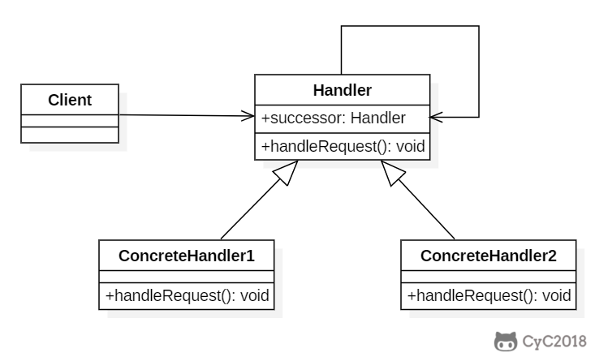
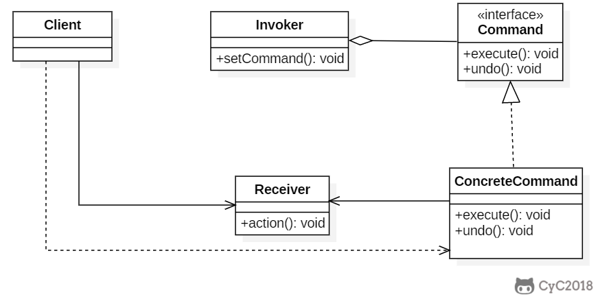
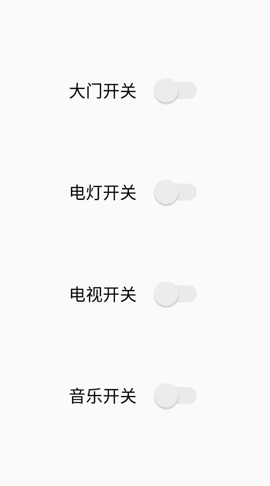
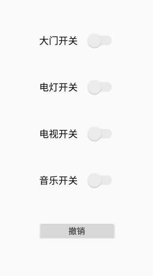

在设计模式系列文章专题中，我们已经将 5 种 **构建型模式** 和 7 种 **结构型模式** 介绍完毕。

从本篇开始我们将学习 **行为型模式**，行为型模式重点关注 **类与类之间的交互与协作**。如同在工作中，每个人的行为都可能影响到其他同事，同时每个人也会受到别人的影响。我们一边接收上级的指令，一边派发任务给下级，在这样的协作中完成一项项伟大的工作。程序在运行时，每个对象都不是孤立的，他们可以通过通信与协作完成种种复杂的功能。

行为型模式共 11 种，分别是：

- 责任链模式
- 命令模式
- 解释器模式
- 迭代器模式
- 中介者模式
- 备忘录模式
- 观察者模式
- 状态模式
- 策略模式
- 模板方法模式
- 访问者模式

本文将介绍行为型模式中的 **责任链模式** 和 **命令模式**。

## **一、责任链模式（Chain Of Responsibility）**

### Intent

使多个对象都有机会处理请求，从而避免请求的发送者和接收者之间的耦合关系。将这些对象连成一条链，并沿着这条链发送该请求，直到有一个对象处理它为止。

### Class Diagram

- Handler：定义处理请求的接口，并且实现后继链（successor）



### 正文：

我们每个人在工作中都承担着一定的责任，比如程序员承担着开发新功能、修改 bug 的责任，运营人员承担着宣传的责任、HR 承担着招聘新人的责任。我们每个人的责任与这个责任链有什么关系吗？

——答案是并没有太大关系。

（小朋友你是否有很多问号？？？）

咳咳，也不是完全没有关系，主要是因为每个人在不同岗位上的责任是分散的，分散的责任组合在一起更像是一张网，无法组成一条链。

同一个岗位上的责任，就可以组成一条链。举个切身的例子，比如：普通的程序员可以解决中等难度的 bug，优秀程序员可以解决困难的 bug，而菜鸟程序员只能解决简单的 bug。为了将其量化，我们用一个数字来表示 bug 的难度，(0, 20] 表示简单，(20,50] 表示中等， (50,100] 表示困难，我们来模拟一个 bug 解决的流程。

#### **“解决 bug” 程序 1.0**

新建一个 bug 类：

```java
public class Bug {
    // bug 的难度值
    int value;

    public Bug(int value) {
        this.value = value;
    }
}
```

新建一个程序员类：

```java
public class Programmer {
    // 程序员类型：菜鸟、普通、优秀
    public String type;

    public Programmer(String type) {
        this.type = type;
    }

    public void solve(Bug bug) {
        System.out.println(type + "程序员解决了一个难度为 " + bug.value + " 的 bug");
    }
}
```

客户端：

```java
import org.junit.Test;

public class Client {
    @Test
    public void test() {
        Programmer newbie = new Programmer("菜鸟");
        Programmer normal = new Programmer("普通");
        Programmer good = new Programmer("优秀");

        Bug easy = new Bug(20);
        Bug middle = new Bug(50);
        Bug hard = new Bug(100);

        // 依次尝试解决 bug
        handleBug(newbie, easy);
        handleBug(normal, easy);
        handleBug(good, easy);

        handleBug(newbie, middle);
        handleBug(normal, middle);
        handleBug(good, middle);

        handleBug(newbie, hard);
        handleBug(normal, hard);
        handleBug(good, hard);
    }

    public void handleBug(Programmer programmer, Bug bug) {
        if (programmer.type.equals("菜鸟") && bug.value > 0 && bug.value <= 20) {
            programmer.solve(bug);
        } else if (programmer.type.equals("普通") && bug.value > 20 && bug.value <= 50) {
            programmer.solve(bug);
        } else if (programmer.type.equals("优秀") && bug.value > 50 && bug.value <= 100) {
            programmer.solve(bug);
        }
    }
}
```

运行程序，输出如下：

```text
菜鸟程序员解决了一个难度为 20 的 bug
普通程序员解决了一个难度为 50 的 bug
优秀程序员解决了一个难度为 100 的 bug
```

功能完美实现了，但在这个程序中，我们让每个程序员都尝试处理了每一个 bug，相当于大家围着讨论每个 bug 该由谁解决，这无疑是非常低效的做法。那么我们要怎么才能优化呢？

#### **“解决 bug” 程序 2.0**

实际上，许多公司会选择让项目经理来分派任务，项目经理会根据 bug 的难度指派给不同的人解决。

引入 ProjectManager 类：

```java
public class ProjectManager {
    Programmer newbie = new Programmer("菜鸟");
    Programmer normal = new Programmer("普通");
    Programmer good = new Programmer("优秀");

    public void assignBug(Bug bug) {
        if (bug.value > 0 && bug.value <= 20) {
            System.out.println("项目经理将这个简单的 bug 分配给了菜鸟程序员");
            newbie.solve(bug);
        } else if (bug.value > 20 && bug.value <= 50) {
            System.out.println("项目经理将这个中等的 bug 分配给了普通程序员");
            normal.solve(bug);
        } else if (bug.value > 50 && bug.value <= 100) {
            System.out.println("项目经理将这个困难的 bug 分配给了优秀程序员");
            good.solve(bug);
        }
    }
}
```

我们让项目经理管理所有的程序员，并且根据 bug 的难度指派任务。这样一来，所有的 bug 只需传给项目经理分配即可，修改客户端如下：

```java
import org.junit.Test;

public class Client2 {
    @Test
    public void test() {
        ProjectManager manager = new ProjectManager();

        Bug easy = new Bug(20);
        Bug middle = new Bug(50);
        Bug hard = new Bug(100);

        manager.assignBug(easy);
        manager.assignBug(middle);
        manager.assignBug(hard);
    }
}
```

运行程序，输出如下：

```text
项目经理将这个简单的 bug 分配给了菜鸟程序员
菜鸟程序员解决了一个难度为 20 的 bug
项目经理将这个中等的 bug 分配给了普通程序员
普通程序员解决了一个难度为 50 的 bug
项目经理将这个困难的 bug 分配给了优秀程序员
优秀程序员解决了一个难度为 100 的 bug
```

看起来很美好，除了项目经理在骂骂咧咧地反驳这个方案。

在这个经过修改的程序中，项目经理一个人承担了分配所有 bug 这个体力活。程序没有变得简洁，只是把复杂的逻辑从客户端转移到了项目经理类中。

而且项目经理类承担了过多的职责，如果以后新增一类程序员，必须改动项目经理类，将其处理 bug 的职责插入分支判断语句中。

所以，我们需要更优的解决方案，那就是——


#### **“解决 bug” 程序 3.0**

> 责任链模式：使多个对象都有机会处理请求，从而避免请求的发送者和接收者之间的耦合关系。将这些对象连成一条链，并沿着这条链传递该请求，直到有一个对象处理它为止。

在本例的场景中，每个程序员的责任都是“解决这个 bug”，当测试提出一个 bug 时，可以走这样一条责任链：

- 先交由菜鸟程序员之手，如果是简单的 bug，菜鸟程序员自己处理掉。如果这个 bug 对于菜鸟程序员来说太难了，交给普通程序员
- 如果是中等难度的 bug，普通程序员处理掉。如果他也解决不了，交给优秀程序员
- 优秀程序员处理掉困难的 bug

有的读者会提出疑问，如果优秀程序员也无法处理这个 bug 呢？

——那当然是处理掉这个假冒优秀程序员。


修改客户端如下：

```java
import org.junit.Test;

public class Client3 {
    @Test
    public void test() throws Exception {
        Programmer newbie = new Programmer("菜鸟");
        Programmer normal = new Programmer("普通");
        Programmer good = new Programmer("优秀");

        Bug easy = new Bug(20);
        Bug middle = new Bug(50);
        Bug hard = new Bug(100);

        // 链式传递责任
        if (!handleBug(newbie, easy)) {
            if (!handleBug(normal, easy)) {
                if (!handleBug(good, easy)) {
                    throw new Exception("Kill the fake good programmer!");
                }
            }
        }

        if (!handleBug(newbie, middle)) {
            if (!handleBug(normal, middle)) {
                if (!handleBug(good, middle)) {
                    throw new Exception("Kill the fake good programmer!");
                }
            }
        }

        if (!handleBug(newbie, hard)) {
            if (!handleBug(normal, hard)) {
                if (!handleBug(good, hard)) {
                    throw new Exception("Kill the fake good programmer!");
                }
            }
        }
    }

    public boolean handleBug(Programmer programmer, Bug bug) {
        if (programmer.type.equals("菜鸟") && bug.value > 0 && bug.value <= 20) {
            programmer.solve(bug);
            return true;
        } else if (programmer.type.equals("普通") && bug.value > 20 && bug.value <= 50) {
            programmer.solve(bug);
            return true;
        } else if (programmer.type.equals("优秀") && bug.value > 50 && bug.value <= 100) {
            programmer.solve(bug);
            return true;
        }
        return false;
    }
}
```

首先我们将 handleBug 方法的签名改为了返回一个 boolean 值，如果此 bug 被处理了，返回 true；否则返回 false，使得责任沿着`菜鸟-> 普通 -> 优秀`这条链继续传递。

运行程序，输出如下：

```text
菜鸟程序员解决了一个难度为 20 的 bug
普通程序员解决了一个难度为 50 的 bug
优秀程序员解决了一个难度为 100 的 bug
```

熟悉责任链模式的同学应该可以看出，这个责任链模式和我们平时使用的不太一样。事实上，这段代码已经很好地体现了责任链模式的基本思想。我们平时使用的责任链模式只是在面向对象的基础上，将这段代码封装了一下，如 4.0 所示。

#### **“解决 bug” 程序 4.0**

新建一个程序员抽象类：

```java
public abstract class Programmer {
    protected Programmer next;

    public void setNext(Programmer next) {
        this.next = next;
    }

    abstract void handle(Bug bug);
}
```

在这个抽象类中：

- next 对象表示如果自己解决不了，需要将责任传递给的下一个人；
- handle 方法表示自己处理此 bug 的逻辑，在这里判断是自己解决或者继续传递。

新建菜鸟程序员类：

```java
public class NewbieProgrammer extends Programmer {

    @Override
    public void handle(Bug bug) {
        if (bug.value > 0 && bug.value <= 20) {
            solve(bug);
        } else if (next != null) {
            next.handle(bug);
        }
    }

    private void solve(Bug bug) {
        System.out.println("菜鸟程序员解决了一个难度为 " + bug.value + " 的 bug");
    }
}
```

新建普通程序员类：

```java
public class NormalProgrammer extends Programmer {

    @Override
    public void handle(Bug bug) {
        if (bug.value > 20 && bug.value <= 50) {
            solve(bug);
        } else if (next != null) {
            next.handle(bug);
        }
    }

    private void solve(Bug bug) {
        System.out.println("普通程序员解决了一个难度为 " + bug.value + " 的 bug");
    }
}
```

新建优秀程序员类：

```java
public class GoodProgrammer extends Programmer {

    @Override
    public void handle(Bug bug) {
        if (bug.value > 50 && bug.value <= 100) {
            solve(bug);
        } else if (next != null) {
            next.handle(bug);
        }
    }

    private void solve(Bug bug) {
        System.out.println("优秀程序员解决了一个难度为 " + bug.value + " 的 bug");
    }
}
```

客户端测试：

```java
import org.junit.Test;

public class Client4 {
    @Test
    public void test() {
        NewbieProgrammer newbie = new NewbieProgrammer();
        NormalProgrammer normal = new NormalProgrammer();
        GoodProgrammer good = new GoodProgrammer();

        Bug easy = new Bug(20);
        Bug middle = new Bug(50);
        Bug hard = new Bug(100);

        // 组成责任链
        newbie.setNext(normal);
        normal.setNext(good);

        // 从菜鸟程序员开始，沿着责任链传递
        newbie.handle(easy);
        newbie.handle(middle);
        newbie.handle(hard);
    }
}
```

在客户端中，我们通过 setNext() 方法将三个程序员组成了一条责任链，由菜鸟程序员接收所有的 bug，发现自己不能处理的 bug，就传递给普通程序员，普通程序员收到 bug 后，如果发现自己不能解决，则传递给优秀程序员。

责任链思想在生活中有很多应用，比如假期审批、加薪申请等，在员工提出申请后，从经理开始，由你的经理决定自己处理或是交由更上一层的经理处理。

再比如处理客户投诉时，从基层的客服人员开始，决定自己回应或是上报给领导，领导再判断是否继续上报。

理清了责任链模式，笔者突然回想起，公司的测试组每次提出 bug 后，总是先指派给我！一瞬间仿佛明白了什么了不得的道理，不禁流下了没技术的眼泪。

### JDK

- [java.util.logging.Logger#log()](http://docs.oracle.com/javase/8/docs/api/java/util/logging/Logger.html#log(java.util.logging.Level, java.lang.String))
- [Apache Commons Chain](https://commons.apache.org/proper/commons-chain/index.html)
- [javax.servlet.Filter#doFilter()](http://docs.oracle.com/javaee/7/api/javax/servlet/Filter.html#doFilter-javax.servlet.ServletRequest-javax.servlet.ServletResponse-javax.servlet.FilterChain-)

### **小结**

通过这个例子，我们已经了解到，责任链主要用于处理**职责相同，程度不同的类**。

其主要优点有：

- 降低了对象之间的耦合度。在责任链模式中，客户只需要将请求发送到责任链上即可，无须关心请求的处理细节和请求的传递过程，所以责任链将请求的发送者和请求的处理者解耦了。
- 扩展性强，满足开闭原则。可以根据需要增加新的请求处理类。
- 灵活性强。可以动态地改变链内的成员或者改变链的次序来适应流程的变化。
- 简化了对象之间的连接。每个对象只需保持一个指向其后继者的引用，不需保持其他所有处理者的引用，这避免了使用众多的条件判断语句。
- 责任分担。每个类只需要处理自己该处理的工作，不该处理的传递给下一个对象完成，明确各类的责任范围，符合类的单一职责原则。不再需要 “项目经理” 来处理所有的责任分配任务。

但我们在使用中也发现了它的一个明显缺点，如果这个 bug 没人处理，可能导致 “程序员祭天” 异常。其主要缺点有：

- 不能保证每个请求一定被处理，该请求可能一直传到链的末端都得不到处理。
- 如果责任链过长，请求的处理可能涉及多个处理对象，系统性能将受到一定影响。
- 责任链建立的合理性要靠客户端来保证，增加了客户端的复杂性，可能会由于责任链拼接次序错误而导致系统出错，比如可能出现循环调用。

## 二、**命令模式（Command）**

### Intent

将命令封装成对象中，具有以下作用：

- 使用命令来参数化其它对象
- 将命令放入队列中进行排队
- 将命令的操作记录到日志中
- 支持可撤销的操作

### Class Diagram

- Command：命令
- Receiver：命令接收者，也就是命令真正的执行者
- Invoker：通过它来调用命令
- Client：可以设置命令与命令的接收者



### 正文：

近年来，智能家居越来越流行。躺在家中，只需要打开对应的 app，就可以随手控制家电开关。但随之而来一个问题，手机里的 app 实在是太多了，每一个家具公司都想要提供一个 app 给用户，以求增加用户粘性，推广他们的其他产品等。

站在用户的角度来看，有时我们只想打开一下电灯，却要先看到恼人的 “新式电灯上新” 的弹窗通知，让人烦不胜烦。如果能有一个万能遥控器将所有的智能家居开关综合起来，统一控制，一定会方便许多。

说干就干，笔者立马打开 PS，设计了一张草图：



“咳咳，我对这个 app 的设计理念呢，是基于 “简洁就是美” 的原则。一个好的设计，首先，最重要的一点就是 '接地气'。当然，我也可以用一些华丽的素材拼接出一个花里胡哨的设计，但，那是一个最低级的设计师才会做的事情......”

我们先来看下四个智能家居类的结构，大门类：

```java
public class Door {
    public void openDoor() {
        System.out.println("门打开了");
    }

    public void closeDoor() {
        System.out.println("门关闭了");
    }
}
```

电灯类：

```java
public class Light {
    public void lightOn() {
        System.out.println("打开了电灯");
    }

    public void lightOff() {
        System.out.println("关闭了电灯");
    }
}
```

电视类：

```java
public class Tv {
    public void TurnOnTv() {
        System.out.println("电视打开了");
    }

    public void TurnOffTv() {
        System.out.println("电视关闭了");
    }
}
```

音乐类：

```java
public class Music {
    public void play() {
        System.out.println("开始播放音乐");
    }

    public void stop() {
        System.out.println("停止播放音乐");
    }
}
```

由于是不同公司的产品，所以接口有所不同，接下来就一起来实现我们的万能遥控器！

#### **万能遥控器 1.0**

不一会儿，我们就写出了下面的代码：

```java
// 初始化开关
Switch switchDoor = 省略绑定UI代码;
Switch switchLight = 省略绑定UI代码;
Switch switchTv = 省略绑定UI代码;
Switch switchMusic = 省略绑定UI代码;

// 初始化智能家居
Door door = new Door();
Light light = new Light();
Tv tv = new Tv();
Music music = new Music();

// 大门开关遥控
switchDoor.setOnCheckedChangeListener((view, isChecked) -> {
    if (isChecked) {
        door.openDoor();
    } else {
        door.closeDoor();
    }
});
// 电灯开关遥控
switchLight.setOnCheckedChangeListener((view, isChecked) -> {
    if (isChecked) {
        light.lightOn();
    } else {
        light.lightOff();
    }
});
// 电视开关遥控
switchTv.setOnCheckedChangeListener((view, isChecked) -> {
    if (isChecked) {
        tv.TurnOnTv();
    } else {
        tv.TurnOffTv();
    }
});
// 音乐开关遥控
switchMusic.setOnCheckedChangeListener((view, isChecked) -> {
    if (isChecked) {
        music.play();
    } else {
        music.stop();
    }
});
```

这份代码很直观，在每个开关状态改变时，调用对应家居的 API 实现打开或关闭。

只有这样的功能实在是太单一了，接下来我们再为它添加一个有趣的功能。

#### **万能遥控器 2.0**

一般来说，电视遥控器上都有一个回退按钮，用来回到上一个频道。相当于文本编辑器中的 “撤销” 功能，既然别的小朋友都有，那我们也要！

设计狮本狮马不停蹄地设计了 UI 2.0：



UI 设计倒是简单，底部添加一个按钮即可。代码设计就比较复杂了，我们需要保存上一步操作，并且将其回退。

初步的想法是设计一个枚举类 Operation，代表每一步的操作：

```java
public enum Operation {
    DOOR_OPEN,
    DOOR_CLOSE,
    LIGHT_ON,
    LIGHT_OFF,
    TV_TURN_ON,
    TV_TURN_OFF,
    MUSIC_PLAY,
    MUSIC_STOP
}
```

然后在客户端定义一个 Operation 变量 lastOperation，在每一步操作后，更新此变量。然后在撤销按钮的点击事件中，根据上一步的操作实现回退：

```java
public class Client {

    // 上一步的操作
    Operation lastOperation;
    
    @Test
    protected void test() {
        
        // 初始化开关和撤销按钮
        Switch switchDoor = 省略绑定UI代码;
        Switch switchLight = 省略绑定UI代码;
        Switch switchTv = 省略绑定UI代码;
        Switch switchMusic = 省略绑定UI代码;
        Button btnUndo = 省略绑定UI代码;

        // 初始化智能家居
        Door door = new Door();
        Light light = new Light();
        Tv tv = new Tv();
        Music music = new Music();

        // 大门开关遥控
        switchDoor.setOnCheckedChangeListener((view, isChecked) -> {
            if (isChecked) {
                lastOperation = Operation.DOOR_OPEN;
                door.openDoor();
            } else {
                lastOperation = Operation.DOOR_CLOSE;
                door.closeDoor();
            }
        });

        // 电灯开关遥控
        switchLight.setOnCheckedChangeListener((view, isChecked) -> {
            if (isChecked) {
                lastOperation = Operation.LIGHT_ON;
                light.lightOn();
            } else {
                lastOperation = Operation.LIGHT_OFF;
                light.lightOff();
            }
        });

        ... 电视、音乐类似

        btnUndo.setOnClickListener(view -> {
            if (lastOperation == null) return;
            // 撤销上一步
            switch (lastOperation) {
                case DOOR_OPEN:
                    door.closeDoor();
                    break;
                case DOOR_CLOSE:
                    door.openDoor();
                    break;
                case LIGHT_ON:
                    light.lightOff();
                    break;
                case LIGHT_OFF:
                    light.lightOn();
                    break;
                ... 电视、音乐类似
            }
        });
    }
}
```

大功告成，不过这份代码只实现了撤销一步，如果我们需要实现撤销多步怎么做呢？

思考一下，每次回退时，都是先将最后一步 Operation 撤销。对于这种后进先出的结构，我们自然就会想到栈结构，代码如下：

```java
public class Client {

    // 所有的操作
    Stack<Operation> operations = new Stack<>();

    @Test
    protected void test() {

        // 初始化开关和撤销按钮
        Switch switchDoor = 省略绑定UI代码;
        Switch switchLight = 省略绑定UI代码;
        Switch switchTv = 省略绑定UI代码;
        Switch switchMusic = 省略绑定UI代码;
        Button btnUndo = 省略绑定UI代码;

        // 初始化智能家居
        Door door = new Door();
        Light light = new Light();
        Tv tv = new Tv();
        Music music = new Music();

        // 大门开关遥控
        switchDoor.setOnCheckedChangeListener((view, isChecked) -> {
            if (isChecked) {
                operations.push(Operation.DOOR_OPEN);
                door.openDoor();
            } else {
                operations.push(Operation.DOOR_CLOSE);
                door.closeDoor();
            }
        });

        // 电灯开关遥控
        switchLight.setOnCheckedChangeListener((view, isChecked) -> {
            if (isChecked) {
                operations.push(Operation.LIGHT_ON);
                light.lightOn();
            } else {
                operations.push(Operation.LIGHT_OFF);
                light.lightOff();
            }
        });

        ...电视、音乐类似

        // 撤销按钮
        btnUndo.setOnClickListener(view -> {
            if (operations.isEmpty()) return;
            // 弹出栈顶的上一步操作
            Operation lastOperation = operations.pop();
            // 撤销上一步
            switch (lastOperation) {
                case DOOR_OPEN:
                    door.closeDoor();
                    break;
                case DOOR_CLOSE:
                    door.openDoor();
                    break;
                case LIGHT_ON:
                    light.lightOff();
                    break;
                case LIGHT_OFF:
                    light.lightOn();
                    break;
                ...电视、音乐类似
            }
        });
    }
}
```

我们将每一步 Operation 记录到栈中，每次撤销时，弹出栈顶的 Operation，再使用 switch 语句判断，将其恢复。

虽然实现了功能，但代码明显已经变得越来越臃肿了。遥控器知道了太多的细节，它必须要知道每个家居的调用方式。以后有开关加入时，不仅要修改 Status 类，增加新的 Operation，还要修改客户端，增加新的分支判断，导致这个类变成一个庞大的类。不仅违背了单一权责原则，还违背了开闭原则。

#### **万能遥控器 3.0**

我们期待能有一种设计，让遥控器不需要知道家居的接口。遥控器只需要负责监听用户按下开关，再根据开关状态发出正确的命令，对应的家居在收到命令后做出响应。就可以达到将 “行为请求者” 和 ”行为实现者“ 解耦的目的。

先定义一个命令接口：

```java
public interface ICommand {
    void execute();
}
```

接口中只有一个 execute 方法，表示 “执行” 命令。

定义开门命令，实现此接口：

```java
public class DoorOpenCommand implements ICommand {
    private Door door;

    public void setDoor(Door door) {
        this.door = door;
    }

    @Override
    public void execute() {
        door.openDoor();
    }
}
```

关门命令：

```java
public class DoorCloseCommand implements ICommand {
    private Door door;

    public void setDoor(Door door) {
        this.door = door;
    }


    @Override
    public void execute() {
        door.closeDoor();
    }
}
```

开灯命令：

```java
public class LightOnCommand implements ICommand {

    Light light;

    public void setLight(Light light) {
        this.light = light;
    }

    @Override
    public void execute() {
        light.lightOn();
    }
}
```

关灯命令：

```java
public class LightOffCommand implements ICommand {

    Light light;

    public void setLight(Light light) {
        this.light = light;
    }

    @Override
    public void execute() {
        light.lightOff();
    }
}
```

电视、音乐的命令类似。

可以看到，我们将家居控制的代码转移到了命令类中，当命令执行时，调用对应家具的 API 实现开启或关闭。

客户端代码：

```java
// 初始化命令
DoorOpenCommand doorOpenCommand = new DoorOpenCommand();
DoorCloseCommand doorCloseCommand = new DoorCloseCommand();
doorOpenCommand.setDoor(door);
doorCloseCommand.setDoor(door);
LightOnCommand lightOnCommand = new LightOnCommand();
LightOffCommand lightOffCommand = new LightOffCommand();
lightOnCommand.setLight(light);
lightOffCommand.setLight(light);
...电视、音乐类似

// 大门开关遥控
switchDoor.setOnCheckedChangeListener((view, isChecked) -> {
    if (isChecked) {
        doorOpenCommand.execute();
    } else {
        doorCloseCommand.execute();
    }
});
// 电灯开关遥控
switchLight.setOnCheckedChangeListener((view, isChecked) -> {
    if (isChecked) {
        lightOnCommand.execute();
    } else {
        lightOffCommand.execute();
    }
});
...电视、音乐类似
```

现在，遥控器只知道用户控制开关后，需要执行对应的命令，遥控器并不知道这个命令会执行什么内容，达到了隐藏技术细节的目的。

与此同时，我们还获得了一个附带的好处。由于每个命令都被抽象成了同一个接口，我们可以将开关代码统一起来。客户端优化如下：

```java
public class Client {

    @Test
    protected void test() {
        ...初始化

        // 大门开关遥控
        switchDoor.setOnCheckedChangeListener((view, isChecked) -> {
            handleCommand(isChecked, doorOpenCommand, doorCloseCommand);
        });
        // 电灯开关遥控
        switchLight.setOnCheckedChangeListener((view, isChecked) -> {
            handleCommand(isChecked, lightOnCommand, lightOffCommand);
        });
        // 电视开关遥控
        switchTv.setOnCheckedChangeListener((view, isChecked) -> {
            handleCommand(isChecked, turnOnTvCommand, turnOffTvCommand);
        });
        // 音乐开关遥控
        switchMusic.setOnCheckedChangeListener((view, isChecked) -> {
            handleCommand(isChecked, musicPlayCommand, musicStopCommand);
        });
    }

    private void handleCommand(boolean isChecked, ICommand openCommand, ICommand closeCommand) { 
        if (isChecked) {
            openCommand.execute();
        } else {
            closeCommand.execute();
        }
    }
}
```

不知不觉中，我们就写出了命令模式的代码。来看下命令模式的定义：

> 命令模式：将一个请求封装为一个对象，从而使你可用不同的请求对客户进行参数化，对请求排队或记录请求日志，以及支持可撤销的操作。

使用命令模式后，要实现撤销功能非常容易。

首先，在命令接口中，新增 undo 方法：

```java
public interface ICommand {
    
    void execute();

    void undo();
}
```

开门命令中新增 undo：

```java
public class DoorOpenCommand implements ICommand {
    private Door door;

    public void setDoor(Door door) {
        this.door = door;
    }

    @Override
    public void execute() {
        door.openDoor();
    }

    @Override
    public void undo() {
        door.closeDoor();
    }
}
```

关门命令中新增 undo：

```java
public class DoorCloseCommand implements ICommand {
    private Door door;

    public void setDoor(Door door) {
        this.door = door;
    }

    @Override
    public void execute() {
        door.closeDoor();
    }

    @Override
    public void undo() {
        door.openDoor();
    }
}
```

开灯命令中新增 undo：

```java
public class LightOnCommand implements ICommand {

    Light light;

    public void setLight(Light light) {
        this.light = light;
    }

    @Override
    public void execute() {
        light.lightOn();
    }

    @Override
    public void undo() {
        light.lightOff();
    }
}
```

关灯命令中新增 undo：

```java
public class LightOffCommand implements ICommand {

    Light light;

    public void setLight(Light light) {
        this.light = light;
    }

    @Override
    public void execute() {
        light.lightOff();
    }

    @Override
    public void undo() {
        light.lightOn();
    }
}
```

电视、音乐命令类似。

客户端：

```java
public class Client {

    // 所有的命令
    Stack<ICommand> commands = new Stack<>();

    @Test
    protected void test() {
        ...初始化

        // 大门开关遥控
        switchDoor.setOnCheckedChangeListener((view, isChecked) -> {
            handleCommand(isChecked, doorOpenCommand, doorCloseCommand);
        });
        // 电灯开关遥控
        switchLight.setOnCheckedChangeListener((view, isChecked) -> {
            handleCommand(isChecked, lightOnCommand, lightOffCommand);
        });
        // 电视开关遥控
        switchTv.setOnCheckedChangeListener((view, isChecked) -> {
            handleCommand(isChecked, turnOnTvCommand, turnOffTvCommand);
        });
        // 音乐开关遥控
        switchMusic.setOnCheckedChangeListener((view, isChecked) -> {
            handleCommand(isChecked, musicPlayCommand, musicStopCommand);
        });

        // 撤销按钮
        btnUndo.setOnClickListener(view -> {
            if (commands.isEmpty()) return;
            // 撤销上一个命令
            ICommand lastCommand = commands.pop();
            lastCommand.undo();
        });
    }

    private void handleCommand(boolean isChecked, ICommand openCommand, ICommand closeCommand) {
        if (isChecked) {
            commands.push(openCommand);
            openCommand.execute();
        } else {
            commands.push(closeCommand);
            closeCommand.execute();
        }
    }
}
```

我们同样使用了一个栈结构，用于存储所有的命令，在每次执行命令前，将命令压入栈中。撤销时，弹出栈顶的命令，执行其 undo 方法即可。

命令模式使得客户端的职责更加简洁、清晰了，命令执行、撤销的代码都被隐藏到了命令类中。唯一的缺点是多了很多的命令类，因为我们必须针对每一个命令都设计一个命令类，容易导致类爆炸。


#### **宏命令**

在我们学习宏命令前，先来了解一下宏。在使用 word 时，有时会弹出一个提示：是否启用宏？


在笔者小的时候（当然现在也没有很老），小小的眼睛里有大大的疑惑：这个 “宏” 是什么意思呢？简简单单一个字，却看起来如此的高大上，一定是一个很难的东西吧。

其实宏一点也不难，宏（英语：Macro）的意思是 “批量处理”，能够帮我们实现合并多个操作。

比如，在 word 中，我们需要设置一个文字加粗、斜体和字号 36。通常来说，我们需要三个步骤：

- 选中文字，设置加粗
- 选中文字，设置斜体
- 选中文字，设置字号 36

如果有一个设置，能一键实现这三个步骤，这个设置就称为一个宏。

如果我们有大量的文字需要这三个设置，定义一个宏就可以省下许多重复操作。

听起来是不是很像格式刷，不过宏远比格式刷要强大。比如宏可以实现将一段文字一键加上 `【】`，在 Excel 中的宏还可以一键实现 `居中` + `排序` 等操作。

比如笔者写的一个宏，效果是运行时给两个汉字自动加上中括号：


这个宏对应的 vba 代码长这样：

```text
Sub Macro1()
'
' Macro1 Macro
'
'
    Selection.TypeText Text:=ChrW(12304)
    Selection.MoveRight Unit:=wdCharacter, Count:=2
    Selection.TypeText Text:=ChrW(12305)
End Sub
```

当然 vba 代码只是秀一秀，不是重点。重点是了解了宏，就不难理解宏命令了。宏命令就是**将多个命令合并起来组成的命令**。

接下来我们给遥控器添加一个 “睡眠” 按钮，按下时可以一键关闭大门，关闭电灯，关闭电视、打开音乐（听着音乐睡觉，就是这么优雅）。UI...就不看了吧，这时就可以使用宏命令：

```java
public class MacroCommand implements ICommand {
    // 定义一组命令
    List<ICommand> commands;

    public MacroCommand(List<ICommand> commands) {
        this.commands = commands;
    }

    @Override
    public void execute() {
        // 宏命令执行时，每个命令依次执行
        for (int i = 0; i < commands.size(); i++) {
            commands.get(i).execute();
        }
    }

    @Override
    public void undo() {
        // 宏命令撤销时，每个命令依次撤销
        for (int i = 0; i < commands.size(); i++) {
            commands.get(i).undo();
        }
    }
}
```

客户端代码如下：

```java
// 定义睡眠宏命令
MacroCommand sleepCommand = new MacroCommand(Arrays.asList(doorCloseCommand, lightOffCommand, turnOffTvCommand, musicPlayCommand));
// 睡眠按钮
btnSleep.setOnClickListener(view -> {
    // 将执行的命令保存到栈中，以便撤销
    commands.push(sleepCommand);
    // 执行睡眠命令
    sleepCommand.execute();
});
```

有了宏命令，我们就可以任意组合多个命令，并且完全不会增加程序结构的复杂度。因为宏命令使用起来和普通的命令一模一样。

### JDK

- [java.lang.Runnable](http://docs.oracle.com/javase/8/docs/api/java/lang/Runnable.html)
- [Netflix Hystrix](https://github.com/Netflix/Hystrix/wiki)
- [javax.swing.Action](http://docs.oracle.com/javase/8/docs/api/javax/swing/Action.html)

### **小结**

前文的定义中讲到，命令模式还可以用于请求排队。要实现请求排队功能，只需创建一个命令队列，将每个需要执行的命令依次传入队列中，然后工作线程不断地从命令队列取出队列头的命令执行即可。

事实上，安卓 app 的界面就是这么实现的。源码中使用了一个阻塞式死循环 Looper，不断地从 MessageQueue 中取出消息，交给 Handler 处理，用户的每一个操作也会通过 Handler 传递到 MessageQueue 中排队执行。

命令模式可以说将封装发挥得淋漓尽致。在我们平时的程序设计中，最常用的封装是将拥有一类职责的对象封装成类，而命令对象的唯一职责就是通过 execute 去调用一个方法，也就是说它将 “方法调用” 这个步骤封装起来了，使得我们可以对 “方法调用” 进行排队、撤销等处理。

命令模式的主要优点如下：

- 降低系统的耦合度。将 “行为请求者” 和 ”行为实现者“ 解耦。
- 扩展性强。增加或删除命令非常方便，并且不会影响其他类。
- 封装 “方法调用”，方便实现 Undo 和 Redo 操作。
- 灵活性强，可以实现宏命令。

它的主要缺点是：

- 会产生大量命令类。增加了系统的复杂性。

本篇文章主要介绍了责任链模式和命令模式，笔者将在后面的章节中介绍剩下的几种行为型模式。有任何疑问或收获欢迎在评论区分享交流。