前面的设计模式主要内容都是知乎上力扣发的，还有几种行为型模式没有介绍，我这里暂时补充一下

## 三. 解释器（Interpreter）

### Intent

为语言创建解释器，通常由语言的语法和语法分析来定义。

### Class Diagram

- TerminalExpression：终结符表达式，每个终结符都需要一个 TerminalExpression。
- Context：上下文，包含解释器之外的一些全局信息。

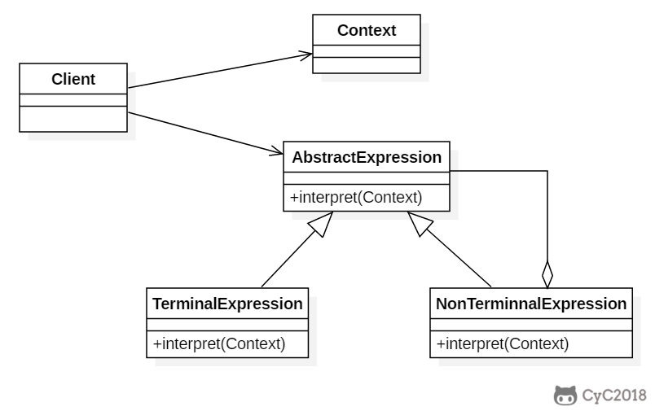


### Implementation

以下是一个规则检验器实现，具有 and 和 or 规则，通过规则可以构建一颗解析树，用来检验一个文本是否满足解析树定义的规则。

例如一颗解析树为 D And (A Or (B C))，文本 "D A" 满足该解析树定义的规则。

这里的 Context 指的是 String。

```java
public abstract class Expression {
    public abstract boolean interpret(String str);
}


public class TerminalExpression extends Expression {

    private String literal = null;

    public TerminalExpression(String str) {
        literal = str;
    }

    public boolean interpret(String str) {
        StringTokenizer st = new StringTokenizer(str);
        while (st.hasMoreTokens()) {
            String test = st.nextToken();
            if (test.equals(literal)) {
                return true;
            }
        }
        return false;
    }
}


public class AndExpression extends Expression {

    private Expression expression1 = null;
    private Expression expression2 = null;

    public AndExpression(Expression expression1, Expression expression2) {
        this.expression1 = expression1;
        this.expression2 = expression2;
    }

    public boolean interpret(String str) {
        return expression1.interpret(str) && expression2.interpret(str);
    }
}


public class OrExpression extends Expression {
    private Expression expression1 = null;
    private Expression expression2 = null;

    public OrExpression(Expression expression1, Expression expression2) {
        this.expression1 = expression1;
        this.expression2 = expression2;
    }

    public boolean interpret(String str) {
        return expression1.interpret(str) || expression2.interpret(str);
    }
}


public class Client {

    /**
     * 构建解析树
     */
    public static Expression buildInterpreterTree() {
        // Literal
        Expression terminal1 = new TerminalExpression("A");
        Expression terminal2 = new TerminalExpression("B");
        Expression terminal3 = new TerminalExpression("C");
        Expression terminal4 = new TerminalExpression("D");
        // B C
        Expression alternation1 = new OrExpression(terminal2, terminal3);
        // A Or (B C)
        Expression alternation2 = new OrExpression(terminal1, alternation1);
        // D And (A Or (B C))
        return new AndExpression(terminal4, alternation2);
    }

    public static void main(String[] args) {
        Expression define = buildInterpreterTree();
        String context1 = "D A";
        String context2 = "A B";
        System.out.println(define.interpret(context1));
        System.out.println(define.interpret(context2));
    }
}
true
false
```

### JDK

- [java.util.Pattern](http://docs.oracle.com/javase/8/docs/api/java/util/regex/Pattern.html)
- [java.text.Normalizer](http://docs.oracle.com/javase/8/docs/api/java/text/Normalizer.html)
- All subclasses of [java.text.Format](http://docs.oracle.com/javase/8/docs/api/java/text/Format.html)
- [javax.el.ELResolver](http://docs.oracle.com/javaee/7/api/javax/el/ELResolver.html)

## 四. 迭代器（Iterator）

### Intent

提供一种顺序访问聚合对象元素的方法，并且不暴露聚合对象的内部表示。

### Class Diagram

- Aggregate 是聚合类，其中 createIterator() 方法可以产生一个 Iterator；
- Iterator 主要定义了 hasNext() 和 next() 方法。
- Client 组合了 Aggregate，为了迭代遍历 Aggregate，也需要组合 Iterator。

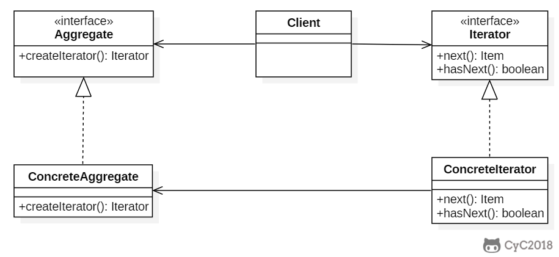


### Implementation

```java
public interface Aggregate {
    Iterator createIterator();
}


public class ConcreteAggregate implements Aggregate {

    private Integer[] items;

    public ConcreteAggregate() {
        items = new Integer[10];
        for (int i = 0; i < items.length; i++) {
            items[i] = i;
        }
    }

    @Override
    public Iterator createIterator() {
        return new ConcreteIterator<Integer>(items);
    }
}


public interface Iterator<Item> {

    Item next();

    boolean hasNext();
}


public class ConcreteIterator<Item> implements Iterator {

    private Item[] items;
    private int position = 0;

    public ConcreteIterator(Item[] items) {
        this.items = items;
    }

    @Override
    public Object next() {
        return items[position++];
    }

    @Override
    public boolean hasNext() {
        return position < items.length;
    }
}


public class Client {

    public static void main(String[] args) {
        Aggregate aggregate = new ConcreteAggregate();
        Iterator<Integer> iterator = aggregate.createIterator();
        while (iterator.hasNext()) {
            System.out.println(iterator.next());
        }
    }
}
```

### JDK

- [java.util.Iterator](http://docs.oracle.com/javase/8/docs/api/java/util/Iterator.html)
- [java.util.Enumeration](http://docs.oracle.com/javase/8/docs/api/java/util/Enumeration.html)

## 五. 中介者（Mediator）

### Intent

集中相关对象之间复杂的沟通和控制方式。

### Class Diagram

- Mediator：中介者，定义一个接口用于与各同事（Colleague）对象通信。
- Colleague：同事，相关对象

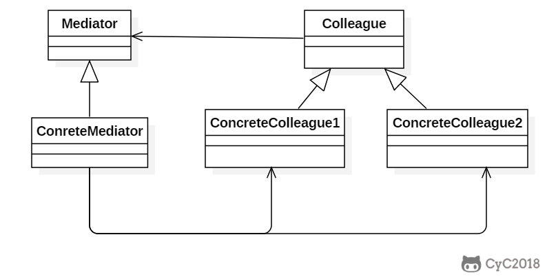

### Implementation

Alarm（闹钟）、CoffeePot（咖啡壶）、Calendar（日历）、Sprinkler（喷头）是一组相关的对象，在某个对象的事件产生时需要去操作其它对象，形成了下面这种依赖结构：

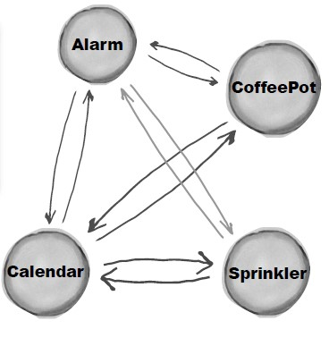


使用中介者模式可以将复杂的依赖结构变成星形结构：

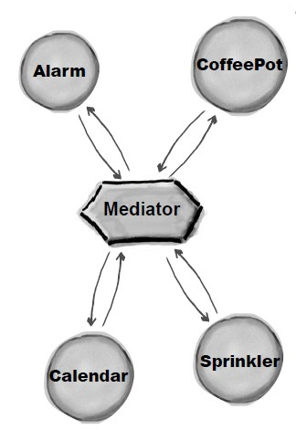


```java
public abstract class Colleague {
    public abstract void onEvent(Mediator mediator);
}


public class Alarm extends Colleague {

    @Override
    public void onEvent(Mediator mediator) {
        mediator.doEvent("alarm");
    }

    public void doAlarm() {
        System.out.println("doAlarm()");
    }
}


public class CoffeePot extends Colleague {
    @Override
    public void onEvent(Mediator mediator) {
        mediator.doEvent("coffeePot");
    }

    public void doCoffeePot() {
        System.out.println("doCoffeePot()");
    }
}


public class Calender extends Colleague {
    @Override
    public void onEvent(Mediator mediator) {
        mediator.doEvent("calender");
    }

    public void doCalender() {
        System.out.println("doCalender()");
    }
}


public class Sprinkler extends Colleague {
    @Override
    public void onEvent(Mediator mediator) {
        mediator.doEvent("sprinkler");
    }

    public void doSprinkler() {
        System.out.println("doSprinkler()");
    }
}


public abstract class Mediator {
    public abstract void doEvent(String eventType);
}


public class ConcreteMediator extends Mediator {
    private Alarm alarm;
    private CoffeePot coffeePot;
    private Calender calender;
    private Sprinkler sprinkler;

    public ConcreteMediator(Alarm alarm, CoffeePot coffeePot, Calender calender, Sprinkler sprinkler) {
        this.alarm = alarm;
        this.coffeePot = coffeePot;
        this.calender = calender;
        this.sprinkler = sprinkler;
    }

    @Override
    public void doEvent(String eventType) {
        switch (eventType) {
            case "alarm":
                doAlarmEvent();
                break;
            case "coffeePot":
                doCoffeePotEvent();
                break;
            case "calender":
                doCalenderEvent();
                break;
            default:
                doSprinklerEvent();
        }
    }

    public void doAlarmEvent() {
        alarm.doAlarm();
        coffeePot.doCoffeePot();
        calender.doCalender();
        sprinkler.doSprinkler();
    }

    public void doCoffeePotEvent() {
        // ...
    }

    public void doCalenderEvent() {
        // ...
    }

    public void doSprinklerEvent() {
        // ...
    }
}


public class Client {
    public static void main(String[] args) {
        Alarm alarm = new Alarm();
        CoffeePot coffeePot = new CoffeePot();
        Calender calender = new Calender();
        Sprinkler sprinkler = new Sprinkler();
        Mediator mediator = new ConcreteMediator(alarm, coffeePot, calender, sprinkler);
        // 闹钟事件到达，调用中介者就可以操作相关对象
        alarm.onEvent(mediator);
    }
}
doAlarm()
doCoffeePot()
doCalender()
doSprinkler()
```

### JDK

- All scheduleXXX() methods of [java.util.Timer](http://docs.oracle.com/javase/8/docs/api/java/util/Timer.html)
- [java.util.concurrent.Executor#execute()](http://docs.oracle.com/javase/8/docs/api/java/util/concurrent/Executor.html#execute-java.lang.Runnable-)
- submit() and invokeXXX() methods of [java.util.concurrent.ExecutorService](http://docs.oracle.com/javase/8/docs/api/java/util/concurrent/ExecutorService.html)
- scheduleXXX() methods of [java.util.concurrent.ScheduledExecutorService](http://docs.oracle.com/javase/8/docs/api/java/util/concurrent/ScheduledExecutorService.html)
- [java.lang.reflect.Method#invoke()](http://docs.oracle.com/javase/8/docs/api/java/lang/reflect/Method.html#invoke-java.lang.Object-java.lang.Object...-)

## 六. 备忘录（Memento）

### Intent

在不违反封装的情况下获得对象的内部状态，从而在需要时可以将对象恢复到最初状态。

### Class Diagram

- Originator：原始对象
- Caretaker：负责保存好备忘录
- Menento：备忘录，存储原始对象的的状态。备忘录实际上有两个接口，一个是提供给 Caretaker 的窄接口：它只能将备忘录传递给其它对象；一个是提供给 Originator 的宽接口，允许它访问到先前状态所需的所有数据。理想情况是只允许 Originator 访问本备忘录的内部状态。

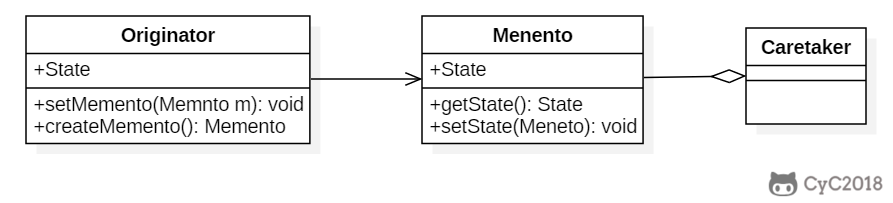


### Implementation

以下实现了一个简单计算器程序，可以输入两个值，然后计算这两个值的和。备忘录模式允许将这两个值存储起来，然后在某个时刻用存储的状态进行恢复。

实现参考：[Memento Pattern - Calculator Example - Java Sourcecode](https://www.oodesign.com/memento-pattern-calculator-example-java-sourcecode.html)

```java
/**
 * Originator Interface
 */
public interface Calculator {

    // Create Memento
    PreviousCalculationToCareTaker backupLastCalculation();

    // setMemento
    void restorePreviousCalculation(PreviousCalculationToCareTaker memento);

    int getCalculationResult();

    void setFirstNumber(int firstNumber);

    void setSecondNumber(int secondNumber);
}


/**
 * Originator Implementation
 */
public class CalculatorImp implements Calculator {

    private int firstNumber;
    private int secondNumber;

    @Override
    public PreviousCalculationToCareTaker backupLastCalculation() {
        // create a memento object used for restoring two numbers
        return new PreviousCalculationImp(firstNumber, secondNumber);
    }

    @Override
    public void restorePreviousCalculation(PreviousCalculationToCareTaker memento) {
        this.firstNumber = ((PreviousCalculationToOriginator) memento).getFirstNumber();
        this.secondNumber = ((PreviousCalculationToOriginator) memento).getSecondNumber();
    }

    @Override
    public int getCalculationResult() {
        // result is adding two numbers
        return firstNumber + secondNumber;
    }

    @Override
    public void setFirstNumber(int firstNumber) {
        this.firstNumber = firstNumber;
    }

    @Override
    public void setSecondNumber(int secondNumber) {
        this.secondNumber = secondNumber;
    }
}


/**
 * Memento Interface to Originator
 *
 * This interface allows the originator to restore its state
 */
public interface PreviousCalculationToOriginator {
    int getFirstNumber();
    int getSecondNumber();
}


/**
 *  Memento interface to CalculatorOperator (Caretaker)
 */
public interface PreviousCalculationToCareTaker {
    // no operations permitted for the caretaker
}


/**
 * Memento Object Implementation
 * <p>
 * Note that this object implements both interfaces to Originator and CareTaker
 */
public class PreviousCalculationImp implements PreviousCalculationToCareTaker,
        PreviousCalculationToOriginator {

    private int firstNumber;
    private int secondNumber;

    public PreviousCalculationImp(int firstNumber, int secondNumber) {
        this.firstNumber = firstNumber;
        this.secondNumber = secondNumber;
    }

    @Override
    public int getFirstNumber() {
        return firstNumber;
    }

    @Override
    public int getSecondNumber() {
        return secondNumber;
    }
}


/**
 * CareTaker object
 */
public class Client {

    public static void main(String[] args) {
        // program starts
        Calculator calculator = new CalculatorImp();

        // assume user enters two numbers
        calculator.setFirstNumber(10);
        calculator.setSecondNumber(100);

        // find result
        System.out.println(calculator.getCalculationResult());

        // Store result of this calculation in case of error
        PreviousCalculationToCareTaker memento = calculator.backupLastCalculation();

        // user enters a number
        calculator.setFirstNumber(17);

        // user enters a wrong second number and calculates result
        calculator.setSecondNumber(-290);

        // calculate result
        System.out.println(calculator.getCalculationResult());

        // user hits CTRL + Z to undo last operation and see last result
        calculator.restorePreviousCalculation(memento);

        // result restored
        System.out.println(calculator.getCalculationResult());
    }
}
110
-273
110
```

### JDK

- java.io.Serializable

## 七. 观察者（Observer）

### Intent

定义对象之间的一对多依赖，当一个对象状态改变时，它的所有依赖都会收到通知并且自动更新状态。

主题（Subject）是被观察的对象，而其所有依赖者（Observer）称为观察者。

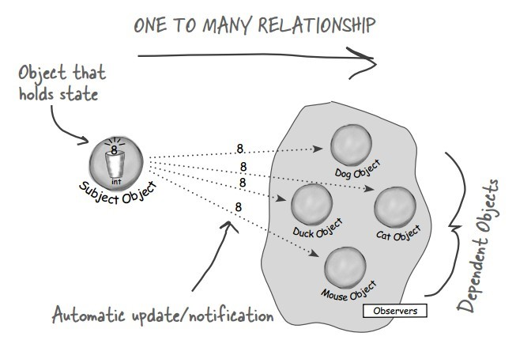


### Class Diagram

主题（Subject）具有注册和移除观察者、并通知所有观察者的功能，主题是通过维护一张观察者列表来实现这些操作的。

观察者（Observer）的注册功能需要调用主题的 registerObserver() 方法。

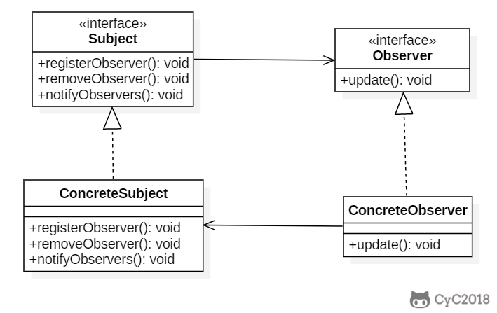

### Implementation

天气数据布告板会在天气信息发生改变时更新其内容，布告板有多个，并且在将来会继续增加。

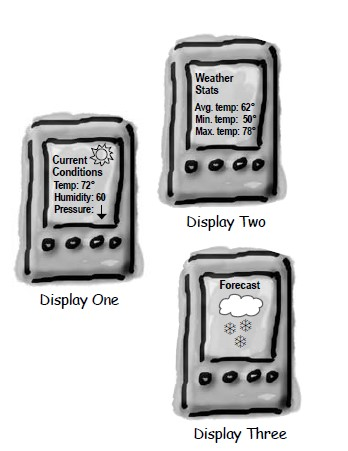


```java
public interface Subject {
    void registerObserver(Observer o);

    void removeObserver(Observer o);

    void notifyObserver();
}


public class WeatherData implements Subject {
    private List<Observer> observers;
    private float temperature;
    private float humidity;
    private float pressure;

    public WeatherData() {
        observers = new ArrayList<>();
    }

    public void setMeasurements(float temperature, float humidity, float pressure) {
        this.temperature = temperature;
        this.humidity = humidity;
        this.pressure = pressure;
        notifyObserver();
    }

    @Override
    public void registerObserver(Observer o) {
        observers.add(o);
    }

    @Override
    public void removeObserver(Observer o) {
        int i = observers.indexOf(o);
        if (i >= 0) {
            observers.remove(i);
        }
    }

    @Override
    public void notifyObserver() {
        for (Observer o : observers) {
            o.update(temperature, humidity, pressure);
        }
    }
}


public interface Observer {
    void update(float temp, float humidity, float pressure);
}


public class StatisticsDisplay implements Observer {

    public StatisticsDisplay(Subject weatherData) {
        weatherData.reisterObserver(this);
    }

    @Override
    public void update(float temp, float humidity, float pressure) {
        System.out.println("StatisticsDisplay.update: " + temp + " " + humidity + " " + pressure);
    }
}


public class CurrentConditionsDisplay implements Observer {

    public CurrentConditionsDisplay(Subject weatherData) {
        weatherData.registerObserver(this);
    }

    @Override
    public void update(float temp, float humidity, float pressure) {
        System.out.println("CurrentConditionsDisplay.update: " + temp + " " + humidity + " " + pressure);
    }
}


public class WeatherStation {
    public static void main(String[] args) {
        WeatherData weatherData = new WeatherData();
        CurrentConditionsDisplay currentConditionsDisplay = new CurrentConditionsDisplay(weatherData);
        StatisticsDisplay statisticsDisplay = new StatisticsDisplay(weatherData);

        weatherData.setMeasurements(0, 0, 0);
        weatherData.setMeasurements(1, 1, 1);
    }
}
CurrentConditionsDisplay.update: 0.0 0.0 0.0
StatisticsDisplay.update: 0.0 0.0 0.0
CurrentConditionsDisplay.update: 1.0 1.0 1.0
StatisticsDisplay.update: 1.0 1.0 1.0
```

### JDK

- [java.util.Observer](http://docs.oracle.com/javase/8/docs/api/java/util/Observer.html)
- [java.util.EventListener](http://docs.oracle.com/javase/8/docs/api/java/util/EventListener.html)
- [javax.servlet.http.HttpSessionBindingListener](http://docs.oracle.com/javaee/7/api/javax/servlet/http/HttpSessionBindingListener.html)
- [RxJava](https://github.com/ReactiveX/RxJava)

## 八. 状态（State）

### Intent

允许对象在内部状态改变时改变它的行为，对象看起来好像修改了它所属的类。

### Class Diagram

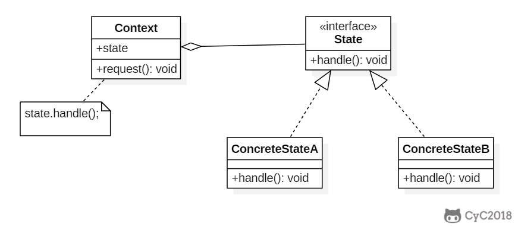


### Implementation

糖果销售机有多种状态，每种状态下销售机有不同的行为，状态可以发生转移，使得销售机的行为也发生改变。

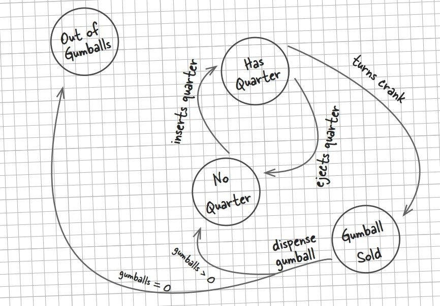

```java
public interface State {
    /**
     * 投入 25 分钱
     */
    void insertQuarter();

    /**
     * 退回 25 分钱
     */
    void ejectQuarter();

    /**
     * 转动曲柄
     */
    void turnCrank();

    /**
     * 发放糖果
     */
    void dispense();
}


public class HasQuarterState implements State {

    private GumballMachine gumballMachine;

    public HasQuarterState(GumballMachine gumballMachine) {
        this.gumballMachine = gumballMachine;
    }

    @Override
    public void insertQuarter() {
        System.out.println("You can't insert another quarter");
    }

    @Override
    public void ejectQuarter() {
        System.out.println("Quarter returned");
        gumballMachine.setState(gumballMachine.getNoQuarterState());
    }

    @Override
    public void turnCrank() {
        System.out.println("You turned...");
        gumballMachine.setState(gumballMachine.getSoldState());
    }

    @Override
    public void dispense() {
        System.out.println("No gumball dispensed");
    }
}


public class NoQuarterState implements State {

    GumballMachine gumballMachine;

    public NoQuarterState(GumballMachine gumballMachine) {
        this.gumballMachine = gumballMachine;
    }

    @Override
    public void insertQuarter() {
        System.out.println("You insert a quarter");
        gumballMachine.setState(gumballMachine.getHasQuarterState());
    }

    @Override
    public void ejectQuarter() {
        System.out.println("You haven't insert a quarter");
    }

    @Override
    public void turnCrank() {
        System.out.println("You turned, but there's no quarter");
    }

    @Override
    public void dispense() {
        System.out.println("You need to pay first");
    }
}


public class SoldOutState implements State {

    GumballMachine gumballMachine;

    public SoldOutState(GumballMachine gumballMachine) {
        this.gumballMachine = gumballMachine;
    }

    @Override
    public void insertQuarter() {
        System.out.println("You can't insert a quarter, the machine is sold out");
    }

    @Override
    public void ejectQuarter() {
        System.out.println("You can't eject, you haven't inserted a quarter yet");
    }

    @Override
    public void turnCrank() {
        System.out.println("You turned, but there are no gumballs");
    }

    @Override
    public void dispense() {
        System.out.println("No gumball dispensed");
    }
}


public class SoldState implements State {

    GumballMachine gumballMachine;

    public SoldState(GumballMachine gumballMachine) {
        this.gumballMachine = gumballMachine;
    }

    @Override
    public void insertQuarter() {
        System.out.println("Please wait, we're already giving you a gumball");
    }

    @Override
    public void ejectQuarter() {
        System.out.println("Sorry, you already turned the crank");
    }

    @Override
    public void turnCrank() {
        System.out.println("Turning twice doesn't get you another gumball!");
    }

    @Override
    public void dispense() {
        gumballMachine.releaseBall();
        if (gumballMachine.getCount() > 0) {
            gumballMachine.setState(gumballMachine.getNoQuarterState());
        } else {
            System.out.println("Oops, out of gumballs");
            gumballMachine.setState(gumballMachine.getSoldOutState());
        }
    }
}


public class GumballMachine {

    private State soldOutState;
    private State noQuarterState;
    private State hasQuarterState;
    private State soldState;

    private State state;
    private int count = 0;

    public GumballMachine(int numberGumballs) {
        count = numberGumballs;
        soldOutState = new SoldOutState(this);
        noQuarterState = new NoQuarterState(this);
        hasQuarterState = new HasQuarterState(this);
        soldState = new SoldState(this);

        if (numberGumballs > 0) {
            state = noQuarterState;
        } else {
            state = soldOutState;
        }
    }

    public void insertQuarter() {
        state.insertQuarter();
    }

    public void ejectQuarter() {
        state.ejectQuarter();
    }

    public void turnCrank() {
        state.turnCrank();
        state.dispense();
    }

    public void setState(State state) {
        this.state = state;
    }

    public void releaseBall() {
        System.out.println("A gumball comes rolling out the slot...");
        if (count != 0) {
            count -= 1;
        }
    }

    public State getSoldOutState() {
        return soldOutState;
    }

    public State getNoQuarterState() {
        return noQuarterState;
    }

    public State getHasQuarterState() {
        return hasQuarterState;
    }

    public State getSoldState() {
        return soldState;
    }

    public int getCount() {
        return count;
    }
}


public class Client {

    public static void main(String[] args) {
        GumballMachine gumballMachine = new GumballMachine(5);

        gumballMachine.insertQuarter();
        gumballMachine.turnCrank();

        gumballMachine.insertQuarter();
        gumballMachine.ejectQuarter();
        gumballMachine.turnCrank();

        gumballMachine.insertQuarter();
        gumballMachine.turnCrank();
        gumballMachine.insertQuarter();
        gumballMachine.turnCrank();
        gumballMachine.ejectQuarter();

        gumballMachine.insertQuarter();
        gumballMachine.insertQuarter();
        gumballMachine.turnCrank();
        gumballMachine.insertQuarter();
        gumballMachine.turnCrank();
        gumballMachine.insertQuarter();
        gumballMachine.turnCrank();
    }
}
You insert a quarter
You turned...
A gumball comes rolling out the slot...
You insert a quarter
Quarter returned
You turned, but there's no quarter
You need to pay first
You insert a quarter
You turned...
A gumball comes rolling out the slot...
You insert a quarter
You turned...
A gumball comes rolling out the slot...
You haven't insert a quarter
You insert a quarter
You can't insert another quarter
You turned...
A gumball comes rolling out the slot...
You insert a quarter
You turned...
A gumball comes rolling out the slot...
Oops, out of gumballs
You can't insert a quarter, the machine is sold out
You turned, but there are no gumballs
No gumball dispensed
```

## 九. 策略（Strategy）

### Intent

定义一系列算法，封装每个算法，并使它们可以互换。

策略模式可以让算法独立于使用它的客户端。

### Class Diagram

- Strategy 接口定义了一个算法族，它们都实现了 behavior() 方法。
- Context 是使用到该算法族的类，其中的 doSomething() 方法会调用 behavior()，setStrategy(Strategy) 方法可以动态地改变 strategy 对象，也就是说能动态地改变 Context 所使用的算法。

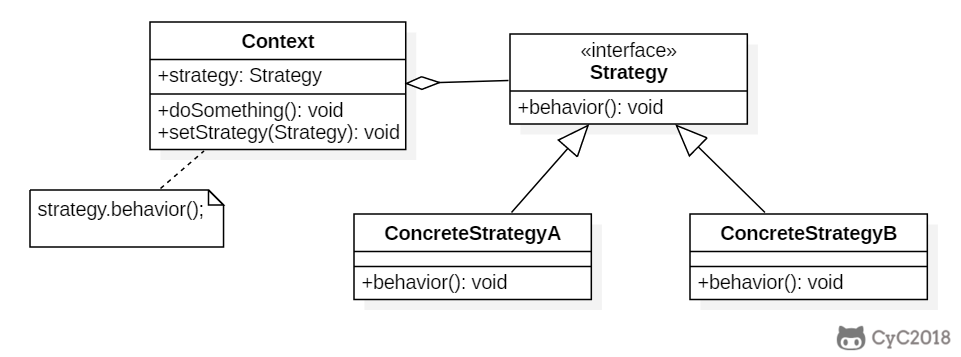


### 与状态模式的比较

状态模式的类图和策略模式类似，并且都是能够动态改变对象的行为。但是状态模式是通过状态转移来改变 Context 所组合的 State 对象，而策略模式是通过 Context 本身的决策来改变组合的 Strategy 对象。所谓的状态转移，是指 Context 在运行过程中由于一些条件发生改变而使得 State 对象发生改变，注意必须要是在运行过程中。

状态模式主要是用来解决状态转移的问题，当状态发生转移了，那么 Context 对象就会改变它的行为；而策略模式主要是用来封装一组可以互相替代的算法族，并且可以根据需要动态地去替换 Context 使用的算法。

### Implementation

设计一个鸭子，它可以动态地改变叫声。这里的算法族是鸭子的叫声行为。

```java
public interface QuackBehavior {
    void quack();
}


public class Quack implements QuackBehavior {
    @Override
    public void quack() {
        System.out.println("quack!");
    }
}


public class Squeak implements QuackBehavior{
    @Override
    public void quack() {
        System.out.println("squeak!");
    }
}


public class Duck {

    private QuackBehavior quackBehavior;

    public void performQuack() {
        if (quackBehavior != null) {
            quackBehavior.quack();
        }
    }

    public void setQuackBehavior(QuackBehavior quackBehavior) {
        this.quackBehavior = quackBehavior;
    }
}


public class Client {

    public static void main(String[] args) {
        Duck duck = new Duck();
        duck.setQuackBehavior(new Squeak());
        duck.performQuack();
        duck.setQuackBehavior(new Quack());
        duck.performQuack();
    }
}
squeak!
quack!
```

### JDK

- java.util.Comparator#compare()
- javax.servlet.http.HttpServlet
- javax.servlet.Filter#doFilter()

## 十. 模板方法（Template Method）

### Intent

定义算法框架，并将一些步骤的实现延迟到子类。

通过模板方法，子类可以重新定义算法的某些步骤，而不用改变算法的结构。

### Class Diagram

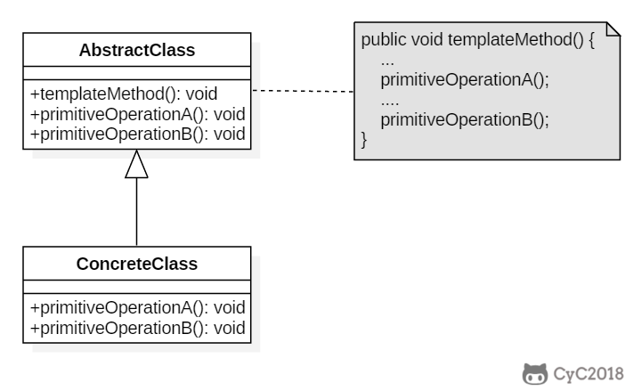


### Implementation

冲咖啡和冲茶都有类似的流程，但是某些步骤会有点不一样，要求复用那些相同步骤的代码。


```java
public abstract class CaffeineBeverage {

    final void prepareRecipe() {
        boilWater();
        brew();
        pourInCup();
        addCondiments();
    }

    abstract void brew();

    abstract void addCondiments();

    void boilWater() {
        System.out.println("boilWater");
    }

    void pourInCup() {
        System.out.println("pourInCup");
    }
}


public class Coffee extends CaffeineBeverage {
    @Override
    void brew() {
        System.out.println("Coffee.brew");
    }

    @Override
    void addCondiments() {
        System.out.println("Coffee.addCondiments");
    }
}


public class Tea extends CaffeineBeverage {
    @Override
    void brew() {
        System.out.println("Tea.brew");
    }

    @Override
    void addCondiments() {
        System.out.println("Tea.addCondiments");
    }
}


public class Client {
    public static void main(String[] args) {
        CaffeineBeverage caffeineBeverage = new Coffee();
        caffeineBeverage.prepareRecipe();
        System.out.println("-----------");
        caffeineBeverage = new Tea();
        caffeineBeverage.prepareRecipe();
    }
}
boilWater
Coffee.brew
pourInCup
Coffee.addCondiments
-----------
boilWater
Tea.brew
pourInCup
Tea.addCondiments
```

### JDK

- java.util.Collections#sort()
- java.io.InputStream#skip()
- java.io.InputStream#read()
- java.util.AbstractList#indexOf()

## 十一. 访问者（Visitor）

### Intent

为一个对象结构（比如组合结构）增加新能力。

### Class Diagram

- Visitor：访问者，为每一个 ConcreteElement 声明一个 visit 操作
- ConcreteVisitor：具体访问者，存储遍历过程中的累计结果
- ObjectStructure：对象结构，可以是组合结构，或者是一个集合。

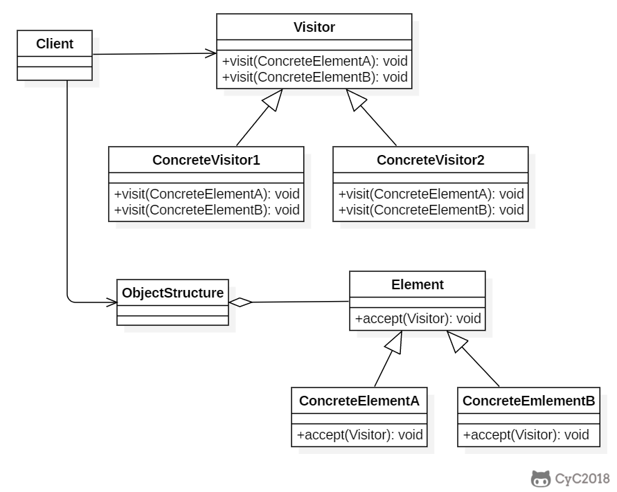


### Implementation

```java
public interface Element {
    void accept(Visitor visitor);
}


class CustomerGroup {

    private List<Customer> customers = new ArrayList<>();

    void accept(Visitor visitor) {
        for (Customer customer : customers) {
            customer.accept(visitor);
        }
    }

    void addCustomer(Customer customer) {
        customers.add(customer);
    }
}


public class Customer implements Element {

    private String name;
    private List<Order> orders = new ArrayList<>();

    Customer(String name) {
        this.name = name;
    }

    String getName() {
        return name;
    }

    void addOrder(Order order) {
        orders.add(order);
    }

    public void accept(Visitor visitor) {
        visitor.visit(this);
        for (Order order : orders) {
            order.accept(visitor);
        }
    }
}


public class Order implements Element {

    private String name;
    private List<Item> items = new ArrayList();

    Order(String name) {
        this.name = name;
    }

    Order(String name, String itemName) {
        this.name = name;
        this.addItem(new Item(itemName));
    }

    String getName() {
        return name;
    }

    void addItem(Item item) {
        items.add(item);
    }

    public void accept(Visitor visitor) {
        visitor.visit(this);

        for (Item item : items) {
            item.accept(visitor);
        }
    }
}


public class Item implements Element {

    private String name;

    Item(String name) {
        this.name = name;
    }

    String getName() {
        return name;
    }

    public void accept(Visitor visitor) {
        visitor.visit(this);
    }
}


public interface Visitor {
    void visit(Customer customer);

    void visit(Order order);

    void visit(Item item);
}


public class GeneralReport implements Visitor {

    private int customersNo;
    private int ordersNo;
    private int itemsNo;

    public void visit(Customer customer) {
        System.out.println(customer.getName());
        customersNo++;
    }

    public void visit(Order order) {
        System.out.println(order.getName());
        ordersNo++;
    }

    public void visit(Item item) {
        System.out.println(item.getName());
        itemsNo++;
    }

    public void displayResults() {
        System.out.println("Number of customers: " + customersNo);
        System.out.println("Number of orders:    " + ordersNo);
        System.out.println("Number of items:     " + itemsNo);
    }
}


public class Client {
    public static void main(String[] args) {
        Customer customer1 = new Customer("customer1");
        customer1.addOrder(new Order("order1", "item1"));
        customer1.addOrder(new Order("order2", "item1"));
        customer1.addOrder(new Order("order3", "item1"));

        Order order = new Order("order_a");
        order.addItem(new Item("item_a1"));
        order.addItem(new Item("item_a2"));
        order.addItem(new Item("item_a3"));
        Customer customer2 = new Customer("customer2");
        customer2.addOrder(order);

        CustomerGroup customers = new CustomerGroup();
        customers.addCustomer(customer1);
        customers.addCustomer(customer2);

        GeneralReport visitor = new GeneralReport();
        customers.accept(visitor);
        visitor.displayResults();
    }
}
customer1
order1
item1
order2
item1
order3
item1
customer2
order_a
item_a1
item_a2
item_a3
Number of customers: 2
Number of orders:    4
Number of items:     6
```

### JDK

- javax.lang.model.element.Element and javax.lang.model.element.ElementVisitor
- javax.lang.model.type.TypeMirror and javax.lang.model.type.TypeVisitor

## 十二. 空对象（Null）

### Intent

使用什么都不做的空对象来代替 NULL。

一个方法返回 NULL，意味着方法的调用端需要去检查返回值是否是 NULL，这么做会导致非常多的冗余的检查代码。并且如果某一个调用端忘记了做这个检查返回值，而直接使用返回的对象，那么就有可能抛出空指针异常。

### Class Diagram

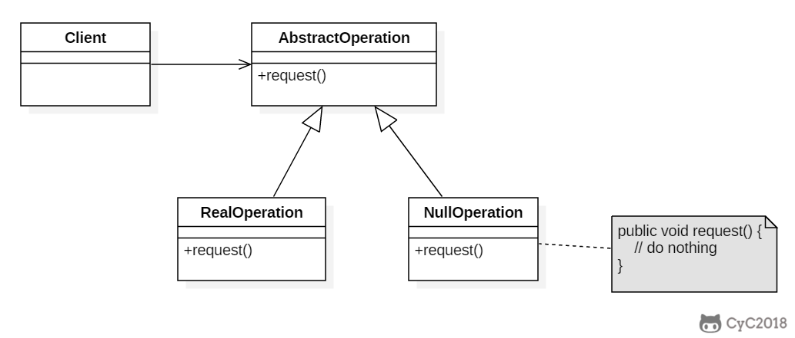


### Implementation

```java
public abstract class AbstractOperation {
    abstract void request();
}


public class RealOperation extends AbstractOperation {
    @Override
    void request() {
        System.out.println("do something");
    }
}


public class NullOperation extends AbstractOperation{
    @Override
    void request() {
        // do nothing
    }
}


public class Client {
    public static void main(String[] args) {
        AbstractOperation abstractOperation = func(-1);
        abstractOperation.request();
    }

    public static AbstractOperation func(int para) {
        if (para < 0) {
            return new NullOperation();
        }
        return new RealOperation();
    }
}
```

