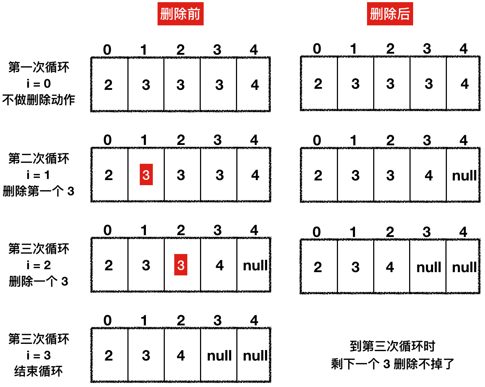

## 引导语

List 作为工作中最常见的集合类型，在面试过程中，也是经常会被问到各种各样的面试题，一般来说，只要你看过源码，心中对 List 的总体结构和细节有所了解的话，基本问题都不大。

## 1 面试题

### 1.1 说说你自己对 ArrayList 的理解？

很多面试官喜欢这样子开头，考察面试同学对 ArrayList 有没有总结经验，介于 ArrayList 内容很多，建议先回答总体架构，再从某个细节出发作为突破口，比如这样：
ArrayList 底层数据结构是个数组，其 API 都做了一层对数组底层访问的封装，比如说 add 方法的过程是……（这里可以引用我们在 ArrayList 源码解析中 add 的过程）。

一般面试官看你回答得井井有条，并且没啥漏洞的话，基本就不会深究了，这样面试的主动权就掌握在自己手里面了，如果你回答得支支吾吾，那么面试官可能就会开启自己面试的套路了。

说说你自己对 LinkedList 的理解也是同样套路。

### 1.2 扩容类问题

#### 1.2.1 ArrayList 无参数构造器构造，现在 add 一个值进去，此时数组的大小是多少，下一次扩容前最大可用大小是多少？

答：此处数组的大小是 1，下一次扩容前最大可用大小是 10，因为 ArrayList 第一次扩容时，是有默认值的，默认值是 10，在第一次 add 一个值进去时，数组的可用大小被扩容到 10 了。

#### 1.2.2 如果我连续往 list 里面新增值，增加到第 11 个的时候，数组的大小是多少？

答：这里的考查点就是扩容的公式，当增加到 11 的时候，此时我们希望数组的大小为 11，但实际上数组的最大容量只有 10，不够了就需要扩容，扩容的公式是：oldCapacity + (oldCapacity>> 1)，oldCapacity 表示数组现有大小，目前场景计算公式是：10 + 10 ／2 = 15，然后我们发现 15 已经够用了，所以数组的大小会被扩容到 15。

#### 1.2.3 数组初始化，被加入一个值后，如果我使用 addAll 方法，一下子加入 15 个值，那么最终数组的大小是多少？

答：第一题中我们已经计算出来数组在加入一个值后，实际大小是 1，最大可用大小是 10 ，现在需要一下子加入 15 个值，那我们期望数组的大小值就是 16，此时数组最大可用大小只有 10，明显不够，需要扩容，扩容后的大小是：10 + 10 ／2 = 15，这时候发现扩容后的大小仍然不到我们期望的值 16，这时候源码中有一种策略如下：

```java
// newCapacity 本次扩容的大小，minCapacity 我们期望的数组最小大小
// 如果扩容后的值 < 我们的期望值，我们的期望值就等于本次扩容的大小
if (newCapacity - minCapacity < 0)
    newCapacity = minCapacity;
```

所以最终数组扩容后的大小为 16。

#### 1.2.4 现在我有一个很大的数组需要拷贝，原数组大小是 5k，请问如何快速拷贝？

答：因为原数组比较大，如果新建新数组的时候，不指定数组大小的话，就会频繁扩容，频繁扩容就会有大量拷贝的工作，造成拷贝的性能低下，所以回答说新建数组时，指定新数组的大小为 5k 即可。

#### 1.2.5 为什么说扩容会消耗性能？

答：扩容底层使用的是 System.arraycopy 方法，会把原数组的数据全部拷贝到新数组上，所以性能消耗比较严重。

#### 1.2.6 源码扩容过程有什么值得借鉴的地方？

答：有两点：

- 是扩容的思想值得学习，通过自动扩容的方式，让使用者不用关心底层数据结构的变化，封装得很好，1.5 倍的扩容速度，可以让扩容速度在前期缓慢上升，在后期增速较快，大部分工作中要求数组的值并不是很大，所以前期增长缓慢有利于节省资源，在后期增速较快时，也可快速扩容。
- 扩容过程中，有数组大小溢出的意识，比如要求扩容后的数组大小，不能小于 0，不能大于 Integer 的最大值。

这两点在我们平时设计和写代码时都可以借鉴。

### 2 删除类问题

#### 2.1 有一个 ArrayList，数据是 2、3、3、3、4，中间有三个 3，现在我通过 for (int i=0;i<list.size ();i++) 的方式，想把值是 3 的元素删除，请问可以删除干净么？最终删除的结果是什么，为什么？删除代码如下：

```java
List<String> list = new ArrayList<String>() {{
    add("2");
    add("3");
    add("3");
    add("3");
    add("4");
}};
for (int i = 0; i < list.size(); i++) {
    if (list.get(i).equals("3")) {
        list.remove(i);
    }
}
```

答：不能删除干净，最终删除的结果是 2、3、4，有一个 3 删除不掉，原因我们看下图：
从图中我们可以看到，每次删除一个元素后，该元素后面的元素就会往前移动，而此时循环的 i 在不断地增长，最终会使每次删除 3 的后一个 3 被遗漏，导致删除不掉。

#### 2.2 还是上面的 ArrayList 数组，我们通过增强 for 循环进行删除，可以么？

答：不可以，会报错。因为增强 for 循环过程其实调用的就是迭代器的 next () 方法，当你调用 list#remove () 方法进行删除时，modCount 的值会 +1，而这时候迭代器中的 expectedModCount 的值却没有变，导致在迭代器下次执行 next () 方法时，expectedModCount !=  modCount 就会报 ConcurrentModificationException 的错误。

#### 2.3 还是上面的数组，如果删除时使用 Iterator.remove () 方法可以删除么，为什么？

答：可以的，因为 Iterator.remove () 方法在执行的过程中，会把最新的 modCount 赋值给 expectedModCount，这样在下次循环过程中，modCount 和 expectedModCount 两者就会相等。

#### 2.4 以上三个问题对于 LinkedList 也是同样的结果么？

答：是的，虽然 LinkedList 底层结构是双向链表，但对于上述三个问题，结果和 ArrayList 是一致的。

### 3 对比类问题

#### 3.1 ArrayList 和 LinkedList 有何不同？

答：可以先从底层数据结构开始说起，然后以某一个方法为突破口深入，比如：最大的不同是两者底层的数据结构不同，ArrayList 底层是数组，LinkedList 底层是双向链表，两者的数据结构不同也导致了操作的 API 实现有所差异，拿新增实现来说，ArrayList 会先计算并决定是否扩容，然后把新增的数据直接赋值到数组上，而 LinkedList 仅仅只需要改变插入节点和其前后节点的指向位置关系即可。

#### 3.2 ArrayList 和 LinkedList 应用场景有何不同

答：ArrayList 更适合于快速的查找匹配，不适合频繁新增删除，像工作中经常会对元素进行匹配查询的场景比较合适，LinkedList 更适合于经常新增和删除，对查询反而很少的场景。

#### 3.3 ArrayList 和 LinkedList 两者有没有最大容量

答：ArrayList 有最大容量的，为 Integer 的最大值，大于这个值 JVM 是不会为数组分配内存空间的，LinkedList 底层是双向链表，理论上可以无限大。但源码中，LinkedList 实际大小用的是 int 类型，这也说明了 LinkedList 不能超过 Integer 的最大值，不然会溢出。

#### 3.4 ArrayList 和 LinkedList 是如何对 null 值进行处理的

答：ArrayList 允许 null 值新增，也允许 null 值删除。删除 null 值时，是从头开始，找到第一值是 null 的元素删除；LinkedList 新增删除时对 null 值没有特殊校验，是允许新增和删除的。

#### 3.5 ArrayList 和 LinedList 是线程安全的么，为什么？

答：当两者作为非共享变量时，比如说仅仅是在方法里面的局部变量时，是没有线程安全问题的，只有当两者是共享变量时，才会有线程安全问题。主要的问题点在于多线程环境下，所有线程任何时刻都可对数组和链表进行操作，这会导致值被覆盖，甚至混乱的情况。

如果有线程安全问题，在迭代的过程中，会频繁报 ConcurrentModificationException 的错误，意思是在我当前循环的过程中，数组或链表的结构被其它线程修改了。

#### 3.6 如何解决线程安全问题？

Java 源码中推荐使用 Collections#synchronizedList 进行解决，Collections#synchronizedList 的返回值是 List 的每个方法都加了 synchronized 锁，保证了在同一时刻，数组和链表只会被一个线程所修改，或者采用 CopyOnWriteArrayList 并发 List 来解决，这个类我们后面会说。

### 4 其它类型题目

#### 4.1 你能描述下双向链表么？

答：如果和面试官面对面沟通的话，你可以去画一下，可以把 《LinkedList 源码解析》中的 LinkedList 的结构画出来，如果是电话面试，可以这么描述：双向链表中双向的意思是说前后节点之间互相有引用，链表的节点我们称为 Node。Node 有三个属性组成：其前一个节点，本身节点的值，其下一个节点，假设 A、B 节点相邻，A 节点的下一个节点就是 B，B 节点的上一个节点就是 A，两者互相引用，在链表的头部节点，我们称为头节点。头节点的前一个节点是 null，尾部称为尾节点，尾节点的后一个节点是 null，如果链表数据为空的话，头尾节点是同一个节点，本身是 null，指向前后节点的值也是 null。

#### 4.2 描述下双向链表的新增和删除

答：如果是面对面沟通，最好可以直接画图，如果是电话面试，可以这么描述：

新增：我们可以选择从链表头新增，也可以选择从链表尾新增，如果是从链表尾新增的话，直接把当前节点追加到尾节点之后，本身节点自动变为尾节点。

删除：把删除节点的后一个节点的 prev 指向其前一个节点，把删除节点的前一个节点的 next 指向其后一个节点，最后把删除的节点置为 null 即可。

## 总结

List 在工作中经常遇到，熟读源码不仅仅是为了应对面试，也为了在工作中使用起来得心应手，如果想更深入了解 List，可以看一遍 ArrayList  源码之后，自己重新实现一个 List。这样的话，就会对 List 底层的数据结构和操作细节理解更深。