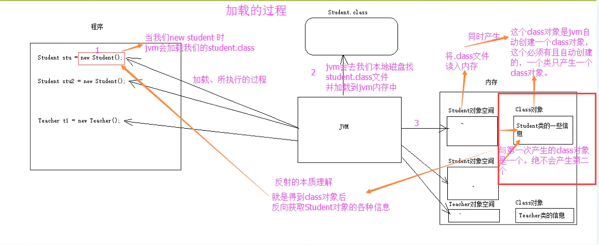

要想理解反射的原理，首先要了解什么是类型信息。Java让我们在运行时识别对象和类的信息，主要有两种方式：

一种是传统的RTTI（Run-Time Type Identification)，它假定我们在编译时已经知道了所有的类型信息；

另一种是反射机制，它允许我们在运行时发现和使用类的信息。

使用的前提条件：必须先得到代表的字节码的[Class](https://www.jianshu.com/p/b3728c26f29b)，Class类用于表示.class文件（字节码）

## 一、反射的概述

JAVA反射机制是在运行状态中，对于任意一个类，都能够知道这个类的所有属性和方法；对于任意一个对象，都能够调用它的任意一个方法和属性；这种动态获取的信息以及动态调用对象的方法的功能称为Java语言的反射机制。
 要想解剖一个类，必须先要获取到该类的字节码文件对象。而解剖使用的就是Class类中的方法。所以先要获取到每一个字节码文件对应的Class类型的对象.。

反射就是把Java类中的各种成分映射成一个个的Java对象。
 例如：
 一个类有：成员变量、方法、构造方法、包等等信息，利用反射技术可以对一个类进行解剖，把各个组成部分映射成一个个对象。
 （其实：一个类中这些成员方法、构造方法，在加入类中都有一个类来描述）
 如图是类的正常加载过程：反射的原理在于class对象。


熟悉一下加载的时候：Class对象的由来是将class文件读入内存，并为之创建一个Class对象。



类的正常加载过程

## 二、反射的理解

反射之中包含了一个「反」字，所以想要解释反射就必须先从「正」开始解释。

一般情况下，我们使用某个类时必定知道它是什么类，是用来做什么的。于是我们直接对这个类进行实例化，之后使用这个类对象进行操作。
 如：

```java
Phone phone = new Phone(); //直接初始化，「正射」
phone.setPrice(4);
```

上面这样子进行类对象的初始化，我们可以理解为「正」。

而反射则是一开始并不知道我要初始化的类对象是什么，自然也无法使用 new 关键字来创建对象了。

这时候，我们使用 JDK 提供的反射 API 进行反射调用：

```java
Class clz = Class.forName("com.xxp.reflect.Phone");
Method method = clz.getMethod("setPrice", int.class);
Constructor constructor = clz.getConstructor();
Object object = constructor.newInstance();
method.invoke(object, 4);
```

上面两段代码的执行结果，其实是完全一样的。但是其思路完全不一样，第一段代码在未运行时就已经确定了要运行的类（Phone），而第二段代码则是在运行时通过字符串值才得知要运行的类（com.xxp.reflect.Phone）。

**所以说什么是反射？反射就是在运行时才知道要操作的类是什么，并且可以在运行时获取类的完整构造，并调用对应的方法。**

一个简单的例子：
 上面提到的示例程序，其完整的程序代码如下：

```java
public class Phone {
    private int price;
    public int getPrice() {
        return price;
    }
    public void setPrice(int price) {
        this.price = price;
    }

    public static void main(String[] args) throws Exception{
        //正常的调用
        Phone phone = new Phone();
        phone.setPrice(5000);
        System.out.println("Phone Price:" + phone.getPrice());
        //使用反射调用
        Class clz = Class.forName("com.xxp.api.Phone");
        Method setPriceMethod = clz.getMethod("setPrice", int.class);
        Constructor phoneConstructor = clz.getConstructor();
        Object phoneObj = phoneConstructor.newInstance();
        setPriceMethod.invoke(phoneObj, 6000);
        Method getPriceMethod = clz.getMethod("getPrice");
        System.out.println("Phone Price:" + getPriceMethod.invoke(phoneObj));
    }
}
```

从代码中可以看到我们使用反射调用了 setPrice 方法，并传递了 6000 的值。之后使用反射调用了 getPrice 方法，输出其价格。上面的代码整个的输出结果是：

Phone Price:5000
 Phone Price:6000
 从这个简单的例子可以看出，一般情况下我们使用反射获取一个对象的步骤：

```java
//获取类的 Class 对象实例
Class clz = Class.forName("com.xxp.api.Phone");
//根据 Class 对象实例获取 Constructor 对象
Constructor phoneConstructor = clz.getConstructor();
//使用 Constructor 对象的 newInstance 方法获取反射类对象
Object phoneObj = phoneConstructor.newInstance();
```

而如果要调用某一个方法，则需要经过下面的步骤：

```java
//获取方法的 Method 对象
Method setPriceMethod = clz.getMethod("setPrice", int.class);
//利用 invoke 方法调用方法
setPriceMethod.invoke(phoneObj, 6000);
```

到这里，我们已经能够掌握反射的基本使用。但如果要进一步掌握反射，还需要对反射的常用 API 有更深入的理解。

## 三、反射的常用API

在 JDK 中，反射相关的 API 可以分为下面几个方面：获取反射的 Class 对象、通过反射创建类对象、通过反射获取类属性方法及构造器。

反射常用API：

 **获取反射中的Class对象**
 在反射中，要获取一个类或调用一个类的方法，我们首先需要获取到该类的 Class 对象。
 在 Java API 中，获取 Class 类对象有三种方法：

1. 使用 Class.forName 静态方法。当知道某类的全路径名时，可以使用此方法获取 Class 类对象。用的最多，但可能抛出 ClassNotFoundException 异常。
    
    ```java
    Class c1 = Class.forName(“java.lang.String”);
    ```
    
2. 直接通过 类名.class 的方式得到，该方法最为安全可靠，程序性能更高。这说明任何一个类都有一个隐含的静态成员变量 class。这种方法只适合在编译前就知道操作的 Class。
    
    ```java
    Class c2 = String.class;
    ```
    
3. 通过对象调用 getClass() 方法来获取，通常应用在：比如你传过来一个 Object类型的对象，而我不知道你具体是什么类，用这种方法。

    ```java
    String str = new String("Hello");
    Class c3 = str.getClass();
    ```

需要注意的是：一个类在 JVM 中只会有一个 Class 实例，即我们对上面获取的 c1、c2和c3进行 equals 比较，发现都是true。

**通过反射创建类对象**
 通过反射创建类对象主要有两种方式：通过 Class 对象的 newInstance() 方法、通过 Constructor 对象的 newInstance() 方法。

1. 通过 Class 对象的 newInstance() 方法。
    
    ```java
    Class clz = Phone.class;
    Phone phone = (Phone)clz.newInstance();
    ```
    
2. 通过 Constructor 对象的 newInstance() 方法

    ```java
    Class clz = Phone.class;
    Constructor constructor = clz.getConstructor();
    Phone phone= (Phone)constructor.newInstance();
    ```

    

通过 Constructor 对象创建类对象可以选择特定构造方法，而通过 Class 对象则只能使用默认的无参数构造方法。下面的代码就调用了一个有参数的构造方法进行了类对象的初始化。

```java
Class clz = Phone.class;
Constructor constructor = clz.getConstructor(String.class, int.class);
Phone phone = (Phone)constructor.newInstance("华为",6666);
```

**通过反射获取类属性、方法、构造器**
 我们通过 Class 对象的 getFields() 方法可以获取 Class 类的属性，但无法获取私有属性。

```java
Class clz = Phone.class;
Field[] fields = clz.getFields();
for (Field field : fields) {
    System.out.println(field.getName());
}

//输出结果是：
 price
```


 而如果使用 Class 对象的 getDeclaredFields() 方法则可以获取包括私有属性在内的所有属性：

```java
Class clz = Phone.class;
Field[] fields = clz.getDeclaredFields();
for (Field field : fields) {
    System.out.println(field.getName());
}

//输出结果是：
 name
 price
```


 与获取类属性一样，当我们去获取类方法、类构造器时，如果要获取私有方法或私有构造器，则必须使用有 declared 关键字的方法。

附：查阅 API 可以看到 Class 有很多方法：

> 　getName()：获得类的完整名字。
>  　getFields()：获得类的public类型的属性。
>  　getDeclaredFields()：获得类的所有属性。包括private 声明的和继承类
>  　getMethods()：获得类的public类型的方法。
>  　getDeclaredMethods()：获得类的所有方法。包括private 声明的和继承类
>  　getMethod(String name, Class[] parameterTypes)：获得类的特定方法，name参数指定方法的名字，parameterTypes 参数指定方法的参数类型。
>  　getConstructors()：获得类的public类型的构造方法。
>  　getConstructor(Class[] parameterTypes)：获得类的特定构造方法，parameterTypes 参数指定构造方法的参数类型。
>  　newInstance()：通过类的不带参数的构造方法创建这个类的一个对象。

## 四、反射源码解析

当我们懂得了如何使用反射后，今天我们就来看看 JDK 源码中是如何实现反射的。或许大家平时没有使用过反射，但是在开发 Web 项目的时候会遇到过下面的异常：

```java
java.lang.NullPointerException 
...
sun.reflect.DelegatingMethodAccessorImpl.invoke(DelegatingMethodAccessorImpl.java:43)
  at java.lang.reflect.Method.invoke(Method.java:369)
```

可以看到异常堆栈指出了异常在 Method 的第 369 的 invoke 方法中，其实这里指的 invoke 方法就是我们反射调用方法中的 invoke。

```java
Method method = clz.getMethod("setPrice", int.class); 
method.invoke(object, 6);   //就是这里的invoke方法
```

例如我们经常使用的 Spring 配置中，经常会有相关 Bean 的配置：

```java
<bean class="com.xxp.Phone">
</bean>
```

当我们在 XML 文件中配置了上面这段配置之后，Spring 便会在启动的时候利用反射去加载对应的 Phone类。而当 Apple 类不存在或发生启发异常时，异常堆栈便会将异常指向调用的 invoke 方法。

从这里可以看出，我们平常很多框架都使用了反射，而反射中最重要的就是 Method 类的 invoke 方法了。

## 五、反射总结

我们知道反射机制允许程序在运行时取得任何一个已知名称的class的内部信息，包括包括其modifiers(修饰符)，fields(属性)，methods(方法)等，并可于运行时改变fields内容或调用methods。那么我们便可以更灵活的编写代码，代码可以在运行时装配，无需在组件之间进行源代码链接，降低代码的耦合度；还有动态代理的实现；JDBC原生代码注册驱动；hibernate 的实体类；Spring的AOP等等。但是凡事都有两面性，反射使用不当会造成很高的资源消耗！

## 六、new对象和反射得到对象的区别

1. 在使用反射的时候，必须确保这个类已经加载并已经连接了。使用new的时候，这个类可以没有被加载，也可以已经被加载。
2. new关键字可以调用任何public构造方法，而反射只能调用无参构造方法。
3. new关键字是强类型的，效率相对较高。 反射是弱类型的，效率低。
4. 反射提供了一种更加灵活的方式创建对象，得到对象的信息。如Spring 中[AOP](https://www.jianshu.com/p/0ce892b5ae5e)等的使用，动态代理的使用，都是基于反射的。解耦。


作者：小逼崽子你是否有很多问号
链接：https://www.jianshu.com/p/1fc45c89e76b
来源：简书
著作权归作者所有。商业转载请联系作者获得授权，非商业转载请注明出处。