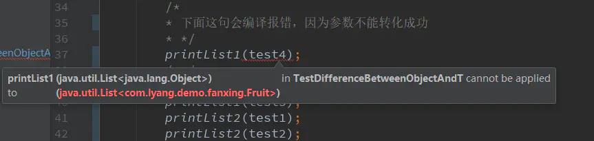

## 1. 先解释下泛型概念

> 泛型是Java SE 1.5的新特性，泛型的本质是参数化类型，也就是说所操作的数据类型被指定为一个参数。这种参数类型可以用在类、接口和方法的创建中，分别称为[泛型类](https://link.jianshu.com?t=http%3A%2F%2Fbaike.baidu.com%2Fview%2F2104244.htm)、泛型接口、泛型方法。[Java语言](https://link.jianshu.com?t=http%3A%2F%2Fbaike.baidu.com%2Fview%2F229611.htm)引入泛型的好处是安全简单。
>  在Java SE 1.5之前，没有泛型的[情况](https://link.jianshu.com?t=http%3A%2F%2Fbaike.baidu.com%2Fview%2F780206.htm)的下，通过对类型Object的引用来实现参数的“任意化”，“任意化”带来的缺点是要做显式的[强制类型转换](https://link.jianshu.com?t=http%3A%2F%2Fbaike.baidu.com%2Fview%2F2886403.htm)，而这种转换是要求开发者对[实际参数](https://link.jianshu.com?t=http%3A%2F%2Fbaike.baidu.com%2Fview%2F2245196.htm)类型可以预知的情况下进行的。对于强制类型转换错误的情况，[编译器](https://link.jianshu.com?t=http%3A%2F%2Fbaike.baidu.com%2Fview%2F487018.htm)可能不提示错误，在运行的时候才出现异常，这是一个安全隐患。
>  泛型的好处是在编译的时候检查[类型安全](https://link.jianshu.com?t=http%3A%2F%2Fbaike.baidu.com%2Fview%2F1965709.htm)，并且所有的[强制转换](https://link.jianshu.com?t=http%3A%2F%2Fbaike.baidu.com%2Fview%2F965170.htm)都是自动和[隐式](https://link.jianshu.com?t=http%3A%2F%2Fbaike.baidu.com%2Fview%2F2852863.htm)的，以提高代码的重用率。

以上内容摘自百度百科

举个栗子:
 Box类定义为一个泛型类


```java
public class Box<T> {
    private T object;

    public void set(T object) { this.object = object; }
    public T get() { return object; }
}
```

创建一个Box对象，不带泛型参数，发现获取对象的时候需要强制转换


```java
Box box2 = new Box();
box2.set(new Apple());
Apple apple = (Apple) box2.get();
```

创建一个Box对象，带泛型参数，获取对象的时候就不需要强制转换


```java
Box<Apple> box = new Box<Apple>();
box.set(new Apple());
Apple apple = box.get();
```

总结下泛型的好处就是
 **省去了强制转换，可以在编译时候检查类型安全，可以用在类，方法，接口上**

但是我们定义泛型类，泛型方法，泛型接口的时候经常会碰见很多不同的通配符T，E，K，V等等，这些通配符又都是什么意思呢？继续往下看

## 2. 下来说说泛型通配符T，E，K，V区别

这些全都属于java泛型的通配符，刚开始我看到这么多通配符，一下晕了，这几个其实**没什么区别**，只不过是一个约定好的代码，也就是说

> **使用大写字母A,B,C,D......X,Y,Z定义的，就都是泛型，把T换成A也一样，这里T只是名字上的意义而已**
>
> -  **？** 表示不确定的java类型
> -  **T (type)** 表示具体的一个java类型
> -  **K V (key value)** 分别代表java键值中的Key Value
> -  **E (element)** 代表Element

举个栗子：


```java
public class Test<T> {    
  public List<T> list = new ArrayList<T>();   
  public static void main(String[] args) {
        Test<String> test = new Test<String>();
        test.list.add("hello");
        System.out.println(test.list);
    }}
```

和


```java
public class Test<A> {    
  public List<A> list = new ArrayList<A>();   
  public static void main(String[] args) {
        Test<String> test = new Test<String>();
        test.list.add("hello");
        System.out.println(test.list);
    }}
```

将T换成了A，在执行效果上是没有任何区别的，只不过我们约定好了T代表type，所以还是**按照约定规范来比较好**，增加了代码的可读性。

如果要定义**多个**泛型参数，比如说两个泛型参数
 很典型的一个栗子是Map的key,value泛型，我们也可以定义一个这样的


```java
public interface Mymap<K, V> {
    public K getKey();
    public V getValue();
}

public class MymapImpl<K, V> implements Mymap<K, V> {

    private K key;
    private V value;

    public MymapImpl(K key, V value) {
    this.key = key;
    this.value = value;
    }

    public K getKey()   { return key; }
    public V getValue() { return value; }
}
```

下来就可以传入任意类型，创建实例了，不用转化类型


```dart
Mymap<String, Integer> mp1= new MymapImpl<String, Integer>("Even", 8);
Mymap<String, String>  mp2= new MymapImpl<String, String>("hello", "world");
Mymap<Integer, Integer> mp3= new MymapImpl<Integer, Integer>(888, 888);
```

如果要定义**超过两个，三个或三个以上**的泛型参数可以使用**T1, T2, ..., Tn**，像这样子


```java
public class Test<T1,T2,T3> {
   public void print(T1 t1,T2 t2,T3 t3){
        System.out.println(t1.getClass());
        System.out.println(t2.getClass());
        System.out.println(t3.getClass());
    }
}
```

## 3. 接下来说说List<T>，List<Object>，List<?>区别

接下来说说List<T>，List<Object>，List<?>区别

**ArrayList al=new ArrayList<T>();**  指定集合元素只能是T类型

**ArrayList al=new ArrayList();**  集合元素可以是任意类型，这种没有意义，一般是方法中，只是为了说明用法


**ArrayList al=new ArrayList();**
 泛型的限定：
 **? extends E**:接收E类型或者E的子类型。
 **? super E**:接收E类型或者E的父类型

- Object和T不同点在于，Object是一个实打实的类,并没有泛指谁，而T可以泛指Object，比方**public void printList(List list){}**方法中可以传入**List list**类型参数，也可以传入**List list**类型参数，但是**public void printList(List list){}**就只可以传入**List list**类型参数，因为Object类型并没有泛指谁，是一个确定的类型
- ?和T区别是？是一个不确定类，？和T都表示不确定的类型 ，但如果是T的话，函数里面可以对T进行操作，比方 T car = getCar()，而不能用？ car = getCar()。

下面举个栗子比较下这三种：


```java
package com.lyang.demo.fanxing;

import java.util.Arrays;
import java.util.List;

/**
 * 测试泛型参数Object和T的区别
 * Created by yanglu on 2017/04/20.
 */
public class TestDifferenceBetweenObjectAndT {
    public static void printList1(List<Object> list) {
        for (Object elem : list)
            System.out.println(elem + " ");
        System.out.println();
    }

    public static <T> void printList2(List<T> list) {
        for (T elem : list)
            System.out.println(elem + " ");
        System.out.println();
    }

    public static  void printList3(List<?> list) {
        for (int i = 0;i<list.size();i++)
            System.out.println(list.get(i) + " ");
        System.out.println();
    }

    public static void main(String[] args) {
        List<Integer> test1 = Arrays.asList(1, 2, 3);
        List<String>  test2 = Arrays.asList("one", "two", "three");
        List<Object> test3 = Arrays.asList(1, "two", 1.23);
        List<Fruit> test4 = Arrays.asList(new Apple(), new Banana());
        /*
        * 下面这句会编译报错，因为参数不能转化成功
        * */
        printList1(test4);
        /**/
        printList1(test3);
        printList1(test3);
        printList2(test1);
        printList2(test2);
        printList2(test3);
        printList3(test1);
        printList3(test2);
        printList3(test3);
    }
}
```




## 4. 最后来说说T，Class<T>，Class<?>区别

T是一种具体的类，例如String,List,Map......等等，这些都是属于具体的类，这个比较好理解
 ** Class是什么呢，Class也是一个类，但Class是存放上面String,List,Map......类信息的一个类**，有点抽象，我们一步一步来看 。

如何获取到Class类呢，有三种方式：
 **1. 调用Object类的getClass()方法来得到Class对象，这也是最常见的产生Class对象的方法。**
 例如：

```java
List list = null;
Class clazz = list.getClass();
```

**2. 使用Class类的中静态forName()方法获得与字符串对应的Class对象。
 **
 例如：

```java
Class clazz = Class.forName("com.lyang.demo.fanxing.People");
```

**3.获取Class类型对象的第三个方法非常简单。如果T是一个Java类型，那么T.class就代表了匹配的类对象。**

```java
Class clazz = List.class;
```

 **那么问题来了？Class类是创建出来了，但是Class<T>和Class<?>适用于什么时候呢？？**

使用Class<T>和Class<?>多发生在反射场景下，先看看如果我们不使用泛型，反射创建一个类是什么样的。


```java
People people = (People) Class.forName("com.lyang.demo.fanxing.People").newInstance();
```

看到了么，需要强转，如果反射的类型不是People类，就会报
 **java.lang.ClassCastException**错误。

使用Class<T>泛型后，不用强转了

```java
public class Test {
    public static <T> T createInstance(Class<T> clazz) throws IllegalAccessException, InstantiationException {
        return clazz.newInstance();
    }

    public static void main(String[] args)  throws IllegalAccessException, InstantiationException  {
            Fruit fruit= createInstance(Fruit .class);
            People people= createInstance(People.class);
    }
}
```

那Class<T>和Class<?>有什么区别呢？
 **Class在实例化的时候，T要替换成具体类
 Class它是个通配泛型，?可以代表任何类型，主要用于声明时的限制情况**
 例如可以声明一个

```java
public Class<?> clazz;
```

但是你不能声明一个

```java
public Class<T> clazz;
```

因为T需要指定类型
 所以当，不知道定声明什么类型的Class的时候可以定义一个Class<?>,Class<?>可以用于参数类型定义，方法返回值定义等。

## Java泛型的实现原理
### 擦除

```java
public class GenericType {
    public static void main(String[] args) {  
        ArrayList<String> arrayString=new ArrayList<String>();   
        ArrayList<Integer> arrayInteger=new ArrayList<Integer>();   
        System.out.println(arrayString.getClass()==arrayInteger.getClass());  
    }  
}

输出：
true
```

在这个例子中，我们定义了两个ArrayList数组，不过一个是ArrayList<String>泛型类型，只能存储字符串。一个是ArrayList<Integer>泛型类型，只能存储整型。最后，我们通过arrayString对象和arrayInteger对象的getClass方法获取它们的类信息并比较，发现结果为true。

这是为什么呢，明明我们定义了两种不同的类型？因为，在编译期间，所有的泛型信息都会被擦除，List<Integer>和List<String>类型，在编译后都会变成List类型（原始类型）。Java中的泛型基本上都是在编译器这个层次来实现的，这也是Java的泛型被称为“伪泛型”的原因。

原始类型
原始类型就是泛型类型擦除了泛型信息后，在字节码中真正的类型。无论何时定义一个泛型类型，相应的原始类型都会被自动提供。原始类型的名字就是删去类型参数后的泛型类型的类名。擦除类型变量，并替换为限定类型（T为无限定的类型变量，用Object替换）。

```java
//泛型类型
class Pair<T> {  
    private T value;  
    public T getValue() {  
        return value;  
    }  
    public void setValue(T  value) {  
        this.value = value;  
    }  
}
//原始类型
class Pair {  
    private Object value;  
    public Object getValue() {  
        return value;  
    }  
    public void setValue(Object  value) {  
        this.value = value;  
    }  
}  

```

因为在Pair<T>中，T是一个无限定的类型变量，所以用Object替换。如果是Pair<T extends Number>，擦除后，类型变量用Number类型替换。

```java
public class ReflectInGeneric {
    public static void main(String[] args) throws IllegalArgumentException, 
                        SecurityException, IllegalAccessException, InvocationTargetException, NoSuchMethodException {  
        ArrayList<Integer> Array=new ArrayList<Integer>();  
        Array.add(1);//这样调用add方法只能存储整形，因为泛型类型的实例为Integer  
        Array.getClass().getMethod("add", Object.class).invoke(Array, "asd");  
        for (int i=0;i<Array.size();i++) {  
            System.out.println(Array.get(i));  
        }  
    }  
}

输出：
1
asd
```

为什么呢？我们在介绍泛型时指出向ArrayList<Integer>中插入String类型的对象，编译时会报错。现在为什么又可以了呢？

我们在程序中定义了一个ArrayList<Integer>泛型类型，如果直接调用add方法，那么只能存储整形的数据。不过当我们利用反射调用add方法的时候，却可以存储字符串。这说明ArrayList<Integer>泛型信息在编译之后被擦除了，只保留了原始类型，类型变量（T）被替换为Object，在运行时，我们可以行其中插入任意类型的对象。

但是，并不推荐以这种方式操作泛型类型，因为这违背了泛型的初衷（减少强制类型转换以及确保类型安全）。当我们从集合中获取元素时，默认会将对象强制转换成泛型参数指定的类型（这里是Integer），如果放入了非法的对象这个强制转换过程就会出现异常。


### 泛型相关问题

1. Java中的泛型是什么 ? 使用泛型的好处是什么?
   泛型是一种参数化类型的机制。它可以使得代码适用于各种类型，从而编写更加通用的代码，例如集合框架。泛型是一种编译时类型确认机制。它提供了编译期的类型安全，确保在泛型类型（通常为泛型集合）上只能使用正确类型的对象，避免了在运行时出现ClassCastException。

2. Java的泛型是如何工作的 ? 什么是类型擦除 ?
   泛型的正常工作是依赖编译器在编译源码的时候，先进行类型检查，然后进行类型擦除并且在类型参数出现的地方插入强制转换的相关指令实现的。

   编译器在编译时擦除了所有类型相关的信息，所以在运行时不存在任何类型相关的信息。例如List<String>在运行时仅用一个List类型来表示。为什么要进行擦除呢？这是为了避免类型膨胀。

3. 什么是泛型中的限定通配符和非限定通配符 ?
限定通配符对类型进行了限制。有两种限定通配符，一种是<? extends T>它通过确保类型必须是T的子类来设定类型的上界，另一种是<? super T>它通过确保类型必须是T的父类来设定类型的下界。泛型类型必须用限定内的类型来进行初始化，否则会导致编译错误。另一方面<?>表示了非限定通配符，因为<?>可以用任意类型来替代。

4. List<? extends T>和List <? super T>之间有什么区别 ?
这和上一个面试题有联系，有时面试官会用这个问题来评估你对泛型的理解，而不是直接问你什么是限定通配符和非限定通配符。这两个List的声明都是限定通配符的例子，List<? extends T>可以接受任何继承自T的类型的List，而List<? super T>可以接受任何T的父类构成的List。例如List<? extends Number>可以接受List<Integer>或List<Float>。在本段出现的连接中可以找到更多信息。

5. 如何编写一个泛型方法，让它能接受泛型参数并返回泛型类型?
    编写泛型方法并不困难，你需要用泛型类型来替代原始类型，比如使用T, E or K,V等被广泛认可的类型占位符。泛型方法的例子请参阅Java集合类框架。最简单的情况下，一个泛型方法可能会像这样:
    
    ```java
    public V put(K key, V value) {
          return cache.put(key, value);
      }
    ```
    
6. Java中如何使用泛型编写带有参数的类?
     这是上一道面试题的延伸。面试官可能会要求你用泛型编写一个类型安全的类，而不是编写一个泛型方法。关键仍然是使用泛型类型来代替原始类型，而且要使用JDK中采用的标准占位符。

7. 编写一段泛型程序来实现LRU缓存?
     对于喜欢Java编程的人来说这相当于是一次练习。给你个提示，LinkedHashMap可以用来实现固定大小的LRU缓存，当LRU缓存已经满了的时候，它会把最老的键值对移出缓存。LinkedHashMap提供了一个称为removeEldestEntry()的方法，该方法会被put()和putAll()调用来删除最老的键值对。

8. 你可以把List<String>传递给一个接受List<Object>参数的方法吗？
     对任何一个不太熟悉泛型的人来说，这个Java泛型题目看起来令人疑惑，因为乍看起来String是一种Object，所以List<String>应当可以用在需要List<Object>的地方，但是事实并非如此。真这样做的话会导致编译错误。如果你再深一步考虑，你会发现Java这样做是有意义的，因为List<Object>可以存储任何类型的对象包括String, Integer等等，而List<String>却只能用来存储Strings。

     ```java
       List<Object> objectList;
       List<String> stringList;
             
       objectList = stringList;  //compilation error incompatible types
     ```

9. Array中可以用泛型吗?
     这可能是Java泛型面试题中最简单的一个了，当然前提是你要知道Array事实上并不支持泛型，这也是为什么Joshua Bloch在Effective Java一书中建议使用List来代替Array，因为List可以提供编译期的类型安全保证，而Array却不能。

10. 如何阻止Java中的类型未检查的警告?
     如果你把泛型和原始类型混合起来使用，例如下列代码，Java 5的javac编译器会产生类型未检查的警告
     ，例如List<String> rawList = new ArrayList()
     注意: Hello.java使用了未检查或称为不安全的操作;
     这种警告可以使用@SuppressWarnings("unchecked")注解来屏蔽。

11. Java中List<Object>和原始类型List之间的区别?
      原始类型和带参数类型<Object>之间的主要区别是，在编译时编译器不会对原始类型进行类型安全检查，却会对带参数的类型进行检查，通过使用Object作为类型，可以告知编译器该方法可以接受任何类型的对象，比如String或Integer。这道题的考察点在于对泛型中原始类型的正确理解。它们之间的第二点区别是，你可以把任何带参数的泛型类型传递给接受原始类型List的方法，但却不能把List<String>传递给接受List<Object>的方法，因为会产生编译错误。

12. Java中List<?>和List<Object>之间的区别是什么?
      这道题跟上一道题看起来很像，实质上却完全不同。List<?> 是一个未知类型的List，而List<Object>其实是任意类型的List。你可以把List<String>, List<Integer>赋值给List<?>，却不能把List<String>赋值给List<Object>。   

      ```java
      List<?> listOfAnyType;
      List<Object> listOfObject = new ArrayList<Object>();
      List<String> listOfString = new ArrayList<String>();
      List<Integer> listOfInteger = new ArrayList<Integer>();
            
      listOfAnyType = listOfString; //legal
      listOfAnyType = listOfInteger; //legal
      listOfObjectType = (List<Object>) listOfString; //compiler error - in-convertible types
      ```

13. List<String>和原始类型List之间的区别.
      该题类似于“原始类型和带参数类型之间有什么区别”。带参数类型是类型安全的，而且其类型安全是由编译器保证的，但原始类型List却不是类型安全的。你不能把String之外的任何其它类型的Object存入String类型的List中，而你可以把任何类型的对象存入原始List中。使用泛型的带参数类型你不需要进行类型转换，但是对于原始类型，你则需要进行显式的类型转换。

      ```java
      List listOfRawTypes = new ArrayList();
      listOfRawTypes.add("abc");
      listOfRawTypes.add(123); //编译器允许这样 - 运行时却会出现异常
      String item = (String) listOfRawTypes.get(0); //需要显式的类型转换
      item = (String) listOfRawTypes.get(1); //抛ClassCastException，因为Integer不能被转换为String
            
      List<String> listOfString = new ArrayList();
      listOfString.add("abcd");
      listOfString.add(1234); //编译错误，比在运行时抛异常要好
      item = listOfString.get(0); //不需要显式的类型转换 - 编译器自动转换
      ```

      

