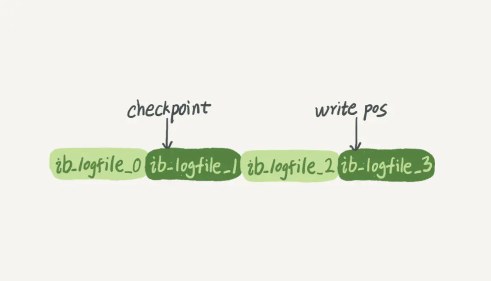

[toc]

本篇文章会分析下一个sql语句在MySQL中的执行过程，包括sql的查询子啊MySQL内部会怎么流转，sql语句的更新是怎么完成的。

在分析之前我会先带你看看MySQL的基础架构，知道了MySQL由哪些组件组成以及这些组件的作用是什么，可以帮助我们理解和解决这些问题。

## 一 MySQL基础结构分析

### 1.1 MySQL基本架构概览

下图是MySQL的一个简要架构图，从下图中你可以很清晰的看到用户的sql语句在MySQL内部是如何执行的。

先简单介绍一下图设计的一些组件的基本作用帮助大家理解这幅图，在1.2节中会详细介绍到这些组件的作用。

- **连接器：**身份认证和权限相关(登录 MySQL 的时候)。
- **查询缓存:**  执行查询语句的时候，会先查询缓存（MySQL 8.0 版本后移除，因为这个功能不太实用）。
- **分析器:**  没有命中缓存的话，SQL 语句就会经过分析器，分析器说白了就是要先看你的 SQL 语句要干嘛，再检查你的 SQL 语句语法是否正确。
- **优化器：**按照 MySQL 认为最优的方案去执行。
- **执行器：** 执行语句，然后从存储引擎返回数据。


### 1.2 server层基本组件介绍

#### **1)连接器**

连接器主要和身份认证和权限相关的功能相关，就好比一个级别很高的门卫一样。

主要负责用户登录数据库，进行用户的身份认证，包括校验账户密码，权限等操作，如果用户账户密码已通过，连接器会到权限表中查询该用户的所有权限，之后在这个连接里的权限逻辑判断都是会依赖此时读取到的权限数据，也就是说，后续只要这个连接不断开，即时管理员修改了该用户的权限，该用户也是不受影响的。

> 常见命令:
>
> mysql -uroot -ppassword

#### 2)查询缓存

查询缓存主要用来缓存我们所执行的 SELECT 语句以及该语句的结果集。

一个请求进来，首先查询缓存，是否存在该记录。之前执行过的语句，则会以语句为key，执行后的结果集为value存储在内存中。当然在真正执行缓存查询的时候还是会校验用户的权限，是否有该表的查询条件。

> - 如果在缓存中查找到，则直接返回给客户端
> - 如果没有找到记录，继续执行后面的操作，并将该语句和结果分别以key-value形式存如内存

**不建议使用查询缓存，因为查询缓存失效在实际业务场景中可能会非常频繁，此操作弊大于利 ( MySQL8.0后该功能被删除 )**

> - 对于一个表，只要有更新便会将涉及到该表的缓存全部清空，只适用于不常更新的静态表
> - 适用场景很少

#### 3)分析器

有命中缓存的话，SQL 语句就会经过分析器，分析器说白了就是要先看你的 SQL 语句要干嘛，再检查你的 SQL 语句语法是否正确。因此分析器主要有两个功能：

> - 词法分析：识别sql关键字，提出主要成分。MySQL根据`"select"`得出这是一条查询语句，根据`"from T"`识别表T，将`"ID"`识别为列名。
> - 语法分析：判断语法规则是否符合sql的语法。如果出现错误，则提示：`"You have an error in your SQL syntax..."`,后面是错误的地方，需要你关注`"use naer"`后的内容。

#### 4)优化器

MySQL选择自己认为最优的执行方案。经过这一步骤，语句如何执行就已经定了下来。该部分内部非常复杂，这里只是简单举例。

> - 当涉及到多个索引时，决定用哪个索引
> - 多表关联的时候，决定连接顺序

####　5)执行器

真正的执行步骤，执行语句，然后从存储引擎返回数据。

> 根据连接器获取到的权限判断，是否对表有操作权限。
>
> 若无权限，返回错误信息。
>
> 若有权限，打开表继续操作，调用引擎接口，并返回执行结果

### 二 语句分析

#### 2.1 查询语句

查询语句，例如：

```sql
select * from tb_student  A where A.age='18' and A.name=' 张三 ';
```

结合上面的说明，我们分析下这个语句的执行流程：

* 先检查该语句是否有权限，如果没有权限，直接返回错误信息，如果有权限，在 MySQL8.0 版本以前，会先查询缓存，以这条 sql 语句为 key 在内存中查询是否有结果，如果有直接缓存，如果没有，执行下一步。

* 通过分析器进行词法分析，提取 sql 语句的关键元素，比如提取上面这个语句是查询 select，提取需要查询的表名为 tb_student，需要查询所有的列，查询条件是这个表的 id='1'。然后判断这个 sql 语句是否有语法错误，比如关键词是否正确等等，如果检查没问题就执行下一步。

* 接下来就是优化器进行确定执行方案，上面的 sql 语句，可以有两种执行方案：

      a.先查询学生表中姓名为“张三”的学生，然后判断是否年龄是 18。
      b.先找出学生中年龄 18 岁的学生，然后再查询姓名为“张三”的学生。

  那么优化器根据自己的优化算法进行选择执行效率最好的一个方案（优化器认为，有时候不一定最好）。那么确认了执行计划后就准备开始执行了。

* 进行权限校验，如果没有权限就会返回错误信息，如果有权限就会调用数据库引擎接口，返回引擎的执行结果。

#### 2.2 更新语句

更新语句，例如：

```sql
update T set c=c+1 where ID=2; 
```

##### 临时记录：redo log

酒店掌柜有一个账本和一个小黑板，来做赊账的记录。有以下两种方案：

1. 每一笔账都打开账本做记录，当有人还账时，找到对应的赊账记录，修改记录的状态
2. 先在黑板上记录本次要做的操作，打烊后按照黑板上的记录向账本上进行核算

当生意红火，顾客络绎不绝时，第一种方案效率实在是低下，掌柜的一定按照第二种方案来记账。
    同样的，MySQL如果每次更新操作都要写入磁盘，在磁盘中找到对应记录，然后更新，这个过程的IO成本、查找成本都太高了。
    为了解决和这个问题，MySQL就使用了类似于`黑板-账本`模式来提高效率。这一模式即为`WAL技术`，全程为`Write-Ahead Logging`，关键点:**先写日志，再写磁盘**，也就是前文中先写黑板，再写账本。

具体步骤如下：
    当有记录需要更新，innoDB先把记录写入redo log中，并更新内存，这是更新操作就算结束了。innoDB引擎会在适当的时候将操作记录更新到磁盘里，这一动作一般是系统比较闲的时候做的。
    redo log的大小是固定的，共有4个文件组成，每个大小为1G。逻辑上可以将4个文件理解为环形，从头开始写，写到末尾又重新开始新的一轮,如下图所示



​    write pos为当前记录位置，check point为当前擦除点的位置，当记录更新时，check point会随着文件的记录向后移动。擦除后未写入的位置可以记录新的操作。当write pos追上了check point，则需要停下来写入动作，将redo log内容写入磁盘,然后清除check point向后移动。
​    有了redo log，innoDB可以知晓每一次操作，保证当数据库发生异常重启时，之前的能够根据redo log恢复之前的记录，这种能力叫做`"crash-safe"`。


##### 归档日志：bin log

redo log与bin log日志的区别：

1. redo log 是属于innoDB引擎所有，bin log是server提供的，所有引擎都可以使用
2. redo log 属于物理日志，记录`在某个数据页做了什么修改`，bin log记录的是该语句逻辑日志，`将ID=2的这一行c的值+1` 
3. redo log日志文件是循环使用的，空间有使用完的时刻，bin log是追加记录的，不会覆盖之前的记录

也就是说，server搭配其他引擎是没有redo log的，因此也就没有了crash-safe能力

##### 更新具体流程

基于对两个日志文件的了解，再次深入了解更新的流程

1. 执行器先通过引擎使用树搜索找到ID=2这一行，如果该记录所在的数据页本身就在内存中，则直接返回执行器，否则先从磁盘读入内存，然后返回
2. 执行器拿到数据后将c的值加一，然后通过引擎的写入接口将修改后的数据写入
3. 引擎j将新数据更新到内存中，然后在redo log中记录此次修改，这时redo log中该记录的状态置为prepare，并告知执行器已经更新完成，随时可以提交事务
4. 执行器生成此次操作的bin log，将bin log写入磁盘中
5. 执行器调用引擎的提交事务接口，引擎将刚刚写入的redo log置为commit状态，更新结束

下图是[《MySQL实战》](https://time.geekbang.org/column/article/68633)提供的流程图：


 浅色代表在innoDB中执行，深色在server中执行


##### 两阶段提交

从上图可以看出，redo log是分两个阶段来提交的,这是为了保持两个日志逻辑上一致
如果不用两阶段提交会发生什么呢 利用反证法来看下：
假设初始ID=2的数据行，c的值为0，现在要执行c+1的操作。

1. **先记录redo log 后记录bin log** 如果刚记录完redo log，还没有记录bin log时，c的值已经记录变为1，这时MySQL服务崩溃重启，根据crash-safe机制，可以用redo log来恢复数据库，恢复后的数据中c的值为1。由于bin log中没有记录这一变化，以后备份bin log时，c的值还是0。如果有一天需要从bin log回复一台备用数据库，由于bin log少了一次更新，则最后恢复出来的c值仍然为0，与原库中值不符合
2. **先记录bin log 后记录redo log**  写完bin log就发生crash，还没来得及写入redo log，崩溃恢复后这个事务是无效的，因此c的值还是0，但是bin log中已经记录了"将c的值+1"的日志，所以用bin log恢复出来的数据多出来一个事务，使得c的值为1，与原库中数据不符。
3. **两阶段提交 记录过bin log回过头提交commit**（可参见评论区知识点）  更新redo log后，还没有记录bin log时崩溃，这时redo log的状态还是prepare，事务并没有提交，而且**bin log中没有记录**，因此由于crash-safe机制，并不会恢复该记录，c的值仍然为0，由于bin log中没有记录，以后从bin log恢复数据时，c的值在此操作中并没有记录变化，因此还是0，与原库中数据一致；另一种情况：更新redo log，也更新了bin log，下一步执行器调用commit接口前崩溃，这时虽然redo log中状态为prepare，但是**从bin log中查到有记录**，所以还是会从redo log中恢复c=1，后面直接从bin log恢复出新的数据库时，因为已经记录c的值+1，所以与原库中的值相同

##### 总结如下：

两种方式确定记录完整：

1. redo log状态为 commit
2. redo log状态为prepare**并且**bin log记录完整 （提交commit之前）

这节主要学习了两个日志文件的用法 redo log 用于保证 crash-safe 能力，bin log用于恢复数据的完整性

- innodb_flush_log_at_trx_commit 这个参数设置成 1 的时候，表示每次事务的 redo log 都直接持久化到磁盘。这样可以保证 MySQL 异常重启之后数据不丢失。
- sync_binlog 这个参数设置成 1 的时候，表示每次事务的 binlog 都持久化到磁盘。这样可以保证 MySQL 异常重启之后 binlog 不丢失。


## 三 总结

* MySQL 主要分为 Server 层和引擎层，Server 层主要包括连接器、查询缓存、分析器、优化器、执行器，同时还有一个日志模块（binlog），这个日志模块所有执行引擎都可以共用,redolog 只有 InnoDB 有。
* 引擎层是插件式的，目前主要包括，MyISAM,InnoDB,Memory 等。
* 查询语句的执行流程如下：权限校验（如果命中缓存）---》查询缓存---》分析器---》优化器---》权限校验---》执行器---》引擎
* 更新语句执行流程如下：分析器----》权限校验----》执行器---》引擎---redo log(prepare 状态---》binlog---》redo log(commit状态)

## 四 参考

* 《MySQL 实战45讲》
* MySQL 5.6参考手册:<https://dev.MySQL.com/doc/refman/5.6/en/>
