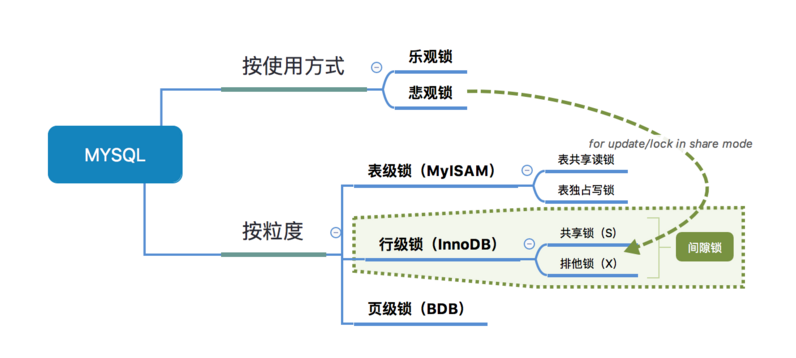
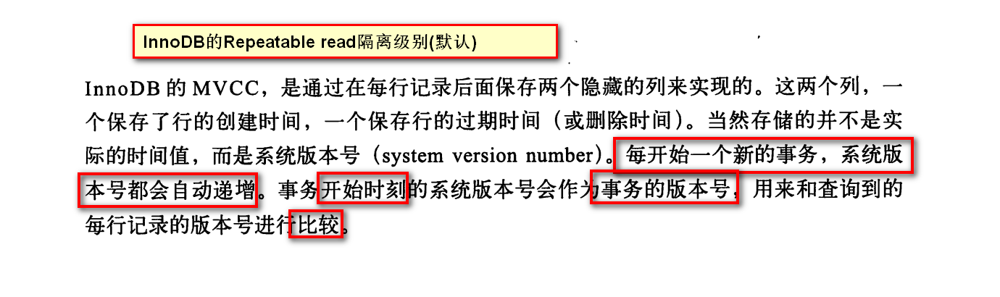
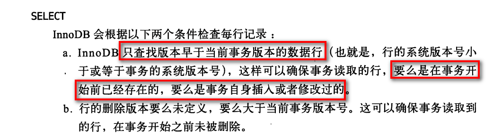

本文摘抄自[码农教程]( http://www.manongjc.com/article/14996.html )

# MySQL锁详细讲解

本文章向大家介绍MySQL锁详细讲解，包括数据库锁基本知识、表锁、表读锁、表写锁、行锁、MVCC、事务的隔离级别、悲观锁、乐观锁、间隙锁GAP、死锁等等，需要的朋友可以参考一下

> 锁的相关知识又跟存储引擎，索引，事务的隔离级别都是关联的

### 数据库锁知识

不少人在开发的时候，应该**很少会注意到**这些锁的问题，也很少会给程序加锁(除了**库存**这些对数量准确性要求极高的情况下)，即使我们不会这些锁知识，我们的程序在一

般情况下还是可以跑得好好的。因为这些锁数据库**隐式**帮我们加了，只会在某些特定的场景下才需要手动加锁。

- 对于UPDATE、DELETE、INSERT语句，**InnoDB**会**自动**给涉及数据集加排他锁（X)
- **MyISAM**在执行查询语句SELECT前，会**自动**给涉及的所有表加**读锁**，在执行增、删、改操作前，会**自动**给涉及的表加**写锁**，这个过程并**不需要用户干预**

### 表锁

> 首先要明确的是，用户很少手动加表锁

首先，从锁的粒度，我们可以分成两大类：

- 表锁
  - 开销小，加锁快；不会出现死锁；锁定力度大，发生锁冲突概率高，并发度最低
- 行锁
  - 开销大，加锁慢；会出现死锁；锁定粒度小，发生锁冲突的概率低，并发度高

不同的存储引擎支持的锁粒度是不一样的：**InnoDB行锁和表锁都支持、MyISAM只支持表锁！InnoDB只有通过索引条件检索数据才使用行级锁**，否则，InnoDB使用表

锁也就是说，InnoDB的行锁是基于索引的！

**表锁下又分为两种模式**：

- 表读锁（Table Read Lock）
- 表写锁（Table Write Lock）
- 从下图可以清晰看到，在表读锁和表写锁的环境下：**读读不阻塞，读写阻塞，写写阻塞**！

1. 读读不阻塞：当前用户在读数据，其他的用户也在读数据，不会加锁
2. 读写阻塞：当前用户在读数据，其他的用户不能修改当前用户读的数据，会加锁！
3. 写写阻塞：当前用户在修改数据，其他的用户不能修改当前用户正在修改的数据，会加锁！

从上面已经看到了：**读锁和写锁是互斥的，读写操作是串行**。

- 如果某个进程想要获取读锁，**同时**另外一个进程想要获取写锁。在mysql中，**写锁是优先于读锁的**！
- 写锁和读锁优先级的问题是可以通过参数调节的：max_write_lock_count和low-priority-updates

 注：

 

### 行锁

InnoDB和MyISAM有两个本质的区别：InnoDB支持行锁、InnoDB支持事务

InnoDB实现了以下**两种**类型的行锁：

- 共享锁（S锁、读锁）：允许一个事务去读一行，阻止其他事务获得相同数据集的排他锁。即多个客户可以**同时读取同一个**资源，但**不允许其他客户修改**。
- 排他锁（X锁、写锁)：允许获得排他锁的事务更新数据，阻止其他事务取得相同数据集的读锁和写锁。写锁是排他的，**写锁会阻塞其他的写锁和读锁**。

另外，**为了允许行锁和表锁共存，实现多粒度锁机制**，InnoDB还有两种内部使用的意向锁（Intention Locks），这两种意向锁都是表锁：

- 意向共享锁（IS）：事务打算给数据行加行共享锁，事务在给一个数据行加共享锁前必须先取得该表的IS锁。
- 意向排他锁（IX）：事务打算给数据行加行排他锁，事务在给一个数据行加排他锁前必须先取得该表的IX锁。
- 意向锁也是数据库隐式帮我们做了，不需要程序员关心！

### MVCC

MVCC(Multi-Version Concurrency Control)多版本并发控制，可以简单地认为：MVCC就是行级锁的一个变种(升级版)。在**表锁中我们读写是阻塞**的，基于提升并发性能

的考虑，MVCC一般读写是不阻塞的(很多情况下避免了加锁的操作)。可以简单的理解为：对数据库的任何修改的提交都不会直接覆盖之前的数据，而是产生一个新的版本与

老版本共存，使得读取时可以完全不加锁。

### 事务的隔离级别

事务的隔离级别就是通过锁的机制来实现，**锁的应用最终导致不同事务的隔离级别**，只不过隐藏了加锁细节，事务的隔离级别有4种：

- Read uncommitted：会出现脏读，不可重复读，幻读
- Read committed：会出现不可重复读，幻读
- Repeatable read：会出现幻读(Mysql默认的隔离级别，但是Repeatable read配合gap锁不会出现幻读！)
- Serializable：串行，避免以上的情况

Read uncommitted：出现的现象--->脏读：一个事务读取到另外一个事务未提交的数据，例子：A向B转账，A执行了转账语句，但A还没有提交事务，B读取数据，发现

自己账户钱变多了！B跟A说，我已经收到钱了。A回滚事务【rollback】，等B再查看账户的钱时，发现钱并没有多...

> 出现脏读的本质就是因为操作(修改)完该数据就立马释放掉锁，导致读的数据就变成了无用的或者是错误的数据

Read committed：出现的现象--->不可重复读：一个事务读取到另外一个事务已经提交的数据，也就是说一个事务可以看到其他事务所做的修改，例如：A查询数据库得到

数据，B去修改数据库的数据，导致A多次查询数据库的结果都不一样【危害：A每次查询的结果都是受B的影响的，那么A查询出来的信息就没有意思了】

Repeatable read：避免不可重复读是事务级别的快照！每次读取的都是当前事务的版本，即使被修改了，也只会读取当前事务版本的数据

> 如果还是不太清楚，我们来看看InnoDB的MVCC是怎么样的吧《高性能MySQL》

至于虚读(幻读)：是指在一个事务内读取到了别的事务插入的数据，导致前后读取不一致。和不可重复读类似，但虚读(幻读)会读到其他事务的插入的数据，导致前后读取不

一致，幻读的重点在于新增或者删除 (数据条数变化)，不可重复读的重点是修改，[幻读和不可重复的区别](https://blog.csdn.net/yuxin6866/article/details/52649048)？

### 乐观锁和悲观锁

无论是Read committed还是Repeatable read隔离级别，都是为了**解决读写冲突**的问题，现在考虑一个问题：有一张数据库表USER，只有id、name字段，现在有2个请求

同时候操作表A，过程如下：（模拟更新丢失，虽然不是很恰当）

　1. 操作1查询出name="zhangsan" 

　2. 操作2也查询出name="zhangsan" 

　3. 操作1把name字段数据修改成lisi并提交

　4. 操作2把name字段数据修改为wangwu并提交

那么操作1的更新丢失啦，即一个事务的更新覆盖了其它事务的更新结果，解决上述更新丢失的方式有如下3种：

- 使用Serializable隔离级别，事务是串行执行的！
- 乐观锁
- 悲观锁

#### 悲观锁

我们使用悲观锁的话其实很简单(手动加行锁就行了)：select * from xxxx for update，在select 语句后边加了for update 相当于加了排它锁(写锁)，加了写锁以后，其

他事务就不能对它修改了！需要等待当前事务修改完之后才可以修改.也就是说，如果操作1使用select ... for update，操作2就无法对该条记录修改了，即可避免更新丢失。

#### 乐观锁

乐观锁不是数据库层面上的锁，需要用户手动去加的锁。一般我们在数据库表中添加一个版本字段version来实现，例如操作1和操作2在更新User表的时，执行语句如下：

update A set Name=lisi,version=version+1 where ID=#{id} and version=#{version}，此时即可避免更新丢失。

> 【参考资料】：[什么是乐观锁和悲观锁](https://zhuanlan.zhihu.com/p/31537871)

### 间隙锁GAP

> 间隙锁只会在Repeatable read隔离级别下使用

当我们用范围条件检索数据而不是相等条件检索数据，并请求共享或排他锁时，InnoDB会给符合范围条件的已有数据记录的索引项加锁；对于键值在条件范围内但并不存在

的记录，叫做“间隙（GAP)”。InnoDB也会对这个“间隙”加锁，这种锁机制就是所谓的间隙锁。例子：假如emp表中只有101条记录，其empid的值分别是1,2,...,100,101

> Select * from emp where empid > 100 for update;

上面是一个范围查询，InnoDB不仅会对符合条件的empid值为101的记录加锁，也会对empid大于101（这些记录并不存在）的“间隙”加锁

InnoDB使用间隙锁的目的有2个：

- 为了防止幻读(上面也说了，Repeatable read隔离级别下再通过GAP锁即可避免了幻读)
- 满足恢复和复制的需要：MySQL的恢复机制要求在一个事务未提交前，其他并发事务不能插入满足其锁定条件的任何记录，也就是不允许出现幻读

### 死锁

并发的问题就少不了死锁，在MySQL中同样会存在死锁的问题

> 【参考资料】：[MySQL死锁问题分析](https://www.cnblogs.com/LBSer/p/5183300.html)
>
> 【参考资料】：[MySQL加锁处理分析](http://hedengcheng.com/?p=771#_Toc374698322)

### 锁总结

表锁其实我们程序员是很少关心它的：

- 在MyISAM存储引擎中，当执行SQL语句的时候是自动加的。
- 在InnoDB存储引擎中，如果没有使用索引，表锁也是自动加的。

现在我们大多数使用MySQL都是使用InnoDB，InnoDB支持行锁：

- 共享锁--读锁--S锁
- 排它锁--写锁--X锁

在默认的情况下，select是不加任何行锁的~事务可以通过以下语句显示给记录集加共享锁或排他锁。

- 共享锁（S）：SELECT * FROM table_name WHERE ... LOCK IN SHARE MODE
- 排他锁（X)：SELECT * FROM table_name WHERE ... FOR UPDATE

InnoDB基于行锁**读写不阻塞**