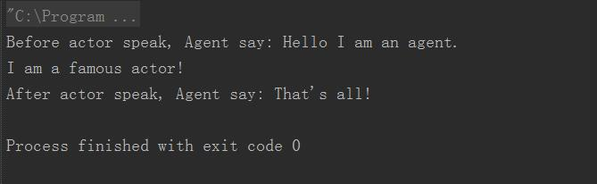

# Spring AOP实现原理

在之前的[一文中](http://www.cnblogs.com/puyangsky/p/5494375.html)介绍过Spring AOP的功能使用，但是没有深究AOP的实现原理，今天正好看到几篇好文，于是就自己整理了一下AOP实现的几种方式，同时把代理模式相关知识也稍微整理一下。

## 代理模式

代理模式的UML类图如下：


可以看到还是很简单的，代理类实现了被代理类的接口，同时与被代理类是组合关系。下面看一下代理模式的实现。

## 静态代理

接口类：

```java
interface Person {
    void speak();
}
```

真实实体类：

```java
class Actor implements Person {
    private String content;
    public Actor(String content) {
        this.content = content;
    }

    @Override
    public void speak() {
        System.out.println(this.content);
    }
}
```

代理类：

```java
class Agent implements Person {
    private Actor actor;
    private String before;
    private String after;
    public Agent(Actor actor, String before, String after) {
        this.actor = actor;
        this.before = before;
        this.after = after;
    }
    @Override
    public void speak() {
        //before speak
        System.out.println("Before actor speak, Agent say: " + before);
        //real speak
        this.actor.speak();
        //after speak
        System.out.println("After actor speak, Agent say: " + after);
    }
}
```

测试方法:

```java
public class StaticProxy {
    public static void main(String[] args) {
        Actor actor = new Actor("I am a famous actor!");
        Agent agent = new Agent(actor, "Hello I am an agent.", "That's all!");
        agent.speak();
    }
}
```

结果：



## 动态代理

在讲JDK的动态代理方法之前，不妨先想想如果让你来实现一个可以任意类的任意方法的代理类，该怎么实现？有个很naive的做法，通过反射获得Class和Method，再调用该方法，并且实现一些代理的方法。我尝试了一下，很快就发现问题所在了。于是乎，还是使用JDK的动态代理接口吧。

### JDK自带方法

首先介绍一下最核心的一个接口和一个方法：

首先是java.lang.reflect包里的InvocationHandler接口：

```java
public interface InvocationHandler {
    public Object invoke(Object proxy, Method method, Object[] args)
        throws Throwable;
}
```

我们对于被代理的类的操作都会由该接口中的invoke方法实现，其中的参数的含义分别是：

- proxy：被代理的类的实例
- method：调用被代理的类的方法
- args：该方法需要的参数

使用方法首先是需要实现该接口，并且我们可以在invoke方法中调用被代理类的方法并获得返回值，自然也可以在调用该方法的前后去做一些额外的事情，从而实现动态代理，下面的例子会详细写到。

另外一个很重要的静态方法是java.lang.reflect包中的Proxy类的newProxyInstance方法：

```java
public static Object newProxyInstance(ClassLoader loader,
                                      Class<?>[] interfaces,
                                      InvocationHandler h)
    throws IllegalArgumentException
```

其中的参数含义如下：

- loader：被代理的类的类加载器
- interfaces：被代理类的接口数组
- invocationHandler：就是刚刚介绍的调用处理器类的对象实例

该方法会返回一个被修改过的类的实例，从而可以自由的调用该实例的方法。下面是一个实际例子。

Fruit接口：

```java
public interface Fruit {
    public void show();
}
```

Apple实现Fruit接口：

```java
public class Apple implements Fruit{
    @Override
    public void show() {
        System.out.println("<<<<show method is invoked");
    }
}
```

代理类Agent.java：

```Java
public class DynamicAgent {

	//实现InvocationHandler接口，并且可以初始化被代理类的对象
    static class MyHandler implements InvocationHandler {
        private Object proxy;
        public MyHandler(Object proxy) {
            this.proxy = proxy;
        }
			
		//自定义invoke方法
        @Override
        public Object invoke(Object proxy, Method method, Object[] args) throws Throwable {
            System.out.println(">>>>before invoking");
			//真正调用方法的地方
            Object ret = method.invoke(this.proxy, args);
            System.out.println(">>>>after invoking");
            return ret;
        }
    }

	//返回一个被修改过的对象
    public static Object agent(Class interfaceClazz, Object proxy) {
        return Proxy.newProxyInstance(interfaceClazz.getClassLoader(), new Class[]{interfaceClazz},
                new MyHandler(proxy));
    }    
}
```

测试类：

```java
public class ReflectTest {
    public static void main(String[] args) throws InvocationTargetException, IllegalAccessException {
		//注意一定要返回接口，不能返回实现类否则会报错
        Fruit fruit = (Fruit) DynamicAgent.agent(Fruit.class, new Apple());
        fruit.show();
    }
}
```

结果：


可以看到对于不同的实现类来说，可以用同一个动态代理类来进行代理，实现了“一次编写到处代理”的效果。但是这种方法有个缺点，就是被代理的类一定要是实现了某个接口的，这很大程度限制了本方法的使用场景。下面还有另外一个使用了CGlib增强库的方法。

### CGLIB库的方法

[CGlib](https://github.com/cglib/cglib)是一个字节码增强库，为AOP等提供了底层支持。下面看看它是怎么实现动态代理的。

```java
import net.sf.cglib.proxy.Enhancer;
import net.sf.cglib.proxy.MethodInterceptor;
import net.sf.cglib.proxy.MethodProxy;
import java.lang.reflect.Method;

public class CGlibAgent implements MethodInterceptor {

    private Object proxy;

    public Object getInstance(Object proxy) {
        this.proxy = proxy;
        Enhancer enhancer = new Enhancer();
        enhancer.setSuperclass(this.proxy.getClass());
        // 回调方法
        enhancer.setCallback(this);
        // 创建代理对象
        return enhancer.create();
    }
	//回调方法
    @Override
    public Object intercept(Object o, Method method, Object[] objects, MethodProxy methodProxy) throws Throwable {
        System.out.println(">>>>before invoking");
		//真正调用
        Object ret = methodProxy.invokeSuper(o, objects);
        System.out.println(">>>>after invoking");
        return ret;
    }

    public static void main(String[] args) {
        CGlibAgent cGlibAgent = new CGlibAgent();
        Apple apple = (Apple) cGlibAgent.getInstance(new Apple());
        apple.show();
    }
}
```

结果：


可以看到结果和JDK动态代理是一样的，但是可以直接对实现类进行操作而非接口，这样会有很大的便利。

## 参考文献

- 《Java编程思想》第14章
- [java动态代理（JDK和cglib）](http://www.cnblogs.com/jqyp/archive/2010/08/20/1805041.html)
