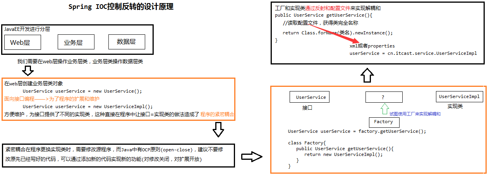

## 1.谈谈你对spring IOC和DI的理解，它们有什么区别？

IoC Inverse of Control 反转控制的概念，就是将原本在程序中手动创建UserService对象的控制权，交由Spring框架管理，简单说，就是创建UserService对象控制权被反转到了Spring框架

DI：Dependency Injection 依赖注入，在Spring框架负责创建Bean对象时，动态的将依赖对象注入到Bean组件

[](http://images2015.cnblogs.com/blog/799093/201607/799093-20160724232924591-1136049226.png)

面试题： IoC 和 DI的区别？

IoC 控制反转，指将对象的创建权，反转到Spring容器 ， DI 依赖注入，指Spring创建对象的过程中，将对象依赖属性通过配置进行注入

## 2.BeanFactory 接口和 ApplicationContext 接口有什么区别 ？

  ①ApplicationContext 接口继承BeanFactory接口，Spring核心工厂是BeanFactory ,BeanFactory采取延迟加载，第一次getBean时才会初始化Bean, ApplicationContext是会在加载配置文件时初始化Bean。

  ②ApplicationContext是对BeanFactory扩展，它可以进行国际化处理、事件传递和bean自动装配以及各种不同应用层的Context实现 

开发中基本都在使用ApplicationContext, web项目使用WebApplicationContext ，很少用到BeanFactory

```java
BeanFactory beanFactory = new XmlBeanFactory(new ClassPathResource("applicationContext.xml"));
IHelloService helloService = (IHelloService) beanFactory.getBean("helloService");
helloService.sayHello();
```

## 3.spring配置bean实例化有哪些方式？

  1）使用类构造器实例化(默认无参数)

```xml
<bean id="bean1" class="cn.itcast.spring.b_instance.Bean1"></bean> 
```

  2）使用静态工厂方法实例化(简单工厂模式)

```
//下面这段配置的含义：调用Bean2Factory的getBean2方法得到bean2
```

```xml
<bean id="bean2" class="cn.itcast.spring.b_instance.Bean2Factory" factory-method="getBean2"></bean> 
```

  3）使用实例工厂方法实例化(工厂方法模式)

//先创建工厂实例bean3Facory，再通过工厂实例创建目标bean实例

```xml
<bean id="bean3Factory" class="cn.itcast.spring.b_instance.Bean3Factory"></bean>
<bean id="bean3" factory-bean="bean3Factory" factory-method="getBean3"></bean>
```


## 4.简单的说一下spring的生命周期？

  1)在配置 <bean> 元素，通过 init-method 指定Bean的初始化方法，通过 destroy-method 指定Bean销毁方法

```xml
<beanid="lifeCycleBean"class="cn.itcast.spring.d_lifecycle.LifeCycleBean"init-method="setup"destroy-method="teardown"></bean> 
```

需要注意的问题：

  \* destroy-method 只对 scope="singleton" 有效 

  \* 销毁方法，必须关闭ApplicationContext对象(手动调用)，才会被调用

 

```java
ClassPathXmlApplicationContext applicationContext = new ClassPathXmlApplicationContext("applicationContext.xml");
applicationContext.close();
```

  2)Bean的完整生命周期 （十一步骤）【了解内容，但是对于spring内部操作理解有一定帮助】

①instantiate bean对象实例化

②populate properties 封装属性

③如果Bean实现BeanNameAware 执行 setBeanName

④如果Bean实现BeanFactoryAware 或者 ApplicationContextAware 设置工厂 setBeanFactory 或者上下文对象 setApplicationContext

⑤如果存在类实现 BeanPostProcessor（后处理Bean） ，执行postProcessBeforeInitialization，BeanPostProcessor接口提供钩子函数，用来动态扩展修改Bean。(程序自动调用后处理Bean)

 

```java
publicclassMyBeanPostProcessorimplementsBeanPostProcessor{
	publicObject postProcessAfterInitialization(Object bean,String beanName)
	throwsBeansException{
		System.out.println("第八步：后处理Bean，after初始化。");
		//后处理Bean，在这里加上一个动态代理，就把这个Bean给修改了。
		return bean;//返回bean，表示没有修改，如果使用动态代理，返回代理对象，那么就修改了。
	}
    
	publicObject postProcessBeforeInitialization(Object bean,String beanName)
		throwsBeansException{
			System.out.println("第五步：后处理Bean的：before初始化！！");
			//后处理Bean，在这里加上一个动态代理，就把这个Bean给修改了。
			return bean;//返回bean本身，表示没有修改。
	}
}
```

注意：这个前处理Bean和后处理Bean会对所有的Bean进行拦截。

⑥如果Bean实现InitializingBean 执行 afterPropertiesSet

⑦调用`<bean init-method="init">` 指定初始化方法 init

⑧如果存在类实现 BeanPostProcessor（处理Bean） ，执行postProcessAfterInitialization

⑨执行业务处理

⑩如果Bean实现 DisposableBean 执行 destroy

⑪调用`<bean destroy-method="customerDestroy">` 指定销毁方法 customerDestroy

## 5.请介绍一下Spring框架中Bean的生命周期和作用域

 

(1)bean定义

  在配置文件里面用`<bean></bean>`来进行定义。

(2)bean初始化

  有两种方式初始化:

A.在配置文件中通过指定init-method属性来完成

B.实现`org.springframwork.beans.factory.InitializingBean`接口

(3)bean调用

  有三种方式可以得到bean实例，并进行调用

(4)bean销毁

  销毁有两种方式

A.使用配置文件指定的destroy-method属性

B.实现`org.springframwork.bean.factory.DisposeableBean`接口

\##作用域

singleton

当一个bean的作用域为singleton, 那么Spring IoC容器中只会存在一个共享的bean实例，并且所有对bean的请求，只要id与该bean定义相匹配，则只会返回bean的同一实例。

prototype

Prototype作用域的bean会导致在每次对该bean请求（将其注入到另一个bean中，或者以程序的方式调用容器的getBean() 方法）时都会创建一个新的bean实例。根据经验，对所有有状态的bean应该使用prototype作用域，而对无状态的bean则应该使用 singleton作用域

request

在一次HTTP请求中，一个bean定义对应一个实例；即每次HTTP请求将会有各自的bean实例， 它们依据某个bean定义创建而成。该作用 域仅在基于web的Spring ApplicationContext情形下有效。

session

在一个HTTP Session中，一个bean定义对应一个实例。该作用域仅在基于web的Spring ApplicationContext情形下有效。

global session

在一个全局的HTTP Session中，一个bean定义对应一个实例。典型情况下，仅在使用portlet context的时候有效。该作用域仅在基于 web的Spring ApplicationContext情形下有效。

 

## 6.Bean注入属性有哪几种方式？

[](http://images2015.cnblogs.com/blog/799093/201607/799093-20160724232926263-388770666.png)

spring支持构造器注入和setter方法注入

  构造器注入，通过 `<constructor-arg>` 元素完成注入

  setter方法注入， 通过`<property>` 元素完成注入【开发中常用方式】

## 7.什么是AOP，AOP的作用是什么？

面向切面编程（AOP）提供另外一种角度来思考程序结构，通过这种方式弥补了面向对象编程（OOP）的不足，除了类（classes）以外，AOP提供了切面。切面对关注点进行模块化，例如横切多个类型和对象的事务管理

Spring的一个关键的组件就是AOP框架，可以自由选择是否使用AOP 提供声明式企业服务，特别是为了替代EJB声明式服务。最重要的服务是声明性事务管理，这个服务建立在Spring的抽象事物管理之上。允许用户实现自定义切面，用AOP来完善OOP的使用,可以把Spring AOP看作是对Spring的一种增强

[](http://images2015.cnblogs.com/blog/799093/201607/799093-20160724232927607-736716234.png)

## 8.Spring的核心类有哪些，各有什么作用？

BeanFactory：产生一个新的实例，可以实现单例模式

BeanWrapper：提供统一的get及set方法

ApplicationContext:提供框架的实现，包括BeanFactory的所有功能

## 9.Spring里面如何配置数据库驱动？

使用”org.springframework.jdbc.datasource.DriverManagerDataSource”数据源来配置数据库驱动。示例如下：

```xml
<bean id="dataSource"> 
    <property name="driverClassName"> 
        <value>org.hsqldb.jdbcDriver</value>
    </property> 
    <property name="url"> 
        <value>jdbc:hsqldb:db/appfuse</value> 
    </property> 
    <property name="username"><value>abc</value></property> 
    <property name="password"><value>abc</value></property> 
</bean> 
```


## 10.Spring里面applicationContext.xml文件能不能改成其他文件名？

ContextLoaderListener是一个ServletContextListener, 它在你的web应用启动的时候初始化。缺省情况下， 它会在WEB-INF/applicationContext.xml文件找Spring的配置。 你可以通过定义一个<context-param>元素名字为”contextConfigLocation”来改变Spring配置文件的 位置。示例如下： 

```xml
<listener> 
    <listener-class>org.springframework.web.context.ContextLoaderListener
        <context-param> 
         <param-name>contextConfigLocation</param-name> 
         <param-value>/WEB-INF/xyz.xml</param-value> 
        </context-param>   
    </listener-class> 
</listener> 
```


## 11.Spring里面如何定义hibernate mapping？

 

添加hibernate mapping 文件到web/WEB-INF目录下的applicationContext.xml文件里面。示例如下：


```xml
<property name=”mappingResources”> 
    <list> 
        <value>org/appfuse/model/User.hbm.xml</value> 
    </list> 
</property>
```


## 12.Spring如何处理线程并发问题？

**Spring使用ThreadLocal解决线程安全问题**

我们知道在一般情况下，只有无状态的Bean才可以在多线程环境下共享，在Spring中，绝大部分Bean都可以声明为singleton作用域。就是因为Spring对一些Bean(如RequestContextHolder、TransactionSynchronizationManager、LocaleContextHolder等)中非线程安全状态采用ThreadLocal进行处理，让它们也成为线程安全的状态，因为有状态的Bean就可以在多线程中共享了。

ThreadLocal和线程同步机制都是为了解决多线程中相同变量的访问冲突问题。

在同步机制中，通过对象的锁机制保证同一时间只有一个线程访问变量。这时该变量是多个线程共享的，使用同步机制要求程序慎密地分析什么时候对变量进行读写，什么时候需要锁定某个对象，什么时候释放对象锁等繁杂的问题，程序设计和编写难度相对较大。

而ThreadLocal则从另一个角度来解决多线程的并发访问。ThreadLocal会为每一个线程提供一个独立的变量副本，从而隔离了多个线程对数据的访问冲突。因为每一个线程都拥有自己的变量副本，从而也就没有必要对该变量进行同步了。ThreadLocal提供了线程安全的共享对象，在编写多线程代码时，可以把不安全的变量封装进ThreadLocal。

由于ThreadLocal中可以持有任何类型的对象，低版本JDK所提供的get()返回的是Object对象，需要强制类型转换。但JDK5.0通过泛型很好的解决了这个问题，在一定程度地简化ThreadLocal的使用。

概括起来说，对于多线程资源共享的问题，同步机制采用了“以时间换空间”的方式，而ThreadLocal采用了“以空间换时间”的方式。前者仅提供一份变量，让不同的线程排队访问，而后者为每一个线程都提供了一份变量，因此可以同时访问而互不影响。

## 13.为什么要有事物传播行为？

[](http://images2015.cnblogs.com/blog/799093/201607/799093-20160724232928935-1122278386.png)

## 14.介绍一下Spring的事物管理

  事务就是对一系列的数据库操作（比如插入多条数据）进行统一的提交或回滚操作，如果插入成功，那么一起成功，如果中间有一条出现异常，那么回滚之前的所有操作。这样可以防止出现脏数据，防止数据库数据出现问题。

开发中为了避免这种情况一般都会进行事务管理。Spring中也有自己的事务管理机制，一般是使用TransactionMananger进行管 理，可以通过Spring的注入来完成此功能。spring提供了几个关于事务处理的类：

TransactionDefinition //事务属性定义

TranscationStatus //代表了当前的事务，可以提交，回滚。

PlatformTransactionManager这个是spring提供的用于管理事务的基础接口，其下有一个实现的抽象类 AbstractPlatformTransactionManager,我们使用的事务管理类例如 DataSourceTransactionManager等都是这个类的子类。

一般事务定义步骤：

```java
TransactionDefinition td =newTransactionDefinition();
TransactionStatus ts = transactionManager.getTransaction(td);
try{ 
    //do sth
    transactionManager.commit(ts);
}catch(Exception e){
    transactionManager.rollback(ts);
}
```

  spring提供的事务管理可以分为两类：编程式的和声明式的。编程式的，比较灵活，但是代码量大，存在重复的代码比较多；声明式的比编程式的更灵活。

 

编程式主要使用transactionTemplate。省略了部分的提交，回滚，一系列的事务对象定义，需注入事务管理对象.

```java
 void add(){
    transactionTemplate.execute(newTransactionCallback(){
        pulic Object doInTransaction(TransactionStatus ts){
         //do sth
        }
    }
}
```

声明式：

 

使用TransactionProxyFactoryBean:PROPAGATION_REQUIRED PROPAGATION_REQUIRED PROPAGATION_REQUIRED,readOnly

围绕Poxy的动态代理 能够自动的提交和回滚事务

org.springframework.transaction.interceptor.TransactionProxyFactoryBean

PROPAGATION_REQUIRED–支持当前事务，如果当前没有事务，就新建一个事务。这是最常见的选择。

PROPAGATION_SUPPORTS–支持当前事务，如果当前没有事务，就以非事务方式执行。

PROPAGATION_MANDATORY–支持当前事务，如果当前没有事务，就抛出异常。

PROPAGATION_REQUIRES_NEW–新建事务，如果当前存在事务，把当前事务挂起。

PROPAGATION_NOT_SUPPORTED–以非事务方式执行操作，如果当前存在事务，就把当前事务挂起。

PROPAGATION_NEVER–以非事务方式执行，如果当前存在事务，则抛出异常。

PROPAGATION_NESTED–如果当前存在事务，则在嵌套事务内执行。如果当前没有事务，则进行与 PROPAGATION_REQUIRED类似的操作。

## 15.解释一下Spring AOP里面的几个名词

切面（Aspect）：一个关注点的模块化，这个关注点可能会横切多个对象。事务管理是J2EE应用中一个关于横切关注点的很好的例子。 在Spring AOP中，切面可以使用通用类（基于模式的风格） 或者在普通类中以 @Aspect 注解（@AspectJ风格）来实现。

连接点（Joinpoint）：在程序执行过程中某个特定的点，比如某方法调用的时候或者处理异常的时候。 在Spring AOP中，一个连接点 总是 代表一个方法的执行。 通过声明一个org.aspectj.lang.JoinPoint类型的参数可以使通知（Advice）的主体部分获得连接点信息。

通知（Advice）：在切面的某个特定的连接点（Joinpoint）上执行的动作。通知有各种类型，其中包括“around”、“before”和“after”等通知。 通知的类型将在后面部分进行讨论。许多AOP框架，包括Spring，都是以拦截器做通知模型， 并维护一个以连接点为中心的拦截器链。

切入点（Pointcut）：匹配连接点（Joinpoint）的断言。通知和一个切入点表达式关联，并在满足这个切入点的连接点上运行（例如，当执行某个特定名称的方法时）。 切入点表达式如何和连接点匹配是AOP的核心：Spring缺省使用AspectJ切入点语法。

引入（Introduction）：（也被称为内部类型声明（inter-type declaration））。声明额外的方法或者某个类型的字段。 Spring允许引入新的接口（以及一个对应的实现）到任何被代理的对象。例如，你可以使用一个引入来使bean实现 IsModified 接口，以便简化缓存机制。

目标对象（Target Object）： 被一个或者多个切面（aspect）所通知（advise）的对象。也有人把它叫做 被通知（advised） 对象。 既然Spring AOP是通过运行时代理实现的，这个对象永远是一个 被代理（proxied） 对象。

AOP代理（AOP Proxy）： AOP框架创建的对象，用来实现切面契约（aspect contract）（包括通知方法执行等功能）。 在Spring中，AOP代理可以是JDK动态代理或者CGLIB代理。 注意：Spring 2.0最新引入的基于模式（schema-based）风格和@AspectJ注解风格的切面声明，对于使用这些风格的用户来说，代理的创建是透明的。

织入（Weaving）：把切面（aspect）连接到其它的应用程序类型或者对象上，并创建一个被通知（advised）的对象。 这些可以在编译时（例如使用AspectJ编译器），类加载时和运行时完成。 Spring和其他纯Java AOP框架一样，在运行时完成织入。

[](http://images2015.cnblogs.com/blog/799093/201607/799093-20160724232929888-1552179747.png)

## 16.通知有哪些类型？

前置通知（Before advice）：在某连接点（join point）之前执行的通知，但这个通知不能阻止连接点前的执行（除非它抛出一个异常）。

返回后通知（After returning advice）：在某连接点（join point）正常完成后执行的通知：例如，一个方法没有抛出任何异常，正常返回。 
抛出异常后通知（After throwing advice）：在方法抛出异常退出时执行的通知。 
后通知（After (finally) advice）：当某连接点退出的时候执行的通知（不论是正常返回还是异常退出）。 
环绕通知（Around Advice）：包围一个连接点（join point）的通知，如方法调用。这是最强大的一种通知类型。 环绕通知可以在方法调用前后完成自定义的行为。它也会选择是否继续执行连接点或直接返回它们自己的返回值或抛出异常来结束执行。 

环绕通知是最常用的一种通知类型。大部分基于拦截的AOP框架，例如Nanning和JBoss4，都只提供环绕通知。 
切入点（pointcut）和连接点（join point）匹配的概念是AOP的关键，这使得AOP不同于其它仅仅提供拦截功能的旧技术。 切入点使得定位通知（advice）可独立于OO层次。 例如，一个提供声明式事务管理的around通知可以被应用到一组横跨多个对象中的方法上（例如服务层的所有业务操作）。