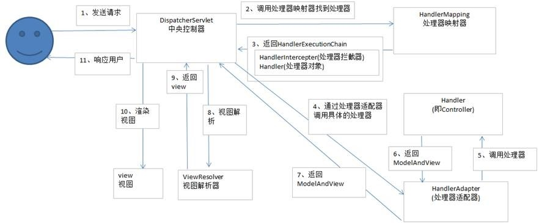

## 1.简单的谈一下SpringMVC的工作流程？

流程 
1、用户发送请求至前端控制器DispatcherServlet 
2、DispatcherServlet收到请求调用HandlerMapping处理器映射器。 
3、处理器映射器找到具体的处理器，生成处理器对象及处理器拦截器(如果有则生成)一并返回给DispatcherServlet。 
4、DispatcherServlet调用HandlerAdapter处理器适配器 
5、HandlerAdapter经过适配调用具体的处理器(Controller，也叫后端控制器)。 
6、Controller执行完成返回ModelAndView 
7、HandlerAdapter将controller执行结果ModelAndView返回给DispatcherServlet 
8、DispatcherServlet将ModelAndView传给ViewReslover视图解析器 
9、ViewReslover解析后返回具体View 
10、DispatcherServlet根据View进行渲染视图（即将模型数据填充至视图中）。 
11、DispatcherServlet响应用户